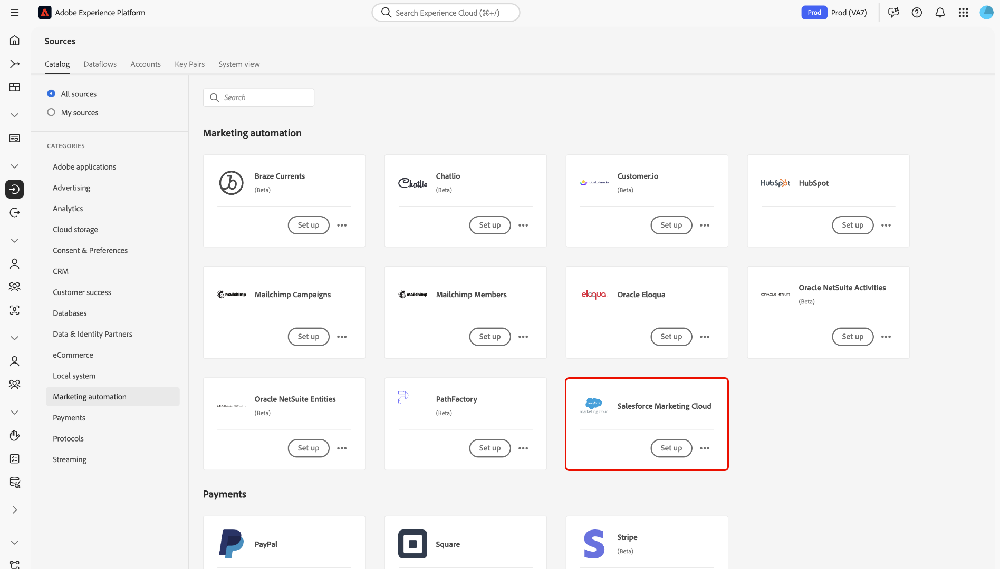

# Anslut ditt [!DNL Salesforce Marketing Cloud]-konto till Experience Platform via användargränssnittet

>[!WARNING]
>
>[!DNL Salesforce Marketing Cloud]-källan kommer att bli inaktuell i januari 2026. En ny källa kommer att släppas senare i år som ett alternativ. När den nya källan har släppts måste du planera migreringen till den nya källan genom att skapa nya kontoanslutningar och dataflöden före utgången av januari 2026.

I den här självstudien beskrivs hur du ansluter ditt [!DNL Salesforce Marketing Cloud]-konto till Adobe Experience Platform via användargränssnittet.

## Komma igång

Den här självstudiekursen kräver en fungerande förståelse av följande komponenter i Experience Platform:

* [[!DNL Experience Data Model (XDM)] System](../../../../../xdm/home.md): Det standardiserade ramverk som [!DNL Experience Platform] organiserar kundupplevelsedata med.
   * [Grundläggande om schemakomposition](../../../../../xdm/schema/composition.md): Lär dig mer om grundstenarna i XDM-scheman, inklusive nyckelprinciper och bästa metoder för schemakomposition.
   * [Schemaredigeraren, självstudiekurs](../../../../../xdm/tutorials/create-schema-ui.md): Lär dig hur du skapar anpassade scheman med hjälp av gränssnittet för Schemaredigeraren.
* [[!DNL Real-Time Customer Profile]](../../../../../profile/home.md): Tillhandahåller en enhetlig konsumentprofil i realtid baserad på aggregerade data från flera källor.

Om du redan har ett [!DNL Salesforce Marketing Cloud]-konto kan du hoppa över resten av det här dokumentet och gå vidare till självstudiekursen om hur du [skickar data för automatiserad marknadsföring till Experience Platform med användargränssnittet](../../dataflow/marketing-automation.md).

### Samla in nödvändiga inloggningsuppgifter

Du måste ange följande värden för att komma åt ditt [!DNL Salesforce Marketing Cloud]-konto på Experience Platform:

| Autentiseringsuppgifter | Beskrivning |
| ---------- | ----------- |
| Värd | Programmets värdserver. Detta är ofta din underdomän. **Obs!** När du anger ditt `host`-värde måste du ange `{subdomain}.rest.marketingcloudapis.com`. Om din värd-URL till exempel är `https://acme-ab12c3d4e5fg6hijk7lmnop8qrst.auth.marketingcloudapis.com/` måste du ange `acme-ab12c3d4e5fg6hijk7lmnop8qrst.rest.marketingcloudapis.com/` som värdvärde. |
| Klient-ID | Klient-ID som är associerat med ditt [!DNL Salesforce Marketing Cloud]-program. |
| Klienthemlighet | Klienthemligheten som är associerad med ditt [!DNL Salesforce Marketing Cloud]-program. |

Mer information om autentisering för [!DNL Salesforce Marketing Cloud] finns i [[!DNL Salesforce] autentiseringsdokumentationen](https://developer.salesforce.com/docs/atlas.en-us.mc-apis.meta/mc-apis/authentication.htm).

## Anslut ditt [!DNL Salesforce Marketing Cloud]-konto

>[!IMPORTANT]
>
>Inläsning av anpassade objekt stöds för närvarande inte av källintegreringen [!DNL Salesforce Marketing Cloud].

I Experience Platform-gränssnittet väljer du **[!UICONTROL Sources]** i den vänstra navigeringen för att komma åt arbetsytan i [!UICONTROL Sources]. [!UICONTROL Catalog] visar en mängd olika källor som stöds av Experience Platform.

Du kan välja lämplig kategori i listan med kategorier. Du kan också använda sökfältet för att filtrera efter en viss källa.

Under kategorin [!UICONTROL Marketing automation] väljer du **[!UICONTROL Salesforce Marketing Cloud]** och sedan **[!UICONTROL Set up]**.

Sidan **[!UICONTROL Connect to Salesforce Marketing Cloud]** visas. På den här sidan kan du antingen skapa ett nytt konto eller använda ett befintligt konto.

### Nytt konto

Om du vill skapa ett nytt konto väljer du **[!UICONTROL New account]** och anger ett namn för ditt konto, en valfri beskrivning och autentiseringsuppgifter som motsvarar ditt [!DNL Salesforce Marketing Cloud]-konto.

När du är klar väljer du **[!UICONTROL Connect to source]** och tillåt sedan lite tid för att upprätta den nya anslutningen.

### Befintligt konto

Om du redan har ett befintligt konto väljer du **[!UICONTROL Existing account]** och sedan det konto som du vill använda i listan som visas.

## Nästa steg

Genom att följa den här självstudiekursen har du upprättat en anslutning mellan ditt [!DNL Salesforce Marketing Cloud]-konto och Experience Platform. Du kan nu fortsätta med nästa självstudiekurs och [skapa ett dataflöde för att överföra dina marknadsföringsdata till Experience Platform](../../dataflow/marketing-automation.md).
