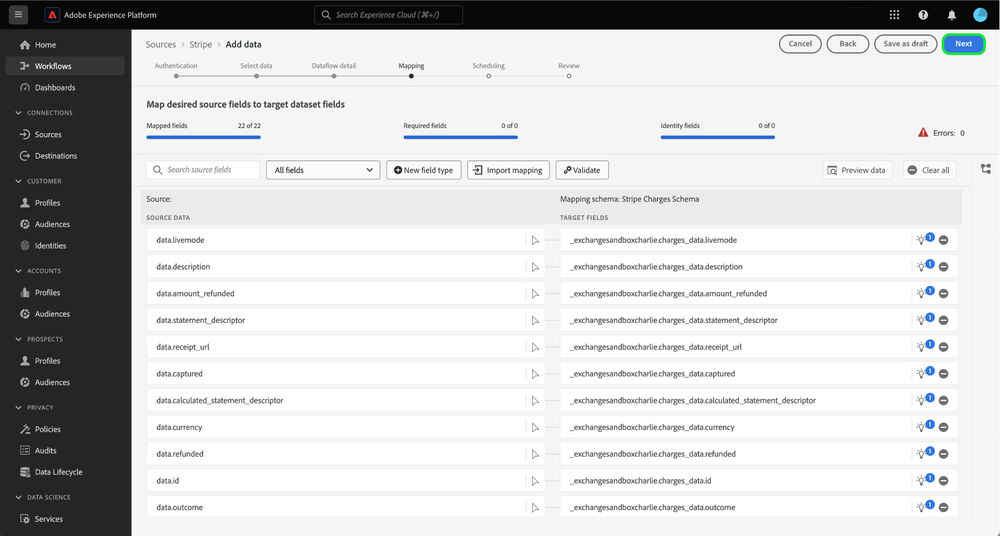
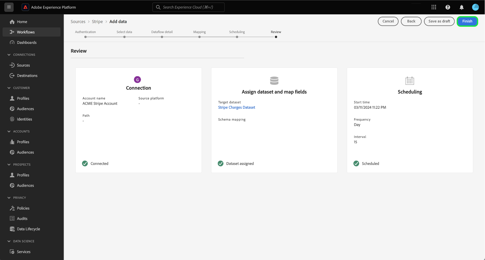

# Hämta in betalningsdata från [!DNL Stripe] konto till Experience Platform via användargränssnittet

>[!NOTE]
>
>The [!DNL Stripe] källan är i betaversion. Läs [villkor](../../../../home.md#terms-and-conditions) i källorna - översikt, om du vill ha mer information om hur du använder betamärkta källor.

Läs följande självstudiekurs för att lära dig hur du importerar betalningsdata från [!DNL Stripe] till Adobe Experience Platform via användargränssnittet.

## Kom igång

Den här självstudiekursen kräver en fungerande förståelse av följande komponenter i Experience Platform:

* [[!DNL Experience Data Model (XDM)] System](../../../../../xdm/home.md): Det standardiserade ramverk som [!DNL Experience Platform] organiserar kundupplevelsedata.
   * [Grunderna för schemakomposition](../../../../../xdm/schema/composition.md): Lär dig mer om de grundläggande byggstenarna i XDM-scheman, inklusive viktiga principer och bästa praxis när det gäller schemakomposition.
   * [Schemaredigeraren, genomgång](../../../../../xdm/tutorials/create-schema-ui.md): Lär dig hur du skapar anpassade scheman med hjälp av gränssnittet i Schemaredigeraren.
* [[!DNL Real-Time Customer Profile]](../../../../../profile/home.md): Ger en enhetlig konsumentprofil i realtid baserad på aggregerade data från flera källor.

### Autentisering

Läs [[!DNL Stripe] översikt](../../../../connectors/payments/stripe.md) om du vill ha information om hur du hämtar autentiseringsuppgifter.

## Koppla samman [!DNL Stripe] konto {#connect}

Välj **[!UICONTROL Sources]** från vänster navigering för att komma åt [!UICONTROL Sources] arbetsyta. Du kan välja lämplig kategori i katalogen till vänster på skärmen. Du kan också hitta den källa du vill arbeta med med med sökalternativet.

Under *Betalningar* kategori, välj **[!DNL Stripe]** och sedan markera **[!UICONTROL Set up]**.

>[!TIP]
>
>Källor i källkatalogen visas **[!UICONTROL Set up]** när en viss källa ännu inte har något autentiserat konto. När det finns ett autentiserat konto ändras det här alternativet till **[!UICONTROL Add data]**.

The **[!UICONTROL Connect Stripe account]** visas. På den här sidan kan du antingen använda nya eller befintliga autentiseringsuppgifter.

>[!BEGINTABS]

>[!TAB Skapa ett nytt konto]

Om du vill skapa ett nytt konto väljer du **[!UICONTROL New account]** och ange ett namn, en valfri beskrivning och dina autentiseringsuppgifter.

När du är klar väljer du **[!UICONTROL Connect to source]** och tillåt sedan lite tid för att upprätta den nya anslutningen.

| Autentiseringsuppgifter | Beskrivning |
| --- | --- |
| Åtkomsttoken | Dina [!DNL Stripe] åtkomsttoken. Mer information om hur du hämtar din åtkomsttoken finns i [[!DNL Stripe] autentiseringsguide](../../../../connectors/payments/stripe.md). |

>[!TAB Använd ett befintligt konto]

Om du vill använda ett befintligt konto väljer du **[!UICONTROL Existing account]** och välj sedan det konto som du vill använda i den befintliga kontokatalogen.

Välj **[!UICONTROL Next]** för att fortsätta.

>[!ENDTABS]

## Markera data {#select-data}

Nu när du har åtkomst till ditt konto måste du identifiera rätt sökväg till [!DNL Stripe] data som du vill importera. Välj **[!UICONTROL Resource path]** och välj sedan den slutpunkt från vilken du vill importera data. Tillgängliga [!DNL Stripe] slutpunkterna är:

* Avgifter
* Prenumerationer
* Återbetalningar
* Saldotransaktioner
* Kunder
* Priser

När du har valt slutpunkten uppdateras gränssnittet till en förhandsgranskningsskärm och visar datastrukturen för [!DNL Stripe] slutpunkt som du har valt. Välj **[!UICONTROL Next]** för att fortsätta.

## Ange information om datauppsättning och dataflöde {#provide-dataset-and-dataflow-details}

Därefter måste du ange information om datauppsättningen och dataflödet.

### Information om datauppsättning {#dataset-details}

En datauppsättning är en lagrings- och hanteringskonstruktion för en datamängd, vanligtvis en tabell, som innehåller ett schema (kolumner) och fält (rader). Data som har inhämtats till Experience Platform lagras i datasjön som datauppsättningar. Under det här steget kan du skapa en ny datauppsättning eller använda en befintlig datauppsättning.

>[!BEGINTABS]

>[!TAB Använd en ny datauppsättning]

Om du vill använda en ny datauppsättning väljer du **[!UICONTROL New dataset]** och ange sedan ett namn och en valfri beskrivning av datauppsättningen. Du måste också välja ett XDM-schema (Experience Data Model) som datauppsättningen följer.

| Ny datauppsättningsinformation | Beskrivning |
| --- | --- |
| Namn på utdatauppsättning | Namnet på den nya datauppsättningen. |
| Beskrivning | (Valfritt) En kort förklaring av den nya datauppsättningen. |
| Schema | En listruta med scheman som finns i organisationen. Du kan också skapa ett eget schema före källkonfigurationsprocessen. Mer information finns i guiden [skapa ett XDM-schema i användargränssnittet](../../../../../xdm/tutorials/create-schema-ui.md). |

>[!TAB Använd en befintlig datamängd]

Om du redan har en befintlig datauppsättning väljer du **[!UICONTROL Existing dataset]** och sedan använda **[!UICONTROL Advanced search]** om du vill visa ett fönster med alla datauppsättningar i organisationen, inklusive deras respektive information, t.ex. om de är aktiverade för förtäring i kundprofilen i realtid eller inte.

>[!ENDTABS]

+++Välj om du vill ha steg för att aktivera profilintagning, feldiagnostik och partiell förtäring.

Om din datauppsättning är aktiverad för kundprofil i realtid kan du under det här steget växla **[!UICONTROL Profile dataset]** för att aktivera data för profilinmatning. Du kan även använda det här steget för att aktivera **[!UICONTROL Error diagnostics]** och **[!UICONTROL Partial ingestion]**.

* **[!UICONTROL Error diagnostics]**: Välj **[!UICONTROL Error diagnostics]** för att instruera källan att skapa feldiagnostik som du senare kan referera till när du övervakar datauppsättningsaktiviteten och dataflödesstatusen.
* **[!UICONTROL Partial ingestion]**: Partiell batchimport är möjligheten att importera data som innehåller fel, upp till ett visst konfigurerbart tröskelvärde. Med den här funktionen kan du importera alla korrekta data till Experience Platform, medan alla felaktiga data batchas separat med information om varför de är ogiltiga.

+++

### Information om dataflöde {#dataflow-details}

När datauppsättningen har konfigurerats måste du ange information om dataflödet, inklusive ett namn, en valfri beskrivning och aviseringskonfigurationer.

| Dataflödeskonfigurationer | Beskrivning |
| --- | --- |
| Dataflödesnamn | Dataflödets namn.  Som standard används namnet på filen som importeras. |
| Beskrivning | (Valfritt) En kort beskrivning av dataflödet. |
| Larm | Experience Platform kan skapa händelsebaserade aviseringar som användare kan prenumerera på. Dessa alternativ kräver alla ett öppet dataflöde för att de ska aktiveras.  Mer information finns i [varningsöversikt](../../alerts.md) <ul><li>**Start för källdataflöde**: Välj den här varningen om du vill få ett meddelande när dataflödeskörningen börjar.</li><li>**Slutförd körning av källdataflöde**: Välj den här varningen för att få ett meddelande om dataflödet avslutas utan fel.</li><li>**Körningsfel för källdataflöde**: Välj den här varningen för att få ett meddelande om dataflödet avslutas med fel.</li></ul> |

När du är klar väljer du **[!UICONTROL Next]** för att fortsätta.

## Mappa fält till ett XDM-schema {#mapping}

The **[!UICONTROL Mapping]** visas. Använd mappningsgränssnittet för att mappa källdata till rätt schemafält innan data hämtas till Experience Platform. En omfattande guide om hur du använder mappningsgränssnittet finns i [Användargränssnittsguide för dataprep](../../../../../data-prep/ui/mapping.md) för mer information.

## Konfigurera matningsschema {#scheduling}

Använd sedan schemaläggningsgränssnittet för att skapa ett intag-schema för dataflödet.

Välj frekvenslistrutan för att konfigurera dataflödets matningsfrekvens.

Du kan också välja kalenderikonen och använda en popup-kalender för att konfigurera starttiden för inmatningen.

| Schemaläggningskonfiguration | Beskrivning |
| --- | --- |
| Frekvens | Konfigurera frekvens för att ange hur ofta dataflödet ska köras. Du kan ange frekvensen till: <ul><li>**En gång**: Ange din frekvens som `once` för att skapa ett engångsintag. Konfigurationer för intervall och bakåtfyllnad är inte tillgängliga när ett dataflöde för engångsinmatning skapas. Som standard är schemaläggningsfrekvensen inställd på en gång.</li><li>**Minut**: Ange din frekvens som `minute` för att schemalägga dataflödet för import av data per minut.</li><li>**Timme**:Ställ in frekvensen på `hour` för att schemalägga ditt dataflöde att importera data per timme.</li><li>**Dag**: Ange din frekvens som `day` för att schemalägga dataflödet för import av data per dag.</li><li>**Vecka**: Ange din frekvens som `week` för att schemalägga dataflödet för import av data per vecka.</li></ul> |
| Intervall | När du har valt en frekvens kan du konfigurera intervallinställningen för att upprätta en tidsram mellan varje intag. Om du t.ex. anger din frekvens som dag och konfigurerar intervallet till 15, kommer dataflödet att köras var 15:e dag. **Anteckning**: Du kan inte ange intervallet till noll. |
| Starttid | Tidsstämpeln för den projicerade körningen visas i UTC-tidszonen. |
| Backfill | Backfill avgör vilka data som hämtas från början. Om bakåtfyllning är aktiverad, kommer alla aktuella filer i den angivna sökvägen att importeras under det första schemalagda intaget. Om underfyllning är inaktiverad importeras endast de filer som läses in mellan den första importkörningen och starttiden. Filer som lästs in före starttiden importeras inte. |

När du har konfigurerat dataflödets schema för inmatning väljer du **[!UICONTROL Next]**.

## Granska ditt dataflöde

Det sista steget i processen för att skapa dataflöde är att granska dataflödet innan det körs. Använd **[!UICONTROL Review]** steg för att granska information om ditt nya dataflöde innan det körs. Detaljerna är grupperade i följande kategorier:

* **Anslutning**: Visar källtypen, den relevanta sökvägen till den valda källfilen och antalet kolumner i källfilen.
* **Tilldela datauppsättnings- och kartfält**: Visar vilken datauppsättning källdata hämtas till, inklusive det schema som datauppsättningen följer.
* **Schemaläggning**: Visar den aktiva perioden, frekvensen och intervallet för intag-schemat.

När du har granskat dataflödet väljer du **[!UICONTROL Finish]** så att dataflödet kan skapas.

## Nästa steg

Genom att följa den här självstudiekursen har du skapat ett dataflöde som hämtar betalningsdata från [!DNL Stripe] källa till Experience Platform. Ytterligare resurser finns i dokumentationen nedan.

### Övervaka dataflödet

När dataflödet har skapats kan du övervaka de data som hämtas genom det för att visa information om hur mycket data som har importerats, hur bra de är och vilka fel som har uppstått. Mer information om hur du övervakar dataflöde finns i självstudiekursen om [övervaka konton och dataflöden i användargränssnittet](../../../../../dataflows/ui/monitor-sources.md).

### Uppdatera ditt dataflöde

Om du vill uppdatera konfigurationerna för schemaläggning, mappning och allmän information för dataflöden går du till självstudiekursen om [uppdatera källornas dataflöden i användargränssnittet](../../update-dataflows.md).

### Ta bort ditt dataflöde

Du kan ta bort dataflöden som inte längre är nödvändiga eller som har skapats felaktigt med **[!UICONTROL Delete]** finns i **[!UICONTROL Dataflows]** arbetsyta. Mer information om hur du tar bort dataflöden finns i självstudiekursen om [ta bort dataflöden i användargränssnittet](../../delete.md).
