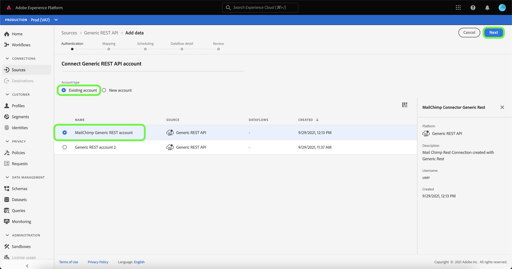

# Create a [!DNL Generic REST API] source connection in the UI

>[!NOTE]
>
> The [!DNL Generic REST API] källan är i betaversion. Se [Översikt över källor](../../../../home.md#terms-and-conditions) om du vill ha mer information om hur du använder beta-märkta anslutningar.

This tutorial provides steps for creating a [!DNL Generic REST API] source connector using the Adobe Experience Platform user interface.

## Komma igång

Den här självstudiekursen kräver en fungerande förståelse av följande plattformskomponenter:

* [Källor](../../../../home.md): Experience Platform tillåter att data kan hämtas från olika källor samtidigt som du kan strukturera, märka och förbättra inkommande data med hjälp av plattformstjänster.
* [Sandboxes](../../../../../sandboxes/home.md): Experience Platform provides virtual sandboxes which partition a single Platform instance into separate virtual environments to help develop and evolve digital experience applications.

### Gather required credentials

För att komma åt [!DNL Generic REST API] på Platform måste du ange giltiga autentiseringsuppgifter för den autentiseringstyp som du väljer. Allmänt REST API har stöd för både OAuth 2-uppdateringskod och grundläggande autentisering. I följande tabeller finns information om autentiseringsuppgifter för de två autentiseringstyper som stöds.

#### OAuth 2-uppdateringskod

| Autentiseringsuppgifter | Beskrivning |
| --- | --- |
| Värd | The host URL of the source that you are making your request to. Det här värdet är obligatoriskt och kan inte åsidosättas med parameteråsidosättning för begäran. |
| Authorization test URL | (Valfritt) URL:en för auktoriseringstestet används för att validera autentiseringsuppgifter när en basanslutning skapas. If unprovided, credentials are automatically checked during the source connection creation step instead. |
| Klient-ID | (Optional) The client ID associated with your user account. |
| Klienthemlighet | (Valfritt) Klienthemligheten som är kopplad till ditt användarkonto. |
| Åtkomsttoken | Den primära autentiseringsreferens som används för att komma åt programmet. The access token represents the authorization of your application, to access particular aspects of a user&#39;s data. This value is required and cannot be bypassed using request parameter override. |
| Refresh token | (Optional) A token that&#39;s used to generate a new access token, when the access token has expired. |
| Access token URL | (Valfritt) URL-slutpunkten som används för att hämta din åtkomsttoken. |
| Åsidosättning av begärandeparameter | (Valfritt) En egenskap som gör att du kan ange vilka autentiseringsparametrar som ska åsidosättas. |

#### Basic authentication

| Autentiseringsuppgifter | Beskrivning |
| --- | --- |
| Värd | The host URL of the source that you are making your request to. |
| Username | Användarnamnet som motsvarar ditt användarkonto. |
| Password | Lösenordet som motsvarar ditt användarkonto. |

## Anslut ditt allmänna REST API-konto

In the Platform UI, select **[!UICONTROL Sources]** from the left navigation to access the [!UICONTROL Sources] workspace. The [!UICONTROL Catalog] I visas en mängd olika källor som du kan skapa ett konto med.

Du kan välja lämplig kategori i katalogen till vänster på skärmen. Du kan också använda sökfältet till att hitta den källa du vill arbeta med.

Under [!UICONTROL Protocols] kategori, välj **[!UICONTROL Generic REST API]** och sedan markera **[!UICONTROL Add data]**.

The **[!UICONTROL Connect to Generic REST API]** visas. På den här sidan kan du antingen använda nya autentiseringsuppgifter eller befintliga.

### Befintligt konto

To connect an existing account, select the Generic REST API account you want to connect with, then select **[!UICONTROL Next]** to proceed.

### New account

Om du skapar ett nytt konto väljer du **[!UICONTROL New account]** och ange sedan ett namn och en alternativbeskrivning för ditt nya [!DNL Generic REST API] konto.

#### Authenticate using OAuth 2 refresh code

[!DNL Generic REST API] supports both OAuth 2 refresh code and basic authentication. Om du vill autentisera med en OAuth2-autentisering väljer du **[!UICONTROL OAuth2RefreshCode]**, ange dina OAuth 2-autentiseringsuppgifter och välj sedan **[!UICONTROL Connect to source]**.

#### Autentisera med grundläggande autentisering

Om du vill använda grundläggande autentisering väljer du **[!UICONTROL Basic authentication]**, ange värden, användarnamn och lösenord och välj **[!UICONTROL Connect to source]**.

## Nästa steg

By following this tutorial, you have established a connection to your Generic REST API account. You can now continue on to the next tutorial and [configure a dataflow to bring data into Platform](../../dataflow/protocols.md).
