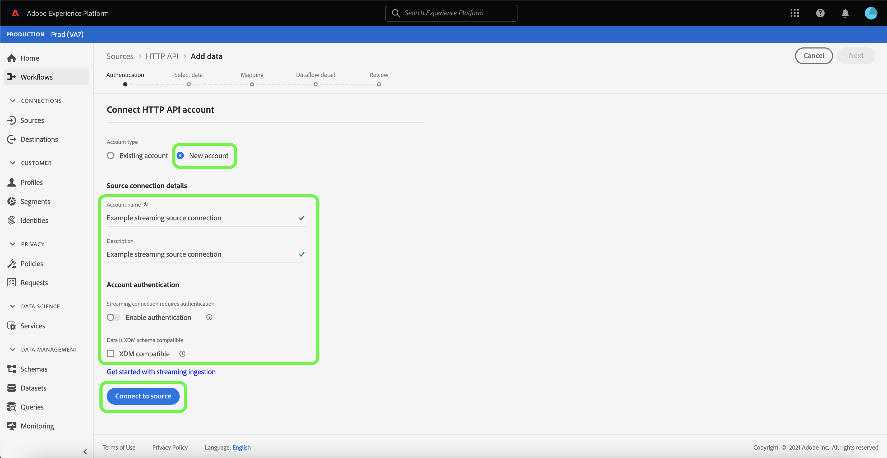

# Skapa en [!DNL HTTP API] direktuppspelningsanslutning med användargränssnittet

I den här självstudiekursen beskrivs hur du skapar en direktuppspelad källanslutning med [!UICONTROL Sources] arbetsyta.

## Komma igång

Den här självstudiekursen kräver en fungerande förståelse av följande komponenter i Adobe Experience Platform:

- [[!DNL Experience Data Model (XDM)] System](../../../../../xdm/home.md): Det standardiserade ramverk som [!DNL Experience Platform] organiserar kundupplevelsedata.
   - [Grunderna för schemakomposition](../../../../../xdm/schema/composition.md): Lär dig mer om de grundläggande byggstenarna i XDM-scheman, inklusive viktiga principer och bästa praxis när det gäller schemakomposition.
   - [Schemaredigeraren, genomgång](../../../../../xdm/tutorials/create-schema-ui.md): Lär dig hur du skapar anpassade scheman med hjälp av gränssnittet i Schemaredigeraren.
- [[!DNL Real-Time Customer Profile]](../../../../../profile/home.md): Ger en enhetlig konsumentprofil i realtid baserad på aggregerade data från flera källor.

## Skapa en direktuppspelningsanslutning

Välj **[!UICONTROL Sources]** från vänster navigering för att komma åt [!UICONTROL Sources] arbetsyta. The [!UICONTROL Catalog] I visas en mängd olika källor som du kan skapa ett konto med.

Du kan välja lämplig kategori i katalogen till vänster på skärmen. Du kan också hitta den källa du vill arbeta med med med sökalternativet.

Under **[!UICONTROL Streaming]** kategori, välj **[!UICONTROL HTTP API]** och sedan **[!UICONTROL Add data]**.

The **[!UICONTROL Connect HTTP API account]** visas. På den här sidan kan du antingen använda nya autentiseringsuppgifter eller befintliga.

### Befintligt konto

Om du vill använda ett befintligt konto väljer du det HTTP API-konto som du vill skapa ett nytt dataflöde med och väljer sedan **[!UICONTROL Next]** för att fortsätta.

### Nytt konto

Om du skapar ett nytt konto väljer du **[!UICONTROL New account]**. Ange ett kontonamn och en valfri beskrivning på indataformuläret som visas. Du får också möjlighet att ange följande konfigurationsegenskaper:

- **[!UICONTROL Authentication]:** Den här egenskapen avgör om direktuppspelningsanslutningen kräver autentisering eller inte. Autentisering säkerställer att data samlas in från betrodda källor. Om du har att göra med personligt identifierbar information (PII) ska den här egenskapen aktiveras. Som standard är den här egenskapen inaktiverad.
- **[!UICONTROL XDM compatible]:** Den här egenskapen anger om den här direktuppspelningsanslutningen skickar händelser som är kompatibla med XDM-scheman. Som standard är den här egenskapen inaktiverad.

När du är klar väljer du **[!UICONTROL Connect to source]** och sedan **[!UICONTROL Next]** för att fortsätta.

## Markera data

När du har skapat HTTP API-anslutningen **[!UICONTROL Select data]** visas så att du får ett gränssnitt där du kan överföra och förhandsgranska dina data.

Välj **[!UICONTROL Upload files]** för att överföra dina data. Du kan också dra och släppa data i [!UICONTROL Drag and drop files] -avsnittet i gränssnittet.

När dina data har överförts kan du använda den högra sidan av gränssnittet för att förhandsgranska din filhierarki. Välj **[!UICONTROL Next]** för att fortsätta.

## Mappa datafält till ett XDM-schema

The [!UICONTROL Mapping] visas med ett gränssnitt för att mappa källdata till en plattformsdatauppsättning.

The [!DNL HTTP API] har stöd för att lägga in JSON-filer. JSON-filer behöver inte konfigureras manuellt om de är markerade som XDM-kompatibla. Om inte, måste du konfigurera mappningen explicit.

Välj en datauppsättning för inkommande data som ska importeras till. Du kan antingen använda en befintlig datauppsättning eller skapa en ny.

### Skapa en ny datauppsättning

Om du vill skapa en ny datauppsättning väljer du **[!UICONTROL New dataset]**. På formuläret som visas anger du namn, valfri beskrivning och målschema för datauppsättningen. Om du väljer en [!DNL Profile]-aktiverat schema, du kan välja om datauppsättningen också ska [!DNL Profile]-enabled.

### Använd en befintlig datamängd

Om du vill använda en befintlig datauppsättning väljer du **[!UICONTROL Existing dataset]**. Markera den datauppsättning som du vill använda i formuläret som visas. När du har valt en datauppsättning kan du välja om den ska vara [!DNL Profile]-enabled.

### Mappa standardfält

Beroende på dina behov kan du välja att mappa fält direkt eller använda förinställningsfunktioner för data för att omvandla källdata för att härleda beräknade eller beräknade värden. Mer information om hur du använder mappningsgränssnittet och beräkningsfälten finns i [Användargränssnittsguide för dataprep](../../../../../data-prep/ui/mapping.md).

Välj om du vill lägga till ett nytt källfält **[!UICONTROL Add new mapping]**.

Ett nytt källfält och målfältskoppling visas. Om du vill lägga till ett nytt källfält väljer du pilikonen bredvid [!UICONTROL Select source field] indatafält.

The [!UICONTROL Select attributes] kan du utforska din filhierarki och välja ett specifikt källfält som ska kopplas till ett mål-XDM-fält. När du har valt det källfält som du vill mappa väljer du **[!UICONTROL Select]** för att fortsätta.

När du har markerat ett källfält kan du nu identifiera rätt mål-XDM-fält att mappa till. Välj schemaikonen under målfältsavsnittet.

The [!UICONTROL Map source field to target field] visas så att du får ett gränssnitt där du kan utforska schemat för måldatauppsättningen. Välj det målfält som matchar källfältet och välj sedan **[!UICONTROL Select]** för att fortsätta.

När alla källfält har mappats till rätt mål-XDM-fält väljer du **[!UICONTROL Next]**

## Dataflödesdetaljer

The **[!UICONTROL Dataflow detail]** visas. På den här sidan kan du ange information för det skapade dataflödet genom att ange ett namn och en valfri beskrivning.

När du angett information för dataflödet väljer du **[!UICONTROL Next]**.

## Granska

The **[!UICONTROL Review]** visas så att du kan granska informationen om dataflödet innan det skapas. Informationen är grupperad i följande kategorier:

- **[!UICONTROL Connection]**: Visar kontonamnet, källplattformen och källnamnet.
- **[!UICONTROL Assign dataset and map fields]**: Visar måldatauppsättningen och det schema som datauppsättningen följer.

När du har bekräftat att informationen är korrekt väljer du **[!UICONTROL Finish]**.

## Hämta URL för direktuppspelningsslutpunkt

När anslutningen har skapats visas informationssidan för källor. På den här sidan visas information om din nya anslutning, inklusive tidigare körda dataflöden, ID och URL för direktuppspelningsslutpunkt.

## Nästa steg

Genom att följa den här självstudiekursen har du skapat en HTTP-direktuppspelningsanslutning som gör att du kan använda direktuppspelningsslutpunkten för att få tillgång till en mängd olika [!DNL Data Ingestion] API. Instruktioner om hur du skapar en direktuppspelningsanslutning i API:t finns i [skapa en självstudiekurs för direktuppspelningsanslutning](../../../api/create/streaming/http.md).

Om du vill lära dig att strömma data till plattformen kan du läsa självstudiekursen på [data för tidsserie för direktuppspelning](../../../../../ingestion/tutorials/streaming-time-series-data.md) eller självstudiekursen [data för direktuppspelningspost](../../../../../ingestion/tutorials/streaming-record-data.md).
