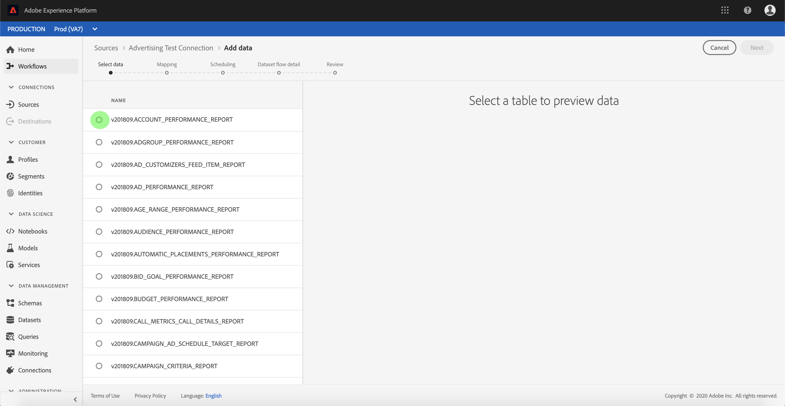
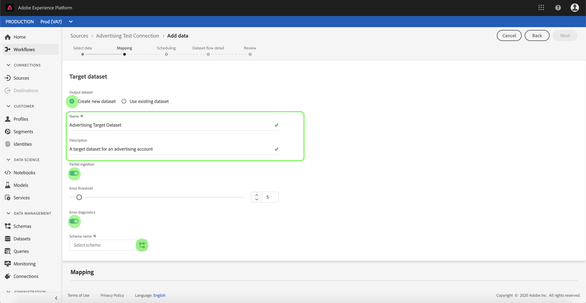
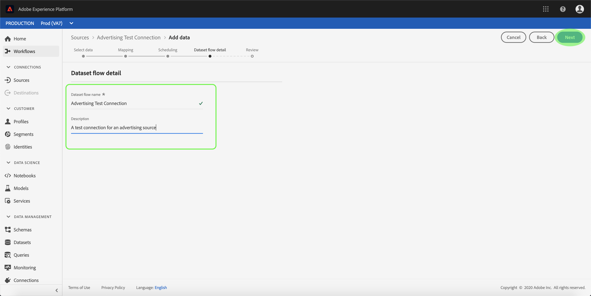
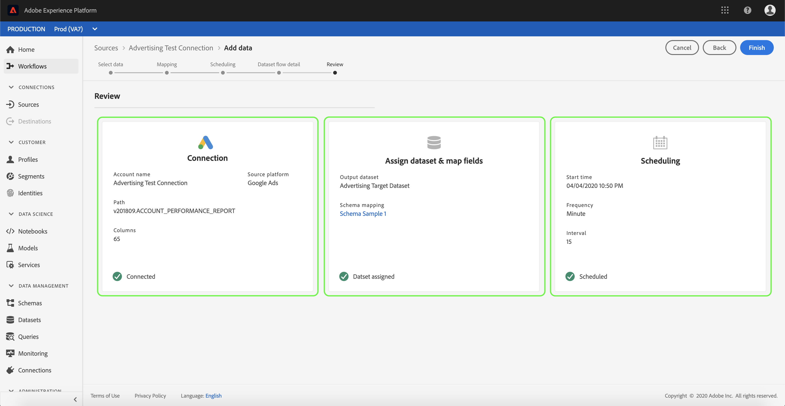

# Konfigurera ett dataflöde för en annonskontakt i användargränssnittet

Ett dataflöde är en schemalagd aktivitet som hämtar och importerar data från en källa till en datauppsättning från Adobe Experience Platform. I den här självstudiekursen beskrivs hur du konfigurerar ett nytt dataflöde med ditt annonskonto.

## Komma igång

Den här självstudiekursen kräver en fungerande förståelse av följande komponenter i Adobe Experience Platform:

- [Experience Data Model (XDM) System](../../../../xdm/home.md): Det standardiserade ramverket som [!DNL Experience Platform] organiserar kundupplevelsedata.
   - [Grundläggande om schemakomposition](../../../../xdm/schema/composition.md): Lär dig mer om de grundläggande byggstenarna i XDM-scheman, inklusive viktiga principer och bästa praxis när det gäller schemakomposition.
   - [Schemaredigeraren, genomgång](../../../../xdm/tutorials/create-schema-ui.md): Lär dig hur du skapar anpassade scheman med hjälp av gränssnittet för Schemaredigeraren.
- [Kundprofil](../../../../profile/home.md)i realtid: Ger en enhetlig konsumentprofil i realtid baserad på aggregerade data från flera källor.

Dessutom kräver den här självstudiekursen att du redan har skapat ett annonskonto. En lista med självstudiekurser för att skapa olika betalningsanslutningar i användargränssnittet finns i [källanslutningsöversikten](../../../home.md).

## Markera data

När du har skapat ditt annonskonto visas *[!UICONTROL Select data]* steget och du får ett interaktivt gränssnitt där du kan utforska din filhierarki.

- Den vänstra halvan av gränssnittet är en katalogwebbläsare som visar serverns filer och kataloger.
- I den högra delen av gränssnittet kan du förhandsgranska upp till 100 rader data från en kompatibel fil.

Markera den katalog som du vill använda och välj sedan **[!UICONTROL Next]**.

## Mappa datafält till ett XDM-schema

Steget visas och innehåller ett interaktivt gränssnitt för att mappa källdata till en *[!UICONTROL Mapping]* [!DNL Platform] datauppsättning.

Välj en datauppsättning för inkommande data som ska importeras till. Du kan antingen använda en befintlig datauppsättning eller skapa en ny datauppsättning.

### Använd en befintlig datauppsättning

Om du vill importera data till en befintlig datauppsättning väljer du **[!UICONTROL Use existing dataset]** och klickar sedan på datamängdikonen .

Dialogrutan *[!UICONTROL Select dataset]* visas. Hitta den datauppsättning du vill använda, markera den och klicka sedan på **[!UICONTROL Continue]**.

### Använd en ny datauppsättning

Om du vill importera data till en ny datauppsättning markerar du **[!UICONTROL Create new dataset]** och anger ett namn och en beskrivning för datauppsättningen i de angivna fälten.

Under den här processen kan du även aktivera *[!UICONTROL Partial ingestion]* och *[!UICONTROL Error diagnostics]*. Aktivering *[!UICONTROL Partial ingestion]* ger möjlighet att importera data som innehåller fel, upp till ett visst tröskelvärde som du kan ange. Aktiveringen [!UICONTROL Error diagnostics] ger information om felaktiga data som grupperas separat. Mer information finns i översikten över [partiell gruppöverföring](../../../../ingestion/batch-ingestion/partial.md).

När du är klar klickar du på schemaikonen.

Dialogrutan *[!UICONTROL Select schema]* visas. Välj det schema som du vill använda för den nya datauppsättningen och klicka sedan på **[!DNL Done]**.

Beroende på dina behov kan du välja att mappa fält direkt eller använda mappningsfunktioner för att omvandla källdata för att härleda beräknade eller beräknade värden. Mer information om datamappning och mappningsfunktioner finns i självstudiekursen om att [mappa CSV-data till XDM-schemafält](../../../../ingestion/tutorials/map-a-csv-file.md).

Du kan också ange inställningar på *[!UICONTROL Mapping]* skärmen *[!UICONTROL Delta column]*. När dataflödet skapas kan du ange vilket tidsstämpelfält som helst som bas för att bestämma vilka poster som ska importeras i schemalagda stegvisa inmatningar.

När källdata har mappats klickar du på **[!UICONTROL Next]**.

## Schemalägg körning av inmatning

Steget visas så att du kan konfigurera ett schema för att automatiskt importera valda källdata med de konfigurerade mappningarna. *[!UICONTROL Scheduling]* I följande tabell visas de olika konfigurerbara fälten för schemaläggning:

| Fält | Beskrivning |
| --- | --- |
| Frekvens | Valbara frekvenser är En gång, Minut, Timme, Dag och Vecka. |
| Intervall | Ett heltal som anger intervallet för den valda frekvensen. |
| Starttid | En UTC-tidsstämpel som anger när det allra första intaget är inställt |
| Backfill | Ett booleskt värde som avgör vilka data som hämtas från början. Om *Backfill* är aktiverat, kommer alla aktuella filer i den angivna sökvägen att kapslas in under det första schemalagda intaget. Om *Backfill* är inaktiverat kapslas endast de filer som läses in mellan den första importkörningen och *starttiden* . Filer som lästs in före *starttiden* importeras inte. |
| Delta-kolumn | Ett alternativ med en filtrerad uppsättning källschemafält av typen, datumet eller tiden. Det här fältet används för att skilja mellan nya och befintliga data. Inkrementella data importeras baserat på tidsstämpeln för den markerade kolumnen. |

Dataflöden är utformade för att automatiskt importera data enligt schema. Börja med att välja intagsfrekvens. Ange sedan intervallet för att ange perioden mellan två flödeskörningar. Intervallets värde måste vara ett heltal som inte är noll och måste vara större än eller lika med 15.

Om du vill ange starttid för intaget justerar du datumet och tiden som visas i rutan för starttid. Du kan också välja kalenderikonen för att redigera starttidsvärdet. Starttiden måste vara större än eller lika med den aktuella UTC-tiden.

Välj **[!UICONTROL Load incremental data by]** att tilldela deltakolumnen. I det här fältet görs en skillnad mellan nya och befintliga data.

### Konfigurera ett dataflöde för engångsbruk

Om du vill ställa in engångsintag väljer du den nedrullningsbara pilen för frekvens och väljer **[!UICONTROL Once]**.

>[!TIP] **[!UICONTROL Interval]** och **[!UICONTROL Backfill]** inte är synliga vid engångsbruk.

När du har angett lämpliga värden för schemat väljer du **[!UICONTROL Next]**.

## Namnge dataflödet

Stegen visas där du måste ange ett namn och en valfri beskrivning för dataflödet. *[!UICONTROL Dataflow detail]* Steget visas. Välj **[!UICONTROL Next]** när du är klar.

## Granska ditt dataflöde

Steget visas så att du kan granska det nya dataflödet innan det skapas. *[!UICONTROL Review]* Informationen är grupperad i följande kategorier:

- *[!UICONTROL Connection]*: Visar källtypen, den relevanta sökvägen för den valda källfilen och mängden kolumner i källfilen.
- *[!UICONTROL Assign dataset & map fields]*: Visar vilken datauppsättning källdata hämtas till, inklusive det schema som datauppsättningen följer.
- *[!UICONTROL Scheduling]*: Visar den aktiva perioden, frekvensen och intervallet för intag-schemat.

När du har granskat dataflödet kan du klicka **[!UICONTROL Finish]** och vänta tills dataflödet har skapats.

## Övervaka och ta bort dataflödet

När dataflödet har skapats kan du övervaka de data som hämtas genom det. Mer information om hur du övervakar och tar bort dataflöden finns i självstudiekursen om [övervakning och borttagning av dataflöden](../monitor.md).

## Nästa steg

Genom att följa den här självstudiekursen har du skapat ett dataflöde som hämtar in data från ett automatiserat marknadsföringssystem och fått insikter om att övervaka datauppsättningar. Inkommande data kan nu användas av [!DNL Platform] tjänster längre fram i kedjan som [!DNL Real-time Customer Profile] och [!DNL Data Science Workspace]. Mer information finns i följande dokument:

- [Översikt över kundprofiler i realtid](../../../../profile/home.md)
- [Översikt över arbetsytan Datavetenskap](../../../../data-science-workspace/home.md)

## Bilaga

I följande avsnitt finns ytterligare information om hur du arbetar med källkopplingar.

### Inaktivera ett dataflöde

När ett dataflöde skapas blir det omedelbart aktivt och importerar data enligt det schema som det gavs. Du kan när som helst inaktivera ett aktivt dataflöde genom att följa instruktionerna nedan.

Markera namnet på det dataflöde som du vill inaktivera på *[!UICONTROL Dataflows]* skärmen.

Kolumnen visas *[!UICONTROL Properties]* till höger på skärmen. Panelen innehåller en **[!UICONTROL Enabled]** växlingsknapp. Klicka på växlingsknappen för att inaktivera dataflödet. Samma växlingsknapp kan användas för att återaktivera ett dataflöde efter att det har inaktiverats.

### Aktivera inkommande data för [!DNL Profile] populationen

Inkommande data från källkopplingen kan användas för att berika och fylla i dina [!DNL Real-time Customer Profile] data. Mer information om hur du fyller i dina [!DNL Real-time Customer Profile] data finns i självstudiekursen om [profilpopulationen](../profile.md).
