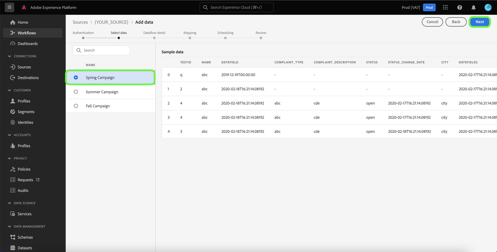

# Skapa ett dataflöde med hjälp av en analyskälla i användargränssnittet

Ett dataflöde är en schemalagd aktivitet som hämtar och importerar data från en källa till en datauppsättning i Adobe Experience Platform. I den här självstudiekursen beskrivs hur du skapar ett dataflöde för en analyskälla med hjälp av plattformsgränssnittet.

>[!NOTE]
>
>Om du vill skapa ett dataflöde måste du redan ha ett autentiserat konto hos [!DNL Mixpanel] källa. Se självstudiekursen om [skapa [!DNL Mixpanel] källanslutning i användargränssnittet](../../ui/create/analytics/mixpanel.md) för mer information.

## Komma igång

Den här självstudiekursen kräver en fungerande förståelse av följande plattformskomponenter:

* [Källor](../../../home.md): Plattformen gör att data kan hämtas från olika källor samtidigt som du kan strukturera, märka och förbättra inkommande data med [!DNL Platform] tjänster.
* [[!DNL Experience Data Model (XDM)] System](../../../../xdm/home.md): Det standardiserade ramverk som Experience Platform använder för att ordna kundupplevelsedata.
   * [Grunderna för schemakomposition](../../../../xdm/schema/composition.md): Lär dig mer om de grundläggande byggstenarna i XDM-scheman, inklusive viktiga principer och bästa praxis när det gäller schemakomposition.
   * [Schemaredigeraren, genomgång](../../../../xdm/tutorials/create-schema-ui.md): Lär dig hur du skapar anpassade scheman med hjälp av gränssnittet för Schemaredigeraren.
* [[!DNL Real-Time Customer Profile]](../../../../profile/home.md): Ger en enhetlig konsumentprofil i realtid baserad på aggregerade data från flera källor.
* [[!DNL Data Prep]](../../../../data-prep/home.md): Gör det möjligt för datatekniker att mappa, omvandla och validera data till och från Experience Data Model (XDM).

<!-- ## Add data

After creating your analytics source account, the **[!UICONTROL Add data]** step appears, providing an interface for you to explore your analytics account's table hierarchy.

* The left half of the interface is a browser, displaying a list of data tables contained in your account. The interface also includes a search option that allows you to quickly identify the source data you intend to use.
* The right half of the interface is a preview panel, allowing you to preview up to 100 rows of data.

>[!NOTE]
>
>The search source data option is available to all table-based sources excluding the Adobe Analytics, [!DNL Amazon Kinesis], and [!DNL Azure Event Hubs].

Once you find the source data, select the table, then select **[!UICONTROL Next]**.

 -->

## Ange information om dataflöde

The [!UICONTROL Dataflow detail] kan du välja om du vill använda en befintlig datamängd eller en ny datamängd. Under den här processen kan du även konfigurera inställningar för [!UICONTROL Profile dataset], [!UICONTROL Error diagnostics], [!UICONTROL Partial ingestion]och [!UICONTROL Alerts].

### Använd en befintlig datauppsättning

Om du vill importera data till en befintlig datauppsättning väljer du **[!UICONTROL Existing dataset]**. Du kan antingen hämta en befintlig datauppsättning med [!UICONTROL Advanced search] eller genom att bläddra igenom listan med befintliga datauppsättningar i listrutan. När du har valt en datauppsättning anger du ett namn och en beskrivning för dataflödet.

### Använd en ny datauppsättning

Om du vill importera till en ny datauppsättning väljer du **[!UICONTROL New dataset]** och ange sedan ett namn och en valfri beskrivning för utdatauppsättningen. Välj sedan ett schema att mappa till med [!UICONTROL Advanced search] eller genom att bläddra igenom listan med befintliga scheman i listrutan. När du har valt ett schema anger du ett namn och en beskrivning för dataflödet.

### Aktivera [!DNL Profile] och feldiagnostik

Välj sedan **[!UICONTROL Profile dataset]** växla för att aktivera datauppsättningen för [!DNL Profile]. På så sätt kan du skapa en helhetsbild av en enhets attribut och beteenden. Data från alla [!DNL Profile]-aktiverade datauppsättningar inkluderas i [!DNL Profile] och ändringarna tillämpas när du sparar dataflödet.

[!UICONTROL Error diagnostics] möjliggör detaljerad generering av felmeddelanden för alla felaktiga poster som inträffar i dataflödet, medan [!UICONTROL Partial ingestion] gör att du kan importera data som innehåller fel, upp till ett visst tröskelvärde som du manuellt anger. Se [partiell batchingång - översikt](../../../../ingestion/batch-ingestion/partial.md) för mer information.

### Aktivera aviseringar

Du kan aktivera varningar för att få meddelanden om status för ditt dataflöde. Välj en avisering i listan om du vill prenumerera och få meddelanden om status för ditt dataflöde. Mer information om varningar finns i guiden [prenumerera på källvarningar med hjälp av användargränssnittet](../alerts.md).

När du är klar med informationen om dataflödet väljer du **[!UICONTROL Next]**.

## Mappa datafält till ett XDM-schema

>[!IMPORTANT]
>
>Du kan inte mappa värden för dynamiska nyckelpar som ett objekt från [!DNL OneTrust] till Platform och måste ange dessa nycklar i målschemat för att mappa dina data under importen.

The [!UICONTROL Mapping] visas med ett gränssnitt för att mappa källfälten från källschemat till rätt mål-XDM-fält i målschemat.

Plattformen ger intelligenta rekommendationer för automatiskt mappade fält baserat på det målschema eller den datamängd du valt. Du kan justera mappningsreglerna manuellt så att de passar dina användningsfall. Beroende på dina behov kan du välja att mappa fält direkt eller använda förinställningsfunktioner för data för att omvandla källdata för att härleda beräknade eller beräknade värden. Mer information om hur du använder mappningsgränssnittet och beräkningsfälten finns i [Användargränssnittsguide för dataprep](../../../../data-prep/ui/mapping.md).

När källdata har mappats väljer du **[!UICONTROL Next]**.

## Schemalägg körning av inmatning

The [!UICONTROL Scheduling] visas så att du kan konfigurera ett matningsschema att automatiskt importera valda källdata med de konfigurerade mappningarna. Som standard är schemaläggning inställd på `Once`. Om du vill justera din matningsfrekvens väljer du **[!UICONTROL Frequency]** och välj sedan ett alternativ i listrutan.

>[!TIP]
>
>Intervall och bakåtfyllnad syns inte vid engångsinmatning.

Om du ställer in din matningsfrekvens på `Minute`, `Hour`, `Day`, eller `Week`måste du ange ett intervall för att skapa en fast tidsram mellan varje intag. Till exempel en matningsfrekvens som är inställd på `Day` och ett intervall anges till `15` innebär att ditt dataflöde är schemalagt att importera data var 15:e dag.

Under det här steget kan du även aktivera **bakfyllning** och definiera en kolumn för stegvis inmatning av data. Backfill används för att importera historiska data, medan kolumnen som du definierar för inkrementellt intag gör att nya data kan skiljas från befintliga data.

Se tabellen nedan för mer information om schemaläggningskonfigurationer.

| Fält | Beskrivning |
| --- | --- |
| Frekvens | Frekvensen med vilken ett intag sker. Valbara frekvenser inkluderar `Once`, `Minute`, `Hour`, `Day`och `Week`. |
| Intervall | Ett heltal som anger intervallet för den valda frekvensen. Intervallets värde måste vara ett heltal som inte är noll och måste vara större än eller lika med 15. |
| Starttid | En UTC-tidsstämpel som anger när det allra första intaget är inställt. Starttiden måste vara större än eller lika med den aktuella UTC-tiden. |
| Backfill | Ett booleskt värde som avgör vilka data som hämtas från början. Om bakåtfyllning är aktiverad, kommer alla aktuella filer i den angivna sökvägen att importeras under det första schemalagda intaget. Om underfyllning är inaktiverad importeras endast de filer som läses in mellan den första importkörningen och starttiden. Filer som lästs in före starttiden importeras inte. |
| Läs in inkrementella data med | Ett alternativ med en filtrerad uppsättning källschemafält av typen, datumet eller tiden. Fältet som du väljer för **[!UICONTROL Load incremental data by]** måste ha sina datum/tid-värden i UTC-tidszonen för att inkrementella data ska kunna läsas in korrekt. Alla tabellbaserade batchkällor hämtar inkrementella data genom att jämföra ett deltskolumnens tidsstämpelvärde med motsvarande körningsfönster UTC-tid och sedan kopiera data från källan, om nya data hittas i UTC-tidsfönstret. |

## Granska ditt dataflöde

The **[!UICONTROL Review]** visas så att du kan granska det nya dataflödet innan det skapas. Informationen är grupperad i följande kategorier:

* **[!UICONTROL Connection]**: Visar källtypen, den relevanta sökvägen för den valda källfilen och mängden kolumner i källfilen.
* **[!UICONTROL Assign dataset & map fields]**: Visar vilken datauppsättning källdata hämtas till, inklusive det schema som datauppsättningen följer.
* **[!UICONTROL Scheduling]**: Visar den aktiva perioden, frekvensen och intervallet för intag-schemat.

När du har granskat dataflödet väljer du **[!UICONTROL Finish]** så att dataflödet kan skapas.

## Övervaka dataflödet

När dataflödet har skapats kan du övervaka de data som importeras genom det för att se information om hur mycket data som har intagits, hur bra de är och vilka fel som har uppstått. Mer information om hur du övervakar dataflöde finns i självstudiekursen om [övervaka konton och dataflöden i användargränssnittet](../monitor.md).

## Ta bort ditt dataflöde

Du kan ta bort dataflöden som inte längre är nödvändiga eller som har skapats felaktigt med **[!UICONTROL Delete]** finns i **[!UICONTROL Dataflows]** arbetsyta. Mer information om hur du tar bort dataflöden finns i självstudiekursen om [ta bort dataflöden i användargränssnittet](../delete.md).

## Nästa steg

Genom att följa den här självstudiekursen har du skapat ett dataflöde för att överföra data från analyskällan till plattformen. Inkommande data kan nu användas av underordnade [!DNL Platform] tjänster som [!DNL Real-Time Customer Profile] och [!DNL Data Science Workspace]. Mer information finns i följande dokument:

* [[!DNL Real-Time Customer Profile] översikt](../../../../profile/home.md)
* [[!DNL Data Science Workspace] översikt](../../../../data-science-workspace/home.md)

>[!WARNING]
>
> Det plattformsgränssnitt som visas i följande video är inaktuellt. Läs dokumentationen ovan för de senaste skärmbilderna och funktionerna i användargränssnittet.
>
>[!VIDEO](https://video.tv.adobe.com/v/29711?quality=12&learn=on)
