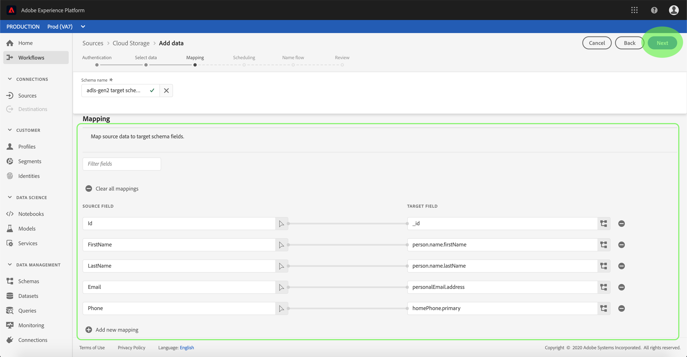
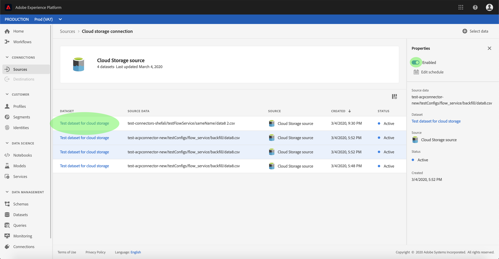

# Konfigurera ett dataflöde för en batchanslutning för molnlagring i användargränssnittet

Ett dataflöde är en schemalagd aktivitet som hämtar och importerar data från en källa till en [!DNL Platform] datauppsättning. I den här självstudiekursen beskrivs hur du konfigurerar ett nytt dataflöde med ditt molnlagringskonto.

## Komma igång

Den här självstudiekursen kräver en fungerande förståelse av följande komponenter i Adobe Experience Platform:

* [[!DNL Experience Data Model] (XDM) System](../../../../../xdm/home.md): Det standardiserade ramverket som [!DNL Experience Platform] organiserar kundupplevelsedata.
   * [Grundläggande om schemakomposition](../../../../../xdm/schema/composition.md): Lär dig mer om de grundläggande byggstenarna i XDM-scheman, inklusive viktiga principer och bästa praxis när det gäller schemakomposition.
   * [Schemaredigeraren, genomgång](../../../../../xdm/tutorials/create-schema-ui.md): Lär dig hur du skapar anpassade scheman med hjälp av gränssnittet för Schemaredigeraren.
* [[!DNL Real-time Customer Profile]](../../../../../profile/home.md): Ger en enhetlig konsumentprofil i realtid baserad på aggregerade data från flera källor.

Den här självstudiekursen kräver dessutom att du har ett etablerat molnlagringskonto. En lista med självstudiekurser för att skapa olika molnlagringskonton i gränssnittet finns i [källanslutningsöversikten](../../../../home.md).

### Filformat som stöds

[!DNL Experience Platform] har stöd för följande filformat som ska importeras från externa lagringsplatser:

* Avgränsaravgränsade värden (DSV): Stödet för DSV-formaterade datafiler är för närvarande begränsat till kommaavgränsade värden. Värdet för fältrubriker i DSV-formaterade filer får endast bestå av alfanumeriska tecken och understreck. Stöd för allmänna DSV-filer kommer att ges i framtiden.
* [!DNL JavaScript Object Notation] (JSON): JSON-formaterade datafiler måste vara XDM-kompatibla.
* [!DNL Apache Parquet]: Parquet-formaterade datafiler måste vara XDM-kompatibla.

## Markera data

När du har skapat ditt molnlagringskonto visas **[!UICONTROL Select data]** steget och du får ett interaktivt gränssnitt där du kan utforska din molnlagringshierarki.

* Den vänstra halvan av gränssnittet är en katalogwebbläsare som visar serverns filer och kataloger.
* I den högra delen av gränssnittet kan du förhandsgranska upp till 100 rader data från en kompatibel fil.

Om du väljer en mapp i listan kan du gå igenom mapphierarkin till djupare mappar. När du har markerat en kompatibel fil eller mapp visas listrutan där du kan välja ett format för att visa data i förhandsvisningsfönstret. **[!UICONTROL Select data format]**

När förhandsvisningsfönstret har fyllts i kan du välja **[!UICONTROL Next]** att överföra alla filer i den valda mappen. Om du vill överföra till en viss fil markerar du filen i listan innan du väljer **[!UICONTROL Next]**.

### Ingest Parquet- eller JSON-filer

Filformat som stöds för ett molnlagringskonto inkluderar även JSON och Parquet. JSON- och Parquet-filer måste vara XDM-kompatibla. Om du vill importera JSON- eller Parquet-filer väljer du lämpligt filformat i katalogwebbläsaren och tillämpar kompatibelt dataformat från det högra gränssnittet. Välj **[!UICONTROL Next]** att fortsätta.

>[!IMPORTANT]
>
>Till skillnad från avgränsade filtyper är JSON- och Parquet-formaterade filer inte tillgängliga för förhandsgranskning.

## Mappa datafält till ett XDM-schema

Steget visas och innehåller ett interaktivt gränssnitt för att mappa källdata till en **[!UICONTROL Mapping]** [!DNL Platform] datauppsättning. Källfiler som är formaterade i JSON eller Parquet måste vara XDM-kompatibla och kräver inte att du konfigurerar mappningen manuellt. CSV-filer kräver däremot att du uttryckligen konfigurerar mappningen, men låter dig välja vilka källdatafält som ska mappas.

Välj en datauppsättning för inkommande data som ska importeras till. Du kan antingen använda en befintlig datauppsättning eller skapa en ny.

**Använd en befintlig datauppsättning**

Om du vill importera data till en befintlig datauppsättning väljer du **[!UICONTROL Existing dataset]** och sedan datamängdikonen.

Dialogrutan **[!UICONTROL Select dataset]** visas. Hitta den datauppsättning du vill använda, markera den och klicka sedan på **[!UICONTROL Continue]**.

**Använd en ny datauppsättning**

Om du vill importera data till en ny datauppsättning markerar du **[!UICONTROL New dataset]** och anger ett namn och en beskrivning för datauppsättningen i de angivna fälten. Om du vill lägga till ett schema kan du ange ett befintligt schemanamn i **[!UICONTROL Select schema]** dialogrutan. Du kan också välja **[!UICONTROL Schema advanced search]** att söka efter ett lämpligt schema.

Under det här steget kan du aktivera datauppsättningen för [!DNL Real-time Customer Profile] och skapa en helhetsbild av en enhets attribut och beteenden. Data från alla aktiverade datauppsättningar inkluderas i [!DNL Profile] och ändringar tillämpas när du sparar dataflödet.

Aktivera måldatauppsättningen för genom att växla **[!UICONTROL Profile dataset]** knapp [!DNL Profile].

Dialogrutan **[!UICONTROL Select schema]** visas. Välj det schema som du vill tillämpa på den nya datauppsättningen och välj sedan **[!UICONTROL Done]**.

Beroende på dina behov kan du välja att mappa fält direkt eller använda mappningsfunktioner för att omvandla källdata för att härleda beräknade eller beräknade värden. Mer information om datamappning och mappningsfunktioner finns i självstudiekursen om att [mappa CSV-data till XDM-schemafält](../../../../../ingestion/tutorials/map-a-csv-file.md).

>[!TIP]
>
>[!DNL Platform] innehåller intelligenta rekommendationer för automatiskt mappade fält baserat på det målschema eller den datamängd som du har valt. Du kan justera mappningsreglerna manuellt så att de passar dina användningsfall.

Välj **[!UICONTROL Preview data]** om du vill visa mappningsresultat på upp till 100 rader med exempeldata från den valda datauppsättningen.

Under förhandsgranskningen prioriteras identitetskolumnen som det första fältet, eftersom det är den nyckelinformation som krävs vid validering av mappningsresultat.

När källdata har mappats väljer du **[!UICONTROL Close]**.

## Schemalägg körning av inmatning

Steget visas så att du kan konfigurera ett schema för att automatiskt importera valda källdata med de konfigurerade mappningarna. **[!UICONTROL Scheduling]** I följande tabell visas de olika konfigurerbara fälten för schemaläggning:

| Fält | Beskrivning |
| --- | --- |
| Frekvens | Valbara frekvenser inkluderar `Once`, `Minute`, `Hour`, `Day`och `Week`. |
| Intervall | Ett heltal som anger intervallet för den valda frekvensen. |
| Starttid | En UTC-tidsstämpel som anger när det allra första intaget är inställt. |
| Backfill | Ett booleskt värde som avgör vilka data som hämtas från början. Om **[!UICONTROL Backfill]** är aktiverat importeras alla aktuella filer i den angivna sökvägen under den första schemalagda importen. Om **[!UICONTROL Backfill]** är inaktiverat importeras endast de filer som är inlästa mellan den första importen och den andra **[!UICONTROL Start time]** . Filer som lästs in tidigare **[!UICONTROL Start time]** kommer inte att importeras. |

Dataflöden är utformade för att automatiskt importera data enligt schema. Börja med att välja intagsfrekvens. Ange sedan intervallet för att ange perioden mellan två flödeskörningar. Intervallets värde måste vara ett heltal som inte är noll och måste vara större än eller lika med 15.

Om du vill ange starttid för intaget justerar du datumet och tiden som visas i rutan för starttid. Du kan också välja kalenderikonen för att redigera starttidsvärdet. Starttiden måste vara större än eller lika med den aktuella tiden i UTC.

Ange värden för schemat och välj **[!UICONTROL Next]**.

### Konfigurera ett dataflöde för engångsbruk

Om du vill ställa in engångsintag väljer du den nedrullningsbara pilen för frekvens och väljer **[!UICONTROL Once]**. Du kan fortsätta att redigera ett dataflöde för att få en engångsfrekvens så länge som starttiden är kvar i framtiden. När starttiden har passerat kan engångsfrekvensvärdet inte längre redigeras.

>[!TIP]
>
>**[!UICONTROL Interval]** och **[!UICONTROL Backfill]** inte är synliga vid engångsbruk.

När du har angett lämpliga värden för schemat väljer du **[!UICONTROL Next]**.

## Ange information om dataflöde

Stegen visas så att du kan ange ett namn och en kort beskrivning av det nya dataflödet. **[!UICONTROL Dataflow detail]**

Under den här processen kan du även aktivera **[!UICONTROL Partial ingestion]** och **[!UICONTROL Error diagnostics]**. Aktivering **[!UICONTROL Partial ingestion]** ger möjlighet att importera data som innehåller fel, upp till ett visst tröskelvärde som du kan ange. Aktivering **[!UICONTROL Error diagnostics]** ger information om felaktiga data som grupperas separat. Mer information finns i översikten över [partiell gruppöverföring](../../../../../ingestion/batch-ingestion/partial.md).

Ange värden för dataflödet och välj **[!UICONTROL Next]**.

## Granska ditt dataflöde

Steget visas så att du kan granska det nya dataflödet innan det skapas. **[!UICONTROL Review]** Informationen är grupperad i följande kategorier:

* **[!UICONTROL Connection]**: Visar källtypen, den relevanta sökvägen för den valda källfilen och mängden kolumner i källfilen.
* **[!UICONTROL Assign dataset & map fields]**: Visar vilken datauppsättning källdata hämtas till, inklusive det schema som datauppsättningen följer.
* **[!UICONTROL Scheduling]**: Visar den aktiva perioden, frekvensen och intervallet för intag-schemat.

När du har granskat dataflödet kan du klicka **[!UICONTROL Finish]** och vänta tills dataflödet har skapats.

## Övervaka dataflödet

När dataflödet har skapats kan du övervaka de data som importeras genom det för att se information om hur mycket data som har intagits, hur bra de är och vilka fel som har uppstått. Mer information om hur du övervakar dataflöde finns i självstudiekursen om [övervakning av konton och dataflöden i användargränssnittet](../../monitor.md).

## Ta bort ditt dataflöde

Du kan ta bort dataflöden som inte längre är nödvändiga eller som har skapats felaktigt med den **[!UICONTROL Delete]** funktion som finns på **[!UICONTROL Dataflows]** arbetsytan. Mer information om hur du tar bort dataflöden finns i självstudiekursen om hur du [tar bort dataflöden i användargränssnittet](../../delete.md).

## Nästa steg

Genom att följa den här självstudiekursen har du skapat ett dataflöde för att hämta in data från en extern molnlagring och fått insikter om att övervaka datauppsättningar. Om du vill veta mer om hur du skapar dataflöden kan du komplettera din inlärning genom att titta på videon nedan. Dessutom kan inkommande data nu användas av [!DNL Platform] tjänster längre fram i kedjan som [!DNL Real-time Customer Profile] och [!DNL Data Science Workspace]. Mer information finns i följande dokument:

* [[!DNL Real-time Customer Profile] översikt](../../../../../profile/home.md)
* [[!DNL Data Science Workspace] översikt](../../../../../data-science-workspace/home.md)

>[!WARNING]
>
> Gränssnittet [!DNL Platform] som visas i följande video är inaktuellt. Läs dokumentationen ovan för de senaste skärmbilderna och funktionerna i användargränssnittet.

>[!VIDEO](https://video.tv.adobe.com/v/29695?quality=12&learn=on)

## Bilaga

I följande avsnitt finns ytterligare information om hur du arbetar med källkopplingar.

### Inaktivera ett dataflöde

När ett dataflöde skapas blir det omedelbart aktivt och importerar data enligt det schema som det gavs. Du kan när som helst inaktivera ett aktivt dataflöde genom att följa instruktionerna nedan.

Klicka på **[!UICONTROL Sources]** fliken på arbetsytan **[!UICONTROL Browse]** . Klicka sedan på namnet på kontot som är associerat med det aktiva dataflödet som du vill inaktivera.

Sidan visas **[!UICONTROL Source activity]** . Markera det aktiva dataflödet i listan för att öppna dess **[!UICONTROL Properties]** kolumn till höger på skärmen, som innehåller en **[!UICONTROL Enabled]** växlingsknapp. Klicka på växlingsknappen för att inaktivera dataflödet. Samma växlingsknapp kan användas för att återaktivera ett dataflöde efter att det har inaktiverats.

### Aktivera inkommande data för [!DNL Profile] populationen

Inkommande data från källkopplingen kan användas för att berika och fylla i dina [!DNL Real-time Customer Profile] data. Mer information om hur du fyller i dina [!DNL Real-time Customer Profile] data finns i självstudiekursen om [profilpopulationen](../../profile.md).
