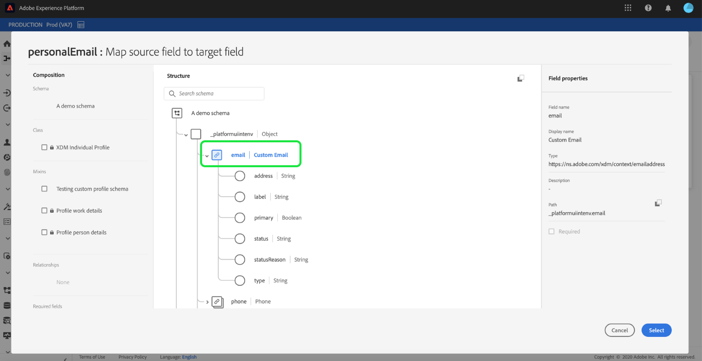

# Konfigurera ett dataflöde för en batchanslutning till molnlagring i användargränssnittet

Ett dataflöde är en schemalagd aktivitet som hämtar och importerar data från en källa till en [!DNL Platform] datauppsättning. I den här självstudiekursen beskrivs hur du konfigurerar ett nytt dataflöde med ditt molnlagringskonto.

## Komma igång

Den här självstudiekursen kräver en fungerande förståelse av följande komponenter i Adobe Experience Platform:

* [[!DNL Experience Data Model (XDM)] System](../../../../../xdm/home.md): Det standardiserade ramverk som [!DNL Experience Platform] organiserar kundupplevelsedata.
   * [Grunderna för schemakomposition](../../../../../xdm/schema/composition.md): Lär dig mer om de grundläggande byggstenarna i XDM-scheman, inklusive viktiga principer och bästa praxis när det gäller schemakomposition.
   * [Schemaredigeraren, genomgång](../../../../../xdm/tutorials/create-schema-ui.md): Lär dig hur du skapar anpassade scheman med hjälp av gränssnittet för Schemaredigeraren.
* [[!DNL Real-time Customer Profile]](../../../../../profile/home.md): Ger en enhetlig konsumentprofil i realtid baserad på aggregerade data från flera källor.

Den här självstudiekursen kräver dessutom att du har ett etablerat molnlagringskonto. En lista med självstudiekurser för att skapa olika molnlagringskonton i användargränssnittet finns i [översikt över källanslutningar](../../../../home.md).

### Filformat som stöds

[!DNL Experience Platform] har stöd för följande filformat som ska importeras från externa lagringsplatser:

* Avgränsaravgränsade värden (DSV): Alla värden med ett tecken kan användas som avgränsare för DSV-formaterade datafiler.
* [!DNL JavaScript Object Notation] (JSON): JSON-formaterade datafiler måste vara XDM-kompatibla.
* [!DNL Apache Parquet]: Parquet-formaterade datafiler måste vara XDM-kompatibla.
* Komprimerade filer: JSON och avgränsade filer kan komprimeras som: `bzip2`, `gzip`, `deflate`, `zipDeflate`, `tarGzip`och `tar`.

## Markera data

När du har skapat ditt molnlagringskonto **[!UICONTROL Select data]** visas med ett gränssnitt där du kan utforska din molnlagringsfilshierarki.

* Den vänstra delen av gränssnittet är en katalogwebbläsare som visar lagringsfiler och kataloger i molnet.
* Med den högra delen av gränssnittet kan du förhandsgranska upp till 100 rader data från en kompatibel fil.

Om du väljer en mapp i listan kan du gå igenom mapphierarkin till djupare mappar. Du kan markera en mapp om du vill importera alla filer i mappen rekursivt. När du importerar en hel mapp måste du se till att alla filer i mappen delar samma schema.

När du har markerat en kompatibel fil eller mapp väljer du motsvarande dataformat på menyn [!UICONTROL Select data format] nedrullningsbar meny.

I följande tabell visas rätt dataformat för de filtyper som stöds:

| Filtyp | Dataformat |
| --- | --- |
| CSV | [!UICONTROL Delimited] |
| JSON | [!UICONTROL JSON] |
| Parquet | [!UICONTROL XDM Parquet] |

Välj **[!UICONTROL JSON]** och vänta några sekunder på att förhandsvisningsgränssnittet ska fyllas i.

>[!NOTE]
>
>Till skillnad från filtyperna separerad och JSON är Parquet-formaterade filer inte tillgängliga för förhandsgranskning.

I förhandsvisningsgränssnittet kan du inspektera innehållet och strukturen i en fil. Som standard visas den första filen i den markerade mappen i förhandsvisningsgränssnittet.

Om du vill förhandsgranska en annan fil markerar du förhandsvisningsikonen bredvid namnet på filen som du vill inspektera.

När du har inspekterat innehållet och strukturen för filerna i mappen väljer du **[!UICONTROL Next]** om du vill importera alla filer i mappen rekursivt.

Om du föredrar att välja en viss fil markerar du den fil som du vill importera och väljer sedan **[!UICONTROL Next]**.

### Ange en anpassad avgränsare för avgränsade filer

Du kan ange en egen avgränsare när du importerar avgränsade filer. Välj **[!UICONTROL Delimiter]** och välj sedan en avgränsare i listrutan. Menyn innehåller de vanligaste alternativen för avgränsare, inklusive kommatecken (`,`), en tabb (`\t`) och ett rör (`|`). Om du föredrar att använda en egen avgränsare väljer du **[!UICONTROL Custom]** och ange en avgränsare med ett tecken i popup-indatafältet.

När du har valt dataformat och angett avgränsare väljer du **[!UICONTROL Next]**.

### Infoga komprimerade filer

Du kan importera komprimerade JSON-filer eller avgränsade filer genom att ange deras komprimeringstyp.

I [!UICONTROL Select data] markerar du en komprimerad fil för inhämtning och väljer sedan lämplig filtyp och om den är XDM-kompatibel eller inte. Nästa, välj **[!UICONTROL Compression type]** och välj sedan lämplig komprimerad filtyp för källdata.

Med en komprimerad filtyp identifierad väljer du **[!UICONTROL Next]** för att fortsätta.

## Mappa datafält till ett XDM-schema

The **[!UICONTROL Mapping]** visas med ett interaktivt gränssnitt för att mappa källdata till [!DNL Platform] datauppsättning. Källfiler som är formaterade i Parquet måste vara XDM-kompatibla och kräver inte att du konfigurerar mappningen manuellt, medan CSV-filer kräver att du uttryckligen konfigurerar mappningen, men tillåter att du väljer vilka källdatafält som ska mappas. Om JSON-filer markeras som XDM-klagomål krävs ingen manuell konfiguration. Om den inte är markerad som XDM-kompatibel måste du explicit konfigurera mappningen.

Välj en datauppsättning för inkommande data som ska importeras till. Du kan antingen använda en befintlig datauppsättning eller skapa en ny.

**Använd en befintlig datauppsättning**

Om du vill importera data till en befintlig datauppsättning väljer du **[!UICONTROL Existing dataset]** väljer du datamängdikonen.

The **[!UICONTROL Select dataset]** visas. Hitta den datauppsättning du vill använda, markera den och klicka sedan på **[!UICONTROL Continue]**.

**Använd en ny datauppsättning**

Om du vill importera data till en ny datauppsättning väljer du **[!UICONTROL New dataset]** och ange ett namn och en beskrivning för datauppsättningen i de angivna fälten. Om du vill lägga till ett schema kan du ange ett befintligt schemanamn i **[!UICONTROL Select schema]** -dialogrutan. Du kan också välja **[!UICONTROL Schema advanced search]** för att söka efter ett lämpligt schema.

Under det här steget kan du aktivera datauppsättningen för [!DNL Real-time Customer Profile] och skapa en helhetsbild av ett företags attribut och beteenden. Data från alla aktiverade datauppsättningar inkluderas i [!DNL Profile] och ändringarna tillämpas när du sparar dataflödet.

Växla **[!UICONTROL Profile dataset]** för att aktivera måldatauppsättningen för [!DNL Profile].

The **[!UICONTROL Select schema]** visas. Välj det schema som du vill tillämpa på den nya datauppsättningen och välj sedan **[!UICONTROL Done]**.

Beroende på dina behov kan du välja att mappa fält direkt eller använda förinställningsfunktioner för data för att omvandla källdata för att härleda beräknade eller beräknade värden. Mer information om mappningsfunktioner och beräkningsfält finns i [Handbok för dataprefixfunktioner](../../../../../data-prep/functions.md) eller [guide för beräknade fält](../../../../../data-prep/calculated-fields.md).

För JSON-filer kan du, förutom att direkt mappa fält till andra fält, direkt mappa objekt till andra objekt och arrayer till andra arrayer. Du kan också förhandsgranska och mappa komplexa datatyper som arrayer i JSON-filer med hjälp av en koppling för molnlagringskälla.

Observera att du inte kan mappa mellan olika typer. Du kan till exempel inte mappa ett objekt till en array eller ett fält till ett objekt.

>[!TIP]
>
>Plattformen ger intelligenta rekommendationer för automatiskt mappade fält baserat på det målschema eller den datamängd du valt. Du kan justera mappningsreglerna manuellt så att de passar dina användningsfall.

Välj **[!UICONTROL Preview data]** för att se mappningsresultat på upp till 100 rader med exempeldata från den valda datauppsättningen.

Under förhandsgranskningen prioriteras identitetskolumnen som det första fältet, eftersom det är den nyckelinformation som krävs vid validering av mappningsresultat.

När källdata har mappats väljer du **[!UICONTROL Close]**.

## Schemalägg körning av inmatning

The **[!UICONTROL Scheduling]** visas så att du kan konfigurera ett matningsschema att automatiskt importera valda källdata med de konfigurerade mappningarna. I följande tabell visas de olika konfigurerbara fälten för schemaläggning:

| Fält | Beskrivning |
| --- | --- |
| Frekvens | Valbara frekvenser inkluderar `Once`, `Minute`, `Hour`, `Day`och `Week`. |
| Intervall | Ett heltal som anger intervallet för den valda frekvensen. |
| Starttid | En UTC-tidsstämpel som anger när det allra första intaget är inställt. |
| Backfill | Ett booleskt värde som avgör vilka data som hämtas från början. If **[!UICONTROL Backfill]** är aktiverat kommer alla aktuella filer i den angivna sökvägen att importeras under det första schemalagda intaget. If **[!UICONTROL Backfill]** är inaktiverat, kommer endast de filer som läses in mellan den första importkörningen och starttiden att importeras. Filer som lästs in före starttiden importeras inte. |

Dataflöden är utformade för att automatiskt importera data enligt schema. Börja med att välja intagsfrekvens. Ange sedan intervallet för att ange perioden mellan två flödeskörningar. Intervallets värde måste vara ett heltal som inte är noll och måste vara större än eller lika med 15.

Om du vill ange starttid för intaget justerar du datumet och tiden som visas i rutan för starttid. Du kan också välja kalenderikonen för att redigera starttidsvärdet. Starttiden måste vara större än eller lika med den aktuella tiden i UTC.

Ange värden för schemat och välj **[!UICONTROL Next]**.

>[!NOTE]
>
>För batchimport väljer varje efterföljande dataflöde filer som ska importeras från källan baserat på deras **senast ändrad** tidsstämpel. Detta innebär att gruppdataflöden hämtar valda filer från källan som antingen är nya eller har ändrats sedan den senaste dataflödeskörningen.

### Konfigurera ett dataflöde för engångsbruk

Om du vill ställa in engångsinmatning väljer du den nedrullningsbara frekvenspilen och väljer **[!UICONTROL Once]**. Du kan fortsätta att redigera ett dataflöde för att få en engångsfrekvens så länge som starttiden är kvar i framtiden. När starttiden har passerat kan engångsfrekvensvärdet inte längre redigeras. **[!UICONTROL Interval]** och **[!UICONTROL Backfill]** är inte synliga när du ställer in ett dataflöde för engångsinmatning.

>[!IMPORTANT]
>
>Vi rekommenderar att du schemalägger dataflödet för engångsbruk när du använder [FTP-anslutning](../../../../connectors/cloud-storage/ftp.md).

När du har angett lämpliga värden för schemat väljer du **[!UICONTROL Next]**.

## Ange information om dataflöde {#provide-dataflow-details}

>[!CONTEXTUALHELP]
>id="platform_sources_alerts_subscribe"
>title="Prenumerera på källvarningar"
>abstract="Välj det eller de alternativ du vill prenumerera på för att få aviseringar om källans dataflöden."
>text="Learn more in documentation"

The **[!UICONTROL Dataflow detail]** visas så att du kan namnge och ge en kort beskrivning av det nya dataflödet.

Under den här processen kan du även aktivera **[!UICONTROL Partial ingestion]** och **[!UICONTROL Error diagnostics]**. Aktivering **[!UICONTROL Partial ingestion]** ger möjlighet att importera data som innehåller fel, upp till ett visst tröskelvärde som du kan ange. Aktivering **[!UICONTROL Error diagnostics]** ger information om felaktiga data som batchas separat. Mer information finns i [partiell batchingång - översikt](../../../../../ingestion/batch-ingestion/partial.md).

Ange värden för dataflödet och välj **[!UICONTROL Next]**.

## Granska ditt dataflöde

The **[!UICONTROL Review]** visas så att du kan granska det nya dataflödet innan det skapas. Informationen är grupperad i följande kategorier:

* **[!UICONTROL Connection]**: Visar källtypen, den relevanta sökvägen för den valda källfilen och mängden kolumner i källfilen.
* **[!UICONTROL Assign dataset & map fields]**: Visar vilken datauppsättning källdata hämtas till, inklusive det schema som datauppsättningen följer.
* **[!UICONTROL Scheduling]**: Visar den aktiva perioden, frekvensen och intervallet för intag-schemat.

När du har granskat dataflödet klickar du på **[!UICONTROL Finish]** så att dataflödet kan skapas.

## Övervaka dataflödet

När dataflödet har skapats kan du övervaka de data som importeras genom det för att se information om hur mycket data som har intagits, hur bra de är och vilka fel som har uppstått. Mer information om hur du övervakar dataflöde finns i självstudiekursen om [övervaka konton och dataflöden i användargränssnittet](../../monitor.md).

## Ta bort ditt dataflöde

Du kan ta bort dataflöden som inte längre är nödvändiga eller som har skapats felaktigt med **[!UICONTROL Delete]** finns i **[!UICONTROL Dataflows]** arbetsyta. Mer information om hur du tar bort dataflöden finns i självstudiekursen om [ta bort dataflöden i användargränssnittet](../../delete.md).

## Nästa steg

Genom att följa den här självstudiekursen har du skapat ett dataflöde för att hämta in data från en extern molnlagring och fått insikter om att övervaka datauppsättningar. Om du vill veta mer om hur du skapar dataflöden kan du komplettera din inlärning genom att titta på videon nedan. Dessutom kan inkommande data nu användas av underordnade [!DNL Platform] tjänster som [!DNL Real-time Customer Profile] och [!DNL Data Science Workspace]. Mer information finns i följande dokument:

* [[!DNL Real-time Customer Profile] översikt](../../../../../profile/home.md)
* [[!DNL Data Science Workspace] översikt](../../../../../data-science-workspace/home.md)

>[!WARNING]
>
> The [!DNL Platform] Gränssnittet som visas i följande video är inaktuellt. Läs dokumentationen ovan för de senaste skärmbilderna och funktionerna i användargränssnittet.

>[!VIDEO](https://video.tv.adobe.com/v/29695?quality=12&learn=on)

## Bilaga

I följande avsnitt finns ytterligare information om hur du arbetar med källkopplingar.

### Inaktivera ett dataflöde

När ett dataflöde skapas blir det omedelbart aktivt och importerar data enligt det schema som det gavs. Du kan när som helst inaktivera ett aktivt dataflöde genom att följa instruktionerna nedan.

I **[!UICONTROL Sources]** klickar du på **[!UICONTROL Browse]** -fliken. Klicka sedan på namnet på kontot som är associerat med det aktiva dataflödet som du vill inaktivera.

The **[!UICONTROL Source activity]** visas. Välj det aktiva dataflödet i listan för att öppna dess **[!UICONTROL Properties]** kolumn till höger på skärmen som innehåller en **[!UICONTROL Enabled]** växlingsknapp. Klicka på växlingsknappen för att inaktivera dataflödet. Samma växlingsknapp kan användas för att återaktivera ett dataflöde efter att det har inaktiverats.

### Aktivera inkommande data för [!DNL Profile] population

Inkommande data från din källanslutning kan användas för att berika och fylla i dina [!DNL Real-time Customer Profile] data. Mer information om hur du fyller i [!DNL Real-time Customer Profile] data, se självstudiekursen om [Profilpopulation](../../profile.md).
