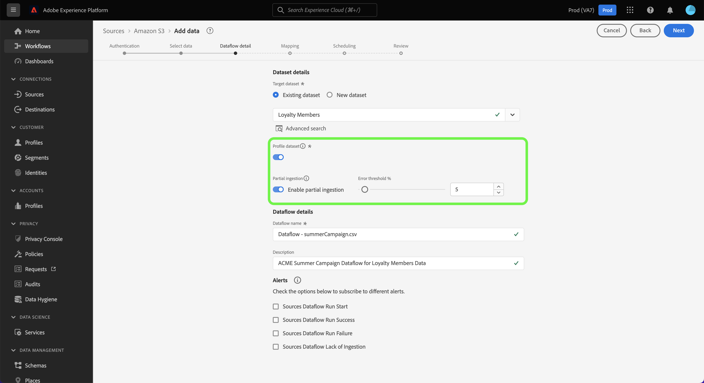
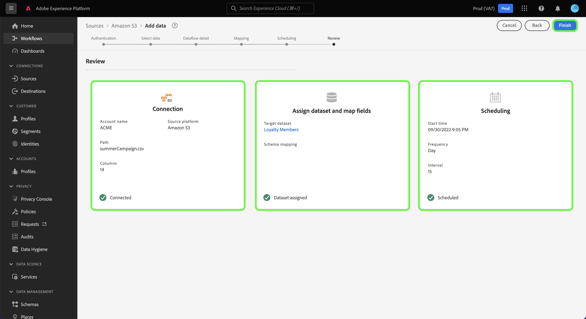

# Konfigurera ett dataflöde för att importera batchdata från en molnlagringskälla i användargränssnittet

I den här självstudiekursen beskrivs hur du konfigurerar ett dataflöde för att hämta batchdata från molnlagringskällan till Adobe Experience Platform.

## Komma igång

>[!NOTE]
>
>Om du vill skapa ett dataflöde för att hämta batchdata från ett molnlagringsutrymme måste du redan ha tillgång till en autentiserad molnlagringskälla. Om du inte har åtkomst går du till [källöversikt](../../../../home.md#cloud-storage) om du vill se en lista över molnlagringskällor som du kan skapa ett konto med.

Den här självstudiekursen kräver en fungerande förståelse av följande komponenter i Experience Platform:

* [[!DNL Experience Data Model (XDM)] System](../../../../../xdm/home.md): Det standardiserade ramverk som Experience Platform använder för att ordna kundupplevelsedata.
   * [Grunderna för schemakomposition](../../../../../xdm/schema/composition.md): Lär dig mer om de grundläggande byggstenarna i XDM-scheman, inklusive viktiga principer och bästa praxis när det gäller schemakomposition.
   * [Schemaredigeraren, genomgång](../../../../../xdm/tutorials/create-schema-ui.md): Lär dig hur du skapar anpassade scheman med hjälp av gränssnittet för Schemaredigeraren.
* [[!DNL Real-time Customer Profile]](../../../../../profile/home.md): Ger en enhetlig konsumentprofil i realtid baserad på aggregerade data från flera källor.

### Filformat som stöds

Molnlagringskällor för batchdata har stöd för följande filformat för inhämtning:

* Avgränsaravgränsade värden (DSV): Alla värden med ett tecken kan användas som avgränsare för DSV-formaterade datafiler.
* [!DNL JavaScript Object Notation] (JSON): JSON-formaterade datafiler måste vara XDM-kompatibla.
* [!DNL Apache Parquet]: Parquet-formaterade datafiler måste vara XDM-kompatibla.
* Komprimerade filer: JSON och avgränsade filer kan komprimeras som: `bzip2`, `gzip`, `deflate`, `zipDeflate`, `tarGzip`och `tar`.

## Lägg till data

När du har skapat ditt molnlagringskonto **[!UICONTROL Add data]** visas med ett gränssnitt där du kan utforska din molnlagringsfilshierarki och välja den mapp eller fil som du vill hämta till plattformen.

* Den vänstra delen av gränssnittet är en katalogwebbläsare som visar din molnlagringsfilshierarki.
* I den högra delen av gränssnittet kan du förhandsgranska upp till 100 rader data från en kompatibel mapp eller fil.

Markera rotmappen för att komma åt mapphierarkin. Härifrån kan du välja en enda mapp att importera alla filer i mappen rekursivt. När du importerar en hel mapp måste du se till att alla filer i den mappen har samma dataformat och schema.

När du har valt en mapp uppdateras det högra gränssnittet till en förhandsvisning av innehållet och strukturen i den första filen i den markerade mappen.

Under det här steget kan du göra flera konfigurationer av dina data innan du fortsätter. Välj först **[!UICONTROL Data format]** och välj sedan rätt dataformat för filen i listrutan som visas.

I följande tabell visas rätt dataformat för de filtyper som stöds:

| Filtyp | Dataformat |
| --- | --- |
| CSV | [!UICONTROL Delimited] |
| JSON | [!UICONTROL JSON] |
| Parquet | [!UICONTROL XDM Parquet] |

### Markera en kolumnavgränsare

När du har konfigurerat dataformatet kan du ange en kolumnavgränsare när du importerar avgränsade filer. Välj **[!UICONTROL Delimiter]** och välj sedan en avgränsare i listrutan. Menyn innehåller de vanligaste alternativen för avgränsare, inklusive kommatecken (`,`), en tabb (`\t`) och ett rör (`|`).

Om du föredrar att använda en egen avgränsare väljer du **[!UICONTROL Custom]** och ange en avgränsare med ett tecken i popup-indatafältet.

### Infoga komprimerade filer

Du kan också importera komprimerade JSON-filer eller avgränsade filer genom att ange deras komprimeringstyp.

I [!UICONTROL Select data] markerar du en komprimerad fil för inhämtning och väljer sedan lämplig filtyp och om den är XDM-kompatibel eller inte. Nästa, välj **[!UICONTROL Compression type]** och välj sedan lämplig komprimerad filtyp för källdata.

Om du vill hämta en viss fil till plattformen markerar du en mapp och väljer sedan den fil som du vill importera. Under det här steget kan du även förhandsgranska filinnehåll för andra filer i en viss mapp med hjälp av förhandsgranskningsikonen bredvid ett filnamn.

När du är klar väljer du **[!UICONTROL Next]**.

## Ange information om dataflöde

The [!UICONTROL Dataflow detail] kan du välja om du vill använda en befintlig datamängd eller en ny datamängd. Under den här processen kan du även konfigurera dina data så att de hämtas till profilen och aktivera inställningar som [!UICONTROL Error diagnostics], [!UICONTROL Partial ingestion]och [!UICONTROL Alerts].

### Använd en befintlig datauppsättning

Om du vill importera data till en befintlig datauppsättning väljer du **[!UICONTROL Existing dataset]**. Du kan antingen hämta en befintlig datauppsättning med [!UICONTROL Advanced search] eller genom att bläddra igenom listan med befintliga datauppsättningar i listrutan. När du har valt en datauppsättning anger du ett namn och en beskrivning för dataflödet.

### Använd en ny datauppsättning

Om du vill importera till en ny datauppsättning väljer du **[!UICONTROL New dataset]** och ange sedan ett namn och en valfri beskrivning för utdatauppsättningen. Välj sedan ett schema att mappa till med [!UICONTROL Advanced search] eller genom att bläddra igenom listan med befintliga scheman i listrutan. När du har valt ett schema anger du ett namn och en beskrivning för dataflödet.

### Aktivera profil- och feldiagnostik

Välj sedan **[!UICONTROL Profile dataset]** för att aktivera datauppsättningen för profil. På så sätt kan du skapa en helhetsbild av en enhets attribut och beteenden. Data från alla profilaktiverade datauppsättningar inkluderas i profilen och ändringarna tillämpas när du sparar dataflödet.

[!UICONTROL Error diagnostics] möjliggör detaljerad generering av felmeddelanden för alla felaktiga poster som inträffar i dataflödet, medan [!UICONTROL Partial ingestion] gör att du kan importera data som innehåller fel, upp till ett visst tröskelvärde som du manuellt anger. Se [partiell batchingång - översikt](../../../../../ingestion/batch-ingestion/partial.md) för mer information.

### Aktivera aviseringar

Du kan aktivera varningar för att få meddelanden om status för ditt dataflöde. Välj en avisering i listan om du vill prenumerera och få meddelanden om status för ditt dataflöde. Mer information om varningar finns i guiden [prenumerera på källvarningar med hjälp av användargränssnittet](../../alerts.md).

När du är klar med informationen om dataflödet väljer du **[!UICONTROL Next]**.

## Mappa datafält till ett XDM-schema

The [!UICONTROL Mapping] visas med ett gränssnitt för att mappa källfälten från källschemat till rätt mål-XDM-fält i målschemat.

Plattformen ger intelligenta rekommendationer för automatiskt mappade fält baserat på det målschema eller den datamängd du valt. Du kan justera mappningsreglerna manuellt så att de passar dina användningsfall. Beroende på dina behov kan du välja att mappa fält direkt eller använda förinställningsfunktioner för data för att omvandla källdata för att härleda beräknade eller beräknade värden. Mer information om hur du använder mappningsgränssnittet och beräkningsfälten finns i [Användargränssnittsguide för dataprep](../../../../../data-prep/ui/mapping.md).

När källdata har mappats väljer du **[!UICONTROL Next]**.

## Schemalägg körning av inmatning

>[!IMPORTANT]
>
>Vi rekommenderar att du schemalägger dataflödet för engångsbruk när du använder [FTP-källa](../../../../connectors/cloud-storage/ftp.md).

The [!UICONTROL Scheduling] visas så att du kan konfigurera ett matningsschema att automatiskt importera valda källdata med de konfigurerade mappningarna. Som standard är schemaläggning inställd på `Once`. Om du vill justera din matningsfrekvens väljer du **[!UICONTROL Frequency]** och välj sedan ett alternativ i listrutan.

>[!TIP]
>
>Intervall och bakåtfyllnad syns inte vid engångsinmatning.

Om du ställer in din matningsfrekvens på `Minute`, `Hour`, `Day`, eller `Week`måste du ange ett intervall för att skapa en fast tidsram mellan varje intag. Till exempel en matningsfrekvens som är inställd på `Day` och ett intervall anges till `15` innebär att ditt dataflöde är schemalagt att importera data var 15:e dag.

Under det här steget kan du även aktivera **bakfyllning** och definiera en kolumn för stegvis inmatning av data. Backfill används för att importera historiska data, medan kolumnen som du definierar för inkrementellt intag gör att nya data kan skiljas från befintliga data.

Se tabellen nedan för mer information om schemaläggningskonfigurationer.

| Fält | Beskrivning |
| --- | --- |
| Frekvens | Frekvensen med vilken ett intag sker. Valbara frekvenser inkluderar `Once`, `Minute`, `Hour`, `Day`och `Week`. |
| Intervall | Ett heltal som anger intervallet för den valda frekvensen. Intervallets värde måste vara ett heltal som inte är noll och måste vara större än eller lika med 15. |
| Starttid | En UTC-tidsstämpel som anger när det allra första intaget är inställt. Starttiden måste vara större än eller lika med den aktuella UTC-tiden. |
| Backfill | Ett booleskt värde som avgör vilka data som hämtas från början. Om bakåtfyllning är aktiverad, kommer alla aktuella filer i den angivna sökvägen att importeras under det första schemalagda intaget. Om underfyllning är inaktiverad importeras endast de filer som läses in mellan den första importkörningen och starttiden. Filer som lästs in före starttiden importeras inte. |

>[!NOTE]
>
>För batchimport väljer varje efterföljande dataflöde filer som ska importeras från källan baserat på deras **senast ändrad** tidsstämpel. Detta innebär att gruppdataflödeväljer filer från källan som antingen är nya eller har ändrats sedan den senaste flödeskörningen. Dessutom måste du se till att det finns tillräckligt med tid mellan filöverföring och ett schemalagt flöde eftersom filer som inte överförs helt till ditt molnlagringskonto innan den schemalagda flödeskörningstiden kanske inte plockas upp för förtäring.

Välj **[!UICONTROL Next]**.

## Granska ditt dataflöde

The **[!UICONTROL Review]** visas så att du kan granska det nya dataflödet innan det skapas. Informationen är grupperad i följande kategorier:

* **[!UICONTROL Connection]**: Visar källtypen, den relevanta sökvägen för den valda källfilen och mängden kolumner i källfilen.
* **[!UICONTROL Assign dataset & map fields]**: Visar vilken datauppsättning källdata hämtas till, inklusive det schema som datauppsättningen följer.
* **[!UICONTROL Scheduling]**: Visar den aktiva perioden, frekvensen och intervallet för intag-schemat.

När du har granskat dataflödet klickar du på **[!UICONTROL Finish]** så att dataflödet kan skapas.

## Nästa steg

Genom att följa den här självstudiekursen har du skapat ett dataflöde för att hämta in data från en extern molnlagring och fått insikter om att övervaka datauppsättningar. Om du vill veta mer om hur du skapar dataflöden kan du komplettera din inlärning genom att titta på videon nedan. Dessutom kan inkommande data nu användas av underordnade [!DNL Platform] tjänster som [!DNL Real-time Customer Profile] och [!DNL Data Science Workspace]. Mer information finns i följande dokument:

* [[!DNL Real-time Customer Profile] översikt](../../../../../profile/home.md)
* [[!DNL Data Science Workspace] översikt](../../../../../data-science-workspace/home.md)

>[!WARNING]
>
> The [!DNL Platform] Gränssnittet som visas i följande video är inaktuellt. Läs dokumentationen ovan för de senaste skärmbilderna och funktionerna i användargränssnittet.

>[!VIDEO](https://video.tv.adobe.com/v/29695?quality=12&learn=on)

## Bilaga

I följande avsnitt finns ytterligare information om hur du arbetar med källkopplingar.

## Övervaka dataflödet

När dataflödet har skapats kan du övervaka de data som hämtas genom det för att visa information om hur mycket data som har importerats, hur bra de är och vilka fel som har uppstått. Mer information om hur du övervakar dataflöde finns i självstudiekursen om [övervaka konton och dataflöden i användargränssnittet](../../monitor.md).

## Uppdatera ditt dataflöde

Om du vill uppdatera konfigurationerna för schemaläggning, mappning och allmän information för dataflöden går du till självstudiekursen om [uppdatera källornas dataflöden i användargränssnittet](../../update-dataflows.md)

## Ta bort ditt dataflöde

Du kan ta bort dataflöden som inte längre är nödvändiga eller som har skapats felaktigt med **[!UICONTROL Delete]** finns i **[!UICONTROL Dataflows]** arbetsyta. Mer information om hur du tar bort dataflöden finns i självstudiekursen om [ta bort dataflöden i användargränssnittet](../../delete.md).