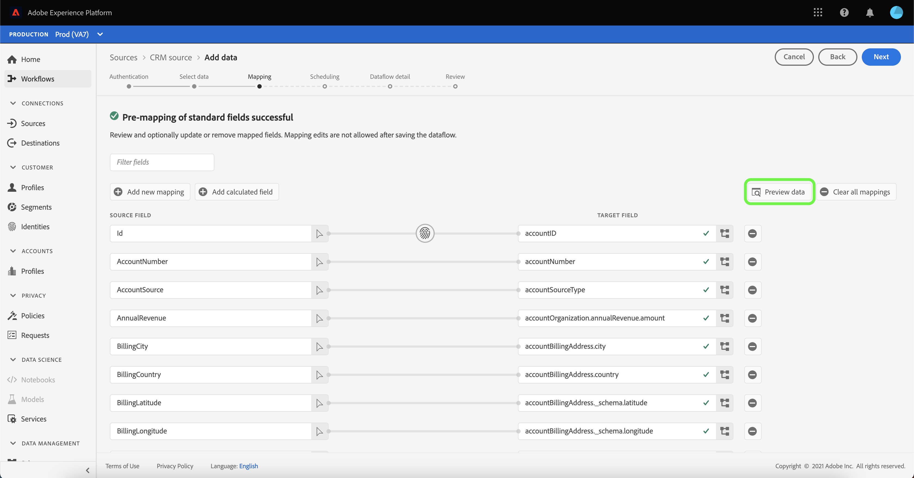

# Konfigurera ett dataflöde för en CRM-anslutning i användargränssnittet

Ett dataflöde är en schemalagd aktivitet som hämtar och importerar data från en källa till en plattformsdatauppsättning. I den här självstudiekursen beskrivs hur du konfigurerar ett nytt dataflöde med ditt CRM-konto.

## Komma igång

Den här självstudiekursen kräver en fungerande förståelse av följande komponenter i Adobe Experience Platform:

* [[!DNL Experience Data Model (XDM)] System](../../../../xdm/home.md): Det standardiserade ramverk som [!DNL Experience Platform] organiserar kundupplevelsedata.
   * [Grunderna för schemakomposition](../../../../xdm/schema/composition.md): Lär dig mer om de grundläggande byggstenarna i XDM-scheman, inklusive viktiga principer och bästa praxis när det gäller schemakomposition.
   * [Schemaredigeraren, genomgång](../../../../xdm/tutorials/create-schema-ui.md): Lär dig hur du skapar anpassade scheman med hjälp av gränssnittet för Schemaredigeraren.
* [[!DNL Real-time Customer Profile]](../../../../profile/home.md): Ger en enhetlig konsumentprofil i realtid baserad på aggregerade data från flera källor.

Den här självstudiekursen kräver dessutom att du redan har skapat ett CRM-konto. En lista med självstudiekurser för att skapa olika CRM-anslutningar i användargränssnittet finns i [översikt över källanslutningar](../../../home.md).

## Markera data

När du har skapat ditt CRM-konto [!UICONTROL Select data] visas så att du får ett gränssnitt där du kan utforska din filhierarki.

* Den vänstra halvan av gränssnittet är en katalogwebbläsare som visar filer och kataloger i CRM.
* I den högra delen av gränssnittet kan du förhandsgranska upp till 100 rader data från en kompatibel fil.

Du kan använda **[!UICONTROL Search]** överst på sidan för att snabbt identifiera de källdata som du tänker använda.

>[!NOTE]
>
>Sökkällans dataalternativ är tillgängligt för alla tabellbaserade källanslutningar, med undantag för Analytics-, Classifications-, Event Hubs- och Kinesis-anslutningar.

När du har hittat källdata markerar du katalogen och väljer sedan **[!UICONTROL Next]**.

## Mappa datafält till ett XDM-schema

The **[!UICONTROL Mapping]** visas med ett gränssnitt för att mappa källdata till en plattformsdatauppsättning.

Välj en datauppsättning för inkommande data som ska importeras till. Du kan antingen använda en befintlig datauppsättning eller skapa en ny datauppsättning.

### Använd en befintlig datauppsättning

Om du vill importera data till en befintlig datauppsättning väljer du **[!UICONTROL Existing dataset]** markerar du dataikonen  bredvid inmatningsfältet.

The **[!UICONTROL Select dataset]** visas. Hitta den datauppsättning du vill använda, markera den och klicka sedan på **[!UICONTROL Continue]**.

### Använd en ny datauppsättning

Om du vill importera data till en ny datauppsättning väljer du **[!UICONTROL New dataset]** och ange ett namn och en beskrivning för datauppsättningen i de angivna fälten.

Du kan bifoga ett schemafält genom att ange ett schemanamn i **[!UICONTROL Select schema]** sökfält. Du kan också välja listruteikonen för att visa en lista över befintliga scheman. Du kan också välja **[!UICONTROL Advanced search]** för att få tillgång till skärmen för befintliga scheman, inklusive deras respektive uppgifter.

Under det här steget kan du aktivera datauppsättningen för [!DNL Real-time Customer Profile] och skapa en helhetsbild av ett företags attribut och beteenden. Data från alla aktiverade datauppsättningar inkluderas i [!DNL Profile] och ändringarna tillämpas när du sparar dataflödet.

Växla **[!UICONTROL Profile dataset]** för att aktivera måldatauppsättningen för [!DNL Profile].

The **[!UICONTROL Select schema]** visas. Välj det schema som du vill tillämpa på den nya datauppsättningen och klicka sedan på **[!UICONTROL Done]**.

Beroende på dina behov kan du välja att mappa fält direkt eller använda förinställningsfunktioner för data för att omvandla källdata för att härleda beräknade eller beräknade värden. Mer information om hur du använder mappningsgränssnittet och beräkningsfälten finns i [Användargränssnittsguide för dataprep](../../../../data-prep/ui/mapping.md)

>[!TIP]
>
>Om du använder [!DNL Salesforce] som en del av B2B CDP, se [[!DNL Salesforce] fältmappningstabeller](../../../connectors/adobe-applications/mapping/salesforce.md) för en guide om lämpliga mappningsuppsättningar mellan [!DNL Salesforce] källfält och XDM-målfält.

Plattformen ger intelligenta rekommendationer för automatiskt mappade fält baserat på det målschema eller den datamängd du valt. Du kan justera mappningsreglerna manuellt så att de passar dina användningsfall.

Välj **[!UICONTROL Preview data]** för att se mappningsresultat på upp till 100 rader med exempeldata från den valda datauppsättningen.

Under förhandsgranskningen prioriteras identitetskolumnen som det första fältet, eftersom det är den nyckelinformation som krävs vid validering av mappningsresultat.

När källdata har mappats väljer du **[!UICONTROL Close]**.

Nästa, från [!UICONTROL Mapping] skärm, välja **[!UICONTROL Next]** för att fortsätta.

## Schemalägg körning av inmatning

The **[!UICONTROL Scheduling]** visas så att du kan konfigurera ett matningsschema att automatiskt importera valda källdata med de konfigurerade mappningarna. I följande tabell visas de olika konfigurerbara fälten för schemaläggning:

| Fält | Beskrivning |
| --- | --- |
| Frekvens | Valbara frekvenser inkluderar `Once`, `Minute`, `Hour`, `Day`och `Week`. |
| Intervall | Ett heltal som anger intervallet för den valda frekvensen. |
| Starttid | En UTC-tidsstämpel som anger när det allra första intaget är inställt. |
| Backfill | Ett booleskt värde som avgör vilka data som hämtas från början. If **[!UICONTROL Backfill]** är aktiverat kommer alla aktuella filer i den angivna sökvägen att importeras under det första schemalagda intaget. If **[!UICONTROL Backfill]** är inaktiverat, endast de filer som lästs in mellan den första uppsättningen av inmatning och **[!UICONTROL Start time]** kommer att förtäras. Filer som lästs in före **[!UICONTROL Start time]** kommer inte att förtäras. |
| Delta-kolumn | Ett alternativ med en filtrerad uppsättning källschemafält av typen, datumet eller tiden. Det här fältet används för att skilja mellan nya och befintliga data. Inkrementella data importeras baserat på tidsstämpeln för den markerade kolumnen. |

Dataflöden är utformade för att automatiskt importera data enligt schema. Börja med att välja intagsfrekvens. Ange sedan intervallet för att ange perioden mellan två flödeskörningar. Intervallets värde måste vara ett heltal som inte är noll och måste vara större än eller lika med 15.

Om du vill ange starttid för intaget justerar du datumet och tiden som visas i rutan för starttid. Du kan också välja kalenderikonen för att redigera starttidsvärdet. Starttiden måste vara större än eller lika med den aktuella UTC-tiden.

Välj **[!UICONTROL Load incremental data by]** för att tilldela deltakolumnen. I det här fältet görs en skillnad mellan nya och befintliga data.

### Konfigurera ett dataflöde för engångsbruk

Om du vill ställa in engångsinmatning väljer du den nedrullningsbara frekvenspilen och väljer **[!UICONTROL Once]**.

>[!TIP]
>
>**[!UICONTROL Interval]** och **[!UICONTROL Backfill]** inte syns vid engångsbruk.

När du har angett lämpliga värden för schemat väljer du **[!UICONTROL Next]**.

## Ange information om dataflöde

The **[!UICONTROL Dataflow detail]** visas så att du kan namnge och ge en kort beskrivning av det nya dataflödet.

Under den här processen kan du även aktivera **[!UICONTROL Partial ingestion]** och **[!UICONTROL Error diagnostics]**. Aktivering **[!UICONTROL Partial ingestion]** ger möjlighet att importera data som innehåller fel upp till ett visst tröskelvärde. En gång **[!UICONTROL Partial ingestion]** är aktiverat drar du **[!UICONTROL Error threshold %]** för att justera batchens feltröskel. Du kan också justera tröskelvärdet manuellt genom att markera inmatningsrutan. Mer information finns i [partiell batchingång - översikt](../../../../ingestion/batch-ingestion/partial.md).

Ange värden för dataflödet och välj **[!UICONTROL Next]**.

## Granska ditt dataflöde

The *Granska* visas så att du kan granska det nya dataflödet innan det skapas. Informationen är grupperad i följande kategorier:

* **[!UICONTROL Connection]**: Visar källkontonamnet, källplattformen, den relevanta sökvägen för den valda källfilen och antalet kolumner i källfilen.
* **[!UICONTROL Assign dataset and map fields]**: Visar måldatauppsättningen som källdata hämtas till, inklusive schemat som datauppsättningen följer.
* **[!UICONTROL Scheduling]**: Visar starttid och frekvens för dataflödet.

När du har granskat dataflödet klickar du på **[!UICONTROL Finish]** så att dataflödet kan skapas.

## Övervaka dataflödet

När dataflödet har skapats kan du övervaka de data som importeras genom det för att se information om hur mycket data som har intagits, hur bra de är och vilka fel som har uppstått. Mer information om hur du övervakar dataflöde finns i självstudiekursen om [övervaka konton och dataflöden i användargränssnittet](../monitor.md).

## Ta bort ditt dataflöde

Du kan ta bort dataflöden som inte längre är nödvändiga eller som har skapats felaktigt med **[!UICONTROL Delete]** finns i **[!UICONTROL Dataflows]** arbetsyta. Mer information om hur du tar bort dataflöden finns i självstudiekursen om [ta bort dataflöden i användargränssnittet](../delete.md).

## Nästa steg

I den här självstudiekursen har du skapat ett dataflöde för att hämta in data från en CRM och fått insikter om att övervaka datauppsättningar. Om du vill veta mer om hur du skapar dataflöden kan du komplettera din inlärning genom att titta på videon nedan. Dessutom kan inkommande data nu användas av plattformstjänster längre fram i kedjan, t.ex. [!DNL Real-time Customer Profile] och [!DNL Data Science Workspace]. Mer information finns i följande dokument:

* [Översikt över kundprofiler i realtid](../../../../profile/home.md)
* [Översikt över arbetsytan Datavetenskap](../../../../data-science-workspace/home.md)

>[!WARNING]
>
> Det plattformsgränssnitt som visas i följande video är inaktuellt. Läs dokumentationen ovan för de senaste skärmbilderna och funktionerna i användargränssnittet.
>
>[!VIDEO](https://video.tv.adobe.com/v/29711?quality=12&learn=on)
