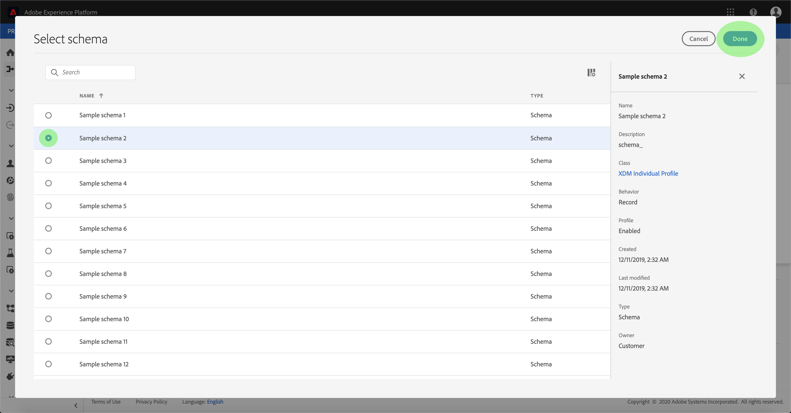

# Konfigurera ett dataflöde för en CRM-koppling i användargränssnittet

Ett dataflöde är en schemalagd aktivitet som hämtar och importerar data från en källa till en [!DNL Platform] datauppsättning. I den här självstudiekursen beskrivs hur du konfigurerar ett nytt dataflöde med CRM-anslutningen.

## Komma igång

Den här självstudiekursen kräver en fungerande förståelse av följande komponenter i Adobe Experience Platform:

* [Experience Data Model (XDM) System](../../../../xdm/home.md): Det standardiserade ramverket som [!DNL Experience Platform] organiserar kundupplevelsedata.
   * [Grundläggande om schemakomposition](../../../../xdm/schema/composition.md): Lär dig mer om de grundläggande byggstenarna i XDM-scheman, inklusive viktiga principer och bästa praxis när det gäller schemakomposition.
   * [Schemaredigeraren, genomgång](../../../../xdm/tutorials/create-schema-ui.md): Lär dig hur du skapar anpassade scheman med hjälp av gränssnittet för Schemaredigeraren.
* [Kundprofil](../../../../profile/home.md)i realtid: Ger en enhetlig konsumentprofil i realtid baserad på aggregerade data från flera källor.

Den här självstudien kräver dessutom att du redan har skapat en CRM-koppling. En lista med självstudiekurser för att skapa olika CRM-anslutningar i användargränssnittet finns i [källanslutningsöversikten](../../../home.md).

## Markera data

När du har skapat CRM-anslutningen visas steget *Välj data* , som ger ett interaktivt gränssnitt där du kan utforska filhierarkin.

* Den vänstra halvan av gränssnittet är en katalogwebbläsare som visar serverns filer och kataloger.
* I den högra delen av gränssnittet kan du förhandsgranska upp till 100 rader data från en kompatibel fil.

Markera den katalog som du vill använda och klicka sedan på **[!UICONTROL Next]**.

## Mappa datafält till ett XDM-schema

Steget *Mappning* visas med ett interaktivt gränssnitt för att mappa källdata till en [!DNL Platform] datauppsättning.

Välj en datauppsättning för inkommande data som ska importeras till. Du kan antingen använda en befintlig datauppsättning eller skapa en ny datauppsättning.

### Använd en befintlig datauppsättning

Om du vill importera data till en befintlig datauppsättning väljer du **[!UICONTROL Use existing dataset]** och klickar sedan på datamängdikonen .

Dialogrutan _Välj datauppsättning_ visas. Hitta den datauppsättning du vill använda, markera den och klicka sedan på **[!UICONTROL Continue]**.

### Använd en ny datauppsättning

Om du vill importera data till en ny datauppsättning markerar du **[!UICONTROL Create new dataset]** och anger ett namn och en beskrivning för datauppsättningen i de angivna fälten. Klicka sedan på schemaikonen.

Dialogrutan _Välj schema_ visas. Välj det schema som du vill använda för den nya datauppsättningen och klicka sedan på **[!UICONTROL Done]**.

Beroende på dina behov kan du välja att mappa fält direkt eller använda mappningsfunktioner för att omvandla källdata för att härleda beräknade eller beräknade värden. Mer information om datamappning och mappningsfunktioner finns i självstudiekursen om att [mappa CSV-data till XDM-schemafält](../../../../ingestion/tutorials/map-a-csv-file.md).

När källdata har mappats klickar du på **[!UICONTROL Next]**.

## Schemalägg körning av inmatning

Steget visas så att du kan konfigurera ett schema för att automatiskt importera valda källdata med de konfigurerade mappningarna. *[!UICONTROL Scheduling]* I följande tabell visas de olika konfigurerbara fälten för schemaläggning:

| Fält | Beskrivning |
| --- | --- |
| Frekvens | Valbara frekvenser är Minute, Hour, Day och Week. |
| Intervall | Ett heltal som anger intervallet för den valda frekvensen. |
| Starttid | En UTC-tidsstämpel för vilken det allra första intaget sker. |
| Backfill | Ett booleskt värde som avgör vilka data som hämtas från början. Om *[!UICONTROL Backfill]* är aktiverat importeras alla aktuella filer i den angivna sökvägen under den första schemalagda importen. Om *[!UICONTROL Backfill]* är inaktiverat importeras endast de filer som är inlästa mellan den första importen och den andra *[!UICONTROL Start time]* . Filer som lästs in tidigare *[!UICONTROL Start time]* kommer inte att importeras. |

Dataflöden är utformade för att automatiskt importera data enligt schema. Om du bara vill importera en gång genom det här arbetsflödet kan du göra det genom att konfigurera **[!UICONTROL Frequency]** till &quot;Dag&quot; och använda ett mycket stort tal för **[!UICONTROL Interval]** fotot, till exempel 10000 eller liknande.

Ange värden för schemat och klicka på **[!UICONTROL Next]**.

## Namnge dataflödet

Steget *Namnflöde* visas där du måste ange ett namn och en valfri beskrivning av dataflödet. Klicka **[!UICONTROL Next]** när du är klar.

## Granska ditt dataflöde

Steget *Granska* visas så att du kan granska det nya dataflödet innan det skapas. Informationen är grupperad i följande kategorier:

* *[!UICONTROL Connection details]*: Visar källtypen, den relevanta sökvägen för den valda källfilen och mängden kolumner i källfilen.
* *[!UICONTROL Mapping details]*: Visar vilken datauppsättning källdata hämtas till, inklusive det schema som datauppsättningen följer.
* *[!UICONTROL Schedule details]*: Visar den aktiva perioden, frekvensen och intervallet för intag-schemat.

När du har granskat dataflödet kan du klicka **[!UICONTROL Finish]** och vänta tills dataflödet har skapats.

## Övervaka och ta bort dataflödet

När dataflödet har skapats kan du övervaka de data som hämtas genom det. Mer information om hur du övervakar och tar bort dataflöden finns i självstudiekursen om [övervakning och borttagning av dataflöden](../monitor.md).

## Nästa steg

I den här självstudiekursen har du skapat ett dataflöde för att hämta in data från en CRM och fått insikter om att övervaka datauppsättningar. Om du vill veta mer om hur du skapar dataflöden kan du komplettera din inlärning genom att titta på videon nedan. Dessutom kan inkommande data nu användas av [!DNL Platform] tjänster längre fram i kedjan som [!DNL Real-time Customer Profile] och [!DNL Data Science Workspace]. Mer information finns i följande dokument:

* [Översikt över kundprofiler i realtid](../../../../profile/home.md)
* [Översikt över arbetsytan Datavetenskap](../../../../data-science-workspace/home.md)

>[!WARNING]
>
> Gränssnittet [!DNL Platform] som visas i följande video är inaktuellt. Läs dokumentationen ovan för de senaste skärmbilderna och funktionerna i användargränssnittet.

>[!VIDEO](https://video.tv.adobe.com/v/29711?quality=12&learn=on)

## Bilaga

I följande avsnitt finns ytterligare information om hur du arbetar med källkopplingar.

### Inaktivera ett dataflöde

När ett dataflöde skapas blir det omedelbart aktivt och importerar data enligt det schema som det gavs. Du kan när som helst inaktivera ett aktivt dataflöde genom att följa instruktionerna nedan.

Markera namnet på den basanslutning som är kopplad till det dataflöde som du vill inaktivera på *[!UICONTROL authenticaton]* skärmen.

Sidan _Källaktivitet_ visas. Markera det aktiva dataflödet i listan för att öppna dess *[!UICONTROL Properties]* kolumn till höger på skärmen, som innehåller en **[!UICONTROL Enabled]** växlingsknapp. Klicka på växlingsknappen för att inaktivera dataflödet. Samma växlingsknapp kan användas för att återaktivera ett dataflöde efter att det har inaktiverats.

### Aktivera inkommande data för [!DNL Profile] populationen

Inkommande data från källkopplingen kan användas för att berika och fylla i dina [!DNL Real-time Customer Profile] data. Mer information om hur du fyller i dina [!DNL Real-time Customer Profile] data finns i självstudiekursen om [profilpopulationen](../profile.md).