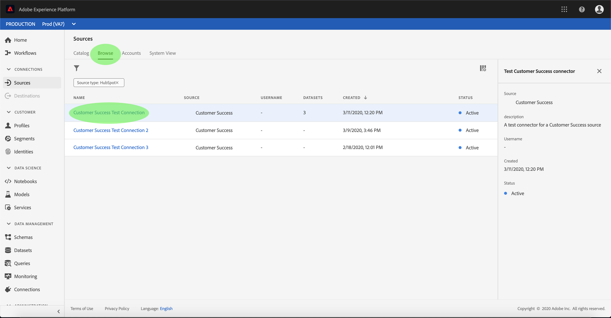

# Konfigurera ett dataflöde för en koppling för lyckade kunder i användargränssnittet

Ett dataflöde är en schemalagd aktivitet som hämtar och importerar data från en källa till en [!DNL Platform] datauppsättning. I den här självstudiekursen beskrivs hur du konfigurerar ett nytt dataflöde med ditt konto för kundframgångar.

## Komma igång

Den här självstudiekursen kräver en fungerande förståelse av följande komponenter i Adobe Experience Platform:

- [Experience Data Model (XDM) System](../../../../xdm/home.md): Det standardiserade ramverket som [!DNL Experience Platform] organiserar kundupplevelsedata.
   - [Grundläggande om schemakomposition](../../../../xdm/schema/composition.md): Lär dig mer om de grundläggande byggstenarna i XDM-scheman, inklusive viktiga principer och bästa praxis när det gäller schemakomposition.
   - [Schemaredigeraren, genomgång](../../../../xdm/tutorials/create-schema-ui.md): Lär dig hur du skapar anpassade scheman med hjälp av gränssnittet för Schemaredigeraren.
- [Kundprofil](../../../../profile/home.md)i realtid: Ger en enhetlig konsumentprofil i realtid baserad på aggregerade data från flera källor.

Den här självstudiekursen kräver dessutom att du redan har skapat ett konto för kundframgångar. En lista med självstudiekurser för att skapa olika kundframgångskopplingar i användargränssnittet finns i [källanslutningsöversikten](../../../home.md).

## Markera data

När du har skapat en kundkontakt visas *[!UICONTROL Select data]* steget och du får ett interaktivt gränssnitt där du kan utforska din filhierarki.

- Den vänstra halvan av gränssnittet är en katalogwebbläsare som visar serverns filer och kataloger.
- I den högra delen av gränssnittet kan du förhandsgranska upp till 100 rader data från en kompatibel fil.

Markera den katalog som du vill använda och klicka sedan på **[!UICONTROL Next]**.

## Mappa datafält till ett XDM-schema

Steget visas med ett interaktivt gränssnitt som du kan använda för att mappa källdata till en *[!UICONTROL Mapping]* [!DNL Platform] datauppsättning.

Välj en datauppsättning för inkommande data som ska importeras till. Du kan antingen använda en befintlig datauppsättning eller skapa en ny datauppsättning.

### Använd en befintlig datauppsättning

Om du vill importera data till en befintlig datauppsättning väljer du **[!UICONTROL Use existing dataset]** och klickar sedan på datamängdikonen .

Dialogrutan *[!UICONTROL Select dataset]* visas. Hitta den datauppsättning du vill använda, markera den och klicka sedan på **[!UICONTROL Continue]**.

### Använd en ny datauppsättning

Om du vill importera data till en ny datauppsättning markerar du **[!UICONTROL Create new dataset]** och anger ett namn och en beskrivning för datauppsättningen i de angivna fälten.

Under den här processen kan du även aktivera *[!UICONTROL Partial ingestion]* och *[!UICONTROL Error diagnostics]*. Aktivering *[!UICONTROL Partial ingestion]* ger möjlighet att importera data som innehåller fel, upp till ett visst tröskelvärde som du kan ange. Aktivering *[!UICONTROL Error diagnostics]* ger information om felaktiga data som grupperas separat. Mer information finns i översikten över [partiell gruppöverföring](../../../../ingestion/batch-ingestion/partial.md).

Klicka sedan på schemaikonen.

Dialogrutan *[!UICONTROL Select schema]* visas. Välj det schema som du vill använda för den nya datauppsättningen och klicka sedan på **[!UICONTROL Done]**.

Beroende på dina behov kan du välja att mappa fält direkt eller använda mappningsfunktioner för att omvandla källdata för att härleda beräknade eller beräknade värden. Mer information om datamappning och mappningsfunktioner finns i självstudiekursen om att [mappa CSV-data till XDM-schemafält](../../../../ingestion/tutorials/map-a-csv-file.md).

När källdata har mappats klickar du på **[!UICONTROL Next]**.

## Schemalägg körning av inmatning

Steget visas så att du kan konfigurera ett schema för att automatiskt importera valda källdata med de konfigurerade mappningarna. *[!UICONTROL Scheduling]* I följande tabell visas de olika konfigurerbara fälten för schemaläggning:

| Fält | Beskrivning |
| --- | --- |
| Frekvens | Valbara frekvenser är Minute, Hour, Day och Week. |
| Intervall | Ett heltal som anger intervallet för den valda frekvensen. |
| Starttid | En UTC-tidsstämpel för vilken det allra första intaget sker. |
| Backfill | Ett booleskt värde som avgör vilka data som hämtas från början. Om *[!UICONTROL Backfill]* är aktiverat importeras alla aktuella filer i den angivna sökvägen under den första schemalagda importen. Om *[!UICONTROL Backfill]* är inaktiverat importeras endast de filer som är inlästa mellan den första importen och den andra *[!UICONTROL Start time]* . Filer som lästs in tidigare *[!UICONTROL Start time]* kommer inte att importeras. |

Dataflöden är utformade för att automatiskt importera data enligt schema. Om du bara vill importera en gång genom det här arbetsflödet kan du göra det genom att konfigurera **[!UICONTROL Frequency]** till &quot;Dag&quot; och använda ett mycket stort tal för **[!UICONTROL Interval]** fotot, till exempel 10000 eller liknande.

Ange värden för schemat och klicka på **[!UICONTROL Next]**.

## Granska ditt dataflöde

Steget visas så att du kan granska det nya dataflödet innan det skapas. *[!UICONTROL Review]* Informationen är grupperad i följande kategorier:

- *[!UICONTROL Connection details]*: Visar källtypen, den relevanta sökvägen för den valda källfilen och mängden kolumner i källfilen.
- *[!UICONTROL Mapping details]*: Visar vilken datauppsättning källdata hämtas till, inklusive det schema som datauppsättningen följer.
- *[!UICONTROL Schedule details]*: Visar den aktiva perioden, frekvensen och intervallet för intag-schemat.

När du har granskat dataflödet kan du klicka **[!UICONTROL Finish]** och vänta tills dataflödet har skapats.

## Övervaka dataflödet

När dataflödet har skapats kan du övervaka de data som hämtas genom det. Följ stegen nedan för att komma åt dataflödets datauppsättningsövervakare.

Välj den Customer Success Source som du vill visa under *[!UICONTROL Sources]* *[!UICONTROL Customer Success]* kategorin på arbetsytan. Välj *[!UICONTROL Connect Source]* att starta autentiseringsgränssnittet. Om du vill visa ett befintligt dataflöde markerar du *[!UICONTROL Existing account]* och väljer det konto du vill få åtkomst till.

Skärmen visas *[!UICONTROL Source activity]* . Klicka på namnet på en datauppsättning vars aktivitet du vill övervaka.

Skärmen visas *[!UICONTROL Dataset activity]* . På den här sidan visas hur många meddelanden som används i form av ett diagram.

Mer information om övervakning av datauppsättningar och förtäring finns i självstudiekursen om [övervakning av dataflöden](../../../../ingestion/quality/monitor-data-flows.md)för direktuppspelning.

## Nästa steg

Genom att följa den här självstudiekursen har du skapat ett dataflöde som hämtar in data från en källa där kunderna lyckades och fått insikter om att övervaka datauppsättningar. Inkommande data kan nu användas av [!DNL Platform] tjänster längre fram i kedjan som [!DNL Real-time Customer Profile] och [!DNL Data Science Workspace]. Mer information finns i följande dokument:

- [Översikt över kundprofiler i realtid](../../../../profile/home.md)
- [Översikt över arbetsytan Datavetenskap](../../../../data-science-workspace/home.md)

## Bilaga

I följande avsnitt finns ytterligare information om hur du arbetar med källkopplingar.

### Inaktivera ett dataflöde

När ett dataflöde skapas blir det omedelbart aktivt och importerar data enligt det schema som det gavs. Du kan när som helst inaktivera ett aktivt dataflöde genom att följa instruktionerna nedan.

Markera namnet på kontot som är kopplat till det dataflöde som du vill inaktivera på *[!UICONTROL authenticaton]* skärmen.

Sidan _Källaktivitet_ visas. Markera det aktiva dataflödet i listan för att öppna dess *[!UICONTROL Properties]* kolumn till höger på skärmen, som innehåller en **[!UICONTROL Enabled]** växlingsknapp. Klicka på växlingsknappen för att inaktivera dataflödet. Samma växlingsknapp kan användas för att återaktivera ett dataflöde efter att det har inaktiverats.

### Aktivera inkommande data för [!DNL Profile] populationen

Inkommande data från källkopplingen kan användas för att berika och fylla i dina [!DNL Real-time Customer Profile] data. Mer information om hur du fyller i dina [!DNL Real-time Customer Profile] data finns i självstudiekursen om [profilpopulationen](../profile.md).