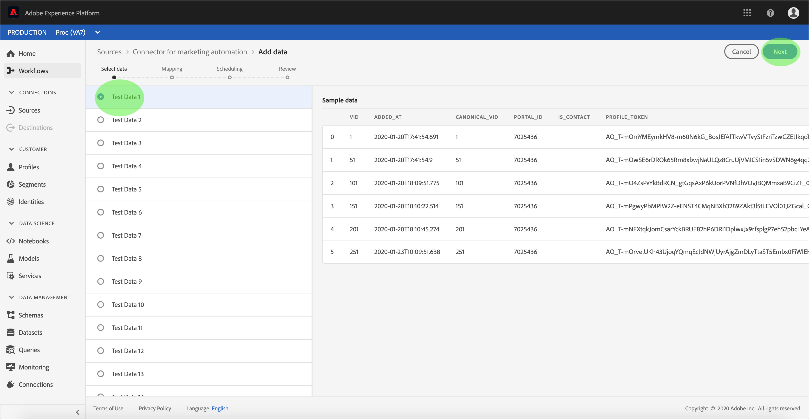

# Konfigurera ett dataflöde för en koppling för automatiserad marknadsföring i användargränssnittet

Ett dataflöde är en schemalagd aktivitet som hämtar och importerar data från en källa till en plattformsdatauppsättning. I den här självstudiekursen beskrivs hur du konfigurerar ett nytt dataflöde med ditt automatiserade marknadsföringskonto.

## Komma igång

Den här självstudien kräver en fungerande förståelse av följande komponenter i Adobe Experience Platform:

- [Experience Data Model (XDM) System](../../../../xdm/home.md): Det standardiserade ramverk som Experience Platform använder för att organisera kundupplevelsedata.
   - [Grundläggande om schemakomposition](../../../../xdm/schema/composition.md): Lär dig mer om de grundläggande byggstenarna i XDM-scheman, inklusive viktiga principer och bästa praxis när det gäller schemakomposition.
   - [Schemaredigeraren, genomgång](../../../../xdm/tutorials/create-schema-ui.md): Lär dig hur du skapar anpassade scheman med hjälp av gränssnittet för Schemaredigeraren.
- [Kundprofil](../../../../profile/home.md)i realtid: Ger en enhetlig konsumentprofil i realtid baserad på aggregerade data från flera källor.

Dessutom kräver den här självstudiekursen att du redan har skapat ett konto för automatiserad marknadsföring. En lista med självstudiekurser för att skapa olika anslutningar för automatiserad marknadsföring i användargränssnittet finns i [källanslutningsöversikten](../../../home.md).

## Markera data

När du har skapat ett automatiserat marknadsföringskonto visas steget *Markera data* , som ger ett interaktivt gränssnitt där du kan utforska din filhierarki.

- Den vänstra halvan av gränssnittet är en katalogwebbläsare som visar serverns filer och kataloger.
- I den högra delen av gränssnittet kan du förhandsgranska upp till 100 rader data från en kompatibel fil.

Markera den katalog som du vill använda och klicka sedan på **Nästa**.

## Mappa datafält till ett XDM-schema

Steget *Mappning* visas med ett interaktivt gränssnitt för att mappa källdata till en plattformsdatauppsättning.

Välj en datauppsättning för inkommande data som ska importeras till. Du kan antingen använda en befintlig datauppsättning eller skapa en ny datauppsättning.

### Använd en befintlig datauppsättning

Om du vill importera data till en befintlig datauppsättning väljer du **Använd befintlig datauppsättning** och klickar sedan på ikonen för datauppsättningen.

Dialogrutan _Välj datauppsättning_ visas. Hitta den datauppsättning du vill använda, markera den och klicka sedan på **Fortsätt**.

### Använd en ny datauppsättning

Om du vill importera data till en ny datauppsättning väljer du **Skapa ny datauppsättning** och anger ett namn och en beskrivning för datauppsättningen i fälten.

Under den här processen kan du även aktivera *partiellt intag* och *feldiagnostik*. Genom att aktivera *partiellt intag* kan du importera data som innehåller fel, upp till ett visst tröskelvärde som du kan ange. Om du aktiverar feldiagnostik får du information om felaktiga data som batchas separat. Mer information finns i översikten över [partiell gruppöverföring](../../../../ingestion/batch-ingestion/partial.md).

När du är klar klickar du på schemaikonen.

Dialogrutan *Välj schema* visas. Välj det schema som du vill använda för den nya datauppsättningen och klicka sedan på **Klar**.

Beroende på dina behov kan du välja att mappa fält direkt eller använda mappningsfunktioner för att omvandla källdata för att härleda beräknade eller beräknade värden. Mer information om datamappning och mappningsfunktioner finns i självstudiekursen om att [mappa CSV-data till XDM-schemafält](../../../../ingestion/tutorials/map-a-csv-file.md).

När källdata har mappats klickar du på **Nästa**.

## Schemalägg körning av inmatning

Steget *Schemaläggning* visas, så att du kan konfigurera ett schema så att det automatiskt importerar valda källdata med de konfigurerade mappningarna. I följande tabell visas de olika konfigurerbara fälten för schemaläggning:

| Fält | Beskrivning |
| --- | --- |
| Frekvens | Valbara frekvenser är Minute, Hour, Day och Week. |
| Intervall | Ett heltal som anger intervallet för den valda frekvensen. |
| Starttid | En UTC-tidsstämpel för vilken det allra första intaget sker. |
| Backfill | Ett booleskt värde som avgör vilka data som hämtas från början. Om *Backfill* är aktiverat, kommer alla aktuella filer i den angivna sökvägen att kapslas in under det första schemalagda intaget. Om *Backfill* är inaktiverat kapslas endast de filer som läses in mellan den första importkörningen och *starttiden* . Filer som lästs in före *starttiden* importeras inte. |

Dataflöden är utformade för att automatiskt importera data enligt schema. Om du bara vill importera en gång genom det här arbetsflödet kan du göra det genom att konfigurera **Frekvensen** till &quot;Dag&quot; och använda ett mycket stort värde för **Intervall**, till exempel 10000 eller liknande.

Ange värden för schemat och klicka på **Nästa**.

## Granska ditt dataflöde

Steget *Granska* visas så att du kan granska det nya dataflödet innan det skapas. Informationen är grupperad i följande kategorier:

- *Anslutning*: Visar källtypen, den relevanta sökvägen för den valda källfilen och mängden kolumner i källfilen.
- *Tilldela datauppsättnings- och kartfält*: Visar vilken datauppsättning källdata hämtas till, inklusive det schema som datauppsättningen följer.
- *Schemaläggning*: Visar den aktiva perioden, frekvensen och intervallet för intag-schemat.

När du har granskat dataflödet klickar du på **Slutför** och anger en tid innan dataflödet skapas.

## Övervaka dataflödet

När dataflödet har skapats kan du övervaka de data som hämtas genom det. Följ stegen nedan för att komma åt dataflödets datauppsättningsövervakare.

På *Källor* -arbetsytan väljer du den källa för automatiserad marknadsföring som du vill visa under kategorin *Automatisering* av marknadsföring. Välj *Anslut källa* för att starta autentiseringsgränssnittet. Om du vill visa ett befintligt dataflöde väljer du *Befintligt konto* och väljer det konto som du vill komma åt.

Skärmen *Källaktivitet* visas. Klicka på namnet på en datauppsättning vars aktivitet du vill övervaka.

Aktivitetsskärmen *för* datauppsättning visas. På den här sidan visas hur många meddelanden som används i form av ett diagram.

Mer information om övervakning av datauppsättningar och förtäring finns i självstudiekursen om [övervakning av dataflöden](../../../../ingestion/quality/monitor-data-flows.md)för direktuppspelning.

## Nästa steg

Genom att följa den här självstudiekursen har du skapat ett dataflöde som hämtar in data från ett automatiserat marknadsföringssystem och fått insikter om att övervaka datauppsättningar. Inkommande data kan nu användas av plattformstjänster längre fram i kedjan, t.ex. kundprofil i realtid och datavetenskapen. Mer information finns i följande dokument:

- [Översikt över kundprofiler i realtid](../../../../profile/home.md)
- [Översikt över arbetsytan Datavetenskap](../../../../data-science-workspace/home.md)

## Bilaga

I följande avsnitt finns ytterligare information om hur du arbetar med källkopplingar.

### Inaktivera ett dataflöde

När ett dataflöde skapas blir det omedelbart aktivt och importerar data enligt det schema som det gavs. Du kan när som helst inaktivera ett aktivt dataflöde genom att följa instruktionerna nedan.

På *autentiseringsskärmen* väljer du namnet på den basanslutning som är kopplad till det dataflöde som du vill inaktivera.

Sidan _Källaktivitet_ visas. Markera det aktiva dataflödet i listan för att öppna kolumnen *Egenskaper* till höger på skärmen, som innehåller en **aktiverad** alternativknapp. Klicka på växlingsknappen för att inaktivera dataflödet. Samma växlingsknapp kan användas för att återaktivera ett dataflöde efter att det har inaktiverats.

### Aktivera inkommande data för profilifyllning

Inkommande data från källkopplingen kan användas för att berika och fylla i kundprofildata i realtid. Mer information om hur du fyller i Real-Customer Profile-data finns i självstudiekursen om [profilpopulationen](../profile.md).
