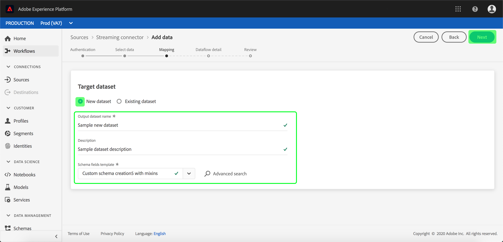

# Konfigurera ett dataflöde för en direktuppspelningskontakt för molnlagring i användargränssnittet

Ett dataflöde är en schemalagd aktivitet som hämtar och importerar data från en källa till en [!DNL Platform] datauppsättning. I den här självstudiekursen beskrivs hur du konfigurerar ett nytt dataflöde med molnlagringsbasen.

## Komma igång

Den här självstudiekursen kräver en fungerande förståelse av följande komponenter i Adobe Experience Platform:

- [[!DNL Experience Data Model] (XDM) System](../../../../../xdm/home.md): Det standardiserade ramverket som [!DNL Experience Platform] organiserar kundupplevelsedata.
   - [Grundläggande om schemakomposition](../../../../../xdm/schema/composition.md): Lär dig mer om de grundläggande byggstenarna i XDM-scheman, inklusive viktiga principer och bästa praxis när det gäller schemakomposition.
   - [Schemaredigeraren, genomgång](../../../../../xdm/tutorials/create-schema-ui.md): Lär dig hur du skapar anpassade scheman med hjälp av gränssnittet för Schemaredigeraren.
- [[!DNL Real-time Customer Profile]](../../../../../profile/home.md): Ger en enhetlig konsumentprofil i realtid baserad på aggregerade data från flera källor.

Den här självstudiekursen kräver dessutom att du redan har skapat en molnlagringskontakt. En lista med självstudiekurser för att skapa olika molnlagringskopplingar i användargränssnittet finns i [källanslutningsöversikten](../../../../home.md).

## Markera data

När du har skapat molnlagringskopplingen visas steget *Välj data* , som ger dig ett gränssnitt där du kan välja vilken ström du vill direktuppspela data från.

## Mappa datafält till ett XDM-schema

Steget visas och innehåller ett interaktivt gränssnitt för att mappa källdata till en **[!UICONTROL Mapping]** [!DNL Platform] datauppsättning.

Välj en datauppsättning för inkommande data som ska importeras till. Du kan antingen använda en befintlig datauppsättning eller skapa en ny.

**Använd en befintlig datauppsättning**

Om du vill importera data till en befintlig datauppsättning väljer du **[!UICONTROL Use existing dataset]** och klickar sedan på datamängdikonen .

Dialogrutan **[!UICONTROL Select dataset]** visas. Hitta den datauppsättning du vill använda, markera den och klicka sedan på **[!UICONTROL Continue]**.

**Använd en ny datauppsättning**

Om du vill importera data till en ny datauppsättning markerar du **[!UICONTROL Create new dataset]** och anger ett namn och en beskrivning för datauppsättningen i de angivna fälten. Välj sedan det schema som du vill använda i listrutan.

## Namnge dataflödet

Stegen visas så att du kan ange ett namn och en kort beskrivning av det nya dataflödet. **[!UICONTROL Dataflow detail]**

Ange värden för dataflödet och klicka **[!UICONTROL Next]**.

### Granska ditt dataflöde

Steget visas så att du kan granska det nya dataflödet innan det skapas. **[!UICONTROL Review]** Informationen är grupperad i följande kategorier:

- **[!UICONTROL Source details]**: Visar källtypen och annan relevant information om källan.
- **[!UICONTROL Target details]**: Visar vilken datauppsättning källdata hämtas till, inklusive det schema som datauppsättningen följer.

När du har granskat dataflödet kan du klicka **[!UICONTROL Finish]** och vänta tills dataflödet har skapats.

## Övervaka och ta bort dataflödet

När ditt molnlagringsdataflöde har skapats kan du övervaka de data som hämtas genom det. Mer information om att övervaka och ta bort dataflöden finns i självstudiekursen om [övervakning av dataflöden](../../../../../ingestion/quality/monitor-data-flows.md).

## Nästa steg

Genom att följa den här självstudiekursen har du skapat ett dataflöde för att hämta in data från en extern molnlagring och fått insikter om att övervaka datauppsättningar. Inkommande data kan nu användas av [!DNL Platform] tjänster längre fram i kedjan som [!DNL Real-time Customer Profile] och [!DNL Data Science Workspace]. Mer information finns i följande dokument:

- [[!DNL Real-time Customer Profile] översikt](../../../../../profile/home.md)
- [[!DNL Data Science Workspace] översikt](../../../../../data-science-workspace/home.md)

## Bilaga

I följande avsnitt finns ytterligare information om hur du arbetar med källkopplingar.

### Inaktivera ett dataflöde

När ett dataflöde skapas blir det omedelbart aktivt och importerar data enligt det schema som det gavs. Du kan när som helst inaktivera ett aktivt dataflöde genom att följa instruktionerna nedan.

Klicka på **[!UICONTROL Sources]** fliken på arbetsytan **[!UICONTROL Browse]** . Klicka sedan på namnet på anslutningen som är kopplad till det aktiva dataflöde som du vill inaktivera.

Sidan visas **[!UICONTROL Source activity]** . Markera det aktiva dataflödet i listan för att öppna dess **[!UICONTROL Properties]** kolumn till höger på skärmen, som innehåller en **[!UICONTROL Enabled]** växlingsknapp. Klicka på växlingsknappen för att inaktivera dataflödet. Samma växlingsknapp kan användas för att återaktivera ett dataflöde efter att det har inaktiverats.

### Aktivera inkommande data för [!DNL Profile] populationen

Inkommande data från källkopplingen kan användas för att berika och fylla i dina [!DNL Real-time Customer Profile] data. Mer information om hur du fyller i dina [!DNL Real-time Customer Profile] data finns i självstudiekursen om [profilpopulationen](../../profile.md).
