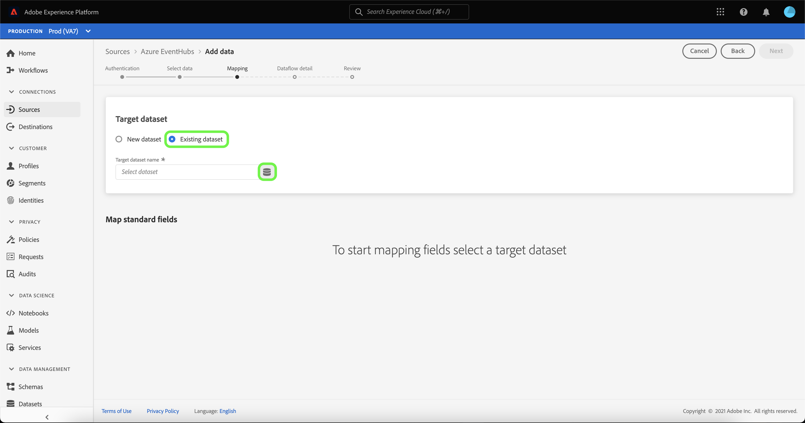

# Skapa ett direktuppspelat dataflöde för en molnlagringskälla i användargränssnittet

Ett dataflöde är en schemalagd aktivitet som hämtar och importerar data från en källa till en Adobe Experience Platform-datauppsättning. I den här självstudiekursen beskrivs hur du skapar ett direktuppspelat dataflöde för en molnlagringskälla i användargränssnittet.

Innan du provar den här självstudiekursen måste du skapa en giltig och autentiserad anslutning mellan ditt molnlagringskonto och Experience Platform. Om du inte redan har en autentiserad anslutning kan du gå till någon av följande självstudiekurser för att få information om hur du autentiserar ditt molnbaserade lagringskonton:

- [[!DNL Amazon Kinesis]](../../../ui/create/cloud-storage/kinesis.md)
- [[!DNL Azure Event Hubs]](../../../ui/create/cloud-storage/eventhub.md)
- [[!DNL Google PubSub]](../../../ui/create/cloud-storage/google-pubsub.md)

## Komma igång

Den här självstudiekursen kräver en fungerande förståelse av följande komponenter i Adobe Experience Platform:

- [Dataflöden](../../../../../dataflows/home.md): Dataflöden är en representation av datajobb som flyttar data mellan Experience Platform. Dataflöden är konfigurerade för olika tjänster, från källor till [!DNL Identity Service], till [!DNL Profile] och till [!DNL Destinations].
- [Data Prep](../../../../../data-prep/home.md): Med Data Prep kan datatekniker mappa, omvandla och validera data till och från Experience Data Model (XDM). Dataförinställning visas som ett steg för&quot;Karta&quot; i dataöverföringsprocesserna, inklusive arbetsflödet för CSV-inmatning.
- [[!DNL Experience Data Model (XDM)] System](../../../../../xdm/home.md): Det standardiserade ramverk som [!DNL Experience Platform] organiserar kundupplevelsedata med.
   - [Grundläggande om schemakomposition](../../../../../xdm/schema/composition.md): Lär dig mer om grundstenarna i XDM-scheman, inklusive nyckelprinciper och bästa metoder för schemakomposition.
   - [Schemaredigeraren, självstudiekurs](../../../../../xdm/tutorials/create-schema-ui.md): Lär dig hur du skapar anpassade scheman med hjälp av gränssnittet för Schemaredigeraren.
- [[!DNL Real-Time Customer Profile]](../../../../../profile/home.md): Tillhandahåller en enhetlig konsumentprofil i realtid baserad på aggregerade data från flera källor.

## Lägg till data

>[!NOTE]
>
>Du kan bara skapa ett källdataflöde per konsumentgrupp för en given händelsehubb.

När du har skapat ditt direktuppspelade molnlagringskonto visas steget **[!UICONTROL Select data]** som ger dig ett gränssnitt där du kan välja vilken dataström du vill ta med till Experience Platform.

- Den vänstra delen av gränssnittet är en webbläsare som gör att du kan visa tillgängliga dataströmmar på ditt konto;
- Med den högra delen av gränssnittet kan du förhandsgranska upp till 100 rader data från en JSON-fil.

Markera dataströmmen som du vill använda och välj sedan **[!UICONTROL Choose file]** för att överföra ett exempelschema.

>[!TIP]
>
>Om dina data är XDM-kompatibla kan du hoppa över överföringen av ett exempelschema och välja **[!UICONTROL Next]** för att fortsätta.

När schemat har överförts uppdateras förhandsgranskningsgränssnittet för att visa en förhandsgranskning av schemat som du har överfört. I förhandsvisningsgränssnittet kan du inspektera innehållet och strukturen i en fil. Du kan också använda verktyget [!UICONTROL Search field] för att komma åt specifika objekt från schemat.

När du är klar väljer du **[!UICONTROL Next]**.

## Mappning

Steget **[!UICONTROL Mapping]** visas med ett gränssnitt för att mappa källdata till en Experience Platform-datauppsättning.

Välj en datauppsättning för inkommande data som ska importeras till. Du kan antingen använda en befintlig datauppsättning eller skapa en ny.

### Ny datauppsättning

Om du vill importera data till en ny datauppsättning väljer du **[!UICONTROL New dataset]** och anger ett namn och en beskrivning för datauppsättningen i de angivna fälten. Om du vill lägga till ett schema kan du ange ett befintligt schemanamn i dialogrutan **[!UICONTROL Select schema]**. Du kan också välja **[!UICONTROL Schema advanced search]** om du vill söka efter ett lämpligt schema.

Fönstret [!UICONTROL Select schema] visas med en lista över tillgängliga scheman att välja mellan. Välj ett schema i listan om du vill uppdatera högerspåret så att det visas information som är specifik för det schema som du har valt, inklusive information om huruvida schemat är aktiverat för [!DNL Profile].

När du har identifierat och valt det schema som du vill använda väljer du **[!UICONTROL Done]**.

Sidan [!UICONTROL Target dataset] uppdateras med det valda schemat som visas som en del av datauppsättningen. Under det här steget kan du aktivera datauppsättningen för [!DNL Profile] och skapa en helhetsbild av en entitets attribut och beteenden. Data från alla aktiverade datauppsättningar inkluderas i [!DNL Profile] och ändringar tillämpas när du sparar dataflödet.

Aktivera måldatauppsättningen för [!DNL Profile] genom att växla **[!UICONTROL Profile dataset]**.

### Befintlig datauppsättning

Om du vill importera data till en befintlig datauppsättning väljer du **[!UICONTROL Existing dataset]** och sedan datamängdikonen.

Dialogrutan **[!UICONTROL Select dataset]** visas med en lista över tillgängliga datauppsättningar att välja mellan. Välj en datauppsättning i listan om du vill uppdatera den högra listen för att visa information som är specifik för den datauppsättning du valde, inklusive information om huruvida datauppsättningen kan aktiveras för [!DNL Profile].

När du har identifierat och valt den datauppsättning som du vill använda väljer du **[!UICONTROL Done]**.

När du har valt datauppsättningen väljer du [!DNL Profile] för att aktivera datauppsättningen för [!DNL Profile].

### Mappa standardfält

När din datauppsättning och ditt schema har etablerats visas gränssnittet **[!UICONTROL Map standard fields]**, vilket gör att du kan konfigurera mappningsfält manuellt för dina data.

>[!TIP]
>
>Experience Platform ger intelligenta rekommendationer för automatiskt mappade fält baserat på det målschema eller den datamängd som du har valt. Du kan justera mappningsreglerna manuellt så att de passar dina användningsfall.

Beroende på dina behov kan du välja att mappa fält direkt eller använda förinställningsfunktioner för data för att omvandla källdata för att härleda beräknade eller beräknade värden. Mer information om hur du använder mappningsgränssnittet och beräkningsfälten finns i [Användargränssnittshandboken för dataförinställningar](../../../../../data-prep/ui/mapping.md).

När källdata har mappats väljer du **[!UICONTROL Next]**.

## Dataflödesdetaljer

**[!UICONTROL Dataflow detail]**-steget visas så att du kan namnge och ge en kort beskrivning av det nya dataflödet.

Ange värden för dataflödet och välj **[!UICONTROL Next]**.

### Granska

Steg **[!UICONTROL Review]** visas, så att du kan granska det nya dataflödet innan det skapas. Informationen är grupperad i följande kategorier:

- **[!UICONTROL Connection]**: Visar ditt kontonamn, typ av källa och annan information som är specifik för den strömmande molnlagringskällan som du använder.
- **[!UICONTROL Assign dataset and map fields]**: Visar måldatauppsättningen och målschemat som du använder för dataflödet.

När du har granskat dataflödet väljer du **[!UICONTROL Finish]** och tillåt en tid innan dataflödet skapas.

## Övervaka och ta bort dataflödet

När du har skapat ett direktuppspelat molnlagringsdataflöde kan du övervaka de data som hämtas genom det. Mer information om hur du övervakar och tar bort dataflöden för direktuppspelning finns i självstudiekursen [Övervaka dataflöden för direktuppspelning](../../monitor-streaming.md).

## Nästa steg

Genom att följa den här självstudiekursen har du skapat ett dataflöde för att strömma data från en molnlagringskälla. Inkommande data kan nu användas av Experience Platform-tjänster längre fram i kedjan som [!DNL Real-Time Customer Profile] och [!DNL Data Science Workspace]. Mer information finns i följande dokument:

- [[!DNL Real-Time Customer Profile] översikt](../../../../../profile/home.md)
- [[!DNL Data Science Workspace] översikt](../../../../../data-science-workspace/home.md)