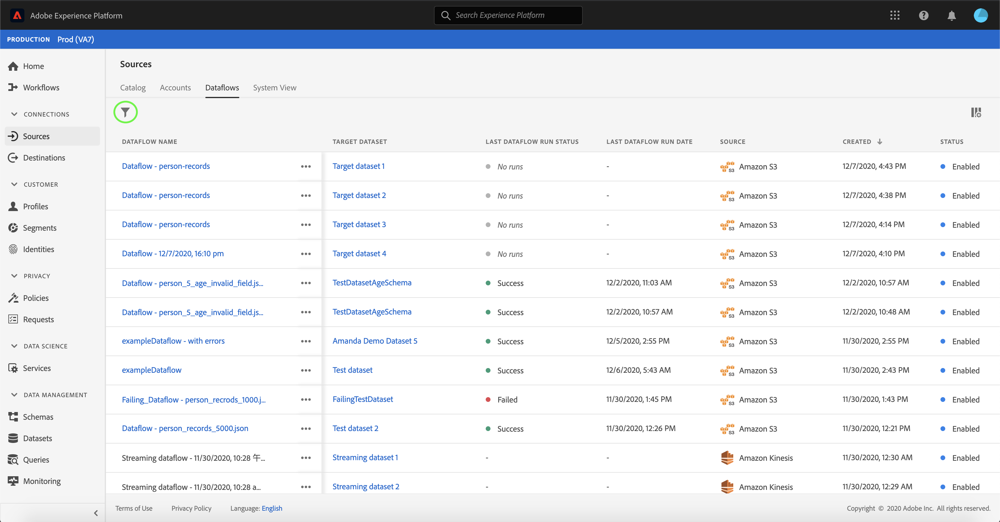

# Ta bort dataflöden

Källkopplingar i Adobe Experience Platform gör det möjligt att importera externt källkodsdata på schemalagd basis. I den här självstudiekursen beskrivs hur du tar bort dataflöden från **[!UICONTROL Sources]** arbetsytan.

## Komma igång

Den här självstudiekursen kräver en fungerande förståelse av följande komponenter i Adobe Experience Platform:

- [[!DNL Experience Data Model] (XDM) System](../../../xdm/home.md): Det standardiserade ramverket som [!DNL Experience Platform] organiserar kundupplevelsedata.
   - [Grundläggande om schemakomposition](../../../xdm/schema/composition.md): Lär dig mer om de grundläggande byggstenarna i XDM-scheman, inklusive viktiga principer och bästa praxis när det gäller schemakomposition.
   - [Schemaredigeraren, genomgång](../../../xdm/tutorials/create-schema-ui.md): Lär dig hur du skapar anpassade scheman med hjälp av gränssnittet för Schemaredigeraren.
- [[!DNL Real-time Customer Profile]](../../../profile/home.md): Ger en enhetlig konsumentprofil i realtid baserad på aggregerade data från flera källor.

## Ta bort dataflöden med användargränssnittet

Logga in på [Adobe Experience Platform](https://platform.adobe.com) och välj sedan **[!UICONTROL Sources]** i det vänstra navigeringsfältet för att komma åt **[!UICONTROL Sources]** arbetsytan. På **[!UICONTROL Catalog]** skärmen visas en mängd olika källor som du kan skapa konton och dataflöden med. Varje källa visar antalet befintliga konton och dataflöden som är kopplade till dem.

Markera **[!UICONTROL Dataflows]** för att komma åt **[!UICONTROL Dataflows]** sidan.

En lista över befintliga dataflöden visas. På den här sidan finns en lista med sorterbar information för befintliga dataflöden, t.ex. källa, användarnamn, körningsstatus och senaste körningsdatum. Välj **kanalikonen** längst upp till vänster om du vill sortera.

Sorteringspanelen visas till vänster på skärmen och innehåller en lista med tillgängliga källor.
Du kan välja mer än en källa med sorteringsfunktionen.

Välj den källa som du vill komma åt och leta reda på det dataflöde som du vill ta bort från listan med dataflöden i huvudgränssnittet. I exemplet är den valda källan **[!DNL Azure Blob Storage]** och dataflödets namn är **[!UICONTROL Customer profiles dataflow]**. När du väljer flera källor från sorteringspanelen visas de senast skapade dataflödena först eftersom listan sorteras efter skapad den.

Markera det dataflöde som du vill ta bort.

Panelen visas till höger på skärmen och innehåller information om det markerade dataflödet samt ett alternativ för att **[!UICONTROL Properties]** välja **[!UICONTROL Edit schedule]**.

Om du vill ta bort dataflödet markerar du **[!UICONTROL Delete]**.

En slutgiltig bekräftelsedialogruta visas. Välj **[!UICONTROL Delete]** för att slutföra processen.

Efter en stund visas en grön bekräftelseruta längst ned på skärmen som bekräftar att borttagningen lyckades.

## Nästa steg

I den här självstudiekursen har du använt arbetsytan för att ta bort befintliga dataflöden **[!UICONTROL Sources]** .

Anvisningar om hur du utför dessa åtgärder programmatiskt med API:t finns i självstudiekursen om hur du [!DNL Flow Service] [tar bort anslutningar med API:t för Flow Service](../../tutorials/api/delete.md)