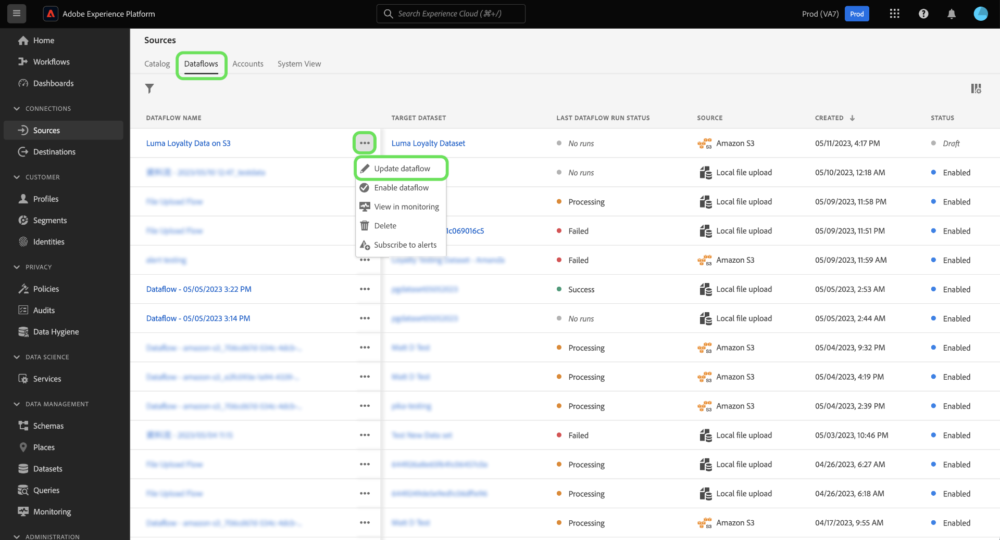

# Utkastdataflöden i användargränssnittet

Spara arbetsflödets förlopp för oavslutad datainmatning genom att ange dataflödet till utkaststatus. Du kan återuppta och slutföra dina skräddarsydda dataflöden vid ett senare tillfälle.

Det här dokumentet innehåller anvisningar om hur du sparar dataflöden när du använder källarbetsytan i Adobe Experience Platform-användargränssnittet.

## Komma igång

Dokumentet kräver en fungerande förståelse av följande komponenter i Adobe Experience Platform:

* [Källor](../../home.md): Experience Platform tillåter data att hämtas från olika källor samtidigt som du kan strukturera, etikettera och förbättra inkommande data med hjälp av plattformstjänster.

## Spara ett dataflöde som ett utkast

Du kan när som helst pausa skapandet av dataflödet efter att du har valt de data som ska hämtas till plattformen.

Om du till exempel vill spara förloppet under informationsflödet väljer du **[!UICONTROL Save as draft]**.

När du har sparat utkastet kommer du till kontosidan där du kan se en lista över dina befintliga dataflöden, inklusive dina utkast.

>[!TIP]
>
>Ritade dataflöden kommer inte att aktiveras och har statusen `draft`.

Om du vill fortsätta med utkastet markerar du ellipserna (`...`) bredvid dataflödets namn och väljer sedan **[!UICONTROL Update dataflow]**.

>[!NOTE]
>
>Om utkastet innehåller schemaläggningsinformation kan du även välja **[!UICONTROL Edit schedule]** i listrutan.

### Öppna dina utkast från källkatalogen

Du kan även komma åt dina utkast via dataflödeskatalogen. Välj **[!UICONTROL Dataflows]** i det övre huvudet för att komma åt dataflödeskatalogen. Här hittar du utkastet från listan med befintliga dataflöden i organisationen, markerar ellipserna (`...`) bredvid namnet och väljer sedan **[!UICONTROL Update dataflow]**.

## Publish ditt datautkastflöde

Du återgår till [!UICONTROL Add data]-steget i arbetsflödet för källor, där du kan bekräfta dataformatet igen och fortsätta arbeta med dataflödet.

När du har bekräftat formatering, avgränsare och komprimeringstyp för dina data väljer du **[!UICONTROL Next]** för att fortsätta.

Bekräfta sedan dataflödesinformationen. Använd informationsgränssnittet för dataflöden för att uppdatera konfigurationer som omger dataflödets namn, beskrivning, partiellt intag, inställningar för feldiagnostik och varningsinställningar.

När du är klar med konfigurationerna väljer du **[!UICONTROL Next]** för att fortsätta.

[!UICONTROL Mapping]-steget visas. Under det här steget kan du konfigurera om mappningskonfigurationerna för ditt dataflöde. En utförlig guide om de förinställningsfunktioner som används för mappning finns i [användargränssnittshandboken för dataförinställningar](../../../data-prep/ui/mapping.md).

När du har slutfört mappningsomkonfigurationen väljer du **[!UICONTROL Next]** för att fortsätta.

Använd steget [!UICONTROL Scheduling] om du vill upprätta ett intag-schema för dataflödet. Du kan ställa in din matningsfrekvens på `once`, `minute`, `hour`, `day` eller `week`. När du är klar väljer du **[!UICONTROL Next]** för att fortsätta.

Granska slutligen informationen om dataflödet och välj sedan **[!UICONTROL Finish]** för att publicera utkastet.

När du har sparat och publicerat ett utkast aktiveras dataflödet och du kan inte längre återställa det som ett utkast.

## Nästa steg

Genom att följa den här självstudiekursen har du lärt dig hur du sparar förloppet och anger ett dataflöde som ett utkast. Mer information om källor finns i [Källöversikt](../../home.md).
