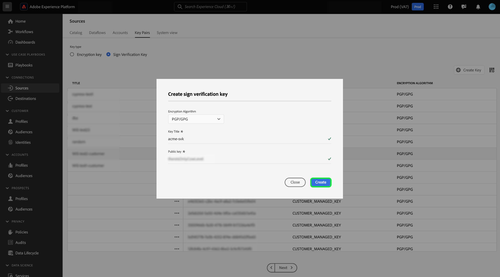

# Infoga krypterade data i källans användargränssnitt

>[!AVAILABILITY]
>
>Stöd för krypterad datainmatning i källans användargränssnitt finns i betaversionen. Funktionen och dokumentationen kan komma att ändras.

Du kan importera krypterade datafiler och mappar till Adobe Experience Platform med batchkällor för molnlagring. Med krypterad datainmatning kan ni utnyttja asymmetriska krypteringsmekanismer för att på ett säkert sätt överföra batchdata till Experience Platform. De asymmetriska krypteringsmekanismer som stöds är PGP och GPG.

Läs den här guiden och lär dig hur du kan importera krypterade data med batchkällor i molnet med hjälp av användargränssnittet.

## Kom igång

Innan du fortsätter med den här självstudiekursen bör du läsa följande dokument för att få en bättre förståelse för följande Experience Platform-funktioner och -koncept.

* [Källor](../../home.md): Använd källor i Experience Platform för att importera data från ett Adobe-program eller en datakälla från en tredje part.
* [Dataflöden](../../../dataflows/home.md): Dataflöden är representationer av datajobb som flyttar data mellan Experience Platform. Du kan använda källarbetsytan för att skapa dataflöden som importerar data från en viss källa till Experience Platform.
* [Sandlådor](../../../sandboxes/home.md): Använd sandlådor i Experience Platform för att skapa virtuella partitioner mellan dina Experience Platform-instanser och skapa miljöer som är dedikerade till utveckling eller produktion.

### Kontur på hög nivå

* Skapa ett krypteringsnyckelpar med hjälp av källarbetsytan i användargränssnittet i Experience Platform.
   * Du kan också skapa ett eget nyckelpar för signaturverifiering för att ge ytterligare ett säkerhetslager till dina krypterade data.
* Använd den offentliga nyckeln från ditt krypteringsnyckelpar för att kryptera dina data.
* Placera dina krypterade data i molnlagringen. Under det här steget måste du också se till att du har en exempelfil med dina data i molnlagringen som kan användas som referens för att mappa dina källdata till ett XDM-schema (Experience Data Model).
* Använd din batchkälla för molnlagring och påbörja dataöverföringsprocessen i källarbetsytan i användargränssnittet i Experience Platform.
* Ange det nyckel-ID som motsvarar den offentliga nyckel som du använde för att kryptera dina data när du skapade källanslutningen.
   * Om du även använde teckenverifieringsnyckelparet måste du även ange det ID för signaturverifieringsnyckel som motsvarar dina krypterade data.
* Fortsätt till stegen för att skapa dataflödet.

## Skapa ett krypteringsnyckelpar {#create-an-encryption-key-pair}

>[!CONTEXTUALHELP]
>id="platform_sources_encrypted_encryptionKeyId"
>title="ID för krypteringsnyckel"
>abstract="Ange det krypteringsnyckel-ID som motsvarar den krypteringsnyckel som användes för att kryptera källdata."

>[!BEGINSHADEBOX]

**Vad är ett krypteringsnyckelpar?**

Ett krypteringsnyckelpar är en asymmetrisk krypteringsmekanism som består av en offentlig nyckel och en privat nyckel. Den offentliga nyckeln används för att kryptera data och den privata nyckeln används sedan för att dekryptera dessa data.

Du kan skapa ditt krypteringsnyckelpar via användargränssnittet i Experience Platform. När den genereras får du en offentlig nyckel och ett motsvarande nyckel-ID. Använd den offentliga nyckeln för att kryptera dina data och använd sedan nyckel-ID:t för att bekräfta din identitet när du håller på att hämta krypterade data. Den privata nyckeln skickas automatiskt till Experience Platform, där den lagras i ett säkert valv, och används endast när dina data är klara för dekryptering.

>[!ENDSHADEBOX]

Navigera till källarbetsytan i plattformsgränssnittet och välj sedan [!UICONTROL Key Pairs] i det övre sidhuvudet.

Du dirigeras till en sida som visar en lista över befintliga krypteringsnyckelpar i organisationen. Den här sidan innehåller information om en viss nyckels titel, ID, typ, krypteringsalgoritm, förfallodatum och status. Om du vill skapa ett nytt nyckelpar väljer du **[!UICONTROL Create Key]**.

Välj sedan den nyckeltyp som du vill skapa. Om du vill skapa en krypteringsnyckel väljer du **[!UICONTROL Encryption Key]** och sedan **[!UICONTROL Continue]**.

Ange en titel och en lösenfras för din krypteringsnyckel. Lösenfrasen är ytterligare ett skyddslager för dina krypteringsnycklar. När lösenordet skapas lagrar Experience Platform den i ett annat säkert valv än den offentliga nyckeln. Du måste ange en sträng som inte är tom som lösenfras. När du är klar väljer du **[!UICONTROL Create]**.

Om det lyckas visas ett nytt fönster med din nya krypteringsnyckel, inklusive titel, offentlig nyckel och nyckel-ID. Använd värdet för den offentliga nyckeln för att kryptera dina data. Du kommer att använda nyckel-ID:t i ett senare steg för att bevisa din identitet när du importerar krypterade data när dataflödet skapas.

Om du vill visa information om en befintlig krypteringsnyckel markerar du ellipserna (`...`) bredvid nyckeltiteln. Välj **[!UICONTROL Key details]** om du vill visa den offentliga nyckeln och nyckel-ID:t. Om du vill ta bort krypteringsnyckeln väljer du **[!UICONTROL Delete]**.

### Skapa en signaturverifieringsnyckel {#create-a-sign-verification-key}

>[!CONTEXTUALHELP]
>id="platform_sources_encrypted_signVerificationKeyId"
>title="ID för signaturverifieringsnyckel"
>abstract="Ange det ID för signaturverifieringsnyckel som motsvarar dina signerade, krypterade källdata."

>[!BEGINSHADEBOX]

**Vad är en signaturverifieringsnyckel?**

En signaturverifieringsnyckel är en annan krypteringsmekanism som innefattar en privat nyckel och en offentlig nyckel. I det här fallet kan du skapa nyckelparet för signaturverifiering och använda den privata nyckeln för att signera och tillhandahålla ytterligare ett krypteringslager för dina data. Sedan delar du motsvarande offentliga nyckel till Experience Platform. Under importen använder Experience Platform den offentliga nyckeln för att verifiera signaturen som är kopplad till din privata nyckel.

>[!ENDSHADEBOX]

Om du vill skapa en signaturverifieringsnyckel väljer du **[!UICONTROL Sign Verification Key]** i fönstret för val av nyckeltyp och väljer sedan **[!UICONTROL Continue]**.

Ange sedan en titel och en [!DNL Base64]-kodad PGP-nyckel som din offentliga nyckel och välj sedan **[!UICONTROL Create]**.

Om det lyckas visas ett nytt fönster med din nya signaturverifieringsnyckel, inklusive titel och nyckel-ID.

## Importera krypterade data {#ingest-encrypted-data}

>[!CONTEXTUALHELP]
>id="platform_sources_encrypted_isFileEncrypted"
>title="Är filen krypterad?"
>abstract="Välj det här alternativet om du vill importera en fil som redan är krypterad."

>[!CONTEXTUALHELP]
>id="platform_sources_encrypted_sampleFile"
>title="Välj exempelfil"
>abstract="Du måste importera en exempelfil när du importerar krypterade data för att kunna skapa en mappning."

Du kan importera krypterade data med följande batchkällor för molnlagring:

* [[!DNL Amazon S3]](../ui/create/cloud-storage/s3.md)
* [[!DNL Azure Blob]](../ui/create/cloud-storage/blob.md)
* [[!DNL Azure Data Lake Storage Gen2]](../ui/create/cloud-storage/adls-gen2.md)
* [[!DNL Azure File Storage]](../ui/create/cloud-storage/azure-file-storage.md)
* [[!DNL Data Landing Zone]](../ui/create/cloud-storage/data-landing-zone.md)
* [[!DNL FTP]](../ui/create/cloud-storage/ftp.md)
* [[!DNL Google Cloud Storage]](../ui/create/cloud-storage/google-cloud-storage.md)
* [[!DNL HDFS]](../ui/create/cloud-storage/hdfs.md)
* [[!DNL Oracle Object Storage]](../ui/create/cloud-storage/oracle-object-storage.md)
* [[!DNL SFTP]](../ui/create/cloud-storage/sftp.md)

Autentisera med molnlagringskällan som du väljer. Under arbetsflödets dataurvalssteg markerar du den krypterade fil eller mapp som du vill importera och aktiverar sedan växlingsknappen **[!UICONTROL Is the file encrypted]**.

Välj sedan en exempelfil från källdata. Eftersom dina data är krypterade behöver Experience Platform en exempelfil för att kunna skapa ett XDM-schema som kan mappas till dina källdata.

När du har valt exempelfilen konfigurerar du inställningarna för dina data, till exempel motsvarande dataformat, avgränsare och komprimeringstyp. Ge förhandsvisningsgränssnittet lite tid att rendera och välj sedan **[!UICONTROL Save]**.

Här använder du listrutan för att välja den offentliga nyckel-ID som motsvarar den offentliga nyckel som du använde för att kryptera dina data.

Om du även använde nyckelparet för signaturverifiering för att tillhandahålla och ytterligare krypteringslager aktiverar du nyckelväxlingen för signaturverifiering och använder sedan listrutan för att välja det ID för signaturverifieringsnyckel som motsvarar nyckeln som du använde för att kryptera dina data.

Välj **[!UICONTROL Next]** när du är klar.

Slutför de återstående stegen i källarbetsflödet för att slutföra dataflödet.

* [Ange dataflöde och datauppsättningsinformation](../ui/dataflow/batch/cloud-storage.md#provide-dataflow-details)
* [Mappa källdata till ett XDM-schema](../ui/dataflow/batch/cloud-storage.md#map-data-fields-to-an-xdm-schema)
* [Konfigurera ett matningsschema för dataflödet](../ui/dataflow/batch/cloud-storage.md#schedule-ingestion-runs)
* [Granska ditt dataflöde](../ui/dataflow/batch/cloud-storage.md#review-your-dataflow)

Du kan fortsätta att [göra uppdateringar av dataflödet](../ui/update-dataflows.md) när det har skapats.

## Nästa steg

Genom att läsa det här dokumentet kan du nu importera krypterade data från molnlagrets batchkälla till Experience Platform. Mer information om hur du importerar krypterade data med API:erna finns i handboken om [inhämtning av krypterade data med  [!DNL Flow Service] API](../api/encrypt-data.md). Allmän information om källor på Experience Platform finns i [Källöversikt](../../home.md).
