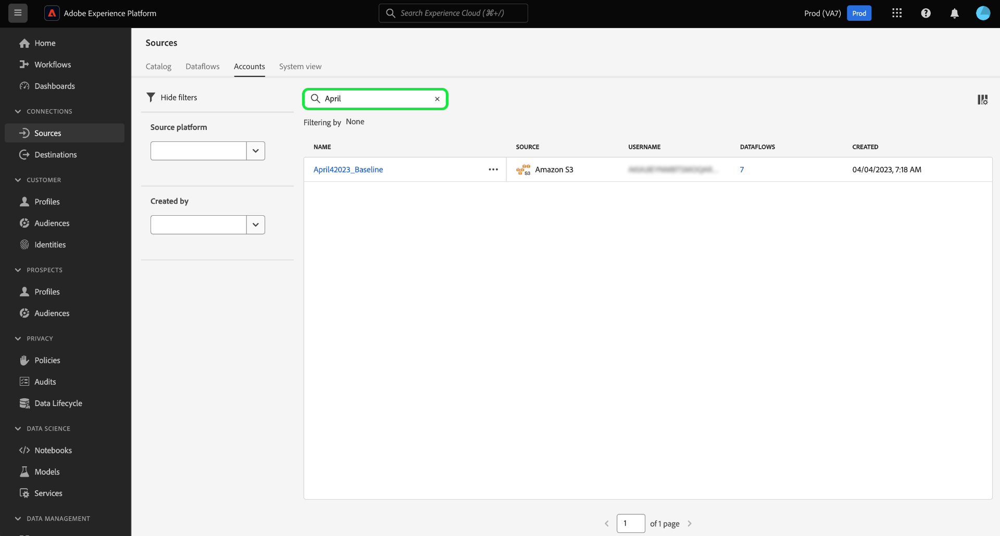

# Filtrera källobjekt i användargränssnittet

Använd verktygen för filtrering, sökning och infogade åtgärder i Adobe Experience Platform användargränssnitt för att effektivisera arbetsflödet i [!UICONTROL Sources] arbetsyta

* Använd filtrerings- och sökfunktioner för att navigera genom källkonton och dataflöden i organisationen.
* Använd textbundna åtgärder för att ändra konfigurationsinställningarna för dataflödena och förbättra arbetsflödena i organisationen. Du kan använda textbundna åtgärder för att lägga till taggar, ställa in aviseringar eller skapa förtäringsjobb på begäran.

## Kom igång

Det är praktiskt att ha en förståelse för följande funktioner och begrepp i Experience Platform innan du arbetar med objektnavigeringsverktygen på källarbetsytan:

* [Källor](../../home.md): Använd källor i Experience Platform för att importera data från ett Adobe-program eller en datakälla från tredje part.
* [Administrativa taggar](../../../administrative-tags/overview.md): Använd administrativa taggar för att lägga till metadatanyckelord i dina objekt och aktivera sökning för att hitta det objektet i Experience Platform-ekosystemet.
* [Varningar](../../../observability/home.md): Använd varningar för att få meddelanden som ger en uppdatering av status för objekt, t.ex. källans dataflöden.
* [Dataflöden](../../../dataflows/home.md): Dataflöden är representationer av datajobb som flyttar data över Experience Platform. Du kan använda källarbetsytan för att skapa dataflöden som importerar data från en viss källa till Experience Platform.
* [Datauppsättningar](../../../catalog/datasets/user-guide.md): En datauppsättning är en lagrings- och hanteringskonstruktion för en datamängd, vanligtvis en tabell, som innehåller ett schema (kolumner) och fält (rader).
* [Sandlådor](../../../sandboxes/home.md): Använd sandlådor i Experience Platform för att skapa virtuella partitioner mellan dina Experience Platform-instanser och skapa miljöer som är dedikerade till utveckling eller produktion.

## Filterkällor, dataflöden {#filter-sources-dataflows}

I användargränssnittet för Experience Platform väljer du **[!UICONTROL Sources]** i den vänstra navigeringen och sedan väljer **[!UICONTROL Dataflows]** i det övre sidhuvudet.

Som standard visas filtermenyn till vänster om gränssnittet. Om du vill dölja menyn väljer du **[!UICONTROL Hide filters]**.

Du kan filtrera källans dataflöden med följande parametrar:

| Filter | Beskrivning |
| --- | --- |
| [Källplattform](#filter-dataflows-by-source-platform) | Filtrera dataflödena baserat på källan som de skapades med. |
| [Taggar](#filter-dataflows-by-tags) | Filtrera dataflödena baserat på de taggar som används i dem. |
| [Status](#filter-dataflows-by-status) | Filtrera dataflödena baserat på deras aktuella status. |
| [Måldatamängd](#filter-dataflows-by-target-dataset) | Filtrera dataflödena baserat på måldatauppsättningen som de skapades med. |
| [Kontonamn](#filter-dataflows-by-account-name) | Filtrera dataflödena baserat på namnet på kontot som de motsvarar. |
| [Skapad av](#filter-dataflows-by-user) | Filtrera dataflödena baserat på vem som skapade dem. |
| [Skapad den](#filter-dataflows-by-creation-date) | Filtrera dataflödena baserat på vilket datum de skapades. |
| [Ändrat den](#filter-dataflows-by-modification-date) | Filtrera dataflödena baserat på det datum då de senast uppdaterades. |

### Filtrera dataflöden efter källplattform {#filter-dataflows-by-source-platform}

Använd [!UICONTROL Source platform] för att filtrera dataflödena efter källtyp. Du kan antingen skriva in en viss källa eller använda listrutan för att visa en lista med källor i katalogen. Du kan också filtrera efter flera olika källor för en given fråga. Du kan t.ex. välja [!DNL Amazon S3], [!DNL Azure Data Lake Storage Gen2]och [!DNL Google Cloud Storage] om du vill uppdatera katalogen och bara visa de dataflöden som skapades med de valda källorna.

### Filtrera dataflöden efter taggar {#filter-dataflows-by-tags}

Använd taggpanelen för att filtrera dataflödena efter deras respektive taggar.

Välj **[!UICONTROL Has any tag]** och markera sedan de taggar som du vill filtrera med hjälp av listrutan. Använd den här inställningen för att filtrera efter dataflöden som har någon av de taggar som du har valt.

Välj **[!UICONTROL Has all tags]** och markera sedan de taggar som du vill filtrera med hjälp av listrutan. Använd den här inställningen om du vill filtrera efter dataflöden som har alla taggar som du har valt.

### Filtrera dataflöden efter status {#filter-dataflows-by-status}

Du kan filtrera efter status med [!UICONTROL Status] -panelen.

| Status | Beskrivning |
| --- | --- |
| Aktiverad | Välj **[!UICONTROL Enabled]** för att filtrera vyn och bara visa aktiva dataflöden. |
| Handikappade | Välj **[!UICONTROL Disabled]** för att filtrera vyn och bara visa inaktiverade dataflöden. |
| Utkast | Välj **[!UICONTROL Draft]** om du vill filtrera vyn och bara visa dataflöden som är i utkastläge. |

### Filtrera dataflöden efter måldatauppsättning {#filter-dataflows-by-target-dataset}

Välj **[!UICONTROL Target dataset]** för att komma åt en listruta med alla måldatauppsättningar. Välj sedan en måldatauppsättning som du vill filtrera vyn och bara visa de dataflöden som har skapats med de angivna måldatauppsättningarna.

### Filtrera dataflöden efter kontonamn {#filter-dataflows-by-account-name}

Välj **[!UICONTROL Account name]** om du vill öppna en listruta med alla konton. Välj sedan ett konto för att filtrera vyn och visa dataflöden som har skapats av det valda kontot.

### Filtrera dataflöden efter användare {#filter-dataflows-by-user}

Använd [!UICONTROL Created by] för att filtrera dataflöden efter den användare som skapade eller senast uppdaterade dataflödena. Markera listrutan och välj sedan användarnamnet för att filtrera dataflödena efter.

### Filtrera dataflöden efter skapandedatum {#filter-dataflows-by-creation-date}

Du kan filtrera dataflödena efter när de skapades. I [!UICONTROL Created date] konfigurerar du ett startdatum och ett slutdatum för att skapa ett tidsramsfönster och filtrerar vyn så att endast dataflöden som skapats i fönstret visas.

Du kan konfigurera tidsramen genom att ange start- och slutdatum. Du kan också välja kalenderikonen och använda kalendern för att konfigurera dina datum.

Du kan också följa samma steg, men filtrera dataflöden efter det senaste ändringsdatumet, i motsats till det datum då de skapades.

### Filtrera dataflöden efter ändringsdatum {#filter-dataflows-by-modification-date}

På samma sätt kan du tillämpa samma principer och filtrera dataflödet efter ändringsdatum. Använd **[!UICONTROL Modified date]** för att konfigurera en viss tidsram och filtrera vyn så att endast dataflöden som har ändrats under den perioden visas.

### Kombinera filter {#combine-filters}

Du kan kombinera olika filter för att göra sökningen bredare eller smalare. I exemplet nedan används ett filter för att söka efter:

* Dataflöden som har skapats med [!DNL Amazon S3] källa.
* Dataflöden som innehåller **[!DNL ACME]** -tagg.
* Datamöjligheter som är aktiverade.
* Dataflöden som har skapats med [!DNL Loyalty Dataset B2C] datauppsättning.
* Dataflöden som skapades mellan den 4 januari 2024 och den 4 november 2024.

Om du vill ta bort alla filter väljer du **[!UICONTROL Clear all]**.

## Filtrera källkonton {#filter-sources-accounts}

I användargränssnittet för Experience Platform väljer du [!UICONTROL Sources] i den vänstra navigeringen och sedan väljer **[!UICONTROL Accounts]** i det övre sidhuvudet. Du kan filtrera dina källkonton baserat på källan som de skapades med eller användaren som skapade dem.

## Sök efter konton och dataflöden {#search-for-accounts-and-dataflows}

Du kan öka effektiviteten genom att använda sökfältet för att direkt navigera till ett visst konto eller dataflöde.

>[!BEGINTABS]

>[!TAB Sök efter dataflöden]

Använd sökfältet i dialogrutan [!UICONTROL Dataflows] sida för att hitta ett specifikt dataflöde. Du kan söka efter ett dataflöde med hjälp av dess namn eller beskrivning.

>[!TAB Sök efter konton]

Använd sökfältet i dialogrutan [!UICONTROL Accounts] sida för att hitta ett specifikt konto. Du kan söka efter ett konto med hjälp av dess namn eller beskrivning.

>[!ENDTABS]

## Textbundna åtgärder för källdata {#inline-actions-for-sources-dataflows}

Markera ellipserna (`...`) bredvid ett dataflödesnamn för en lista med infogade åtgärder som du kan använda för att göra ändringar i dataflödet.

| Inline-åtgärder | Beskrivning |
| --- | --- |
| [!UICONTROL Edit schedule] | Välj **[!UICONTROL Edit schedule]** för att uppdatera intag av ditt dataflöde. Det går inte att redigera ett dataflöde som har ställts in på engångsintag. |
| [!UICONTROL Disable dataflow] | Välj **[!UICONTROL Disable dataflow]** för att inaktivera ett dataflöde. Det här alternativet tar inte bort dataflödet. |
| [!UICONTROL View in monitoring] | Välj **[!UICONTROL View in monitoring]** för att visa datafältets mått och status på kontrollpanelen. Mer information finns i guiden [övervaka källfilsdataflöden](../../../dataflows/ui/monitor-sources.md). |
| [!UICONTROL Delete] | Välj **[!UICONTROL Delete]** för att ta bort dataflödet. |
| [!UICONTROL Run on-demand] | Välj **[!UICONTROL Run on-demand]** för att utlösa en enda iteration av ett dataflöde. Mer information finns i guiden [skapa ett dataflöde vid behov](../ui/on-demand-ingestion.md). |
| [!UICONTROL Subscribe to alerts] | Välj **[!UICONTROL Subscribe to alerts]** om du vill visa ett popup-fönster med varningar som du kan prenumerera på: <ul><li>Körningsstart för källdataflöde: Välj den här aviseringen om du vill få ett meddelande när körningen av dataflödet på begäran börjar.</li><li>Källdataflöde har körts: Välj den här aviseringen om du vill få ett meddelande när körningen av dataflödet på begäran har slutförts.</li><li>Körningsfel för källdataflöde: Välj den här aviseringen när körningen av dataflödet på begäran misslyckas på grund av fel.</li></ul> Mer information finns i guiden [prenumerera på aviseringar för källdataflöden](../ui/alerts.md). |
| [!UICONTROL Add to package] | Välj **[!UICONTROL Add to package]** för att lägga till ditt dataflöde i ett paket och exportera det för användning i en annan sandlåda. Under det här steget kan du antingen skapa ett nytt paket eller lägga till dataflödet i ett befintligt paket. Mer information finns i guiden [sandlådeverktyg](../../../sandboxes/ui/sandbox-tooling.md). |
| [!UICONTROL Manage tags] | Välj **[!UICONTROL Manage tags]** om du vill lägga till eller ta bort taggar från dataflödet. Använd taggar för att hantera metadatataxonomier och klassificera affärsobjekt för enklare identifiering och kategorisering. Mer information finns i guiden [hantera taggar](../../../administrative-tags/ui/managing-tags.md). |

## Nästa steg

Genom att läsa det här dokumentet har du lärt dig navigera genom källkonton och dataflödessidor. Mer information om källor finns i [källöversikt](../../home.md).
