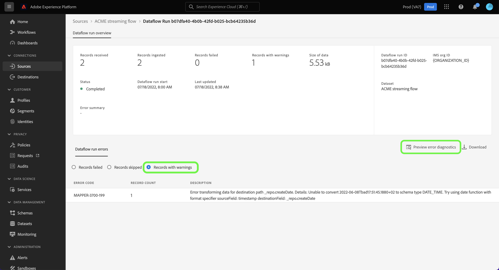

# Övervaka dataflöden för strömningskällor i användargränssnittet

I den här självstudiekursen beskrivs stegen för att övervaka dataflöden för direktuppspelningskällor med [!UICONTROL Sources] arbetsyta.

## Komma igång

Den här självstudiekursen kräver en fungerande förståelse av följande komponenter i Adobe Experience Platform:

* [Dataflöden](../../../dataflows/home.md): Dataflöden är en representation av datajobb som flyttar data mellan plattformar. Dataflöden konfigureras över olika tjänster, vilket hjälper dig att flytta data från källanslutningar till måldatauppsättningar till [!DNL Identity] och [!DNL Profile]och till [!DNL Destinations].
   * [Dataflödeskörningar](../../notifications.md): Dataflödeskörningar är återkommande schemalagda jobb som baseras på frekvenskonfigurationen för valda dataflöden.
* [Källor](../../home.md): Experience Platform tillåter att data kan hämtas från olika källor samtidigt som du kan strukturera, märka och förbättra inkommande data med hjälp av plattformstjänster.
* [Sandlådor](../../../sandboxes/home.md): Experience Platform tillhandahåller virtuella sandlådor som partitionerar en enda plattformsinstans i separata virtuella miljöer för att utveckla och utveckla program för digitala upplevelser.

## Övervaka dataflöden för strömningskällor

Välj **[!UICONTROL Sources]** från det vänstra navigeringsfältet för att komma åt [!UICONTROL Sources] arbetsyta. The [!UICONTROL Catalog] I visas en mängd olika källor som du kan skapa ett konto med.

Om du vill visa befintliga dataflöden för direktuppspelningskällor väljer du **[!UICONTROL Dataflows]** i det övre sidhuvudet.

The [!UICONTROL Dataflows] sidan innehåller en lista med alla befintliga dataflöden i organisationen, inklusive information om deras källdata, kontonamn och dataflödeskörningsstatus.

Välj namnet på det dataflöde som du vill visa.

Följande tabell innehåller mer information om status för dataflödeskörning:

| Status | Beskrivning |
| ------ | ----------- |
| Slutförd | The `Completed` status anger att alla poster för motsvarande dataflödeskörning har bearbetats inom en timma. A `Completed` status kan fortfarande innehålla fel i dataflödeskörningar. |
| Lyckades | The `Success` status anger att alla poster för motsvarande dataflödeskörning har bearbetats inom en timme och att inga fel uppstod under dataflödeskörningen. |
| Bearbetar | The `Processing` status anger att ett dataflöde ännu inte är aktivt. Denna status inträffar ofta omedelbart efter att ett nytt dataflöde har skapats. |
| Fel | The `Error` status anger att aktiveringsprocessen för ett dataflöde har avbrutits. |
| Inga körningar | The `No runs` status anger att dataflödet skapades men att inga dataflödeskörningar startades. |

The [!UICONTROL Dataflow Activity] sidan visar specifik information om ditt strömmande dataflöde. Den översta banderollen innehåller det kumulativa antalet poster som importerats och poster som misslyckats för alla strömmande dataflöden i det valda datumintervallet.

Som standard innehåller de data som visas mängder av konsumtion från de senaste sju dagarna. Välj **[!UICONTROL Last 7 days]** för att justera tidsramen för de poster som visas.

Ett kalender-popup-fönster visas med alternativ för alternativa tidsramar för inmatning. Du kan konfigurera bildrutan för körtid för dataflöde så att flödet från de föregående sju dagarna eller de senaste 30 dagarna visas. Du kan också konfigurera den interaktiva kalendern så att den anger en anpassad tidsram. När du är klar väljer du **[!UICONTROL Apply]**.

Den nedre halvan av sidan visar information om antalet poster som tagits emot, importerats och misslyckats, per flödeskörning. Varje flödeskörning registreras i ett timfönster.

### Mätvärden för dataflödeskörning {#dataflow-run-metrics}

>[!CONTEXTUALHELP]
>id="platform_sources_dataflow_records_received"
>title="Mottagna poster"
>abstract="Måttet Mottagna poster anger det totala antalet poster som tagits emot i dataflödet."
>text="Learn more in documentation"

>[!CONTEXTUALHELP]
>id="platform_sources_dataflow_records_ingested"
>title="Insamlade poster"
>abstract="Posterna i fältet Ingrederat anger det totala antalet poster som har importerats till datasjön."
>text="Learn more in documentation"

>[!CONTEXTUALHELP]
>id="platform_sources_dataflow_records_failed"
>title="Misslyckade poster"
>abstract="Måttet Poster misslyckades anger det totala antalet poster som inte har importerats till datasjön på grund av fel i data."
>text="Learn more in documentation"

>[!CONTEXTUALHELP]
>id="platform_sources_dataflow_records_warnings"
>title="Poster med varningar"
>abstract="Poster med varningar anger det totala antalet poster som har importerats med mappningsomformningsvarningar. Alla mappartransformeringsfel rapporteras som varningar och rader som delvis har importerats anses vara lyckade med en varning"
>text="Learn more in documentation"

Varje enskild dataflödeskörning visar följande information:

* **[!UICONTROL Dataflow run start]**: Den tid som dataflödet körs vid.
* **[!UICONTROL Processing time]**: Den tid det tog för dataflödet att bearbeta.
* **[!UICONTROL Records Received]**: Det totala antalet poster som tagits emot i dataflödet från en källkoppling.
* **[!UICONTROL Records Ingested]**: Det totala antalet poster som har importerats till [!DNL Data Lake].
* **[!UICONTROL Records with Warnings]**: Det totala antalet poster med varningar som har importerats. Alla mappartransformeringsfel rapporteras som varningar och rader som är delvis inkapslade markeras som `success` med en varning. **Anteckning**: Stöd för inmatning av poster med varningar är endast tillgängligt för strömningskällor.
* **[!UICONTROL Records Failed]**: Antalet poster som inte har importerats till [!DNL Data Lake] på grund av fel i data.
* **[!UICONTROL Ingestion Rate]**: Antal poster som har importerats till [!DNL Data Lake]. Detta mått gäller när [!UICONTROL Partial Ingestion] är aktiverat.
* **[!UICONTROL Status]**: Representerar läget för dataflödet: antingen [!UICONTROL Completed] eller [!UICONTROL Processing]. [!UICONTROL Completed] innebär att alla poster för motsvarande dataflödeskörning har bearbetats inom en timma. [!UICONTROL Processing] betyder att dataflödeskörningen inte har slutförts ännu.

The [!UICONTROL Dataflow run overview] sidan innehåller ytterligare information om dataflödet, t.ex. motsvarande körnings-ID för dataflöde, måldatauppsättning och organisations-ID.

Ett flöde som körs med fel innehåller även [!UICONTROL Dataflow run errors] som visar det specifika fel som ledde till att körningen misslyckades samt det totala antalet poster som misslyckades.

### Visa poster med varningar {#warnings}

[!UICONTROL Records with warnings] visar en lista med mapparomvandlingsvarningar som inträffade under flödeskörningen. Rader som är delvis inkapslade betraktas som lyckade och läggs till med varningar om det finns några mappningsomformningsfel.

Som standard betraktas alla mappningsomformningsfel som varningar, förutom om de är något av följande:

* Syntaxfel
* Referenser till attribut som inte finns
* Felmatchning av XDM-datatyper

Om du vill visa feldiagnostik väljer du **[!UICONTROL Preview error diagnostics]**.

The [!UICONTROL Error diagnostics preview] I kan du förhandsgranska upp till 100 fel och/eller varningar för ditt dataflöde. Härifrån kan du även hämta manifestet för misslyckade inmatningar om du vill ha mer information, med hjälp av [!DNL Data Access] API.

## Nästa steg

Genom att följa den här självstudiekursen har du använt [!UICONTROL Sources] på arbetsytan för att övervaka strömmande dataflöden och identifiera de fel som ledde till eventuella felaktiga dataflöden. Mer information finns i följande dokument:

* [Översikt över källor](../../home.md)
* [Översikt över dataflöden](../../../dataflows/home.md)
