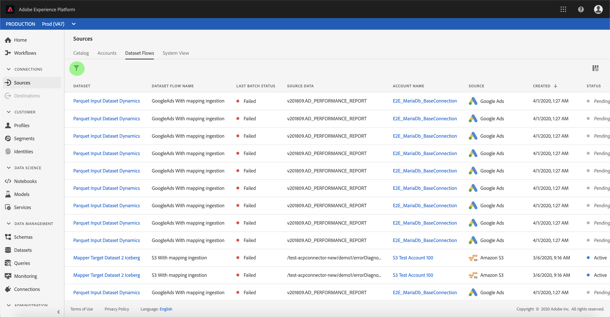

# Övervaka konton och datauppsättningsflöden

Källkopplingar i Adobe Experience Platform ger möjlighet att importera externt källdata på schemalagd basis. I den här självstudiekursen beskrivs hur du visar befintliga konton och datauppsättningsflöden från *[!UICONTROL Sources]* arbetsytan.

## Komma igång

Den här självstudiekursen kräver en fungerande förståelse av följande komponenter i Adobe Experience Platform:

- [Experience Data Model (XDM) System](../../../xdm/home.md): Det standardiserade ramverket som [!DNL Experience Platform] organiserar kundupplevelsedata.
   - [Grundläggande om schemakomposition](../../../xdm/schema/composition.md): Lär dig mer om de grundläggande byggstenarna i XDM-scheman, inklusive viktiga principer och bästa praxis när det gäller schemakomposition.
   - [Schemaredigeraren, genomgång](../../../xdm/tutorials/create-schema-ui.md): Lär dig hur du skapar anpassade scheman med hjälp av gränssnittet för Schemaredigeraren.
- [Kundprofil](../../../profile/home.md)i realtid: Ger en enhetlig konsumentprofil i realtid baserad på aggregerade data från flera källor.

## Övervaka konton

Logga in på <a href="https://platform.adobe.com" target="_blank">Adobe Experience Platform</a> och välj sedan **[!UICONTROL Sources]** i det vänstra navigeringsfältet för att komma åt *[!UICONTROL Sources]* arbetsytan. På *[!UICONTROL Catalog]* skärmen visas en mängd olika källor som du kan skapa datauppsättningsflöden för konton med. Varje källa visar antalet befintliga konton och datauppsättningsflöden som är kopplade till dem.

Välj *[!UICONTROL Accounts]* i den övre rubriken om du vill visa befintliga konton.

Sidorna *[!UICONTROL Accounts]* visas. På den här sidan finns en lista med visningsbara konton, inklusive information om källa, användarnamn, antal datauppsättningsflöden och datum när de skapades.

Välj ikonen längst upp till vänster för att starta sorteringsfönstret.

På sorteringspanelen kan du komma åt konton från en viss källa. Välj den källa du vill arbeta med och välj kontot i listan till höger.

På *[!UICONTROL Accounts]* sidan kan du visa en lista över befintliga datauppsättningsflöden som är kopplade till kontot du har öppnat. Välj det datauppsättningsflöde som du vill visa.

Skärmen visas *[!UICONTROL Dataset flow activity]* . På den här sidan visas hur många meddelanden som används i form av ett diagram.

## Övervaka datauppsättningsflöden

Datauppsättningsflöden kan nås direkt från *[!UICONTROL Catalog]* sidan utan att visas *[!UICONTROL Accounts]*. Välj *[!UICONTROL Dataset flows]* i den översta rubriken om du vill visa en lista över befintliga datauppsättningsflöden.

På liknande sätt som konton kan du sortera listan med datauppsättningsflöden med hjälp av sorteringsikonen högst upp till vänster. Välj den källa som du vill visa och välj datauppsättningsflödet i listan till höger.

Skärmen visas *[!UICONTROL Dataset flow activity]* . På den här sidan visas hur många meddelanden som används i form av ett diagram.

Mer information om övervakning av datauppsättningar och förtäring finns i självstudiekursen om [övervakning av dataflöden](../../../ingestion/quality/monitor-data-flows.md)för direktuppspelning.

## Nästa steg

Genom att följa den här självstudiekursen har du fått åtkomst till befintliga konton och datauppsättningsflöden från *[!UICONTROL Sources]* arbetsytan. Inkommande data kan nu användas av [!DNL Platform] tjänster längre fram i kedjan som [!DNL Real-time Customer Profile] och [!DNL Data Science Workspace]. Mer information finns i följande dokument:

- [Översikt över kundprofiler i realtid](../../../profile/home.md)
- [Översikt över arbetsytan Datavetenskap](../../../data-science-workspace/home.md)