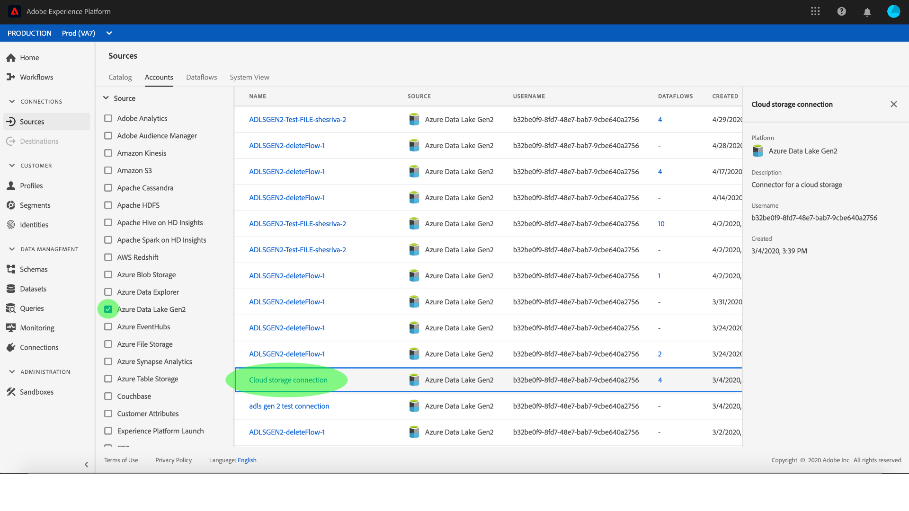
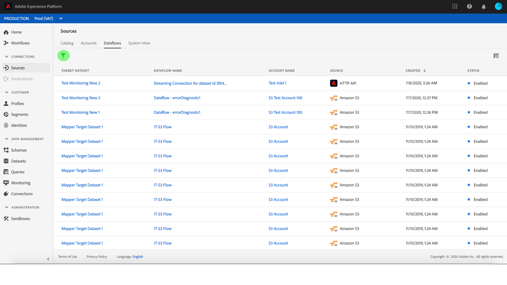
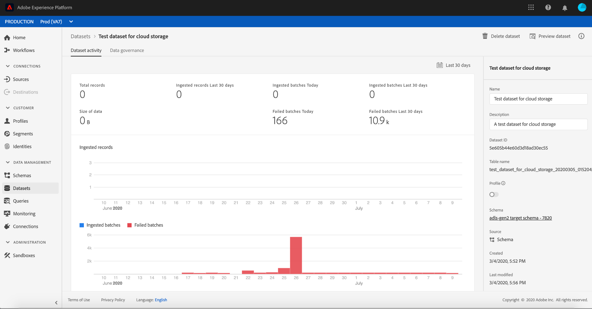

# Övervaka konton och dataflöden i användargränssnittet

Källkopplingar i Adobe Experience Platform gör det möjligt att importera externt källkodsdata på schemalagd basis. I den här självstudiekursen beskrivs hur du visar befintliga konton och dataflöden från *[!UICONTROL Sources]* arbetsytan.

## Komma igång

Den här självstudiekursen kräver en fungerande förståelse av följande komponenter i Adobe Experience Platform:

- [Experience Data Model (XDM) System](../../../xdm/home.md): Det standardiserade ramverket som [!DNL Experience Platform] organiserar kundupplevelsedata.
   - [Grundläggande om schemakomposition](../../../xdm/schema/composition.md): Lär dig mer om de grundläggande byggstenarna i XDM-scheman, inklusive viktiga principer och bästa praxis när det gäller schemakomposition.
   - [Schemaredigeraren, genomgång](../../../xdm/tutorials/create-schema-ui.md): Lär dig hur du skapar anpassade scheman med hjälp av gränssnittet för Schemaredigeraren.
- [Kundprofil](../../../profile/home.md)i realtid: Ger en enhetlig konsumentprofil i realtid baserad på aggregerade data från flera källor.

## Övervaka konton

Logga in på [Adobe Experience Platform](https://platform.adobe.com) och välj sedan **[!UICONTROL Sources]** i det vänstra navigeringsfältet för att komma åt *[!UICONTROL Sources]* arbetsytan. På *[!UICONTROL Catalog]* skärmen visas en mängd olika källor som du kan skapa konton och dataflöden med. Varje källa visar antalet befintliga konton och dataflöden som är kopplade till dem.

Välj *[!UICONTROL Accounts]* i den övre rubriken om du vill visa befintliga konton.

Sidorna *[!UICONTROL Accounts]* visas. På den här sidan finns en lista med visningsbara konton, inklusive information om källa, användarnamn, antal dataflöden och datum när de skapades.

Välj trattikonen längst upp till vänster för att starta sorteringsfönstret.

På sorteringspanelen kan du komma åt konton från en viss källa. Välj den källa du vill arbeta med och välj kontot i listan till höger.

På *[!UICONTROL Accounts]* sidan kan du visa en lista över befintliga dataflöden eller måldatauppsättningar som är kopplade till kontot du har öppnat.

## Övervaka dataflöden

Dataflöden kan nås direkt från *[!UICONTROL Catalog]* sidan utan att visas *[!UICONTROL Accounts]*. Välj *[!UICONTROL Dataflows]* i den övre rubriken om du vill visa en lista över befintliga dataflöden.

En lista över befintliga dataflöden visas. På den här sidan finns en lista med visningsbara dataflöden, inklusive information om källa, användarnamn, antal dataflöden och status. Välj trattsymbolen längst upp till vänster för att sortera.

Sorteringspanelen visas. Välj den källa som du vill komma åt på rullningsmenyn och välj dataflödet i listan till höger.

Sidan innehåller information om hur många poster som har importerats och vilka poster som har misslyckats samt information om dataflödets status och bearbetningstid. *[!UICONTROL Dataflow activity]* Välj kalenderikonen ovanför dataflödet för att justera tidsramen för dina inmatningsposter.

I kalendern kan du visa olika tidsramar för inkapslade poster. Du kan välja ett av de två förinställda alternativen *[!UICONTROL Last 7 days]* eller *[!UICONTROL Last 30 days]*. Du kan också ange en anpassad tidsram i kalendern. Välj önskad tidsram och välj **[!UICONTROL Apply]** för att fortsätta.

Som standard *[!UICONTROL Dataflow activity]* visas den *[!UICONTROL Properties]* panel som är associerad med dataflödet. Välj flödeskörningen i listan för att se tillhörande metadata, inklusive information om dess unika körnings-ID.

Välj **[!UICONTROL Dataflow run start]** för att komma åt *[!UICONTROL Dataflow run overview]*.

Informationen *[!UICONTROL Dataflow run overview]* visas om dataflödet, inklusive dess metadata, *[!UICONTROL Partial ingestion]* status och tilldelade *[!UICONTROL Error threshold]*. Den övre rubriken innehåller också en *[!UICONTROL Error summary]*. Den *[!UICONTROL Error summary]* innehåller det specifika felet på den översta nivån som visar i vilket steg som inmatningsprocessen påträffade ett fel.

I följande tabell finns felkoder som du kan se i *[!UICONTROL Error summary]*.

| Felkod | Felmeddelande |
| ---------- | ----------- |
| `CONNECTOR-1001-500` | &quot;Ett problem uppstod med kopieringsaktiviteten.&quot; |
| `CONNECTOR-2001-500` | &quot;Det gick inte att kopiera från Experience Platform-källan till datauppsättningen.&quot; |
| `CONNECTOR-3001-500` | &quot;Ett problem uppstod med flödesprovidern när en grupp skapades med API för massimport.&quot; |

Den nedre halvan av skärmen innehåller information om *[!UICONTROL Dataflow run errors]*. Härifrån kan du även visa de filer som har importerats, förhandsgranska och ladda ned feldiagnostik eller ladda ned filmanifestet.

I *[!UICONTROL Dataflow run errors]* avsnittet visas *[!UICONTROL Error code]* antalet misslyckade poster och information som beskriver felet.

Välj det här alternativet **[!UICONTROL Preview error diagnostics]** om du vill ha mer information om felet.

Panelen *[!UICONTROL Error diagnostics preview]* visas. På den här skärmen visas specifik information om felet vid importen, inklusive *[!UICONTROL File name]* namnet *[!UICONTROL Error code]*, namnet på den kolumn där felet inträffade samt en beskrivning av felet.

I det här avsnittet finns även en förhandsgranskning av kolumnen som innehåller felet.

>[!IMPORTANT]
>
>För att kunna aktivera måste *[!UICONTROL Error diagnostics preview]* du aktivera *[!UICONTROL Partial ingestion]* och *[!UICONTROL Error diagnostics]* när du konfigurerar ett dataflöde. Om du gör det kan systemet skanna alla poster som hämtas under flödeskörningen.

När du har förhandsgranskat felen kan du välja **[!UICONTROL Download]** från *[UICONTROL-dataflödet med översiktspanelen]* för att få tillgång till fullständig feldiagnostik och hämta filmanifestet. Mer information finns i dokumenten om [feldiagnostik](../../../ingestion/batch-ingestion/partial.md#retrieve-errors) och [hämtning av metadata](../../../ingestion/batch-ingestion/partial.md#download-metadata) .

Mer information om övervakning av dataflöden och förtäring finns i självstudiekursen om [övervakning av dataflöden](../../../ingestion/quality/monitor-data-flows.md)för direktuppspelning.

## Nästa steg

Genom att följa den här självstudiekursen har du fått åtkomst till befintliga konton och dataflöden från *[!UICONTROL Sources]* arbetsytan. Inkommande data kan nu användas av [!DNL Platform] tjänster längre fram i kedjan som [!DNL Real-time Customer Profile] och [!DNL Data Science Workspace]. Mer information finns i följande dokument:

- [Översikt över kundprofiler i realtid](../../../profile/home.md)
- [Översikt över arbetsytan Datavetenskap](../../../data-science-workspace/home.md)
