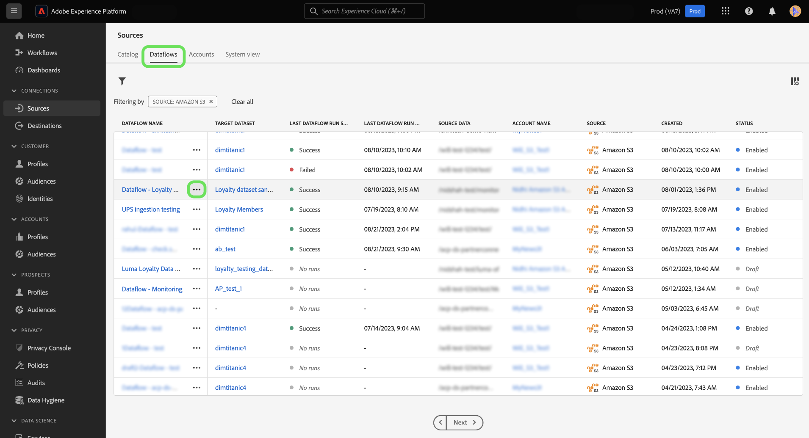

# On-demand-inmatning för källdataflöden i användargränssnittet

Du kan använda on-demand-inmatning för att utlösa en flödeskörning av ett befintligt dataflöde med hjälp av källarbetsytan i Adobe Experience Platform användargränssnitt.

I det här dokumentet får du information om hur du skapar dataflöden på begäran för källor samt hur du försöker återanvända flödeskörningar som har bearbetats eller misslyckats.

>[!BEGINSHADEBOX]

**Vad är ett flöde?**

Flödeskörningar är en instans av körning av dataflöde. Om ett dataflöde till exempel är schemalagt att köras varje timme kl. 9.00, 10.00 och 11.00 har du tre instanser av en flödeskörning. Flödeskörningar är specifika för just din organisation.

>[!ENDSHADEBOX]

## Komma igång

Dokumentet kräver en fungerande förståelse av följande komponenter i Experience Platform:

* [Källor](../../home.md): Experience Platform tillåter att data kan hämtas från olika källor samtidigt som du kan strukturera, märka och förbättra inkommande data med hjälp av plattformstjänster.
* [Dataflöden](../../../dataflows/home.md): Ett dataflöde är en representation av datajobb som flyttar data över plattformen. Dataflöden är konfigurerade för olika tjänster, vilket hjälper dig att flytta data från källkopplingar till måldatauppsättningar, till identitetstjänsten och kundprofilen i realtid samt till destinationer.
* [Sandlådor](../../../sandboxes/home.md): Experience Platform tillhandahåller virtuella sandlådor som partitionerar en enda plattformsinstans i separata virtuella miljöer för att utveckla och utveckla program för digitala upplevelser.

## Skapa ett dataflöde on demand {#create-a-dataflow-on-demand}

Navigera till *[!UICONTROL Dataflows]* -fliken i källarbetsytan. Här hittar du det dataflöde som du vill köra on demand och väljer ellipserna (**`...`**) bredvid ditt dataflödesnamn.

Nästa, välj **[!UICONTROL Run on-demand]** i listrutan som visas.

Konfigurera schemat för on demand-intaget. Välj **[!UICONTROL Ingestion start time]**, **[!UICONTROL Date range start time]** och **[!UICONTROL Date range end time]**.

| Schemaläggningskonfiguration | Beskrivning |
| --- | --- |
| [!UICONTROL Ingestion start time] | Den schemalagda starttiden i UTC för när dataflödet på begäran startar. |
| [!UICONTROL Date range start time] | Startdatum och starttid från vilket data hämtas. |
| [!UICONTROL Date range end time] | Slutdatum och sluttid från vilket data hämtas fram till. |

Välj **[!UICONTROL Schedule]** och ge ett par minuter så att dataflödet kan utlösas när det behövs.

Välj dataflödets namn för att visa dataflödesaktiviteten. Här visas en lista över dataflödeskörningar som har bearbetats. Välj ett dataflöde och välj sedan **[!UICONTROL Retry]** från den högra listen för att försöka lägga på igen för ett valt dataflöde som körs.

Välj **[!UICONTROL Scheduled]** för att se en lista över dataflödeskörningar som är schemalagda för framtida intag.

## Nästa steg

Genom att läsa det här dokumentet har du lärt dig hur du skapar flöden på begäran för befintliga källfilsdataflöden. Mer information om källor finns i [källöversikt](../../home.md)