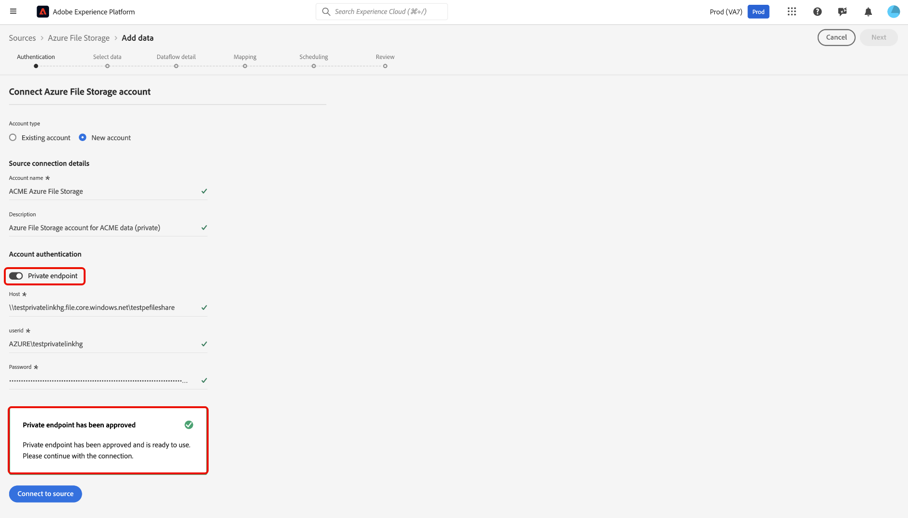
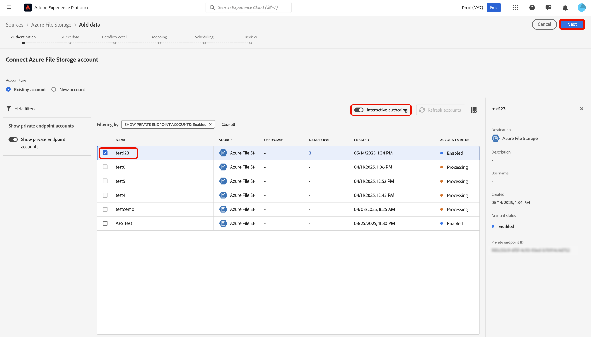

# Använd [!DNL Azure Private Link] för källor i användargränssnittet

>[!AVAILABILITY]
>
>Den här funktionen är i betaversion och stöds för närvarande bara för följande källor:
>
>* [[!DNL Azure Blob Storage]](../../connectors/cloud-storage/blob.md)
>* [[!DNL ADLS Gen2]](../../connectors/cloud-storage/adls-gen2.md)
>* [[!DNL Azure File Storage]](../../connectors/cloud-storage/azure-file-storage.md)
>* [[!DNL Snowflake]](../../connectors/databases/snowflake.md)

Du kan använda funktionen [!DNL Azure Private Link] för att skapa privata slutpunkter som dina Adobe Experience Platform-källor kan ansluta till. Anslut dina källor säkert till ett virtuellt nätverk med privata IP-adresser, vilket eliminerar behovet av offentliga IP-adresser och minskar din attackyta.Förenkla nätverksinstallationen genom att ta bort behovet av komplexa konfigurationer för brandvägg eller översättning av nätverksadresser, samtidigt som datatrafiken endast når godkända tjänster.

Läs den här vägledningen när du vill veta hur du kan använda arbetsytan för källor i Experience Platform-användargränssnittet för att skapa och använda en privat slutpunkt.

## Skapa en privat slutpunkt

Om du vill komma igång med [!DNL Azure Private Link] går du till katalogen *[!UICONTROL Sources]* i Experience Platform-gränssnittet och väljer **[!UICONTROL Private endpoints]** på flikmenyn på arbetsytan för källor.

Använd gränssnittet för att visa information om befintliga privata slutpunkter, som deras ID, associerade källa och aktuella status. Om du vill skapa en ny privat slutpunkt väljer du **[!UICONTROL Create private endpoint]**.

Välj sedan den önskade källan och ange värden för följande egenskaper:

| Egenskap | Beskrivning |
| --- | --- |
| `name` | Namnet på din privata slutpunkt. |
| `subscriptionId` | Det ID som är kopplat till din [!DNL Azure]-prenumeration. Mer information finns i guiden [!DNL Azure] om hur du [hämtar dina prenumerations- och klient-ID:n från  [!DNL Azure Portal]](https://learn.microsoft.com/en-us/azure/azure-portal/get-subscription-tenant-id). |
| `resourceGroupName` | Namnet på resursgruppen på [!DNL Azure]. En resursgrupp innehåller relaterade resurser för en [!DNL Azure]-lösning. Mer information finns i guiden [!DNL Azure] om [hantering av resursgrupper](https://learn.microsoft.com/en-us/azure/azure-resource-manager/management/manage-resource-groups-portal). |
| `resourceGroup` | Namnet på resursen. I [!DNL Azure] refererar en resurs till instanser som virtuella datorer, webbprogram och databaser. Mer information finns i guiden [!DNL Azure] om [att förstå  [!DNL Azure] resurshanteraren](https://learn.microsoft.com/en-us/azure/azure-resource-manager/management/overview). |
| `fqdns` | De kvalificerade domännamnen för källan. **OBS**: Den här egenskapen krävs bara när källan [!DNL Snowflake] används. |

{style="table-layout:auto"}

När du är klar väljer du **[!UICONTROL Submit]**.

### Godkänn en privat slutpunkt

En nyskapad slutpunkt är fortfarande i ett väntande läge tills den har godkänts av en administratör.

Logga in på [!DNL Azure Blob] om du vill godkänna en privat slutpunktsbegäran för källorna [!DNL Azure Data Lake Gen2] och [!DNL Azure Portal]. Välj **[!DNL Data storage]** i den vänstra navigeringen, gå till fliken **[!DNL Security + networking]** och välj **[!DNL Networking]**. Välj sedan **[!DNL Private endpoints]** för att visa en lista över privata slutpunkter som är associerade med ditt konto och deras aktuella anslutningstillstånd. Om du vill godkänna en väntande begäran markerar du önskad slutpunkt och klickar på **[!DNL Approve]**.

## Skapa ett konto med en privat slutpunkt

Navigera till källkatalogen och välj en källa som stöder privata slutpunkter. Skapa sedan ett nytt konto med källan och välj alternativet **[!UICONTROL Private endpoint]** under kontoautentiseringen. Ange autentiseringsuppgifterna för källan och välj sedan **[!UICONTROL Connect to source]** Tillåt några minuter för att upprätta anslutningen.

>[!NOTE]
>
>Om alternativet [!UICONTROL Private endpoint] är aktiverat kontrollerar Experience Platform om det finns en godkänd privat slutpunkt för den valda källan. Om ingen godkänd slutpunkt hittas kan du inte upprätta någon anslutning.

Navigera sedan till [!UICONTROL Existing account]-gränssnittet för källan. Använd det här gränssnittet för att visa en lista över dina befintliga konton och deras motsvarande status. Du kan välja filterikonen  om du bara vill visa konton som har aktiverats för att ansluta till en privat slutpunkt.

Markera det konto som du vill använda och aktivera sedan **[!UICONTROL Interactive Authoring]**. Den här växlingen aktiverar [!UICONTROL Interactive Authoring], en [!DNL Azure]-funktion som gör att du kan testa anslutningar, bläddra i mapplistor och förhandsgranska data. Du måste aktivera [!UICONTROL Interactive Authoring] för privata slutpunktsanslutningar. Observera att du inte kan stänga av den här växeln manuellt. Den inaktiveras automatiskt efter 60 minuter.

[!UICONTROL Interactive Authoring] tar några minuter att aktivera. När inställningen är aktiverad väljer du **[!UICONTROL Next]** för att fortsätta till nästa steg och markera de data som du vill importera.

## Nästa steg

Nu när du har skapat en privat slutpunkt kan du skapa källanslutningar och dataflöden samt importera data med privata slutpunkter. Läs följande handböcker om hur du skapar dataflöden i användargränssnittet:

* [Skapa ett dataflöde för en molnlagringskälla](../ui/dataflow/batch/cloud-storage.md)
* [Skapa ett dataflöde för en datakälla](../ui/dataflow/databases.md)
