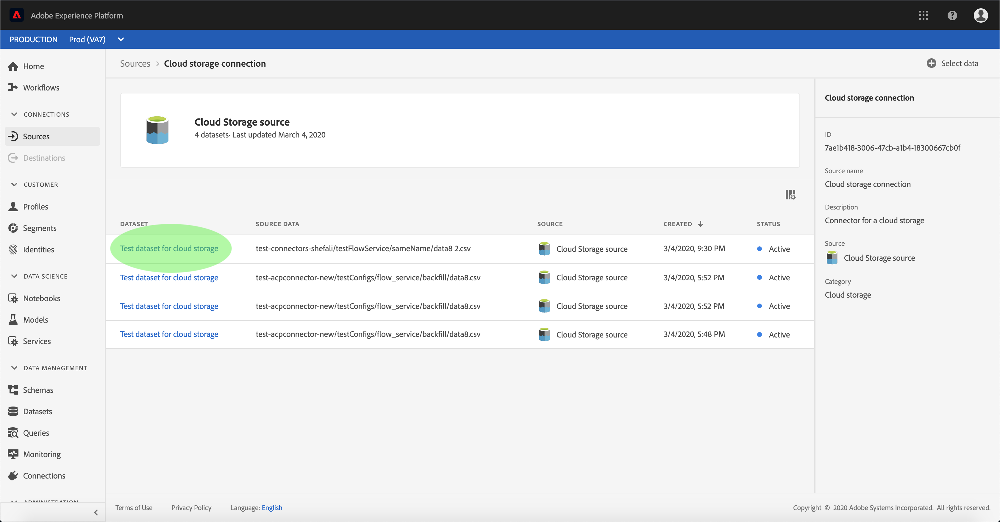

# Aktivera inkommande källdata för att fylla i kundprofiler

Inkommande data från källkopplingen kan användas för att berika och fylla i dina [!DNL Real-time Customer Profile] data.

## Komma igång

Den här självstudiekursen kräver en fungerande förståelse av följande komponenter i Adobe Experience Platform:

- [[!DNL Experience Data Model] (XDM) System](../../../xdm/home.md): Det standardiserade ramverket som [!DNL Experience Platform] organiserar kundupplevelsedata.
   - [Grundläggande om schemakomposition](../../../xdm/schema/composition.md): Lär dig mer om de grundläggande byggstenarna i XDM-scheman, inklusive viktiga principer och bästa praxis när det gäller schemakomposition.
   - [Schemaredigeraren, genomgång](../../../xdm/tutorials/create-schema-ui.md): Lär dig hur du skapar anpassade scheman med hjälp av gränssnittet för Schemaredigeraren.
- [[!DNL Real-time Customer Profile]](../../../profile/home.md): Ger en enhetlig konsumentprofil i realtid baserad på aggregerade data från flera källor.

Den här självstudien kräver dessutom att du redan har skapat och konfigurerat en källkoppling.  En lista med självstudiekurser för att skapa olika kopplingar i användargränssnittet finns i [källanslutningsöversikten](../../home.md).

## Fylla i dina [!DNL Real-time Customer Profile] data

Om du vill utöka kundprofiler måste måldatauppsättningens källschema vara kompatibelt för användning i [!DNL Real-time Customer Profile]. Ett kompatibelt schema uppfyller följande krav:

- Schemat har minst ett attribut angivet som en identitetsegenskap.
- Schemat har en identitetsegenskap definierad som primär identitet.
- Det finns en mappning i dataflödet där den primära identiteten är ett målattribut.

På arbetsytan Källor klickar du på **[!UICONTROL Browse]** fliken för att visa dina basanslutningar. I listan som visas söker du efter anslutningen som innehåller det dataflöde som du vill fylla i profiler med. Klicka på anslutningens namn för att komma åt information om anslutningen.

Anslutningens **[!UICONTROL Source activity]** skärm visas och visar de datauppsättningar som anslutningen hämtar källdata till. Klicka på namnet på datauppsättningen som du vill aktivera för [!DNL Profile].

Skärmen visas **[!UICONTROL Dataset activity]** . I **[!UICONTROL Properties]** kolumnen till höger på skärmen visas information om datauppsättningen och den innehåller en **[!UICONTROL Profile]** växel och en länk till det schema som datauppsättningen följer. Klicka på schemats namn för att visa dess komposition.

Då **[!UICONTROL Schema Editor]** visas schemats struktur på arbetsytan i mitten. Markera det fält som ska anges som primär identitet på arbetsytan. Markera kryssrutan under fliken **[!UICONTROL Field properties]** som visas och markera sedan **[!UICONTROL Identity]** kryssrutan **[!UICONTROL Primary identity]**. Välj sedan ett lämpligt alternativ **[!UICONTROL Identity namespace]** och klicka på **[!UICONTROL Apply]**.

Klicka på det översta nivåobjektet i schemats struktur så visas **[!UICONTROL Schema properties]** kolumnen. Aktivera schemat för [!DNL Profile] genom att växla **[!UICONTROL Profile]** . Klicka **[!UICONTROL Save]** för att slutföra ändringarna.

Nu när schemat är aktiverat för [!DNL Profile]går du tillbaka till **[!UICONTROL Dataset activity]** skärmen och aktiverar datauppsättningen [!DNL Profile] genom att klicka på **[!UICONTROL Profile]** växlingsknappen i **[!UICONTROL Properties]** kolumnen.

När både schemat och datauppsättningen är aktiverad för [!DNL Profile]fylls även kundprofiler i med data som hämtas in i den datauppsättningen.

>[!NOTE]
>
>Befintliga data i en nyligen aktiverad datauppsättning används inte av [!DNL Profile].

## Nästa steg

Genom att följa den här självstudiekursen har du aktiverat inkommande data för [!DNL Profile] populationen. Mer information finns i [[!DNL Real-time Customer Profile] översikten](../../../profile/home.md).