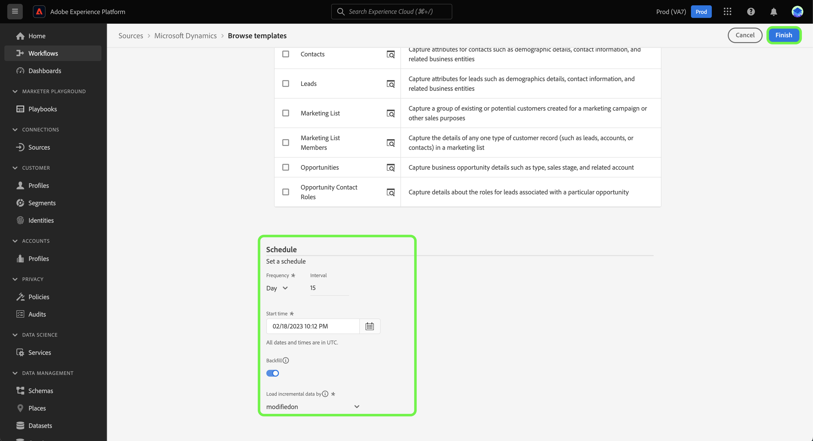

# Skapa ett källdataflöde med hjälp av mallar i användargränssnittet {#create-a-sources-dataflow-using-templates-in-the-ui}

>[!CONTEXTUALHELP]
>id="platform_sources_marketo_mapping"
>title="Mallar för källor i plattformens användargränssnitt"
>abstract="Mallar innehåller automatiskt genererade resurser som scheman, datauppsättningar, identiteter, mappningsregler, identitetsnamnutrymmen och dataflöden som du kan använda när du hämtar data från en källa till Experience Platform. Du kan uppdatera automatiskt genererade resurser för anpassning så att de passar dina användningsexempel."

>[!IMPORTANT]
>
>Mallarna är i betaversion och stöds av följande källor:
>
>* [[!DNL Marketo Engage]](../../connectors/adobe-applications/marketo/marketo.md)
>* [[!DNL Microsoft Dynamics]](../../connectors/crm/ms-dynamics.md)
>* [[!DNL Salesforce]](../../connectors/crm/salesforce.md)
>
>Dokumentationen och funktionerna kan komma att ändras.

Adobe Experience Platform tillhandahåller förkonfigurerade mallar som du kan använda för att snabba upp dataöverföringsprocessen. Mallar innehåller automatiskt genererade resurser som scheman, datauppsättningar, identiteter, mappningsregler, identitetsnamnutrymmen och dataflöden som du kan använda när du hämtar data från en källa till Experience Platform.

Med mallar kan man

* Minska tiden till värdet av intag genom att accelerera skapandet av komplexa resurser.
* Minimera antalet fel som kan uppstå under den manuella dataöverföringsprocessen.
* Uppdatera automatiskt genererade resurser när som helst för att passa dina användningsexempel.

I följande självstudie beskrivs hur du använder mallar i användargränssnittet för plattformen.

## Komma igång

Den här självstudiekursen kräver en fungerande förståelse av följande komponenter i Experience Platform:

* [Källor](../../home.md): Experience Platform tillåter att data kan hämtas från olika källor samtidigt som du kan strukturera, märka och förbättra inkommande data med hjälp av plattformstjänster.
* [[!DNL Experience Data Model (XDM)] System](../../../xdm/home.md): Det standardiserade ramverk som Experience Platform använder för att ordna kundupplevelsedata.
* [Sandlådor](../../../sandboxes/home.md): Experience Platform tillhandahåller virtuella sandlådor som partitionerar en enda plattformsinstans i separata virtuella miljöer för att utveckla och utveckla program för digitala upplevelser.

## Använda mallar i plattformens användargränssnitt {#use-templates-in-the-platform-ui}

>[!CONTEXTUALHELP]
>id="platform_sources_templates_accounttype"
>title="Välj affärstyp"
>abstract="Välj lämplig affärstyp för ditt användningsfall. Åtkomsten kan variera beroende på ditt Real-time Customer Data Platform-prenumerationskonto."
>additional-url="https://experienceleague.adobe.com/docs/experience-platform/rtcdp/overview.html?lang=sv" text="Real-Time CDP - översikt"

Välj **[!UICONTROL Sources]** från vänster navigering för att komma åt [!UICONTROL Sources] och se en katalog med källor i Experience Platform.

Använd *[!UICONTROL Categories]* meny för att filtrera källor efter kategori. Du kan också ange ett källnamn i sökfältet för att hitta en viss källa från katalogen.

Gå till [!UICONTROL Adobe applications] för att se [!DNL Marketo Engage] källkort och välj [!UICONTROL Add data] till att börja.

Ett popup-fönster visas där du kan bläddra bland mallar eller använda befintliga scheman och datauppsättningar.

* **Bläddra bland mallar**: Källmallar skapar automatiskt scheman, identiteter, datauppsättningar och dataflöden med mappningsregler åt dig. Du kan anpassa dessa resurser efter behov.
* **Använd mina befintliga resurser**: Infoga data med befintliga datauppsättningar och scheman som du har skapat. Du kan också skapa nya datauppsättningar och scheman vid behov.

Om du vill använda automatiskt genererade resurser väljer du **[!UICONTROL Browse templates]** och sedan markera **[!UICONTROL Select]**.

### Autentisering

Autentiseringssteget visas och du uppmanas att antingen skapa ett nytt konto eller använda ett befintligt konto.

>[!BEGINTABS]

>[!TAB Använd ett befintligt konto]

Om du vill använda ett befintligt konto väljer du [!UICONTROL Existing account] och välj sedan det konto som du vill använda i listan som visas.

>[!TAB Skapa ett nytt konto]

Om du vill skapa ett nytt konto väljer du **[!UICONTROL New account]** och ange sedan din källanslutningsinformation och autentiseringsuppgifter för kontot. När du är klar väljer du **[!UICONTROL Connect to source]** så att den nya anslutningen kan upprättas.

>[!ENDTABS]

### Välj mallar

Beroende på vilken affärstyp du har valt visas en lista med mallar. Välj förhandsvisningsikonen  bredvid ett mallnamn om du vill förhandsgranska exempeldata från mallen.

Förhandsgranskningsfönstret visas så att du kan utforska och inspektera exempeldata från mallen. När du är klar väljer du **[!UICONTROL Got it]**.

Välj sedan den mall du vill använda i listan. Du kan välja flera mallar och skapa flera dataflöden samtidigt. En mall kan dock bara användas en gång per konto. När du har valt mallar väljer du **[!UICONTROL Finish]** så att resurserna kan genereras en stund.

Om du väljer ett eller flera objekt i listan med tillgängliga mallar kommer alla B2B-scheman och identitetsnamnutrymmen fortfarande att genereras för att säkerställa att B2B-relationer mellan scheman konfigureras korrekt.

>[!NOTE]
>
>Mallar som redan har använts inaktiveras.

### Ange ett schema

The [!DNL Microsoft Dynamics] och [!DNL Salesforce] båda källorna har stöd för schemaläggning av dataflöden.

Använd schemaläggningsgränssnittet för att konfigurera ett matningsschema för dataflödena. Ställ in din matningsfrekvens på **En gång** för att skapa ett engångsintag.

Du kan också ange att din matningsfrekvens ska vara **Minut**, **Timme**, **Dag**, eller **Vecka**. Om du schemalägger dataflödet för flera frågor måste du ange ett intervall för att skapa en tidsram mellan varje intag. Till exempel en matningsfrekvens som är inställd på **Timme** och ett intervall anges till **15** innebär att ditt dataflöde är schemalagt att importera data var **15 timmar**.

Under det här steget kan du även aktivera **bakfyllning** och definiera en kolumn för stegvis inmatning av data. Backfill används för att importera historiska data, medan kolumnen som du definierar för inkrementellt intag gör att nya data kan skiljas från befintliga data.

När du är klar med att konfigurera ditt intag väljer du **[!UICONTROL Finish]**.

### Granska resurser {#review-assets}

>[!CONTEXTUALHELP]
>id="platform_sources_templates_review"
>title="Granska dina automatiskt genererade resurser"
>abstract="Det kan ta upp till fem minuter att generera alla resurser. Om du väljer att lämna sidan får du ett meddelande som returneras när resurserna är klara. Du kan granska resurserna när de har skapats och göra ytterligare konfigurationer av dataflödet när som helst."

The [!UICONTROL Review template assets] visas de resurser som genereras automatiskt som en del av mallen. På den här sidan kan du visa de automatiskt genererade scheman, datauppsättningar, identitetsnamnutrymmen och dataflöden som är kopplade till din källanslutning. Det kan ta upp till fem minuter att generera alla resurser. Om du väljer att lämna sidan får du ett meddelande som returneras när resurserna är klara. Du kan granska resurserna när de har skapats och göra ytterligare konfigurationer av dataflödet när som helst.

Som standard är automatiskt genererade dataflöden inställda på ett utkasttillstånd för att tillåta ytterligare anpassning av konfigurationer, som mappningsregler eller schemalagda frekvenser. Markera ellipserna (`...`) bredvid dataflödets namn och välj **[!UICONTROL Preview mappings]** om du vill visa de mappningsuppsättningar som har skapats för ditt utkast till dataflöde.

En förhandsgranskningssida visas där du kan kontrollera mappningsförhållandet mellan källdatafälten och målschemafälten. När du har tittat på dataflödets mappningar. Välj **[!UICONTROL Got it.]**

Du kan uppdatera dataflödena när som helst efter körningen. Markera ellipserna (`...`) bredvid dataflödets namn och välj **[!UICONTROL Update dataflow]**. Du dirigeras till arbetsflödessidan för källor där du kan uppdatera dina dataflödesdetaljer, inklusive inställningar för partiellt intag, feldiagnostik och varningsmeddelanden samt mappning av dataflöde.

Du kan använda schemaredigeringsvyn för att göra uppdateringar i det automatiskt genererade schemat. Besök guiden på [med schemaredigeraren](../../../xdm/tutorials/create-schema-ui.md) för mer information.

>[!TIP]
>
>Du kommer åt ditt utkast via [!UICONTROL Dataflows] katalogsida på arbetsytan för källor. Välj **[!UICONTROL Dataflows]** i den övre rubriken och välj sedan det dataflöde som du vill uppdatera i listan.
>
>

### Publicera dataflödet

Börja publiceringsprocessen genom att gå igenom källarbetsflödet. När du har valt [!UICONTROL Update dataflow]går du till *[!UICONTROL Add data]* steg i arbetsflödet. Välj **[!UICONTROL Next]** för att fortsätta.

Bekräfta sedan dataflödesinformationen och konfigurera inställningarna för feldiagnostik, partiell import och varningsmeddelanden. När du är klar väljer du **[!UICONTROL Next]**.

>[!NOTE]
>
>Du kan välja **[!UICONTROL Save as draft]** när som helst för att stoppa och spara de ändringar du har gjort i dataflödet.

Mappningssteget visas. Under det här steget kan du konfigurera om mappningskonfigurationerna för ditt dataflöde. En omfattande guide om förinställningsfunktionerna för data som används för mappning finns på [gränssnittsguide för dataförberedelser](../../../data-prep/ui/mapping.md).

Granska slutligen informationen om dataflödet och välj **[!UICONTROL Save & ingest]** för att publicera utkastet.

## Nästa steg

Genom att följa den här självstudiekursen har du nu skapat dataflöden och resurser som scheman, datauppsättningar och identitetsnamnutrymmen med hjälp av mallar. Allmän information om källor finns på [källöversikt](../../home.md).

## Varningar och meddelanden {#alerts-and-notifications}

Mallar stöds av Adobe Experience Platform Alerts och du kan använda meddelandepanelen för att få uppdateringar om statusen för dina resurser och även för att gå tillbaka till granskningssidan.

Välj meddelandeikonen i det övre huvudet i plattformsanvändargränssnittet och välj sedan statusaviseringen för att se vilka resurser du vill granska.

Du kan uppdatera aviseringsinställningarna för dina mallar så att du kan ta emot både e-post- och plattformsmeddelanden om status för dina dataflöden. Mer information om hur du konfigurerar varningar finns i guiden på [prenumerera på aviseringar för källdataflöden](../ui/alerts.md).