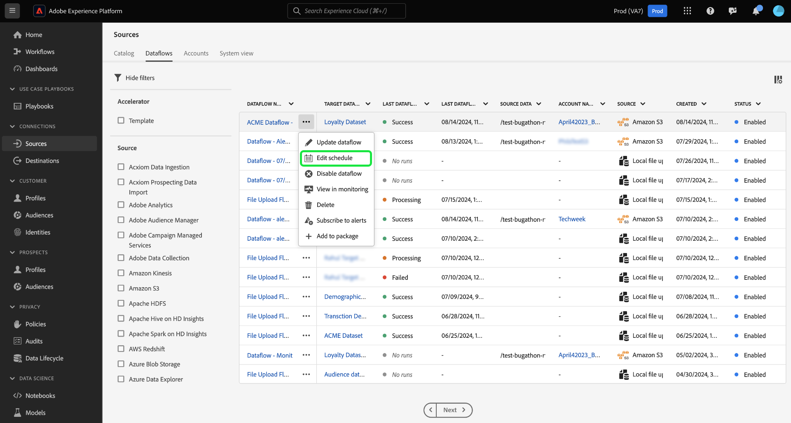

# Uppdatera dataflöden i användargränssnittet

I den här självstudiekursen beskrivs hur du uppdaterar ett befintligt dataflöde, inklusive dess schema och mappningskonfigurationer, med hjälp av källarbetsytan i Adobe Experience Platform användargränssnitt.

## Kom igång

Den här självstudiekursen kräver en fungerande förståelse av följande komponenter i Experience Platform:

* [Källor](../../home.md): Med Experience Platform kan data hämtas från olika källor samtidigt som du kan strukturera, etikettera och förbättra inkommande data med hjälp av Experience Platform tjänster.
* [Sandlådor](../../../sandboxes/home.md): Experience Platform tillhandahåller virtuella sandlådor som partitionerar en enda Experience Platform-instans till separata virtuella miljöer för att utveckla och utveckla program för digitala upplevelser.

## Uppdatera dataflöden {#update-dataflows}

>[!CONTEXTUALHELP]
>id="platform_sources_dataflows_daysRemaining"
>title="Utgångsdatum för datauppsättning"
>abstract="Den här kolumnen anger antalet dagar som måldatauppsättningen har kvar innan den automatiskt upphör att gälla. Ett dataflöde misslyckas om måldatauppsättningen har gått ut. För att förhindra att ett dataflöde misslyckas kontrollerar du att måldatauppsättningen är inställd på att förfalla på rätt datum. Mer information om hur du uppdaterar förfallodatum finns i dokumentationen."

I Experience Platform-gränssnittet väljer du **[!UICONTROL Sources]** i den vänstra navigeringen och sedan **[!UICONTROL Dataflows]** i den övre rubriken.

>[!TIP]
>
>Du kan sortera och filtrera dataflödena med hjälp av filterfunktioner. Mer information finns i guiden [Filtrera källobjekt i användargränssnittet](./filter.md).

På sidan [!UICONTROL Dataflows] visas en lista med alla befintliga dataflöden i organisationen. Leta reda på det dataflöde som du vill uppdatera och markera sedan ellipserna (`...`) bredvid det. En listruta visas med en lista över alternativ som du kan välja mellan för att göra ytterligare konfigurationer av ditt befintliga dataflöde.

Välj **[!UICONTROL Update dataflow]** om du vill uppdatera dataflödet.

Du dirigeras till arbetsflödet för källor där du kan fortsätta att uppdatera aspekter av dataflödet, inklusive information i steget [!UICONTROL Provide dataflow details].

### Uppdatera mappning {#update-mapping}

>[!NOTE]
>
>Redigeringsmappningsfunktionen stöds för närvarande inte för följande källor: Adobe Analytics, Adobe Audience Manager, HTTP API och [!DNL Marketo Engage].

Under den här processen kan du även uppdatera mappningsuppsättningarna som är kopplade till dataflödet.  Mappningsgränssnittet visar det befintliga mappningsflödet för ditt dataflöde och inte en ny rekommenderad mappningsuppsättning. Mappningsuppdateringar tillämpas bara på framtida schemalagda dataflöden. Ett dataflöde som har schemalagts för engångsinmatning kan inte ha sina mappningsuppsättningar uppdaterade.

Använd mappningsgränssnittet för att ändra mappningsuppsättningarna som används i dataflödet. Mer information om hur du använder mappningsgränssnittet finns i [användargränssnittshandboken för dataförinställningar](../../../data-prep/ui/mapping.md).

### Uppdatera schema

När du har uppdaterat mappningarna för dataflödet kan du sedan fortsätta att uppdatera ditt intag-schema för att importera dataflödet med dess nya mappningsdata. Du kan bara uppdatera matningsschemat för dataflöden som har konfigurerats att mata in enligt ett återkommande schema. Det går inte att schemalägga om ett dataflöde som har konfigurerats för engångsinmatning.

Du kan även uppdatera matningsschemat för ditt dataflöde med hjälp av det infogade uppdateringsalternativet på dataflödessidan.

På dataflödessidan markerar du ellipserna (`...`) bredvid dataflödets namn och väljer sedan **[!UICONTROL Edit schedule]** i listrutan som visas.

Dialogrutan **[!UICONTROL Edit schedule]** innehåller alternativ för att uppdatera dataflödets matningsfrekvens och intervallhastighet. När du har angett de uppdaterade värdena för frekvens och intervall väljer du **[!UICONTROL Save]**.

Läs följande avsnitt om du vill ha mer information om hur schema för intag varje vecka fungerar.

#### Om schema för veckointag {#weekly}

När du väljer att ställa in dataflödet så att det körs en gång i veckan, kommer dataflödet att köras baserat på något av följande scenarier:

* Om datakällan har skapats men inga data har importerats än kommer det första veckodataflödet att köras 7 dagar efter det att källan skapades. Detta sjudagarsintervall startar alltid från när källan skapades, oavsett när du ställer in schemat. Efter den första körningen fortsätter dataflödet att köras varje vecka enligt det konfigurerade schemat.
* Om data från källan har importerats tidigare och du schemalägger dem för veckointag igen, kommer nästa dataflöde att köras 7 dagar efter det senaste framgångsrika intaget.

### Inaktivera dataflöde

Du kan inaktivera dataflödet med samma listruta. Om du vill inaktivera dataflödet väljer du **[!UICONTROL Disable dataflow]**.

Välj sedan [!UICONTROL Disable] i popup-fönstret som visas.

Om och när du senare återaktiverar det här dataflödet schemaläggs återfyllningen automatiskt så att den täcker den period då dataflödet inaktiverades. Om dataflödet till exempel har konfigurerats för att köras varje timme och inaktiverats i 48 timmar, kommer Experience Platform att skapa 48 backfill-körningar för att bearbeta de missade intervallen när dataflödet återaktiveras.

## Nästa steg

Genom att följa den här självstudiekursen har du använt arbetsytan [!UICONTROL Sources] för att uppdatera inmatningsschemat och mappningsuppsättningarna för dataflödet.

Anvisningar om hur du utför dessa åtgärder programmatiskt med API:t [!DNL Flow Service] finns i självstudiekursen [Uppdatera dataflöden med API:t för Flow Service &#x200B;](../../tutorials/api/update-dataflows.md).
