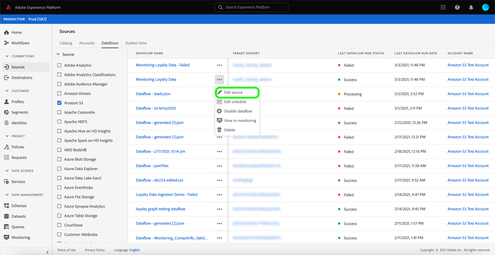

# Uppdatera dataflöden i användargränssnittet

I den här självstudiekursen får du lära dig hur du uppdaterar ett befintligt källkodsdataflöde, inklusive information om hur du redigerar ett dataflödesschema och mappning med arbetsytan [!UICONTROL Sources].

## Komma igång

Den här självstudiekursen kräver en fungerande förståelse av följande komponenter i Adobe Experience Platform:

- [Källor](../../home.md): Experience Platform tillåter att data kan hämtas från olika källor samtidigt som du kan strukturera, märka och förbättra inkommande data med hjälp av plattformstjänster.
- [Sandlådor](../../../sandboxes/home.md): Experience Platform tillhandahåller virtuella sandlådor som partitionerar en enda plattformsinstans i separata virtuella miljöer för att utveckla och utveckla program för digitala upplevelser.

## Redigera mappning

>[!NOTE]
>
>Redigeringsmappningsfunktionen stöds för närvarande inte för följande källor: Adobe Analytics, Adobe Audience Manager, HTTP API och [!DNL Marketo Engage].

Välj **[!UICONTROL Sources]** från vänster navigering i plattformsgränssnittet för att komma åt arbetsytan [!UICONTROL Sources]. Välj **[!UICONTROL Dataflows]** i den övre rubriken om du vill visa en lista över befintliga dataflöden.

Sidan [!UICONTROL Dataflows] innehåller en lista med alla befintliga dataflöden, inklusive information om körningsstatus, senaste körningsdatum och kontonamn.

Välj filterikonen  längst upp till vänster för att starta sorteringspanelen.

Sorteringspanelen innehåller en lista med alla tillgängliga källor. Du kan välja mer än en källa i listan för att få tillgång till ett filtrerat urval av dataflöden som tillhör olika källor.

Välj den källa som du vill arbeta med för att visa en lista över de befintliga dataflödena. När du har identifierat det dataflöde som du vill uppdatera markerar du ellipserna (`...`) bredvid kontonamnet.

En listruta visas med alternativ för att uppdatera det dataflöde du valde. Härifrån kan du välja att uppdatera ett dataflöds mappningsuppsättningar och schema för inmatning. Du kan också välja alternativ för att inspektera dataflödet på kontrollpanelen samt inaktivera eller ta bort dataflödet.

Välj **[!UICONTROL Edit source]** om du vill uppdatera mappningen.

[!UICONTROL Add data]-steget visas. Välj lämpligt dataformat för att granska innehållet i dina markerade data och välj sedan **[!UICONTROL Next]** för att fortsätta.

Sidan [!UICONTROL Mapping] innehåller ett gränssnitt där du kan lägga till och ta bort mappningsuppsättningar som är kopplade till datauppsättningen.

>[!TIP]
>
>Mappningsuppdateringar tillämpas bara på framtida schemalagda dataflöden.

Välj **[!UICONTROL Add new mapping]** om du vill lägga till en ny mappningsuppsättning.

Ange sedan rätt källfältsattribut och mål-XDM-fältvärden för att slutföra den ytterligare mappningsuppsättningen. Välj **[!UICONTROL Next]** för att fortsätta.

Steget [!UICONTROL Scheduling] visas så att du kan uppdatera dataflödets schema för inmatning och automatiskt importera valda källdata med uppdaterade mappningar.

>[!NOTE]
>
>Det går inte att uppdatera mappningsuppsättningar för dataflöden som schemalagts för engångsinmatning och som redan har startats.

På sidan [!UICONTROL Dataflow detail] kan du ange ett uppdaterat namn och en beskrivning för dataflödet samt konfigurera om feltröskeln för dataflödet.

När du har angett dina uppdaterade värden väljer du **[!UICONTROL Next]**.

Steget **[!UICONTROL Review]** visas så att du kan granska dataflödet innan det uppdateras.

När du har granskat dataflödet väljer du **[!UICONTROL Finish]** och anger en tid för dataflödet med de nya mappningsuppsättningarna som ska skapas.

## Redigera schema

Om du vill redigera inmatningsschemat för ett befintligt dataflöde markerar du ellipserna (`...`) bredvid ett dataflödesnamn och väljer sedan **[!UICONTROL Edit schedule]** i listrutan.

Dialogrutan **[!UICONTROL Edit schedule]** innehåller alternativ för att uppdatera dataflödets matningsfrekvens och intervallhastighet. När du har angett uppdaterade värden för frekvens och intervall väljer du **[!UICONTROL Save]**.

>[!NOTE]
>
>Det går inte att schemalägga om ett dataflöde som schemalagts för engångsintag.

| Schemaläggning | Beskrivning |
| ---------- | ----------- |
| Frekvens | Frekvensen med vilken dataflödet samlar in data. Giltiga värden för redigering av frekvensschema för ett befintligt dataflöde är: `minute`, `hour`, `day` eller `week`. |
| Intervall | Intervallet anger perioden mellan två på varandra följande flödeskörningar. Intervallets värde ska vara ett heltal som inte är noll och måste vara större än eller lika med `15`. |

Efter en stund visas en bekräftelseruta längst ned på skärmen som bekräftar att uppdateringen lyckades.

## Nästa steg

Genom att följa den här självstudiekursen har du använt arbetsytan [!UICONTROL Sources] för att uppdatera inmatningsschemat och mappningsuppsättningarna för dataflödet.

Anvisningar om hur du utför dessa åtgärder programmatiskt med API:t [!DNL Flow Service] finns i självstudiekursen om att [uppdatera dataflöden med API:t för Flow Service](../../tutorials/api/update-dataflows.md).
