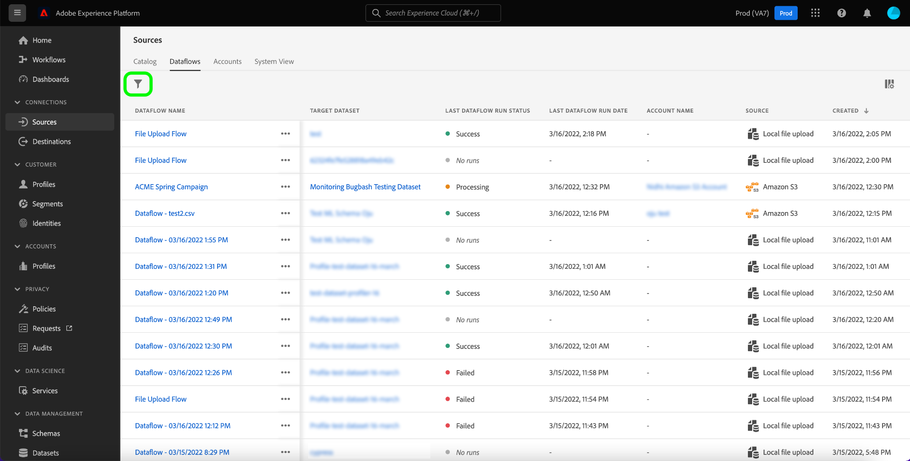
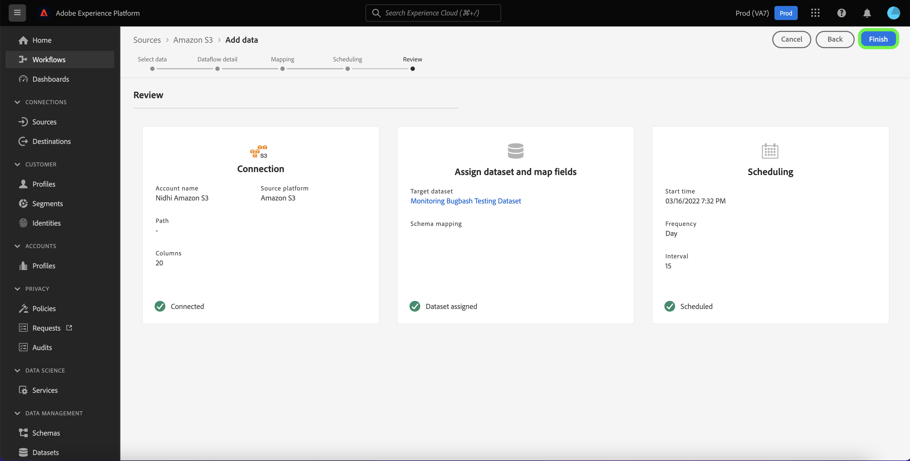

# Uppdatera dataflöden i användargränssnittet

I den här självstudien får du lära dig hur du uppdaterar ett befintligt dataflöde, inklusive dess schema och mappning, med hjälp av källarbetsytan.

## Komma igång

Den här självstudiekursen kräver en fungerande förståelse av följande komponenter i Adobe Experience Platform:

* [Källor](../../home.md): Experience Platform tillåter att data kan hämtas från olika källor samtidigt som du kan strukturera, märka och förbättra inkommande data med hjälp av plattformstjänster.
* [Sandlådor](../../../sandboxes/home.md): Experience Platform tillhandahåller virtuella sandlådor som partitionerar en enda plattformsinstans i separata virtuella miljöer för att utveckla och utveckla program för digitala upplevelser.

## Uppdatera dataflöden {#update-dataflows}

>[!CONTEXTUALHELP]
>id="platform_sources_dataflows_daysRemaining"
>title="Utgångsdatum för datauppsättning"
>abstract="Den här kolumnen anger antalet dagar som måldatauppsättningen har kvar innan den automatiskt upphör att gälla. Ett dataflöde misslyckas om måldatauppsättningen har upphört att gälla. För att förhindra att ett dataflöde misslyckas kontrollerar du att måldatauppsättningen är inställd på att förfalla på rätt datum. Mer information om hur du uppdaterar förfallodatum finns i dokumentationen."

Välj **[!UICONTROL Sources]** från vänster navigering för att komma åt [!UICONTROL Sources] arbetsyta. Välj **[!UICONTROL Dataflows]** i det övre sidhuvudet för att visa en lista över befintliga dataflöden.

The [!UICONTROL Dataflows] sidan innehåller en lista med alla befintliga dataflöden, inklusive information om deras motsvarande måldatauppsättning, källa och kontonamn.

Om du vill sortera igenom listan väljer du filterikonen  längst upp till vänster om du vill använda sorteringspanelen.

Sorteringspanelen innehåller en lista med alla tillgängliga källor. Du kan välja mer än en källa i listan för att få tillgång till ett filtrerat urval av dataflöden som tillhör olika källor.

Välj den källa som du vill arbeta med för att visa en lista över de befintliga dataflödena. När du har identifierat det dataflöde som du vill uppdatera väljer du ellipserna (`...`) bredvid dataflödets namn.

En listruta visas med alternativ för att uppdatera det dataflöde du valde. Härifrån kan du välja att uppdatera ett dataflöds mappningsuppsättningar och schema för inmatning. Du kan också välja alternativ för att inspektera dataflödet på kontrollpanelen, prenumerera på aviseringar samt inaktivera eller ta bort dataflödet.

Välj **[!UICONTROL Update dataflow]**.

### Lägg till data

The [!UICONTROL Add data] visas. Välj lämpligt dataformat för att granska innehållet i dina markerade data och välj sedan **[!UICONTROL Next]** för att fortsätta.

### Dataflödesdetaljer

I [!UICONTROL Dataflow detail] kan du ange ett uppdaterat namn och en beskrivning för dataflödet samt konfigurera om feltröskeln för dataflödet. Under det här steget kan du även konfigurera eller ändra inställningar för din aviseringsprenumeration.

När du har angett dina uppdaterade värden väljer du **[!UICONTROL Next]**.

### Mappning

>[!NOTE]
>
>Redigeringsmappningsfunktionen stöds för närvarande inte för följande källor: Adobe Analytics, Adobe Audience Manager, HTTP API och [!DNL Marketo Engage].

The [!UICONTROL Mapping] På sidan finns ett gränssnitt där du kan lägga till och ta bort mappningsuppsättningar som är kopplade till ditt dataflöde.

Mappningsgränssnittet visar det befintliga mappningsuppsättningen för dataflödet och inte en ny rekommenderad mappningsuppsättning. Mappningsuppdateringar tillämpas bara på framtida schemalagda dataflöden. Ett dataflöde som har schemalagts för engångsinmatning kan inte ha sina mappningsuppsättningar uppdaterade.

Härifrån kan du använda mappningsgränssnittet för att ändra mappningsuppsättningarna som används i dataflödet. Detaljerade anvisningar om hur du använder mappningsgränssnittet finns i [gränssnittsguide för dataförberedelser](../../../data-prep/ui/mapping.md) för mer information.

### Schemaläggning

The [!UICONTROL Scheduling] visas så att du kan uppdatera dataflödets schema för inmatning och automatiskt importera valda källdata med de uppdaterade mappningarna.

>[!NOTE]
>
>Det går inte att schemalägga om ett dataflöde som schemalagts för engångsintag.

Du kan även uppdatera matningsschemat för ditt dataflöde med hjälp av det infogade uppdateringsalternativet som finns på dataflödessidan.

Välj ellipserna (`...`) bredvid dataflödets namn och välj **[!UICONTROL Edit schedule]** i listrutan som visas.

The **[!UICONTROL Edit schedule]** I finns alternativ som du kan använda för att uppdatera dataflödets frekvens för intag och intervall. När du har angett uppdaterade värden för frekvens och intervall väljer du **[!UICONTROL Save]**.

### Granska

The **[!UICONTROL Review]** visas så att du kan granska dataflödet innan det uppdateras.

När du har granskat dataflödet väljer du **[!UICONTROL Finish]** och ge lite tid för dataflödet med de nya mappningsuppsättningarna som ska skapas.

## Nästa steg

Genom att följa den här självstudiekursen har du använt [!UICONTROL Sources] arbetsyta för att uppdatera inmatningsschemat och mappningsuppsättningar för dataflödet.

För steg om hur du utför dessa åtgärder programmatiskt med [!DNL Flow Service] API, se självstudiekursen om [uppdatera dataflöden med API:t för Flow Service](../../tutorials/api/update-dataflows.md).
