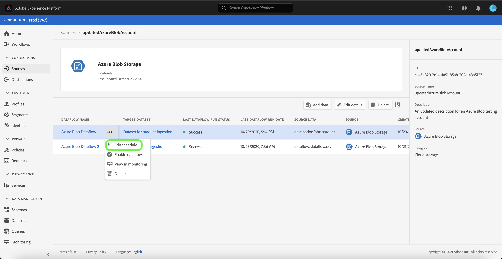

# Uppdatera kontoinformation i användargränssnittet

Under vissa omständigheter kan det vara nödvändigt att uppdatera informationen för ett befintligt källkonto. Med arbetsytan [!UICONTROL Sources] kan du lägga till, redigera och ta bort information om en befintlig batch- eller direktuppspelningsanslutning, inklusive namn, beskrivning och autentiseringsuppgifter.

Arbetsytan [!UICONTROL Sources] ger dig även möjlighet att redigera schemat för batchdataflöden, så att du kan uppdatera dess intagsfrekvens och intervallhastighet.

I den här självstudiekursen beskrivs steg för hur du uppdaterar information och autentiseringsuppgifter för ett befintligt konto från arbetsytan [!UICONTROL Sources] samt hur du uppdaterar inmatningsschemat för ett dataflöde.

## Komma igång

Den här självstudiekursen kräver en fungerande förståelse av följande komponenter i Adobe Experience Platform:

- [Källor](../../home.md): Experience Platform tillåter att data kan hämtas från olika källor samtidigt som du kan strukturera, märka och förbättra inkommande data med hjälp av plattformstjänster.
- [Sandlådor](../../../sandboxes/home.md): Experience Platform tillhandahåller virtuella sandlådor som partitionerar en enda plattformsinstans i separata virtuella miljöer för att utveckla och utveckla program för digitala upplevelser.

## Uppdatera konton

Logga in på [Experience Platform-gränssnittet](https://platform.adobe.com) och välj sedan **[!UICONTROL Sources]** i den vänstra navigeringen för att komma åt arbetsytan [!UICONTROL Sources]. Välj **[!UICONTROL Accounts]** i den övre rubriken om du vill visa befintliga konton.

Sidan **[!UICONTROL Accounts]** visas. På den här sidan finns en lista med visningsbara konton, inklusive information om källa, användarnamn, antal dataflöden och datum när de skapades.

Välj filterikonen  längst upp till vänster för att starta sorteringspanelen.

Sorteringspanelen innehåller en lista med alla källor. Du kan välja mer än en källa i listan för att komma åt ett filtrerat urval konton som är associerade med olika källor.

Välj den källa som du vill arbeta med för att visa en lista över dess befintliga konton. När du har identifierat det konto du vill uppdatera markerar du ellipserna (`...`) bredvid kontonamnet.

En listruta visas med alternativ för **[!UICONTROL Add data]**, **[!UICONTROL Edit details]** och **[!UICONTROL Delete]**. Välj **[!UICONTROL Edit details]** på menyn för att uppdatera ditt konto.

I dialogrutan **[!UICONTROL Edit account details]** kan du uppdatera ett kontos namn, beskrivning och autentiseringsuppgifter. När du har uppdaterat den önskade informationen väljer du **[!UICONTROL Save]**.

Efter en stund visas en bekräftelseruta längst ned på skärmen som bekräftar att uppdateringen lyckades.

## Redigera schema

Du kan redigera inmatningsschemat för ett dataflöde från sidan **[!UICONTROL Accounts]**. I listan över konton väljer du det konto som innehåller det dataflöde som du vill schemalägga om.

Sidan med dataflöden visas. Den här sidan innehåller en lista över befintliga dataflöden som är kopplade till det konto du har valt. Markera de ellipser (`...`) bredvid det dataflöde som du vill schemalägga om.

En listruta visas med alternativ för **[!UICONTROL Edit schedule]**, **[!UICONTROL Enable dataflow]**, **[!UICONTROL View in monitoring]** och **[!UICONTROL Delete]**. Välj **[!UICONTROL Edit schedule]** på menyn.

Dialogrutan **[!UICONTROL Edit schedule]** innehåller alternativ för att uppdatera dataflödets matningsfrekvens och intervallhastighet. När du har angett uppdaterade värden för frekvens och intervall väljer du **[!UICONTROL Save]**.

| Schemaläggning | Beskrivning |
| ---------- | ----------- |
| Frekvens | Frekvensen med vilken dataflödet samlar in data. Giltiga värden för redigering av frekvensschema för ett befintligt dataflöde är: `minute`, `hour`, `day` eller `week`. |
| Intervall | Intervallet anger perioden mellan två på varandra följande flödeskörningar. Intervallets värde ska vara ett heltal som inte är noll och måste vara större än eller lika med `15`. |

Efter en stund visas en bekräftelseruta längst ned på skärmen som bekräftar att uppdateringen lyckades.

## Nästa steg

Genom att följa den här självstudiekursen har du använt arbetsytan [!UICONTROL Sources] för att uppdatera kontoinformationen och redigera ditt dataflödesschema.

Anvisningar om hur du utför dessa åtgärder programmatiskt med API:t [!DNL Flow Service] finns i självstudiekursen om att [uppdatera anslutningsinformation med API:t för Flow Service](../../tutorials/api/update.md).