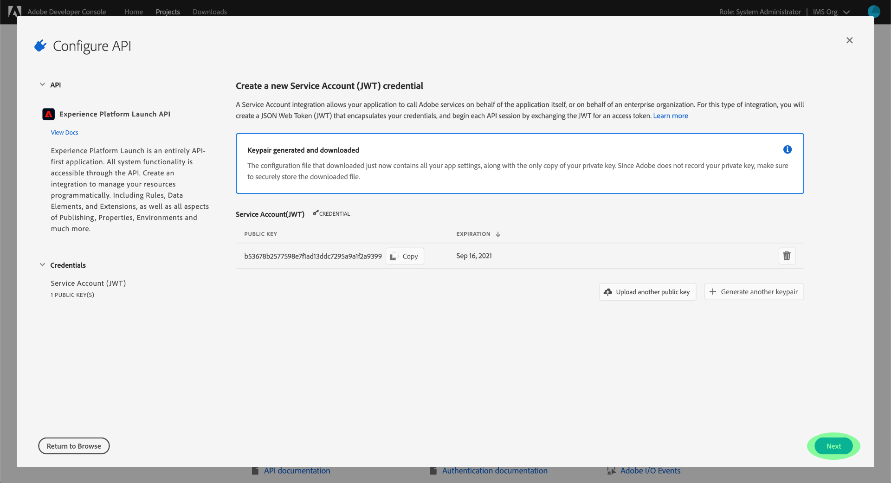
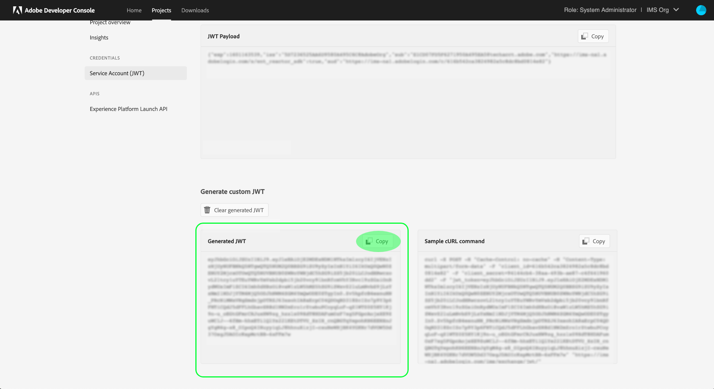

# Komma igång med Reactor API

För att kunna använda [Reaktors-API](https://www.adobe.io/experience-platform-apis/references/reactor/)måste varje begäran innehålla följande autentiseringsrubriker:

* `Authorization: Bearer {ACCESS_TOKEN}`
* `x-api-key: {API_KEY}`
* `x-gw-ims-org-id: {ORG_ID}`

Den här guiden beskriver hur du använder Adobe Developer Console för att samla in värdena för vart och ett av dessa rubriker så att du kan börja anropa Reactor API.

## Få utvecklare tillgång till Adobe Experience Platform

Innan du kan generera autentiseringsvärden för Reactor API måste du ha utvecklaråtkomst till Experience Platform. Följ de inledande stegen i dialogrutan för att få utvecklaråtkomst [Självstudiekurs om autentisering av Experience Platform](https://www.adobe.com/go/platform-api-authentication-en). När du är klar med steget &quot;Get User Access&quot; går du tillbaka till den här självstudiekursen för att generera de specifika autentiseringsuppgifterna för Reactor API.

## Generera autentiseringsuppgifter för åtkomst

Med Adobe Developer Console måste du generera följande tre autentiseringsuppgifter:

* `{ORG_ID}`
* `{API_KEY}`
* `{ACCESS_TOKEN}`

Din IMS-organisations ID (`{ORG_ID}`) och API-nyckel (`{API_KEY}`) kan återanvändas i framtida API-anrop efter att de ursprungligen har skapats. Din åtkomsttoken (`{ACCESS_TOKEN}`) är tillfälligt och måste genereras om var 24:e timme.

Stegen för att generera dessa värden beskrivs närmare nedan.

### Engångskonfiguration

Gå till [Adobe Developer Console](https://www.adobe.com/go/devs_console_ui) och logga in med din Adobe ID. Följ sedan instruktionerna i självstudiekursen på [skapa ett tomt projekt](https://developer.adobe.com/developer-console/docs/guides/projects/projects-empty/) i Developer Console-dokumentationen.

När du har skapat ett projekt väljer du **Lägg till API** på **Projektöversikt** skärm.


The **Lägg till ett API** visas. Välj **Experience Platform Reactor API** i listan med tillgängliga API:er innan du väljer **Nästa**.


På nästa skärm uppmanas du att skapa en JWT-autentiseringsuppgift (JSON Web Token) som antingen genererar ett nytt nyckelpar eller överför din egen offentliga nyckel. För den här självstudiekursen väljer du **Generera ett nyckelpar** välj **Generera nyckelpar** i det nedre högra hörnet.


Nästa skärm bekräftar att nyckelparet har genererats och en komprimerad mapp som innehåller ett offentligt certifikat och en privat nyckel hämtas automatiskt till datorn. Den här privata nyckeln krävs i ett senare steg för att generera en åtkomsttoken.

Välj **Nästa** för att fortsätta.



På nästa skärm får du en uppmaning om att välja en eller flera produktprofiler som ska associeras med API-integreringen.

>[!NOTE]
>
>Produktprofiler hanteras av er organisation via Adobe Admin Console och innehåller specifika behörighetsgrupper för detaljfunktioner. Produktprofiler och deras behörigheter kan bara hanteras av användare med administratörsbehörighet inom organisationen. Om du är osäker på vilka produktprofiler du ska välja för API kontaktar du administratören.

Välj önskade produktprofiler i listan och välj sedan **Spara konfigurerat API** för att slutföra API-registreringen.


När API:t har lagts till i projektet visas projektsidan igen på Experience Platform Reactor API-sidan. Här rullar du nedåt till **Tjänstkonto (JWT)** som ger följande åtkomstbehörigheter som krävs i alla anrop till Reactor API:

* **KLIENT-ID**: Klient-ID krävs `{API_KEY}` som måste anges i `x-api-key` header.
* **ORGANISATIONS-ID**: Organisations-ID är `{ORG_ID}` värde som måste användas i `x-gw-ims-org-id` header.


### Autentisering för varje session

Nu när du har `{API_KEY}` och `{ORG_ID}` värden, det sista steget genererar ett `{ACCESS_TOKEN}` värde.

>[!NOTE]
>
>Dessa token upphör att gälla efter 24 timmar. Om du använder den här integreringen för ett program är det en bra idé att hämta din innehavartoken programmatiskt inifrån programmet.

Det finns två alternativ för att generera åtkomsttoken, beroende på hur du använder dem:

* [Generera tokens manuellt](#manual)
* [Generera tokens programmatiskt](#program)

#### Generera åtkomsttoken manuellt {#manual}

Öppna den privata nyckeln som du hämtade tidigare i en textredigerare eller webbläsare och kopiera innehållet. Gå sedan tillbaka till Developer Console och klistra in den privata nyckeln i dialogrutan **Generera åtkomsttoken** -avsnittet på Reaktors API-sidan för ditt projekt innan du väljer **Generera token**.


En ny åtkomsttoken genereras och en knapp för att kopiera token till Urklipp tillhandahålls. Det här värdet används för det obligatoriska `Authorization` och måste anges i formatet `Bearer {ACCESS_TOKEN}`.


#### Generera åtkomsttoken programmatiskt {#program}

Om du använder integreringen för ett program kan du programmässigt generera åtkomsttoken via API-begäranden. För att uppnå detta måste du få följande värden:

* Klient-ID (`{API_KEY}`)
* Klienthemlighet (`{SECRET}`)
* En JSON-webbtoken (`{JWT}`)

Ditt klient-ID och din hemlighet kan hämtas från huvudsidan för ditt projekt, vilket visas i [föregående steg](#one-time-setup).


Om du vill ha dina JWT-autentiseringsuppgifter går du till **Tjänstkonto (JWT)** i den vänstra navigeringen väljer du **Generera JWT** -fliken. På den här sidan, under **Generera anpassad JWT**, klistra in innehållet i den privata nyckeln i den angivna textrutan och markera **Generera token**.


Den genererade JWT-filen visas nedan när bearbetningen är klar, tillsammans med ett exempel på ett cURL-kommando som du kan använda för att testa variabeln om du vill. Använd **Kopiera** om du vill kopiera token till Urklipp.



När du har samlat in dina inloggningsuppgifter kan du integrera API-anropet nedan i ditt program för att programmatiskt generera åtkomsttoken.

**Begäran**

Begäran måste skicka en `multipart/form-data` nyttolast, med dina autentiseringsuppgifter som visas nedan:

```shell
curl -X POST \
  https://ims-na1.adobelogin.com/ims/exchange/jwt/ \
  -H 'Content-Type: multipart/form-data' \
  -F 'client_id={API_KEY}' \
  -F 'client_secret={SECRET}' \
  -F 'jwt_token={JWT}'
```

**Svar**

Ett lyckat svar returnerar en ny åtkomsttoken samt antalet sekunder som återstår tills det upphör att gälla.

```json
{
  "token_type": "bearer",
  "access_token": "{ACCESS_TOKEN}",
  "expires_in": 86399999
}
```

| Egenskap | Beskrivning |
| :-- | :-- |
| `access_token` | Det nyligen genererade åtkomsttokenvärdet. Det här värdet används för det obligatoriska `Authorization` och måste anges i formatet `Bearer {ACCESS_TOKEN}`. |
| `expires_in` | Återstående tid tills token upphör att gälla, i millisekunder. När en token upphör att gälla måste en ny genereras. |

{style="table-layout:auto"}

## Nästa steg

Om du följer stegen i den här självstudiekursen bör du ha giltiga värden för `{ORG_ID}`, `{API_KEY}`och `{ACCESS_TOKEN}`. Du kan nu testa dessa värden genom att använda dem i en enkel cURL-begäran till Reactor API.

Börja med att göra ett API-anrop till [lista alla företag](./endpoints/companies.md#list).

>[!NOTE]
>
>Du kanske inte har några företag i din organisation, och då är svaret HTTP-status 404 (Hittades inte). Så länge du inte får ett 403-fel (Ej tillåtet) är dina inloggningsuppgifter giltiga och fungerar.

När du har bekräftat att dina inloggningsuppgifter fungerar kan du fortsätta att utforska den andra API-referensdokumentationen och lära dig API:ts många funktioner.

## Ytterligare resurser

JWT Libraries och SDK: [https://jwt.io/](https://jwt.io/)

Postman API-utveckling: [https://www.postman.com/](https://www.postman.com/)
