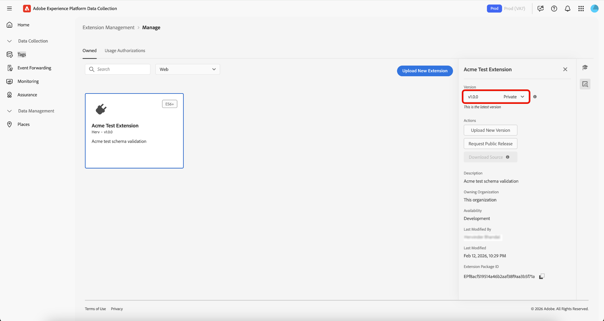

# Hantering av taggtillägg

Med Adobe Experience Platform kan du hantera **[!UICONTROL Owned]** tillägg. Du kan överföra nya tillägg, distribuera nya versioner och publicera dem till antingen privat eller offentlig tillgänglighet.

## Hantera ett tillägg  {#manage-extension}

När du har förberett tilläggspaketet lokalt kan du använda **[!UICONTROL Extension Management]** i användargränssnittet för datainsamling för att överföra det, validera paketet och frisläppa versionerna via tillgängligheten **Utveckling**, **Privat** och **Offentlig**. Du kan sedan installera tillägget på en egenskap och använda det för testning.

### Överför ett tillägg {#upload-extension}

Om du vill överföra ett tillägg går du till användargränssnittet för datainsamling och väljer **[!UICONTROL Extension Management]** i den vänstra navigeringen. Välj fliken **[!UICONTROL Owned]** härifrån. På den här fliken visas alla tillägg som ägs av dig eller din organisation. De separeras av plattformen och du ser vilka tillägg du har på respektive plattform (Web, Mobile och Edge) i listrutan. Välj **[!UICONTROL Upload New Extension]**.

På sidan **Överför nytt tillägg** väljer du **[!UICONTROL Select Extension Folder]**, navigerar till mappen som innehåller tillägget, markerar mappen och väljer **[!UICONTROL Upload]**.

Bekräfta antalet filer som ska överföras genom att välja **[!UICONTROL Upload]**.

Antalet filer som ska överföras visas, inklusive tilläggets namn och version. Du kan välja att utföra en **[!UICONTROL Dry Run]** som hämtar en ZIP-fil till din lokala dator för kontroll. Välj **[!UICONTROL Validate & Upload]**.

Bekräftelse på att tillägget har överförts och bearbetats visas tillsammans med ditt **tilläggspaket-ID**. Välj **[!UICONTROL Close]** om du vill återgå till fliken **[!UICONTROL Owned]** där tillägget visas.

Du återgår till fliken [!UICONTROL Owned] där det överförda tillägget visas.

>[!IMPORTANT]
>
>Tillägg laddas upp i tillgängligheten **Utveckling**. Tillägg i tillgängligheten **Utveckling** kan inte delas förrän de har släppts till tillgängligheten **Privat**.

### Frigöra ett tillägg {#release-extension}

Om du vill frigöra tillägget så att det blir tillgängligt privat markerar du tillägget så att informationspanelen visas till höger. Här ser du följande information om tillägget:

* **Version** - Visar den senaste versionen och det läge den befinner sig i. Du kan använda listrutan för att visa tilläggets versionshistorik.
* **Åtgärder** - Gör att du kan **[!UICONTROL Upload New Version]** av tillägget och **[!UICONTROL Release To Private]**.
* **ID för tilläggspaket** - visas längst ned. Detta ändras beroende på vilken version som är vald.

Välj **[!UICONTROL Release To Private]** och välj sedan **[!UICONTROL Release To Private]** igen för att bekräfta releasen.

Bekräftelse tas emot när tillägget har släppts till **Privat**-tillgänglighet. Den uppdaterade tillgängligheten visas på den högra panelen.

>[!NOTE]
>
>När tillägget har släppts till **Privat** kan det delas med andra organisationer.

Om du vill frigöra tillägget till **Offentlig** tillgänglighet väljer du **[!UICONTROL Request Public Release]** på den högra panelen.

Skärmen **[!UICONTROL Release Extension Package]** innehåller information som krävs i begärandeformuläret, med ett alternativ för att kopiera informationen. Välj **[!UICONTROL Go To Request Form]**.

En ny flik öppnas med begärandeformuläret. Kopiera och klistra in informationen från skärmen **[!UICONTROL Release Extension Package]** i relevanta fält. Skicka det ifyllda formuläret för granskning. Du meddelas när tillägget har offentliggjorts.

## Dela tilläggspaket med andra organisationer {#share-extension}

>[!NOTE]
>
>Tilläggspaket måste ha en version som är antingen privat eller offentlig för att kunna delas via [!UICONTROL Usage Authorizations]. Versioner som är markerade som utvecklingstillgänglighet är inte berättigade till delning och visas inte i listrutan för behörighet. Detta gäller även om en tidigare version (t.ex. 1.0.0) redan har delats. Nyare versioner (t.ex. 1.0.1) måste göras minst privata innan de kan godkännas eller installeras av mottagande organisationer.
>
>All vägledning om delning av privata tilläggspaket gäller också om du senare väljer att göra dessa paket offentliga. Samma överväganden som rör synlighet, versionshantering, säkerhet, kompatibilitet, support och dokumentation är fortfarande relevanta oavsett paketets tillgänglighetsstatus.

**[!UICONTROL Usage Authorizations]** är en kraftfull funktion som du kan använda för att på ett säkert sätt dela privata tilläggspaket med betrodda partner utan att göra dem allmänt tillgängliga i tilläggskatalogen. Använd den här funktionen för att skapa en säker bro mellan olika organisationer, så att ni kan utnyttja varandras anpassade tilläggskoder samtidigt som ni behåller integriteten och kontrollen över era egna lösningar.

Organisationer utvecklar ofta specialanpassade tillägg som är skräddarsydda efter deras unika affärskrav. Dessa tillägg kan innehålla egna logiska funktioner, anpassade integreringar eller känsliga konfigurationer som inte ska vara tillgängliga för allmänheten. Användningsauktoriseringar löser detta problem genom att aktivera:

* **Selektiv delning**: Dela privata tillägg endast med betrodda partnerorganisationer.
* **Bevarad sekretess**: Håll känslig tilläggskod utanför den offentliga katalogen.
* **Samarbetsutveckling**: Gör det möjligt för betrodda partner att dra nytta av dina anpassade lösningar.
* **Kontrollerad åtkomst**: Behåll fullständig kontroll över vem som har åtkomst till och kan använda dina privata tillägg.

Delningsprocessen omfattar två huvuddeltagare:

1. **Delningsorganisation**: Organisationen som äger och delar det privata tilläggspaketet
2. **Mottagande organisation**: Den betrodda organisationen som får åtkomst till det delade tillägget

När en privat version delas får den mottagande organisationen tillgång till den specifika versionen, vilket skapar en direkt anslutning mellan de två organisationerna. Om en nyare version senare görs privat blir den även tillgänglig för den mottagande organisationen utan att ytterligare åtgärder krävs från den egna organisationens sida.

### Skapa en användningsbehörighet för tilläggspaket {#package-usage-authorization}

Om du vill dela ett tillägg går du till användargränssnittet för datainsamling och väljer **[!UICONTROL Extension Management]** i den vänstra navigeringen. Välj fliken **[!UICONTROL Usage Authorizations]** härifrån.

Här visas en lista över befintliga delade auktoriseringar ordnade i två kategorier:

* **Delad med den här organisationen**: Tillägg som andra organisationer har delat med dig.
* **Delas med andra organ**: Tillägg som du har delat med andra organisationer.

Välj **[!UICONTROL Add Authorization]**.

![Fliken [!UICONTROL Usage Authorizations] som visar en lista över tillägg som delas med den här organisationen, med markering [!UICONTROL Add Authorization]](../images/shared-extensions/add-authorization.png)

>[!IMPORTANT]
>
>Du måste hämta målorganisationens **`Organization ID`** till organisationens ägare. Det går inte att söka efter organisationer efter namn.

Välj den **[!UICONTROL Platform]** som du vill auktorisera ett tillägg för i listrutan. Du kan dela tilläggen **[!UICONTROL Web]**, **[!UICONTROL Mobile]** och **[!UICONTROL Edge]**.

Välj sedan den **[!UICONTROL Extension]** som du vill dela bland dina tillgängliga tillägg i listrutan. I listan visas tillägg som ägs av organisationen tillsammans med deras tillgänglighetsstatus. Tillägg vars senaste version är tillgänglig i **Development** visas inte i den här listan.

Ange sedan den mottagande organisationens ID och välj **[!UICONTROL Save]**.

![Sidan [!UICONTROL Create extension package usage authorization] som visar ett valt tillägg och ett företags-ID för Adobe har angetts. [!UICONTROL Save]](../images/shared-extensions/save-authorization.png)

Du återgår till fliken [!UICONTROL Usage Authorizations] där du kan se tillägget i listan **[!UICONTROL Shared with other orgs]**. Statusen visar **Väntar på godkännande** tills den mottagande organisationen godkänner auktoriseringen, och då uppdateras den till **Godkänd**.

![Fliken [!UICONTROL Usage Authorizations] som visar en lista över tillägg som delas med andra organ, och som markerar den nya auktoriseringen &#x200B;](../images/shared-extensions/new-authorization.png)

>[!TIP]
>
>Du kan också dela tillägg direkt från **[!UICONTROL Extension Catalog]** genom att välja menyn ( ⋯) på tilläggskortet och sedan välja delningsalternativet på menyn.

När en auktorisering är aktiv visar det delade tillägget ett ***Delningsmärke*** i katalogen som anger att det delas med andra organisationer.

![Fliken [!UICONTROL Catalog] som visar det delade tillägget med märket &#x200B;](../images/shared-extensions/sharing-badge.png)

### Auktorisera och hantera delade tillägg {#manage-shared-extension}

>[!NOTE]
>
>Som mottagande organisation kan du bara godkänna eller avvisa delade tillägg. Du kan inte hantera eller ändra auktoriseringsinformationen eftersom den styrs av delningsorganisationen.

Om du vill godkänna ett delat tillägg för din organisation går du till användargränssnittet för datainsamling och väljer **[!UICONTROL Extension Management]** i den vänstra navigeringen och väljer sedan fliken **[!UICONTROL Usage Authorizations]**.

Du kan se en lista över delade tillägg, inklusive de **som väntar på godkännande** i avsnittet **[!UICONTROL Shared with this org]**. Markera det tillägg som du vill godkänna och välj sedan **[!UICONTROL Approve]**.

![Fliken [!UICONTROL Usage Authorizations] som visar en lista över tillägg som delas med den här organisationen med tillägget Väntar på godkännande markerat. [!UICONTROL Approve]](../images/shared-extensions/approve-authorization.png)

>[!NOTE]
>
>Du kan också avvisa en begäran på fliken **[!UICONTROL Usage Authorizations]** om det delade tillägget inte längre krävs av din organisation.

Välj **[!UICONTROL OK]** i dialogrutan **[!UICONTROL Authorization Usages]**.

![Dialogrutan [!UICONTROL Authorization Usages] med färgmarkering [!UICONTROL OK]](../images/shared-extensions/confirmation.png)

Du återgår till fliken [!UICONTROL Usage Authorizations] där du kan se att tillägget nu har statusen **Godkänd**.

![Fliken [!UICONTROL Usage Authorizations] som visar en lista över tillägg som delas med den här organisationen, och markerar tillägget med statusen Godkänd](../images/shared-extensions/approved-authorization.png)

När auktoriseringen har godkänts är tillägget tillgängligt i din katalog och kan installeras och användas som alla andra tillägg. Det delade tillägget visar ett ***Ta emot***-märke som anger att det är ett tillägg som delas med dig av en annan organisation.

![Fliken [!UICONTROL Catalog] som visar det delade tillägget med märket &quot;Tar emot&quot; &#x200B;](../images/shared-extensions/receiving-badge.png)

### Återkalla auktoriseringar {#revoke-authorization}

Som ägande organisation kan du ta bort en auktorisering när som helst, oavsett dess aktuella status (väntar på godkännande, avvisat eller godkänt).

**Om tillägget aldrig har publicerats:**

* Alla privata versioner av den mottagande organisationen som redan är installerad visas även i listan över installerade tillägg.
* Om den mottagande organisationen aldrig har installerat tillägget visas det inte längre någonstans i gränssnittet.

**Om tillägget har publicerats:**

* Alla privata versioner som den mottagande organisationen har installerat förblir synliga i listan över installerade tillägg.
* Om de aldrig har installerat din privata version ser de fortfarande den senaste offentliga versionen i sin katalog och kan installera den.
* De kan även nedgradera från din privata version till den senaste tillgängliga offentliga versionen om du vill.

När du återkallar en auktorisering behåller den mottagande organisationen vissa rättigheter för att skydda sina befintliga implementeringar:

* **Fortsatt användning**: Den mottagande organisationen kan fortsätta att använda alla privata versioner som de redan har installerat, även efter att du har återkallat åtkomsten.
* **Skapa skydd**: Om den mottagande organisationen har installerat din privata version 1.0.0 och du senare släpper en privat version 1.0.1, kan den senare versionen inte visas, men den kan fortsätta att bygga med version 1.0.0 utan avbrott.
* **Framtida uppgraderingar**: Om du senare gör tillägget offentligt (till exempel publicerar v2.0.0 offentligt) kan den mottagande organisationen uppgradera från sin privata v1.0.0 direkt till den nya publika v2.0.0.

>[!IMPORTANT]
>
>Befintliga byggen eller implementeringar bryts inte om du återkallar auktoriseringen. Mottagande organisationer behåller åtkomsten till de privata versioner de redan har installerat för att säkerställa kontinuiteten i verksamheten.

## Nästa steg {#next-steps}

Det här dokumentet visar hur du använder funktionen för delade tillägg i Experience Platform. Mer information om tilläggsutveckling finns i användarhandboken för [tilläggsutveckling](./getting-started.md).

En översikt över tilläggsutveckling i Experience Platform finns i [översiktsdokumentationen](./overview.md).
