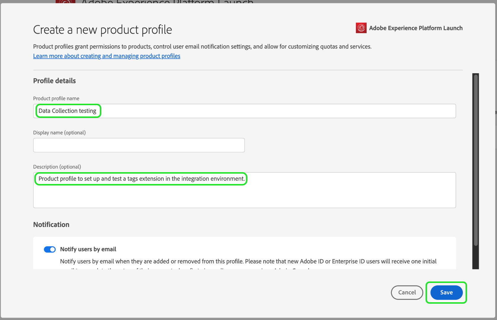
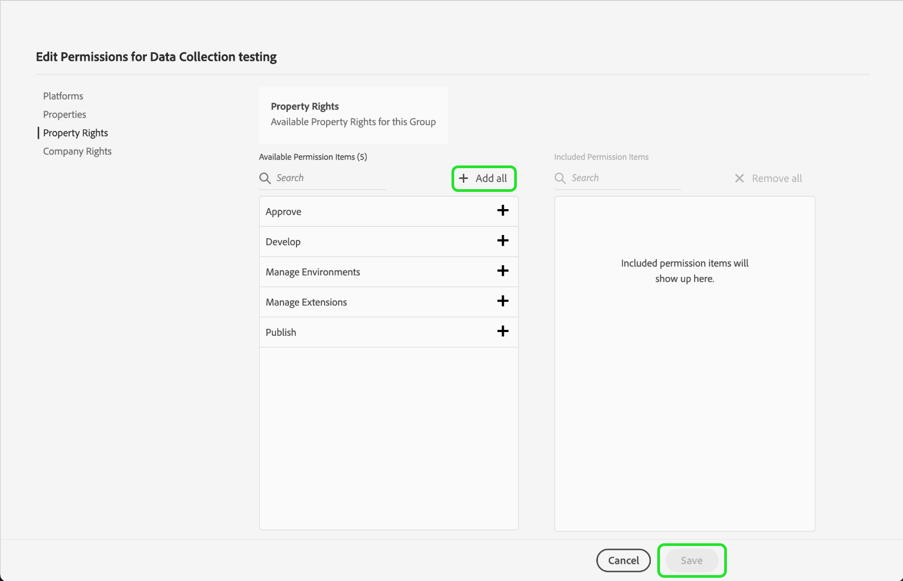

# Bevilja användaråtkomst

>[!NOTE]
>
>Adobe Experience Platform Launch har omklassificerats som en serie datainsamlingstekniker i Adobe Experience Platform. Som ett resultat av detta har flera terminologiska förändringar införts i produktdokumentationen. Se följande [dokument](../../term-updates.md) för en konsoliderad hänvisning till terminologiska förändringar.

Innan du börjar med ditt extension_package måste du konfigurera dina teammedlemmar med användarkonton och behörigheter.  Detta uppnås i [Adobe Admin Console](https://adminconsole.adobe.com/).

Det här dokumentet innehåller steg för hur du beviljar åtkomst till taggar i Adobe Experience Platform via Admin Console.

## Förutsättningar

I den här handboken förutsätts du vara en organisationsadministratör enligt Admin Console. Om du behöver mer information om Admin Console och tilldelning av roller kan du läsa följande resurser:

* [Användarhandbok för administration](https://helpx.adobe.com/enterprise/administering/user-guide.html?topic=/enterprise/administering/morehelp/introduction.ug.js): Information om allt i Admin Console
* [Företagsadministrationsroller](https://helpx.adobe.com/au/enterprise/using/admin-roles.html): Mer information om de olika typerna av administrationsroller. I guiden nedan antar vi att du är en organisationsadministratör.

## Välj organisation

Din Adobe Experience Cloud-administratör bör logga in på [Admin Console](https://adminconsole.adobe.com/). Den första skärmen är översikten.

Vissa av er har kanske tillgång till fler än en organisation (Org). Om du vill lägga till taggfunktioner i rätt organisation markerar du namnet på organisationen som visas i skärmens övre högra hörn. Välj sedan den organisation där du vill använda taggar i listrutan.

## Skapa en produktprofil

En produktprofil är en grupp. Enskilda rättigheter tilldelas till produktprofiler och alla användare i profilen ärver dessa rättigheter.

Välj **[!UICONTROL Products]** länk överst, och **[!UICONTROL Experience Cloud]** till vänster. Om du inte har användargränssnittet för datainsamling i listan bör kunderna kontakta kontoteamet och partners bör skicka e-post <ExchangeTechEC@adobe.com>.

På skärmbilden ovan visas en exempelprofil som du kanske inte har ännu. Om du vill skapa en väljer du **[!UICONTROL New Profile]**. På **Skapa en ny profil** skärm, lägg bara till **Profilnamn** (till exempel datainsamlingstestning) och ett valfritt **Beskrivning** väljer **[!UICONTROL Save]**:

Produktprofilen har nu lagts till i organisationen. Lägg sedan till användare i produktprofilen.

## Tilldela användare till produktprofilen

Observera att produktprofilen visar noll för **BERÄTTIGADE ANVÄNDARE** och **ADMINISTRATÖRER**. Välj namnet på produktprofilen som du skapade (datainsamlingstestning i vårt exempel).

Klicka på fliken **[!UICONTROL Users]**.  Här kan du söka efter befintliga Adobe ID-användare via e-post eller lägga till nya användare i produktprofilen. Välj **[!UICONTROL Add User link]**.

Ange ett namn, en användargrupp eller en e-postadress i lämpligt textfält. Vi rekommenderar att du tar med ett för- och efternamn där det är möjligt. Välj **[!UICONTROL Save]** för att lägga till användaren.

När du har alla användare du behöver i den här produktprofilen lägger vi till behörigheter för dem. Klicka på fliken **[!UICONTROL Permissions]**.  På behörighetsskärmen ser du **[!UICONTROL Properties]**, **[!UICONTROL Company Rights]** och **[!UICONTROL Property Rights]**. Välj **[!UICONTROL Edit]**.

Om du vill skapa tillägg måste ditt team ha minst följande behörigheter:

* &quot;Hantera egenskaper&quot; från företagsgruppen.
* &quot;Hantera tillägg&quot;, &quot;Hantera miljöer&quot; och &quot;Utveckla&quot; från egenskapsgruppen.

Du kan skapa ytterligare produktprofiler med mer begränsad behörighet senare om du vill, men nu väljer du bara **[!UICONTROL + Add all]** för båda **Företagsrättigheter** och **Egendomsrättigheter**. Se till att markera **[!UICONTROL Save]** på var och en.

Hittills har vi valt lämplig organisation, skapat en produktprofil, lagt till användare i produktprofilen och tilldelat behörigheter.

Detta slutför konfigurationen i Admin Console. Du och dina teammedlemmar som har konfigurerats som användare kan nu logga in på [användargränssnittet för datainsamling](https://launch.adobe.com/).

## Bekräfta etablering

När ditt företag har fått tillgång till taggar och dina användare har konfigurerats enligt beskrivningen ovan bör du kunna komma åt produktionsmiljön från [Användargränssnitt för datainsamling](https://launch.adobe.com/). Om du har etablerats för taggar och har slutfört Admin Console-stegen ovan, men ändå inte kan logga in i användargränssnittet för datainsamling, kontaktar du supportpersonalen på Adobe.
