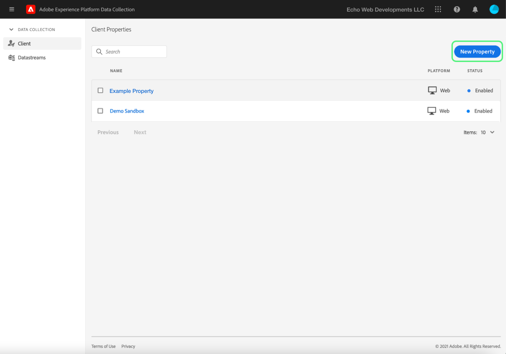

# Ladda upp och implementera testning från början till slut

>[!NOTE]
>
>Adobe Experience Platform Launch har omklassificerats som en serie datainsamlingstekniker i Adobe Experience Platform. Som ett resultat av detta har flera terminologiska förändringar införts i produktdokumentationen. Se följande [dokument](../../term-updates.md) för en konsoliderad hänvisning till terminologiska förändringar.

Om du vill testa taggtillägg i Adobe Experience Platform använder du tagg-API:t och/eller kommandoradsverktygen för att överföra dina tilläggspaket. Använd sedan användargränssnittet för plattformen eller användargränssnittet för datainsamling för att installera tilläggspaketet i en egenskap och använda funktionerna i ett taggbibliotek och skapa det.

I det här dokumentet beskrivs hur du implementerar kompletta tester för ditt tillägg.

>[!NOTE]
>
>Den här guiden förutsätter att du använder MacOS med Node.js och npm installerade och tillgängliga.

## Validera tillägget {#validate}

När ditt team är nöjd med hur tillägget fungerar och vilka resultat de får visas i [Sandbox](https://www.npmjs.com/package/@adobe/reactor-sandbox#running-the-sandbox) kan du överföra tilläggspaketet till taggar.

Innan du överför filen kontrollerar du att det finns obligatoriska fält eller inställningar. Du kan till exempel granska [tilläggsmanifest](../manifest.md), [tilläggskonfiguration](../configuration.md), [vyer](../web/views.md)och [biblioteksmoduler](../web/format.md) (åtminstone) är god praxis.

Ett specifikt exempel är din logotypfil: Lägg till en `"iconPath": "example.svg",` linje till `extension.json` och ta med logotypbilden i projektet. Det här är den relativa sökvägen till ikonen som ska visas för tillägget. Det ska inte börja med ett snedstreck. Den måste referera till en SVG-fil med en `.svg` tillägg. SVG ska visas normalt när den återges fyrkantig och kan skalas av användargränssnittet. Se [Så här skalförändrar du SVG-artikel](https://css-tricks.com/scale-svg/) för mer information.

>[!NOTE]
>
>För offentliga tillägg ska du inkludera ett objekt i `extension.json` med en länk till din Exchange-lista. Dina [tilläggsmanifest](../manifest.md) ska innehålla följande: `"exchangeUrl":"https://www.adobeexchange.com/experiencecloud.details.12345.html"` som pekar på URL:en för Exchange-listan.

## Skapa integrering med Adobe I/O {#integration}

Om du vill använda API- eller kommandoradsverktygen behöver du ett tekniskt konto hos Adobe I/O. Du måste skapa det tekniska kontot i I/O-konsolen och sedan använda verktyget Överför för att överföra tilläggspaketet.

Mer information om hur du skapar ett tekniskt konto som kan användas med taggar i Adobe Experience Platform finns i [Åtkomsttoken](https://developer.adobelaunch.com/api/guides/access_tokens/) guide.

>[!IMPORTANT]
>
>För att kunna skapa en integrering i Adobe I/O måste du vara en Experience Cloud-organisationsadministratör eller en Experience Cloud-grupputvecklare.

Om du inte kan skapa en integrering har du förmodligen inte rätt behörighet. Detta kräver antingen en organisationsadministratör för att slutföra stegen åt dig eller för att du ska kunna utses till utvecklare.

## Överför ditt tilläggspaket {#upload}

Nu när du har inloggningsuppgifter kan du testa tilläggspaketet från början till slut.

När du först överför tilläggspaketet försätts det i `development`. Det innebär att det bara är synligt för din egen organisation, och bara med en egenskap som har markerats för tilläggsutveckling.

Använd kommandoraden för att köra följande kommando i katalogen som innehåller ditt ZIP-paket.

```bash
npx @adobe/reactor-uploader
```

`npx` Med kan du hämta och köra ett npm-paket utan att installera det på datorn. Detta är det enklaste sättet att köra Uploader.

I Uploader måste du ange flera uppgifter. Det tekniska konto-ID:t, API-nyckeln och annan information kan hämtas från Adobe I/O-konsolen. Navigera till [Integrationssida](https://console.adobe.io/integrations) i I/O-konsolen. Välj rätt organisation i listrutan, hitta rätt integration och välj **[!UICONTROL View]**.

- Vilken är sökvägen till din privata nyckel? /path/to/private.key. Det här är den plats där du sparade din privata nyckel i steg 2 ovan.
- Vad är ditt Org ID? Kopiera och klistra in det här från översiktssidan för I/O-konsolen som du lämnade öppen tidigare.
- Vad är ditt ID för tekniskt konto? Kopiera och klistra in det här från I/O-konsolen.
- Vad är din API-nyckel? Kopiera och klistra in det här från I/O-konsolen.
- Vad är klienthemligheten? Kopiera och klistra in det här från I/O-konsolen.
- Vilken sökväg till det extension_package som du vill överföra? /path/to/extension_package.zip. Om du anropar den som laddar upp filen från den katalog som innehåller ditt ZIP-paket kan du bara välja den i listan i stället för att skriva sökvägen.

Tilläggspaketet kommer sedan att överföras och den överförande filen ger dig ID:t för extension_package.

>[!NOTE]
>
>Vid överföring eller korrigering placeras tilläggspaket i ett väntande läge medan systemet extraherar paketet och distribuerar asynkront. Medan processen pågår kan du avfråga `extension_package` ID för dess status med API och i användargränssnittet. Ett tilläggskort visas i katalogen som är markerad som Väntande.

>[!NOTE]
>
>Om du tänker köra överföringen ofta kan det vara en börda att skicka all den här informationen varje gång. Du kan också skicka dessa som argument från kommandoraden. Kolla in [Avsnittet Kommandoradsargument](https://www.npmjs.com/package/@adobe/reactor-uploader#command-line-arguments) av NPM-dokumenten för mer information.

## Skapa en utvecklingsegenskap {#property}

När du har loggat in på användargränssnittet och valt **[!UICONTROL Tags]** i den vänstra navigeringen visas [!UICONTROL Properties] visas. En egenskap är en behållare för de taggar som du vill distribuera och den kan användas på en eller flera platser.



Du kommer inte att se några egenskaper på skärmen första gången du loggar in. Välj **Ny egenskap** för att skapa en. Ange ett namn och en URL. Använd URL-adressen till testwebbplatsen eller den sida där du testar tillägget. Det här domänfältet kan användas av vissa tillägg eller av ett villkor med Core-tillägget.

>[!NOTE]
>
>`localhost` fungerar inte som ett URL-värde. Använd i stället ett modellvärde för testning om du använder en `localhost` URL. Till exempel example.com.

Om du vill använda den här egenskapen för tilläggstestning måste du utöka **AVANCERAD OPTIONS** och se till att kryssrutan **Konfigurera för tilläggsutveckling**.


Välj **Spara** längst ned för att spara den nya egenskapen.

Skärmen Egenskaper visas. Välj namnet på den egenskap som du nyss skapade. Skärmen Egenskapsöversikt visas. Den innehåller länkar till varje område i systemet med de globala navigeringslänkarna i kolumnen till vänster.

## Installera tillägget {#install-extension}

Om du vill installera tillägget i den här egenskapen väljer du **Tillägg** i huvudnavigeringslänkarna i den vänstra kolumnen. The **Core** tillägget visas på **Installerad** skärm. Tillägget Core innehåller alla tagghanteringsfunktioner i datainsamlingen.


Om du vill lägga till tillägget väljer du **Katalog** -fliken.


Katalogen visar kortikoner för varje tillgängligt tillägg. Om tillägget inte visas i katalogen kontrollerar du att du har slutfört stegen ovan i Adobe Administration Console Konfigurera och Skapa tilläggspaket. Tilläggspaketet kan också visas som Väntande om plattformen inte har slutfört den inledande bearbetningen.

Om du har följt de föregående stegen och fortfarande inte ser något väntande eller misslyckat tilläggspaket i katalogen, bör du kontrollera status för tilläggspaketet direkt med API:t. Information om hur du gör rätt API-anrop finns i [Hämta ett ExtensionPackage](https://developer.adobelaunch.com/api/reference/1.0/extension_packages/fetch/) i API-dokumentationen.

När tilläggspaketet har bearbetats väljer du **Installera** längst ned på kortet.


Konfigurationsskärmen öppnas (förutsatt att tillägget har ett). Lägg till information som behövs för att konfigurera tillägget och välj **Spara** längst ned. I det här exemplet på konfigurationsskärmen används Facebook-tillägget som kräver ett Pixel-ID.


Nu bör du se **Installerad** skärm med tillägget Core och tillägget.


## Skapa resurser för att testa tillägget {#resources}

Tillägg ger nya funktioner för användare av Adobe Experience Platform. Dessa visas vanligtvis i dataelement eller i regelbyggaren.

### Dataelement

Syftet med taggdataelement är att hjälpa användarna att behålla värden. Varje dataelement är en mappning eller pekare till källdata. Ett enskilt dataelement är en variabel som kan mappas till frågesträngar, URL:er, cookie-värden, JavaScript-variabler osv. Välj **Dataelement** från det vänstra navigeringsfältet, och **Skapa nytt dataelement**.


Tillägg kan definiera dataelementtyper om det behövs för att tillägget ska fungera, eller helt enkelt som en smidighet för användarna. När ett tillägg innehåller dataelementtyper visas de i en listruta för användare på **Skapa dataelement** skärm:


När en användare väljer ditt tillägg i dialogrutan **Tillägg** listrutan, **Dataelementtyp** listrutan fylls i med eventuella dataelementtyper som anges av tillägget. Användaren kan sedan mappa varje dataelement till dess källvärde. Dataelement kan sedan användas när du skapar regler i Ändra dataelement eller Anpassad kodhändelse för att aktivera en regel som ska köras. Ett dataelement kan också användas i Dataelementvillkor eller andra villkor, undantag eller åtgärder i en regel.

När dataelementet har skapats (mappningen har konfigurerats) kan användarna referera till källdata genom att referera till dataelementet. Om värdekällan ändras (webbplatsen ändrar design osv.) -användare behöver bara uppdatera mappningen en gång i användargränssnittet och alla dataelement får automatiskt det nya källvärdet.

### Regler

Välj **Regler** länk i den vänstra navigeringen och sedan **Skapa ny regel**.


Ange först ett beskrivande namn för regeln. The **Skapa regel** skärmen konfigureras som `if-then` -programsats.


Om en händelse inträffar, och villkoren skickas och det inte finns några undantag, utlöses åtgärden. Samma flöde finns i tillägg där du kan skapa eller återanvända händelser, villkor, undantag, dataelement eller åtgärder.

Med hjälp av Facebook-tillägget lägger du till en händelse för varje tillfälle en sida läses in på testwebbplatsen.


The `Window Loaded` **Händelsetyp** säkerställer att den här regeln aktiveras varje gång en sida läses in på testwebbplatsen. Välj **Behåll ändringar**. I det här exemplet ignorerar du **Villkor** eftersom regeln ska aktiveras för alla sidor på testwebbplatsen.

Under **ÅTGÄRDER** välj **Lägg till**. The **Åtgärdskonfiguration** visas.Sedan måste du välja det tillägg som regeln ska tillämpas på och vilken åtgärd som ska utföras när regeln aktiveras. Välj **Facebook Pixel** från **Tillägg** nedrullningsbar lista och **Skicka sidvy** från **Åtgärdstyp** listruta. Välj **Behåll ändringar** och sedan **Spara** på följande **Redigera regel** skärm.


När du testar tillägget ska du välja relevanta händelser, villkor osv. tillhandahålls av ditt tillägg enligt ett valfritt antal regler.

## Publicera ändringarna {#publish}

I huvudnavigeringen väljer du **Publicering**, sedan på **Lägg till nytt bibliotek** länk:


Ett bibliotek är en uppsättning instruktioner för hur tillägg, dataelement och regler ska samverka med varandra och med en webbplats. Biblioteken kompileras till byggen. Ett bibliotek kan innehålla så många ändringar som en användare känner sig bekväm med att göra eller testa samtidigt.

På **Skapa bibliotek** på skärmen lägger du till ett namn i **Namn** textfält. Taggar innehåller en standardutvecklingsmiljö med namnet **Utveckling**. Välj **Utveckling** från **Miljö** listruta. Lägg till alla tillgängliga resurser för enkelhetens skull. Välj **Lägg till alla ändrade resurser** väljer **Spara**.

>[!NOTE]
>
>När du lägger till en resurs i ett bibliotek tas en ögonblicksbild av resursen från och med den tidpunkten och läggs till i biblioteket. När du ändrar resurser senare (till exempel på grund av korrigeringar som du måste göra) måste du även uppdatera biblioteket så att det innehåller de senaste ändringarna av resurserna. The **Lägg till alla ändrade resurser** är även användbar för detta ändamål.


Nu när alla ändringar har tagits med i det nyligen skapade biblioteket (namngivna **dev** i det angivna exemplet) väljer du **Spara och bygg till utveckling**.


När byggprocessen är klar visas en grön **framgång** visas bredvid biblioteksnamnet.


Taggbiblioteket är nu publicerat och tillgängligt för användning. Testsidan måste använda det nya biblioteket för att testa sidbeteendet för slutanvändaren i en webbläsare.

## Installera taggar på en testplats {#install-data-collection-tags}

Installationsanvisningar finns på fliken Miljöer. På den här sidan visas alla tillgängliga miljöer och du kan även skapa fler. När biblioteket publicerades i utvecklingsmiljön markerar du ruteikonen i **INSTALLERA** kolumn på **Utveckling** rad.


The **Instruktioner för webbinstallation** dialogrutan för utvecklingsmiljön visas. Markera kopieringsikonen om du vill kopiera hela `<script>` -tagg.


Slutför installationen genom att montera denna `<script>` -taggen inuti `<head>` i dokumentet eller webbplatsmallen. Gå sedan till testwebbplatsen för att undersöka hur ditt publicerade taggbibliotek fungerar.

## Test {#test}

Nedan följer en lista med användbara konsolkommandon för att validera tillägget på testsidan eller -platsen.

- `_satellite.setDebug(true);` aktiverar felsökningsläge och skickar användbara loggningsprogramsatser till konsolen.
- The `_satellite._container` -objektet innehåller användbar information om det distribuerade biblioteket, inklusive information om Build, Data Elements, Rules och Extensions.

Syftet med den här testningen är att kontrollera funktionaliteten i det distribuerade biblioteket och se till att tilläggspaketet beter sig som förväntat efter att det har registrerats i ett bibliotek.

När du upptäcker ändringar som behöver göras i tilläggspaketet liknar iterationsprocessen utvecklingsprocessen.

1. Gör ändringar i koden i ditt projekt.
1. Validera ändringarna med sandlådeverktyget.
1. Använd Packager-verktyget för att skapa ett nytt ZIP-paket
1. Använd verktyget Överför för att överföra ditt nya ZIP-paket. Processen följer samma instruktioner som tidigare när det gäller den inledande överföringen. Eftersom det redan finns ett tilläggspaket med det namnet i utvecklingsläget skriver det nya paketet över den äldre versionen i stället för att skapa ett nytt.

   >[!NOTE]
   >
   >Argument kan skickas på kommandoraden för att spara tid genom att undvika upprepade inloggningsuppgifter. Mer information finns i [dokumentation för uppladdning av reaktor](https://www.npmjs.com/package/@adobe/reactor-uploader).
1. Installationssteget kan hoppas över när du uppdaterar ett befintligt paket.
1. Ändra resurser - om konfigurationen för någon av dina tilläggskomponenter har ändrats måste du uppdatera de resurserna i användargränssnittet.
1. Lägg till de senaste ändringarna i biblioteket och bygg igen.
1. Komplettera ytterligare en testomgång.
