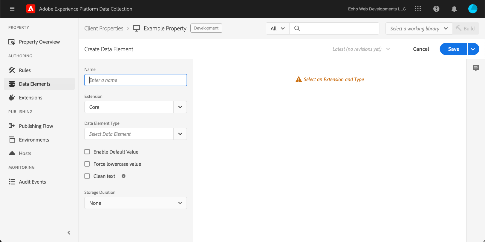

# Ladda upp och implementera testning från början till slut

>[!NOTE]
>
>Adobe Experience Platform Launch har omprofilerats till en serie tekniker för datainsamling i Adobe Experience Platform. Som ett resultat av detta har flera terminologiska förändringar genomförts i produktdokumentationen. Se följande [dokument](../../term-updates.md) för en konsoliderad referens av terminologiändringarna.

Om du vill testa taggtillägg i Adobe Experience Platform använder du taggens API och/eller kommandoradsverktygen för att överföra dina tilläggspaket. Använd sedan användargränssnittet i Experience Platform eller datainsamlingen för att installera tilläggspaketet i en egenskap och använda funktionerna i ett taggbibliotek och skapa det.

I det här dokumentet beskrivs hur du implementerar kompletta tester för ditt tillägg.

>[!NOTE]
>
>Den här guiden förutsätter att du använder MacOS med Node.js och npm installerade och tillgängliga.

## Validera tillägget {#validate}

När ditt team är nöjd med hur tillägget fungerar och vilka resultat de ser i [sandlådeverktyget](https://www.npmjs.com/package/@adobe/reactor-sandbox#running-the-sandbox) bör du vara redo att överföra tilläggspaketet till taggar.

Innan du överför filen kontrollerar du att det finns obligatoriska fält eller inställningar. Om du till exempel granskar ditt [tilläggsmanifest](../manifest.md), din [tilläggskonfiguration](../configuration.md), dina [vyer](../web/views.md) och dina [biblioteksmoduler](../web/format.md) (minst) är det bra rutin.

Ett specifikt exempel är din logotypfil: Lägg till en `"iconPath": "example.svg",`-rad i din `extension.json`-fil och ta med den logotypbilden i ditt projekt. Det här är den relativa sökvägen till ikonen som ska visas för tillägget. Det ska inte börja med ett snedstreck. Den måste referera till en SVG-fil med tillägget `.svg`. SVG bör visas normalt när den återges fyrkantig och kan skalas av användargränssnittet. Mer information finns i artikeln [Så här skalförändrar du SVG](https://css-tricks.com/scale-svg/).

>[!NOTE]
>
>För offentliga tillägg måste du inkludera ett objekt i `extension.json` med en länk till Exchange-listan. Ditt [tilläggsmanifest](../manifest.md) ska innehålla en post som den här: `"exchangeUrl":"https://www.adobeexchange.com/experiencecloud.details.12345.html"` som pekar på URL:en för Exchange-listan.

## Integrera Adobe I/O {#integration}

Om du vill använda API:t eller kommandoradsverktygen behöver du ett tekniskt konto hos Adobe I/O. Du måste skapa det tekniska kontot i I/O-konsolen och sedan använda verktyget Överför för att överföra tilläggspaketet.

Mer information om hur du skapar ett tekniskt konto som ska användas med taggar i Adobe Experience Platform finns i handboken [Reactor API Getting Started](../../api/getting-started.md) .

>[!IMPORTANT]
>
>För att kunna skapa en integrering i Adobe I/O måste du vara Experience Cloud organisationsadministratör eller Experience Cloud Organisationsutvecklare.

Om du inte kan skapa en integrering är det troligtvis så att du inte har rätt behörighet. Detta kräver antingen en organisationsadministratör för att slutföra stegen åt dig eller för att du ska kunna utses till utvecklare.

## Överför ditt tilläggspaket {#upload}

Nu när du har inloggningsuppgifter kan du testa tilläggspaketet från början till slut.

När du först överför ditt tilläggspaket får det statusen `development`. Det innebär att det bara är synligt för din egen organisation, och bara med en egenskap som har markerats för tilläggsutveckling.

Använd kommandoraden för att köra följande kommando i katalogen som innehåller ditt ZIP-paket.

```bash
npx @adobe/reactor-uploader
```

Med `npx` kan du hämta och köra ett npm-paket utan att installera det på datorn. Detta är det enklaste sättet att köra Uploader.

>[!NOTE]
> Som standard förväntas Adobe I/O-autentiseringsuppgifter för ett Oauth-flöde mellan servrar. De gamla `jwt-auth`-autentiseringsuppgifterna
> kan användas genom att köra `npx @adobe/reactor-uploader@v5.2.0` tills borttagningen är den 1 januari 2025. De parametrar som krävs
> för att köra `jwt-auth`-versionen finns [här](https://github.com/adobe/reactor-uploader/tree/cdc27f4f0e9fa3136b8cd5ca8c7271428b842452).

Överföraren kräver att du bara anger ett fåtal delar av informationen. `clientId` och `clientSecret` kan hämtas från Adobe I/O-konsolen. Navigera till [integreringssidan](https://console.adobe.io/integrations) i I/O-konsolen. Välj rätt organisation i listrutan, hitta rätt integrering och välj **[!UICONTROL View]**.

- Vad är din `clientId`? Kopiera och klistra in det här från I/O-konsolen.
- Vad är din `clientSecret`? Kopiera och klistra in det här från I/O-konsolen.
- Om du anropar den som laddar upp filen från den katalog som innehåller ditt ZIP-paket kan du bara välja den i listan i stället för att skriva sökvägen.

Tilläggspaketet kommer sedan att överföras och den överförande filen ger dig ID:t för extension_package.

>[!NOTE]
>
>Vid överföring eller korrigering placeras tilläggspaket i ett väntande läge medan systemet extraherar paketet och distribuerar asynkront. När den här processen pågår kan du avfråga `extension_package`-ID:t om dess status med API:t och gränssnittet. Ett tilläggskort visas i katalogen som är markerad som Väntande.

>[!NOTE]
>
>Om du tänker köra överföringen ofta kan det vara en börda att skicka all den här informationen varje gång. Du kan också skicka dessa som argument från kommandoraden. Mer information finns i avsnittet [Kommandoradsargument](https://www.npmjs.com/package/@adobe/reactor-uploader#command-line-arguments) i NPM-dokumenten.

Om du vill hantera överföringen av tillägget med API:t direkt kan du läsa exempelanropen för [skapa](../../api/endpoints/extension-packages.md/#create) eller [uppdatera](../../api/endpoints/extension-packages.md#update) ett tilläggspaket i API-dokumenten för mer information.

## Skapa en utvecklingsegenskap {#property}

När du har loggat in i användargränssnittet och väljer **[!UICONTROL Tags]** i den vänstra navigeringen visas skärmen [!UICONTROL Properties]. En egenskap är en behållare för de taggar som du vill distribuera och den kan användas på en eller flera platser.


Du kommer inte att se några egenskaper på skärmen första gången du loggar in. Välj **Ny egenskap** om du vill skapa en. Ange ett namn och en URL. Använd URL-adressen till testwebbplatsen eller den sida där du testar tillägget. Det här domänfältet kan användas av vissa tillägg eller av ett villkor med Core-tillägget.

>[!NOTE]
>
>`localhost` fungerar inte som ett URL-värde. Använd i stället ett standardvärde för testning om du använder en `localhost`-URL. Exempel: example.com.

Om du vill använda den här egenskapen för tilläggstestning måste du expandera **ADVANCED OPTIONS** och markera kryssrutan för **Konfigurera för tilläggstestning**.


Välj **Spara** längst ned om du vill spara den nya egenskapen.

Skärmen Egenskaper visas. Välj namnet på den egenskap som du nyss skapade. Skärmen Egenskapsöversikt visas. Den innehåller länkar till varje område i systemet med de globala navigeringslänkarna i kolumnen till vänster.

## Installera tillägget {#install-extension}

Om du vill installera tillägget i den här egenskapen väljer du länken **Tillägg** i huvudnavigeringslänkarna i den vänstra kolumnen. Tillägget **Core** visas på skärmen **Installed**. Tillägget Core innehåller alla tagghanteringsfunktioner i datainsamlingen.


Om du vill lägga till tillägget väljer du fliken **Katalog**.


Katalogen visar kortikoner för varje tillgängligt tillägg. Om tillägget inte visas i katalogen kontrollerar du att du har slutfört stegen ovan i avsnitten Konfigurera och Skapa tilläggspaket i Adobe Administration Console. Tilläggspaketet kan också visas som Väntande om Experience Platform inte har slutfört den inledande bearbetningen.

Om du har följt de föregående stegen och fortfarande inte ser något väntande eller misslyckat tilläggspaket i katalogen, bör du kontrollera status för tilläggspaketet direkt med API:t. Mer information om hur du gör rätt API-anrop finns i [Hämta ett ExtensionPackage](../../api/endpoints/extension-packages.md#lookup) i API-dokumentationen.

När tilläggspaketet har bearbetats väljer du **Installera** längst ned på kortet.


Konfigurationsskärmen öppnas (förutsatt att tillägget har ett). Lägg till information som behövs för att konfigurera tillägget och välj **Spara** längst ned. I det här exemplet på konfigurationsskärmen används Facebook-tillägget som kräver ett Pixel-ID.


Nu bör du se skärmen **Installed** extensions med Core-tillägget och ditt tillägg.


## Skapa resurser för att testa tillägget {#resources}

Tillägg ger nya funktioner för användare av Adobe Experience Platform. Dessa visas vanligtvis i Data Elements eller i Regelbyggaren.

### Dataelement

Syftet med taggdataelement är att hjälpa användarna att behålla värden. Varje dataelement är en mappning eller pekare till källdata. Ett enskilt dataelement är en variabel som kan mappas till frågesträngar, URL:er, cookie-värden, JavaScript-variabler osv. Välj **Dataelement** i det vänstra navigeringsfältet och **Skapa nytt dataelement**.


Tillägg kan definiera dataelementtyper om det behövs för att tillägget ska fungera, eller helt enkelt som en smidighet för användarna. När ett tillägg innehåller dataelementtyper visas de i en listruta för användare på skärmen **Skapa dataelement**:



När en användare väljer ditt tillägg i listrutan **Tillägg** fylls listrutan **Dataelementtyp** i med eventuella dataelementtyper som anges av tillägget. Användaren kan sedan mappa varje dataelement till dess källvärde. Dataelement kan sedan användas när du skapar regler i Ändra dataelement eller Anpassad kodhändelse för att aktivera en regel som ska köras. Ett dataelement kan också användas i Dataelementvillkor eller andra villkor, undantag eller åtgärder i en regel.

När dataelementet har skapats (mappningen har konfigurerats) kan användarna referera till källdata genom att referera till dataelementet. Om värdekällan ändras (omdesign av webbplatser osv.) behöver användarna bara uppdatera mappningen en gång i användargränssnittet och alla dataelement får automatiskt det nya källvärdet.

### Regler

Markera länken **Regler** i den vänstra navigeringen och **Skapa ny regel**.


Ange först ett beskrivande namn för regeln. Skärmen **Skapa regel** är konfigurerad som en `if-then`-sats.


Om en händelse inträffar och villkoren skickas, och det inte finns några undantag, utlöses åtgärden. Samma flöde finns i tillägg där du kan skapa eller återanvända händelser, villkor, undantag, dataelement eller åtgärder.

Med hjälp av exemplet med Facebook-tillägget lägger du till en händelse för varje gång en sida läses in på testwebbplatsen.


Händelsetypen `Window Loaded` **Händelsetyp** säkerställer att den här regeln aktiveras varje gång en sida läses in på testwebbplatsen. Välj **Behåll ändringar**. I det här exemplet ignorerar du **Villkor** eftersom regeln ska aktiveras för alla sidor på testwebbplatsen.

Under **ÅTGÄRDER** väljer du **Lägg till**. Skärmen **Åtgärdskonfiguration** visas.Sedan måste du välja vilket tillägg regeln ska tillämpas på och vilken åtgärd som ska utföras när regeln aktiveras. Välj **Facebook-pixel** i listrutan **Tillägg** och **Skicka sidvy** i listrutan **Åtgärdstyp**. Välj **Behåll ändringar** och sedan **Spara** på följande skärm: **Redigera regel**.


När du testar tillägget ska du välja relevanta händelser, villkor osv. tillhandahålls av ditt tillägg enligt ett valfritt antal regler.

## Publicera ändringarna {#publish}

I huvudnavigeringen väljer du **Publicera** och sedan på länken **Lägg till nytt bibliotek** :


Ett bibliotek är en uppsättning instruktioner för hur tillägg, dataelement och regler ska samverka med varandra och med en webbplats. Biblioteken kompileras till byggen. Ett bibliotek kan innehålla så många ändringar som en användare känner sig bekväm med att göra eller testa samtidigt.

Lägg till ett namn i textfältet **Namn** på skärmen **Skapa bibliotek**. Taggar innehåller en standardutvecklingsmiljö med namnet **Development**. Välj **Utveckling** i listrutan **Miljö**. Lägg till alla tillgängliga resurser för enkelhetens skull. Välj **Lägg till alla ändrade resurser** och välj sedan **Spara**.

>[!NOTE]
>
>När du lägger till en resurs i ett bibliotek tas en ögonblicksbild av resursen från och med den tidpunkten och läggs till i biblioteket. När du ändrar resurser senare (till exempel på grund av korrigeringar som du måste göra) måste du även uppdatera biblioteket så att det innehåller de senaste ändringarna av resurserna. Knappen **Lägg till alla ändrade resurser** är även användbar för detta ändamål.


Nu när alla ändringar har inkluderats i det nyligen skapade biblioteket (med namnet **dev** i det angivna exemplet) väljer du **Spara och skapa till utveckling**.


När byggprocessen har slutförts visas en grön **success** -indikator bredvid biblioteksnamnet.


Taggbiblioteket är nu publicerat och tillgängligt för användning. Testsidan måste använda det nya biblioteket för att testa sidbeteendet för slutanvändaren i en webbläsare.

## Installera taggar på en testplats {#install-data-collection-tags}

Installationsanvisningar finns på fliken Miljöer. På den här sidan visas alla tillgängliga miljöer och du kan även skapa fler. När biblioteket publicerades i utvecklingsmiljön markerar du ruteikonen i kolumnen **INSTALL** på raden **Utveckling**.


Dialogrutan **Instruktioner för webbinstallation** för utvecklingsmiljön visas. Markera kopieringsikonen om du vill kopiera hela taggen `<script>`.


Slutför installationen genom att placera den här enstaka `<script>`-taggen i `<head>`-avsnittet i dokumentet eller webbplatsmallen. Gå sedan till testwebbplatsen för att undersöka hur ditt publicerade taggbibliotek fungerar.

## Test {#test}

Nedan följer en lista med användbara konsolkommandon för att validera tillägget på testsidan eller -platsen.

- `_satellite.setDebug(true);` aktiverar felsökningsläge och skickar användbara loggningsprogramsatser till konsolen.
- Objektet `_satellite._container` innehåller användbar information om det distribuerade biblioteket, inklusive information om Build, Data Elements, Rules och Extensions.

Syftet med den här testningen är att kontrollera funktionaliteten i det distribuerade biblioteket och se till att tilläggspaketet beter sig som förväntat efter att det har registrerats i ett bibliotek.

När du upptäcker ändringar som behöver göras i tilläggspaketet liknar iterationsprocessen utvecklingsprocessen.

1. Gör ändringar i koden i ditt projekt.
1. Validera ändringarna med sandlådeverktyget.
1. Skapa ett nytt ZIP-paket med Packager-verktyget
1. Använd verktyget Överför för att överföra ditt nya ZIP-paket. Processen följer samma instruktioner som tidigare när det gäller den inledande överföringen. Eftersom det redan finns ett tilläggspaket med det namnet i utvecklingsläget skriver det nya paketet över den äldre versionen i stället för att skapa ett nytt.

   >[!NOTE]
   >
   >Argument kan skickas på kommandoraden för att spara tid genom att undvika upprepade inloggningsuppgifter. Mer information finns i [dokumentationen för uppladdning av reaktor](https://www.npmjs.com/package/@adobe/reactor-uploader).
1. Installationssteget kan hoppas över när du uppdaterar ett befintligt paket.
1. Ändra resurser - om konfigurationen för någon av dina tilläggskomponenter har ändrats måste du uppdatera de resurserna i användargränssnittet.
1. Lägg till de senaste ändringarna i biblioteket och bygg igen.
1. Komplettera ytterligare en testomgång.
