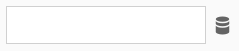

# Vyer i webbtillägg

>[!NOTE]
>
>Adobe Experience Platform Launch har omprofilerats till en serie tekniker för datainsamling i Adobe Experience Platform. Som ett resultat av detta har flera terminologiska förändringar genomförts i produktdokumentationen. Se följande [dokument](../../term-updates.md) för en konsoliderad referens av terminologiändringarna.

Varje händelse, villkor, åtgärd eller dataelementtyp kan innehålla en vy som gör att användaren kan ange inställningar. Tillägget kan också ha en [tilläggskonfigurationsvy](../configuration.md) på den översta nivån, som gör att användare kan ange globala inställningar för hela tillägget. Processen att skapa en vy är identisk för alla typer av vyer.

## Inkludera en dokumenttyp

Se till att du inkluderar en `doctype`-tagg i din HTML-fil. Vanligtvis innebär det att du börjar med en HTML-fil med följande:

```xml
<!DOCTYPE html>
```

## Inkludera taggarnas iframe-skript

Inkludera taggar i iframe-skript i vyns HTML:

```html
<script src="https://assets.adobedtm.com/activation/reactor/extensionbridge/extensionbridge.min.js"></script>
```

Skriptet innehåller ett kommunikations-API som gör att vyn kan kommunicera med taggprogrammet.

## Registrering med tilläggsbryggans kommunikations-API

När iframe-skriptet har lästs in måste du ange några metoder för taggar som det ska använda för kommunikation. Anropa `window.extensionBridge.register` och skicka ett objekt enligt följande:

```js
window.extensionBridge.register({
  init: function(info) {
    // Populate view with info.settings which will exist if the user is editing something
    // that was previously saved.
    if (info.settings) {
      document.getElementById('name').value = info.settings.name;
    }
  },
  validate: function() {
    // Return whether the view is valid.
    return document.getElementById('name').value.length > 0;
  },
  getSettings: function() {
    // Return user-provided settings.
    return {
      name: document.getElementById('name').value
    };
  }
});
```

Innehållet i varje metod måste ändras för att passa dina visningsbehov.

### [!DNL init]

Metoden `init` anropas av taggar så snart vyn har lästs in i iframe. Det kommer att skicka ett enskilt argument (`info`) som måste vara ett objekt som innehåller följande egenskaper:

| Egenskap | Beskrivning |
| --- | --- |
| `settings` | Ett objekt som innehåller inställningar som tidigare sparats från den här vyn. Om `settings` är `null` anger det att användaren skapar de ursprungliga inställningarna i stället för att läsa in en sparad version. Om `settings` är ett objekt bör du använda det för att fylla i vyn eftersom användaren väljer att redigera de tidigare beständiga inställningarna. |
| `extensionSettings` | Inställningar som har sparats från tilläggskonfigurationsvyn. Det här kan vara användbart för att komma åt tilläggsinställningar i vyer som inte är tilläggskonfigurationsvyn. Om den aktuella vyn är tilläggskonfigurationsvyn använder du `settings`. |
| `propertySettings` | Ett objekt som innehåller inställningar för egenskapen. Mer information om vad som finns i det här objektet finns i [handboken för turbinobjektet](../turbine.md#property-settings). |
| `tokens` | Ett objekt som innehåller API-token. Om du vill få åtkomst till Adobe API:er inifrån vyn måste du vanligtvis använda en IMS-token under `tokens.imsAccess`. Denna token blir bara tillgänglig för tillägg som utvecklats av Adobe. Om du är en Adobe-anställd som representerar ett tillägg som har skapats av Adobe [skickar du ett e-postmeddelande till datainsamlingsingenjörsteamet](mailto:reactor@adobe.com) och anger namnet på tillägget så att vi kan lägga till det i tillåtelselista. |
| `company` | Ett objekt som innehåller en enda egenskap, `orgId`, som i sin tur representerar ditt Adobe Experience Cloud-id (en 24-siffrig alfanumerisk sträng). |
| `schema` | Ett objekt i formatet [JSON Schema](https://json-schema.org/). Det här objektet kommer från [tilläggsmanifestet](../manifest.md) och kan vara användbart när du validerar formuläret. |

Vyn bör använda den här informationen för att återge och hantera formuläret. Det är troligt att du bara behöver hantera `info.settings`, men den andra informationen tillhandahålls om det är nödvändigt.

### [!DNL validate]

Metoden `validate` anropas när användaren har kommit till knappen Spara. Den ska returnera något av följande:

* Ett booleskt värde som anger om användarens indata är giltiga.
* Ett löfte att senare matchas med ett booleskt värde som anger om användarens indata är giltiga.

Det är upp till dig som tilläggsutvecklare att avgöra vad som är giltiga indata eftersom din biblioteksmodul kommer att reagera på dessa indata.

Om användarens indata är ogiltiga, visa en indikation på detta i din vy så att användarna vet vad som behöver korrigeras.

### [!DNL getSettings]

Metoden `getSettings` anropas när användaren har kommit till knappen Spara och vyn har validerats. Funktionen ska returnera något av följande:

* Ett objekt som innehåller inställningar baserade på användarindata.
* Ett löfte att senare lösas med ett objekt som innehåller inställningar som baseras på användarindata.

Det här inställningsobjektet kommer senare att skickas i taggens körningsbibliotek. Objektets innehåll bestäms av dig. Objektet måste kunna serialiseras och avserialiseras till och från JSON. Värden som funktioner eller [RegExp](https://developer.mozilla.org/en-US/docs/Web/JavaScript/Reference/Global_Objects/RegExp)-instanser uppfyller inte dessa villkor och är därför inte tillåtna.

## Använd delade vyer

Objektet `window.extensionBridge` har flera metoder som gör att du kan dra nytta av befintliga vyer som är tillgängliga via taggar så att du inte behöver återskapa dem i vyn. Följande metoder är tillgängliga:

### [!DNL openCodeEditor]

```js
window.extensionBridge.openCodeEditor().then(function(code) { 
  console.log(code);
});
```

Om den här metoden anropas visas ett modalt kodfragment som gör att användaren kan redigera ett kodfragment. När användaren är klar med redigeringen av koden löses löftet med den uppdaterade koden. Om användaren stänger kodredigeraren utan att välja att spara ändringar kommer löftet aldrig att lösas. Objektet `options` ska struktureras på följande sätt:

| Egenskap | Beskrivning |
| --- | --- |
| `code` | Kod som ska visas i redigeraren. Detta anges vanligtvis när användaren redigerar befintlig kod. Om detta inte anges kommer kodredigeraren att vara tom när den öppnas. |
| `language` | Språket för koden som ska redigeras. Giltiga alternativ är `javascript`, `html`, `css`, `json` och `plaintext`. Om detta inte anges antas `javascript`. |

### [!DNL openRegexTester]

```js
window.extensionBridge.openRegexTester().then(function(pattern) { 
  console.log(pattern);
});
```

Om den här metoden anropas visas ett modalt uttryck som gör att användaren kan testa och ändra ett mönster för reguljära uttryck. När användaren har redigerat det reguljära uttrycket löses löftet med det uppdaterade mönstret för reguljära uttryck. Om användaren stänger regex-testaren utan att välja att spara ändringarna kommer löftet aldrig att lösas. Objektet `options` ska innehålla följande egenskaper:

| Egenskap | Beskrivning |
| --- | --- |
| `pattern` | Det reguljära uttrycksmönstret som ska användas som startvärde för mönsterfältet inuti provaren. Detta anges vanligtvis när användaren redigerar ett befintligt reguljärt uttryck. Om detta inte anges kommer mönsterfältet till att börja med att vara tomt. |
| `flags` | De flaggor för reguljära uttryck som ska användas av provaren. Som ett exempel skulle `gi` indikera den globala matchningsflaggan och flaggan för ignorerade fall. Dessa flaggor kan inte ändras av användaren i testaren, men används för att demonstrera de specifika flaggor som tillägget kommer att använda när det reguljära uttrycket körs. Om detta inte anges kommer inga flaggor att användas i provaren. Mer information om flaggor för reguljära uttryck finns i [MDN:s RegExp-dokumentation](https://developer.mozilla.org/en-US/docs/Web/JavaScript/Reference/Global_Objects/RegExp).<br><br>Ett vanligt scenario är ett tillägg som gör att användare kan växla skiftlägeskänslighet för ett reguljärt uttryck. För att detta ska fungera måste tillägget vanligtvis ha en kryssruta i tilläggsvyn som, när den är markerad, aktiverar skiftlägesokänslighet (representeras av flaggan `i`). Inställningsobjektet som sparas av vyn måste representera om kryssrutan är markerad så att biblioteksmodulen som kör det reguljära uttrycket kan veta om flaggan `i` ska användas. När tilläggsvyn vill öppna den reguljära uttrycksprovaren måste flaggan `i` skickas om kryssrutan för skiftlägesokänslighet är markerad. Detta gör att användaren kan testa det reguljära uttrycket med aktiverad skiftlägeskänslighet. |

### [!DNL openDataElementSelector] {#open-data-element}

```js
window.extensionBridge.openDataElementSelector().then(function(dataElement) { 
  console.log(dataElement);
});
```

Om den här metoden anropas visas ett modalt element som gör att användaren kan välja ett dataelement. När användaren har valt ett dataelement kommer löftet att lösas med namnet på det valda dataelementet (namnet kommer som standard att omslutas av procenttecken). Om användaren stänger elementväljaren utan att välja att spara ändringar kommer löftet aldrig att lösas.

Objektet `options` ska innehålla en enda boolesk egenskap, `tokenize`. Den här egenskapen anger om namnet på det markerade dataelementet ska radbrytas i procent innan löftet löses. I avsnittet [Supporting data elements](#supporting-data-elements) finns mer information om varför detta är användbart. Det här alternativet är som standard `true`.

## Stöd för dataelement {#supporting-data-elements}

Dina vyer har antagligen formulärfält där användarna vill utnyttja dataelement. Om vyn t.ex. innehåller ett textfält där användaren ska ange ett produktnamn, kan det vara svårt att skriva in ett hårdkodat värde i fältet. I stället kanske de vill att fältets värde ska vara dynamiskt (bestämmas vid körning) och kan uppnå detta genom att använda ett dataelement.

Anta till exempel att vi skapar ett tillägg som skickar en signal för att spåra en konvertering. Låt oss också anta att en av de data som vår beacon skickar är ett produktnamn. Vår tilläggsvy som gör att användaren kan konfigurera beacon har förmodligen ett textfält för produktnamnet. Normalt skulle det inte vara särskilt vettigt för Experience Platform-användaren att skriva in ett statiskt produktnamn som &quot;Calzone Oven XL&quot;, eftersom produktnamnet troligen är beroende av vilken sida som beacon ska skickas från. Detta är ett bra exempel på ett dataelement.

Om en användare vill använda dataelementet `productname` som produktnamnsvärde kan de skriva namnet på dataelementet med procenttecken på båda sidor (`%productname%`). Vi kallar ett procenttecken för ett dataelementnamn som en&quot;dataelementtoken&quot;. Användare av Experience Platform känner ofta till denna konstruktion. Ditt tillägg skulle i sin tur spara dataelementstoken i det `settings`-objekt som exporteras. Inställningsobjektet kan då se ut så här:

```js
{
  productName: '%productname%'
}
```

Innan inställningsobjektet skickas till biblioteksmodulen skannas inställningsobjektet och alla variabler för dataelement ersätts med deras respektive värden. Om värdet för dataelementet `productname` var `Ceiling Medallion Pro 2000` vid körning, skulle inställningsobjektet som skulle skickas till din biblioteksmodul vara följande:

```js
{
  productName: 'Ceiling Medallion Pro 2000'
}
```

För att ange var det kan vara praktiskt för användarna att använda dataelement och för att göra det enkelt för användarna att ange ett dataelement, rekommenderar vi att du lägger till en ikonknapp bredvid de fält som visas här:



>[!NOTE]
>
>Om du vill hämta rätt ikon går du till sidan [ikoner i Adobe Spectrum](https://spectrum.adobe.com/page/icons/) och söker efter [!DNL Data].

När knappen bredvid textfältet markeras av en användare, anropar du `window.extensionBridge.openDataElementSelector` som [enligt ovan](#open-data-element). Då visas en lista med användarens dataelement som användaren kan välja bland i stället för att tvinga användaren att komma ihåg tecknen för namn och procent. När användaren har valt ett dataelement får du namnet på det markerade dataelementet omgivet av procenttecken (om du inte har angett alternativet `tokenize` till `false`). Vi rekommenderar att du sedan fyller i textfältet med resultatet.

### Ersätta dataelementstoken

Om ett beständigt inställningsobjekt bestod av följande:

```js
{
  productName: '%productname%'
}
```

Vid körning var värdet för dataelementet `productname` `Ceiling Medallion Pro 2000` och inställningsobjektet som skickas till biblioteksmodulen skulle vara följande:

```js
{
  productName: 'Ceiling Medallion Pro 2000'
}
```

När ett värde i ett inställningsobjekt som består av ett procenttecken påträffas, sedan en sträng, ett procenttecken, _och inget mer_, ersätts det av dataelementvärdet _utan att datavärdets typ_ ändras.

Om värdet för `productname` vid körning till exempel är talet `538` (inte en sträng), blir inställningsobjektet som skickas till din biblioteksmodul följande:

```js
{
  productName: 538
}
```

Observera att resultatet `538` är ett tal här och inte en sträng. Om dataelementvärdet vid körning var en funktion (ett sällsynt men möjligt användningsfall) blir det resulterande inställningsobjektet följande:

```js
{
  productName: function() { … }
}
```

Å andra sidan antar vi att det beständiga inställningsobjektet var följande:

```js
{
  productName: '%productname% - %modelnumber%'
}
```

I det här fallet kommer resultatet alltid att vara en sträng eftersom värdet för `productName` är mer än en enda dataelementtoken. Varje dataelementtoken ersätts med sitt respektive värde efter att ha bytt till en sträng. Om värdet för `productname` var `Ceiling Medallion Pro` (en sträng) och `modelnumber` var `2000` (ett tal) vid körning, skulle det resulterande inställningsobjektet som skickades till din biblioteksmodul vara:

```js
{
  productName: 'Ceiling Medallion Pro - 2000'
}
```

## Undvik navigering

Kommunikation mellan tilläggsvyn och det innehållande användargränssnittet för datainsamling är beroende av att ingen navigering sker i tilläggsvyn. Undvik därför att lägga till något i tilläggsvyn som skulle göra det möjligt för användaren att navigera bort från tilläggsvyns HTML-sida. Om du till exempel anger en länk i tilläggsvyn måste du se till att ett nytt webbläsarfönster öppnas (vanligtvis genom att lägga till `target="_blank"` till ankartaggen). Om du väljer att använda ett `form`-element i tilläggsvyn måste du se till att formuläret aldrig skickas. Om du har ett `button`-element i formuläret och inte lägger till `type="button"` i det kan det hända att formuläret skickas in av misstag. Om du skickar ett formulär i tilläggsvyn uppdateras HTML-dokumentet, vilket ger en trasig användarupplevelse.
