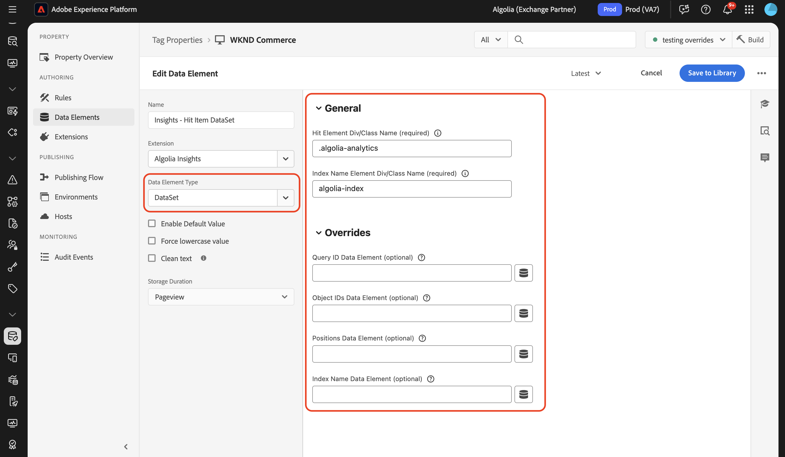

# Översikt över tillägget [!DNL Algolia] Taggar

Tillägget [!DNL Algolia] Taggar ger marknadsförarna möjlighet att enkelt konfigurera regler som skickar användarinteraktionsdata till [!DNL Algolia], vilket hjälper dig att leverera mer personaliserade AI-söknings- och identifieringsupplevelser.

Det här tillägget drivs av en nyckelfunktion:

* **[!DNL Algolia]Insikter**: Hämtar och skickar automatiskt användarinteraktionshändelser till [!DNL Algolia], vilket möjliggör kraftfull analys, personaliserade upplevelser och förbättrad sökrelevans.

## Förhandskrav {#prerequisites}

Du måste ha ett giltigt [!DNL Algolia]-konto för att kunna använda det här tillägget. Gå till [[!DNL Algolia] registreringssidan](https://dashboard.algolia.com/users/sign_up) och skapa ett konto om du inte redan har ett.

### Samla nödvändig konfigurationsinformation {#configuration-details}

Om du vill ansluta [!DNL Algolia] till Adobe Experience Platform behöver du följande information:

| Autentiseringsuppgifter | Beskrivning | Exempel |
| --- | --- | --- |
| Program-ID | Ditt program-ID finns i avsnittet [API-nycklar](https://www.algolia.com/account/api-keys/all) på [!DNL Algolia]-instrumentpanelen. | 0ABCDEFG12 |
| API-nyckel för sökning | Du hittar API-nyckeln för sökning i avsnittet [API-nycklar](https://www.algolia.com/account/api-keys/all) på [!DNL Algolia]-instrumentpanelen. | 1234a12345678901b1234567890c1ab1 |

## Installera och konfigurera [!DNL Algolia] Insights-tillägget {#install-configure}

Om du vill installera tillägget [!DNL Algolia] Insights går du till [!UICONTROL Data Collection UI] och väljer **[!UICONTROL Tags]** i den vänstra navigeringen. Här väljer du en egenskap som tillägget ska läggas till i eller skapar en ny egenskap i stället.

När du har markerat eller skapat den önskade egenskapen väljer du **[!UICONTROL Extensions]** i den vänstra navigeringen och väljer sedan fliken **[!UICONTROL Catalog]**. Sök efter [!DNL Algolia] Insights-kortet och välj sedan **[!UICONTROL Install]**.


I konfigurationsvyn som visas måste du ange följande information:

| Egenskap | Beskrivning |
| --- | --- |
| Program-ID | Ange [!UICONTROL Application Id] som du redan har samlat in i avsnittet [konfigurationsinformation](#configuration-details). |
| API-nyckel för sökning | Ange [!UICONTROL Search API Key] som du redan har samlat in i avsnittet [konfigurationsinformation](#configuration-details). |
| Indexnamn | [!UICONTROL Index Name] innehåller produkterna eller innehållet.  Det här indexet används som standard. |
| Användartokendataelement | Det dataelement som returnerar användartoken. |
| Autentiserat dataelement för användartoken | Ange det dataelement som returnerar den autentiserade användartoken. |
| Valuta | Välj en valutatyp.  Standardvärdet är `USD`. |


## Åtgärdstyper för tillägg av insikter för [!DNL Algolia] {#action-types}

[!DNL Algolia] stöder en uppsättning fördefinierade standardhändelser, var och en med specifika kontexter och egenskaper. De åtgärder som är tillgängliga i tillägget [!DNL Algolia] är anpassade till de här händelsetyperna, vilket gör det enkelt att kategorisera och konfigurera händelserna som du skickar till [!DNL Algolia] utifrån deras typ.

### Läs in insikter {#load-insights}

>[!NOTE]
>
>I de flesta fall bör du läsa in [!DNL Algolia]-insikter på alla sidor på din webbplats.

Lägg till åtgärden **[!UICONTROL Load Insights]** i din taggregel var det lämpligaste för inläsning av [!DNL Algolia]-insikter baserat på regelkontext. Den här åtgärden läser in biblioteket `search-insights.js` på sidan.

Skapa en ny taggregel eller öppna en befintlig. Definiera villkoren enligt dina krav, välj sedan **[!UICONTROL Algolia]** som [!UICONTROL Extension] och välj **[!UICONTROL Load Insights]** som [!UICONTROL Action Type].

| Egenskap | Beskrivning |
| --- | --- |
| [!UICONTROL Insight Library Version] | [!DNL Algolia] Insights-versionen. Standardvärdet är `2.13.0`. |
| [!UICONTROL User Opt Out Data Element] | Det dataelement som fångar användarens spårningspreferens. |
| [!UICONTROL Use User Token Cookie] | Markera den här kryssrutan om du vill tillåta [!DNL Algolia] att generera en användartokencookie. Som standard är det här alternativet inställt på `false`. |


### Klickat {#clicked}

Lägg till åtgärden **[!UICONTROL Click]** i taggregeln för att skicka klickade händelser till [!DNL Algolia]. Skapa en ny taggregel eller öppna en befintlig. Definiera villkoren enligt dina krav, välj sedan **[!UICONTROL Algolia]** som [!UICONTROL Extension] och välj **[!UICONTROL Clicked]** som [!UICONTROL Action Type].

| Egenskap | Beskrivning |
| --- | --- |
| [!UICONTROL Event Name] | Händelsenamnet som kan användas för att ytterligare förfina den här klickhändelsen. |
| Dataelement för händelseinformation | Dataelementet returnerar händelseinformation, inklusive: <ul><li>`indexName`</li><li>`objectIDs`</li><li>`queryID` (valfritt)</li><li>`position` (valfritt)</li></ul> |

>[!NOTE]
>
>Om både `queryID` och `position` ingår, klassificeras händelsen som **objekt-ID:n som klickats efter sökning**. Annars klassas den som en **klickad objekt-ID** -händelse.
>><br>
>>Om dataelementet inte innehåller någon `indexName` används **standardindexnamn** när händelsen skickas.


Mer information om händelsekategorierna finns i [Klickade objekt-ID:n efter sökning](https://www.algolia.com/doc/api-reference/api-methods/clicked-object-ids-after-search/)
och [Handböcker för objekt-ID:n som klickats ](https://www.algolia.com/doc/api-reference/api-methods/clicked-object-ids/) .

### Konverterad {#converted}

Lägg till åtgärden **[!UICONTROL Converted]** i taggregeln för att skicka konverterade händelser till [!DNL Algolia]. Skapa en ny taggregel eller öppna en befintlig. Definiera villkoren enligt dina krav, välj sedan **[!UICONTROL Algolia]** som [!UICONTROL Extension] och välj **[!UICONTROL Converted]** som [!UICONTROL Action Type].

| Egenskap | Beskrivning |
| --- | --- |
| Händelsenamn | Händelsenamnet som ska användas för att ytterligare förfina den här **convert**-händelsen. |
| Dataelement för händelseinformation | Dataelementet returnerar händelseinformation, inklusive: <ul><li>`indexName`</li><li>`objectIDs`</li><li>`queryID` (valfritt)</li></ul> |

>[!NOTE]
>
>Om dataelementet innehåller `queryId` klassas händelsen som **Konverterad efter sökning**. Annars kommer den att klassas som en **Konverterad**-händelse.
>><br>
>>Om dataelementet inte innehåller någon `indexName` används **standardindexnamn** när händelsen skickas.


Mer information om händelsekategorierna finns i handböckerna [Konverterade objekt-ID:n efter sökning](https://www.algolia.com/doc/api-reference/api-methods/converted-object-ids-after-search/) och [Konverterade objekt-ID:n](https://www.algolia.com/doc/api-reference/api-methods/converted-object-ids/).

### Tillagd i kundvagnen {#added-to-cart}

Lägg till åtgärden **[!UICONTROL Added to Cart]** i taggregeln för att skicka tillagda i kundvagnshändelser till [!DNL Algolia]. Skapa en ny taggregel eller öppna en befintlig. Definiera villkoren enligt dina krav, välj sedan **[!UICONTROL Algolia]** som [!UICONTROL Extension] och välj **[!UICONTROL Added to cart]** som [!UICONTROL Action Type].

| Egenskap | Beskrivning |
| --- | --- |
| Händelsenamn | Händelsenamnet som ska användas för att ytterligare förfina den här **convert**-händelsen. |
| Dataelement för händelseinformation | Dataelementet returnerar händelseinformation, inklusive: <ul><li>`indexName`</li><li>`objectIDs`</li><li>`objectData`<ul><li>`queryID` (valfritt)</li><li>`price`</li><li>`quantity`</li><li>`discount`</li></ul></li><li>`queryID` (valfritt)</li></ul>. |
| Valuta | Anger valutatypen, till exempel `USD`. |

>[!NOTE]
>
>Om dataelementet innehåller `queryId` kommer händelsen att klassas som **Added to cart object IDs after Search**. I annat fall kommer den att klassas som en **tillagd i cart-objekt-ID:n** .
>><br>
>>Om dataelementet inte innehåller någon `indexName` används **standardindexnamn** när händelsen skickas.
>><br>
>>Om standarddataelementen inte uppfyller dina krav kan ett anpassat dataelement skapas för att returnera den önskade händelseinformationen.


Mer information om händelsekategorierna finns i [Added to cart object IDs after search](https://www.algolia.com/doc/api-reference/api-methods/added-to-cart-object-ids-after-search/) and [Added to cart object IDs](https://www.algolia.com/doc/api-reference/api-methods/added-to-cart-object-ids/) guides.

### Köpt {#purchased}

Lägg till åtgärden **[!UICONTROL Purchased]** i taggregeln för att skicka köpta händelser till [!DNL Algolia]. Skapa en ny taggregel eller öppna en befintlig. Definiera villkoren enligt dina krav, välj sedan **[!UICONTROL Algolia]** som [!UICONTROL Extension] och välj **[!UICONTROL Purchased]** som [!UICONTROL Action Type].

| Egenskap | Beskrivning |
| --- | --- |
| Händelsenamn | Händelsenamnet som ska användas för att ytterligare förfina den här **purchase**-händelsen. |
| Dataelement för händelseinformation | Dataelementet returnerar händelseinformation, inklusive: <ul><li>`indexName`</li><li>`objectIDs`</li><li>`objectData`<ul><li>`queryID` (valfritt)</li><li>`price`</li><li>`quantity`</li><li>`discount`</li></ul></li><li>`queryID` (valfritt)</li></ul>. |
| Valuta | Anger valutatypen, till exempel `USD`. |

>[!NOTE]
>
>Om dataelementet innehåller `queryId` kommer händelsen att klassas som **Inköpta objekt-ID:n efter sökning**. Annars klassas den som en **Inköpt objekt-ID** -händelse.
>><br>
>>Om dataelementet inte innehåller någon `indexName` används **standardindexnamn** när händelsen skickas.
>><br>
>>Om standarddataelementen inte uppfyller dina krav kan ett anpassat dataelement skapas för att returnera den önskade händelseinformationen.


Mer information om händelsekategorierna finns i [Inköpta objekt-ID:n efter sökning](https://www.algolia.com/doc/api-reference/api-methods/purchased-object-ids-after-search/)
och [ Inköpta objekt-ID:n ](https://www.algolia.com/doc/api-reference/api-methods/purchased-object-ids/) .

### Visad {#viewed}

Lägg till åtgärden **[!UICONTROL Viewed]** i taggregeln för att skicka köpta händelser till [!DNL Algolia]. Skapa en ny taggregel eller öppna en befintlig. Definiera villkoren enligt dina krav, välj sedan **[!UICONTROL Algolia]** som [!UICONTROL Extension] och välj **[!UICONTROL Viewed]** som [!UICONTROL Action Type].

| Egenskap | Beskrivning |
| --- | --- |
| Händelsenamn | Händelsenamnet som ska användas för att ytterligare förfina den här **vyn**-händelsen. |
| Dataelement för händelseinformation | Dataelementet returnerar händelseinformation, inklusive: <ul><li>`indexName`</li><li>`objectIDs`</li></ul> |

>[!NOTE]
>
>Om dataelementet inte innehåller någon `indexName` används **standardindexnamn** när händelsen skickas.


Mer information om händelsen view finns i guiden [Visade objekt-ID](https://www.algolia.com/doc/api-reference/api-methods/viewed-object-ids/).

## Dataelement för [!DNL Algolia] Insights-tillägg {#data-elements}

[!DNL Algolia] har stöd för en uppsättning fördefinierade dataelement, där vart och ett har specifika kontexter och egenskaper. I följande avsnitt beskrivs de dataelement som är tillgängliga i [!DNL Algolia] Insights-tillägget.

### DataSet {#dataset}

DataSet Data Element hämtar data som är associerade med HTML-element, som sedan används i [!DNL Algolia]-åtgärder.

| Egenskap | Beskrivning |
| --- | --- |
| Träffelementets div/klassnamn | HTML-elementnamnet och/eller CSS-klassnamnet som innehåller datauppsättningsattributen inklusive `data-insights-object-id` och eventuellt `data-insights-query-id` och `data-insights-position` i HTML-elementet. |
| Element-Div/klassnamn för indexnamn | HTML-elementnamnet och/eller CSS-klassnamnet som har datauppsättningsattributen (`data-indexname`) i HTML-elementet. |



Detta dataelement returnerar:

```javascript
{
  timestamp,
  queryID,
  indexName,
  objectIDs,
  positions
}
```

Ett exempel på HTML som innehåller datauppsättningen:

```html
<div data-indexname="acme_master_default_products" class="instant-search-comp__hits">
  <div class="hit-card"
    data-insights-object-id="${hit.objectID}"
    data-insights-position="${hit.__position}"
    data-insights-query-id="${hit.__queryID}">
    <h4 class="hit-name">...</h4>   
  </div>
</div>
```

### Frågesträng {#query-string}

Dataelementet för frågesträngen extraherar data från URL-frågesträngen som ska användas i [!DNL Algolia]-åtgärder.

| Egenskap | Beskrivning |
| --- | --- |
| Param-namn för objekt-ID | Frågeparameternamnet som innehåller objekt-ID:t. |
| Namn på indexnamnsparam (valfritt) | Frågeparameternamnet som innehåller indexnamnet. |
| Fråge-ID-parameternamn (valfritt) | Frågeparameternamnet som innehåller fråge-ID:t. |
| Positionsparamn (valfritt) | Frågeparameternamnet som innehåller positionen. |


Detta dataelement returnerar:

```javascript
{
  timestamp,
  queryID,
  indexName,
  objectIDs
}
```

Ett exempel på HTML som innehåller frågeparametrar.

```
<a href="product.html?objectID=${hit.objectID}&queryID=${hit.__queryID}&indexName=${indexName}&position=${hit.position}">Read More</a>
```

### Lagring {#storage}

Lagringsdataelementet hämtar data från sessionslagring för användning i [!DNL Algolia] åtgärder.

Det här dataelementet hämtar händelseinformation från sessionslagring. Ingen konfiguration krävs. Data läggs automatiskt till under *click*-händelseåtgärden och tas bort under *convert* -händelseåtgärden.


Det här dataelementet returnerar det som lagras i sessionslagringen.

```javascript
{
  timestamp,
  queryID,
  indexName,
  objectIDs
}
```

## Klickad eller konverterad efter sökning {#clicked-converted-after-search}

Händelserna *som klickats efter sökning* eller *Konverterats efter sökning* kräver `queryId` och `position` krävs även för *klickade efter sökning*. De här egenskaperna är tillgängliga när flaggan `insights` aktiveras i parametrarna InstantSearch och/eller Autocomplete. Läs om följande resurser för att lära dig hur du konfigurerar insikter för din webbplats:

* [Ställa in insikter för Autocomplete](https://www.algolia.com/doc/ui-libraries/autocomplete/api-reference/autocomplete-js/autocomplete/#param-insights)
* [Ställa in insikter på InstantSearch.js](https://www.algolia.com/doc/guides/building-search-ui/events/js/#set-the-insights-option-to-true)
* [Kom igång med klicknings- och konverteringshändelser](https://www.algolia.com/doc/guides/sending-events/implementing/how-to/sending-events-backend/)
* [Skickar [!DNL Algolia] Insights-händelser](https://www.algolia.com/doc/ui-libraries/autocomplete/guides/sending-algolia-insights-events/)
* [[!DNL Algolia] Starta GitHub-databasen för tillägg](https://github.com/algolia/algolia-launch-extension)
* [InstantSearch.js-dokumentation](https://www.algolia.com/doc/guides/building-search-ui/what-is-instantsearch/js/)
* [[!DNL Algolia] API-dokumentation för insikter](https://www.algolia.com/doc/rest-api/insights/)
* [Algolia Launch Extension Code Repo](https://github.com/algolia/algolia-launch-extension)

## Nästa steg {#next-steps}

I den här guiden beskrivs hur du skickar data till [!DNL Algolia] med taggtillägget [!DNL Algolia Insights]. Om du planerar att även skicka händelser på serversidan till [!DNL Algolia] kan du nu fortsätta installera och konfigurera tillägget [[!DNL Conversions API] för vidarebefordran av händelser](../../server/algolia/overview.md).

Mer information om taggar i Experience Platform finns i [taggöversikten](../../../home.md).
