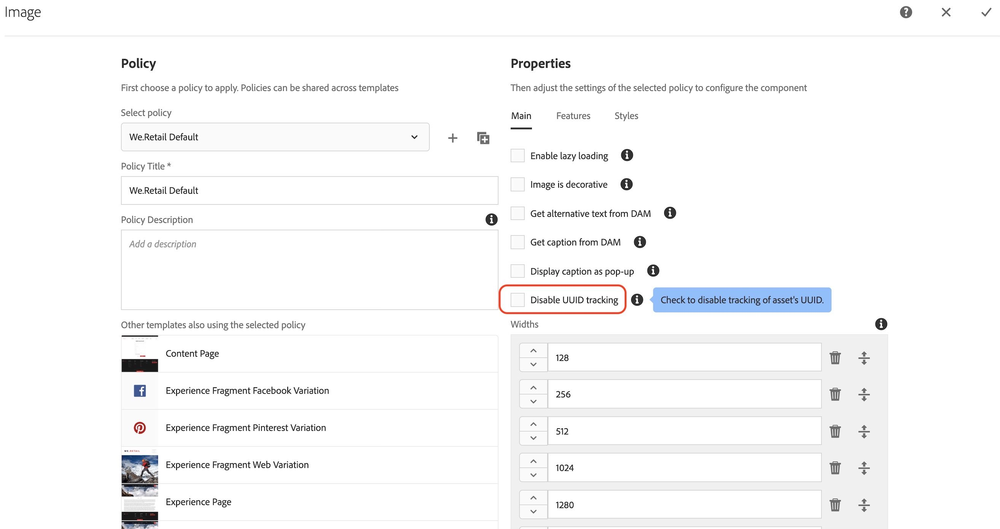
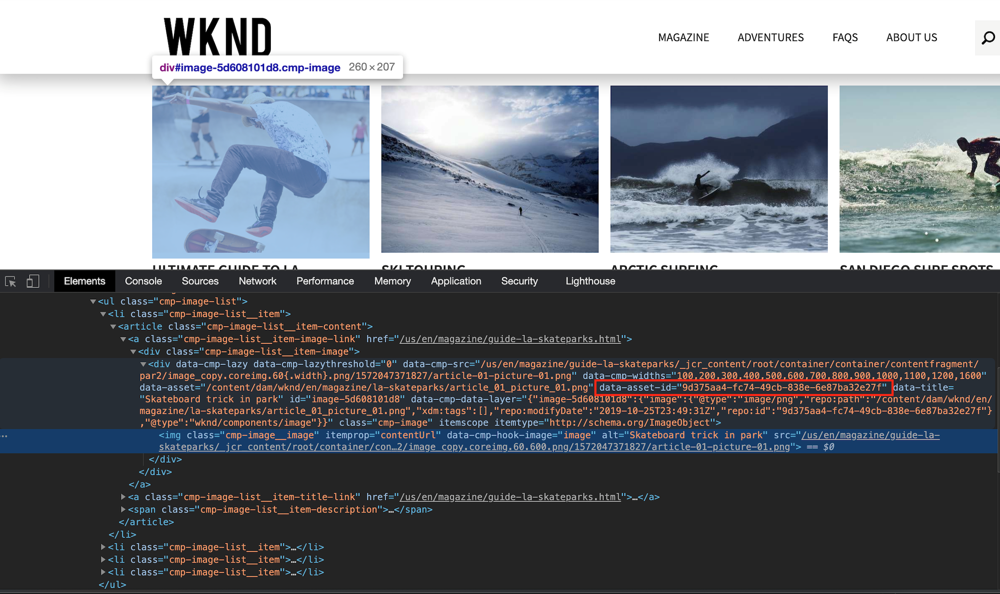

# Översikt över tillägget AEM Asset Insights

>[!NOTE]
>
>Adobe Experience Platform Launch har omprofilerats till en serie tekniker för datainsamling i Adobe Experience Platform. Som ett resultat av detta har flera terminologiska förändringar genomförts i produktdokumentationen. Se följande [dokument](../../../term-updates.md) för en konsoliderad referens av terminologiändringarna.

Det här tillägget är avsett att användas tillsammans med [AEM Asset Insights](https://experienceleague.adobe.com/docs/experience-manager-65/assets/managing/touch-ui-configuring-asset-insights.html). Mer specifikt ersätter den processen&quot;pageTracker&quot; och bäddar in kod. När det här tillägget är konfigurerat skickas mått för *Impression* och *Click* till Adobe Analytics, varefter de importeras till AEM tillgångsinsikter. Måtten på tillgångarna kan sedan rapporteras med hjälp av AEM resursinsikter eller Adobe Analytics projektarbetsytor.

## Förutsättningar för tillägg

### Analytics 

AEM Asset-rapporterna i Analytics innehåller tre AEM-dimensioner:

* Tillgångs-ID
* Resurs-Source
* Klickad resurs

Det finns också två mätvärden:
* Resursimpression
* Resursklickningar.

Rapporterna måste aktiveras med Analytics Administrator (välj **[!UICONTROL Analytics]> [!UICONTROL Admin] > [!UICONTROL Report Suites] > `<report suite>` > [!UICONTROL Edit Settings] > [!UICONTROL AEM] >[!UICONTROL AEM Assets Reporting]**) innan de kan fyllas i med det här tillägget.

Taggtillägget *Adobe Analytics* för Adobe Experience Platform måste installeras i samma webbegenskap.

### Adobe Experience Manager (AEM)

1. Aktivera [AEM-resursinsikter](https://experienceleague.adobe.com/docs/experience-manager-65/assets/managing/touch-ui-configuring-asset-insights.html). I AEM väljer du **[!UICONTROL Tools > Assets]** och öppnar sedan panelen **[!UICONTROL Insights Configuration]**.

1. Inaktivera UUID-spårning.

   >[!IMPORTANT]
   >
   >Tillägget *fungerar inte* om konfigurationsinställningen **[!UICONTROL Disable UUID Tracking]** för AEM-resurser är markerad. Den är avmarkerad som standard.

   

## Konfigurera Adobe Experience Manager (AEM)

I det här avsnittet beskrivs hur du konfigurerar AEM med taggar i Adobe Experience Platform, hur du aktiverar Asset Insight i AEM och hur du aktiverar UUID-spårning för Assets.

### Integrera AEM med taggar

Den rekommenderade integreringen av [Experience Platform](https://experienceleague.adobe.com/docs/experience-manager-learn/sites/integrations/experience-platform-launch/overview.html) med Adobe Experience Manager görs via Adobe I/O.

1. [Koppla AEM till taggar med Adobe I/O](https://experienceleague.adobe.com/docs/experience-manager-learn/sites/integrations/experience-platform-launch/connect-aem-launch-adobe-io.html).

2. [Skapa en Adobe Experience Platform Cloud Service-konfiguration](https://experienceleague.adobe.com/docs/experience-manager-learn/sites/integrations/experience-platform-launch/create-launch-cloud-service.html).

### Aktivera tillgångsinsikt i AEM

Instruktioner om hur du aktiverar tillgångsinsikter finns i användarhandboken för [Experience Manager 6.5 Assets](https://experienceleague.adobe.com/docs/experience-manager-65/assets/managing/touch-ui-configuring-asset-insights.html).

### Aktivera UUID-spårning för Assets

Spåra resurser i Analytics med hjälp av objektets UUID i AEM.

Om du vill aktivera spårning med objektets UUID öppnar du komponentprincipkonsolen för den redigerbara mallen och avmarkerar egenskapen Inaktivera UUID-spårning. (Som standard kontrolleras den här egenskapen för OOTB-bildkomponenten.)

När du har aktiverat UUID bör du se dataelementet&quot;data-asset-id&quot; som fylls med objektets UUID. Analytics spårar klickningen eller intrycket av resursen med detta UUID.

## Tilläggsanvändning

Tillägget har två händelser och en åtgärd.

* **Klickad resurs:** En _händelse_ som utlöses när besökaren väljer en AEM-resurs som är aktiverad för spårning och har ett mål (href-attribut).

* **Klickad resurs (inget mål):** En _händelse_ som utlöses när besökaren väljer en AEM-resurs som är aktiverad för spårning och som inte har något mål (inget href-attribut).

* **Ange AA-variabler:** En _åtgärd_ som anger vilka Analytics-variabler som är reserverade för AEM Assets (kontextdatavariabler `a.assets.source`, `a.assets.idlist` och `a.asset.clickedid`) beroende på vilken händelse som användes och hur händelsen och åtgärden har konfigurerats. Det här tillägget använder inte några Analytics-händelser, -props eller -variabler.

### Resursavtryck

Lägg till åtgärden Ange AA-variabler i en ny eller befintlig taggregel som aktiveras på varje sida och skickar en förfrågan om Analytics-bild. Åtgärden Ange AA-variabler måste visas **före** åtgärden Adobe Analytics - skicka Beacon. Ytterligare åtgärder kan läggas till efter behov.

På konfigurationssidan **[Ange A-variabler]** väljer du alternativet **[Visad Assets]** (standard). Detta ställer bara in Impressions-händelsen för resurser som faktiskt visas av besökaren.

>[!NOTE]
>
>Även om det inte rekommenderas stöder åtgärden Ange AA-variabler även ett inläst alternativ, som skickar materialavbildningar för varje resurs på sidan, oavsett om besökaren såg dem eller inte.

### Klickningar på resurs

Konfigurera en andra regel med hjälp av händelsen Klickad resurs och åtgärden Ange AA-variabler. Händelsen &quot;Resurs klickad&quot; bör konfigureras så att &quot;Bildbegäran klickad på resurs&quot; är inställd på &quot;Vid sidinläsning&quot; (standard). Den här regeln kräver inga Adobe Analytics-åtgärder (som Skicka Beacon) eftersom resurs-ID sparas i `sessionStorage` och skickas av den efterföljande Impressions-regeln.

Händelsen &quot;Klickad resurs&quot; stöder även inställningen &quot;Bildbegäran klickad på resurs&quot; som &quot;Vid klickning&quot;. Detta skickar klickmätningen till Analytics omedelbart och kräver även en Analytics-åtgärd,&quot;Send Beacon&quot;.

Konfigurera en tredje regel som utlöses när det finns Assets på sidor som inte har något mål (inget `href`-attribut). Den nya regeln måste minst använda händelsen&quot;Klickad resurs (inget mål)&quot; samt åtgärderna&quot;Ange AA-variabler&quot; och&quot;Adobe Analytics - skicka signal&quot;. Ytterligare villkor och åtgärder kan läggas till efter behov.

### Tips för tilläggstestning

Konfigurera tre regler enligt beskrivningen ovan:

* Resursimpression
* Resursklickningar
* Resursklick utan mål

**Impressions**

1. Navigera till en sida som innehåller AEM-resurser.

1. Om det inte finns några resurser synliga i webbläsaren rullar du tills du kan se minst en resurs och välja den resursen, eller bara navigera till en annan sida.

1. Titta på Analytics-bildförfrågan.

   Om `a.assets.idlist` innehåller de resurs-ID:n som kunde visas på föregående sida fungerar regeln korrekt.

   Om `a.assets.idlist` inte ingår i bildbegäran är det troligtvis en av två orsaker:

   * Det fanns aldrig någon resurs i webbläsarens visningsområde

   * Det fanns inga resurser på sidan som konfigurerats med [Resursinsikter](https://experienceleague.adobe.com/docs/experience-manager-65/assets/managing/touch-ui-configuring-asset-insights.html) aktiverat i AEM.

**Klicka**

1. Navigera till en sida som innehåller AEM-resurser.

1. Välj en av Assets:erna.

I den resulterande Analytics-bildbegäran (från nästa sida) fungerar regeln korrekt om `a.assets.idlist` har resurs-ID:n på målsidan och `a.assets.clickedid` har resurs-ID:t för resursen som valdes på originalsidan.

Om `a.assets.clickedid` inte ingår i avbildningsbegäran är det mest troligt eftersom den valda resursen inte har [Resursinsikter](https://experienceleague.adobe.com/docs/experience-manager-65/assets/managing/touch-ui-configuring-asset-insights.html) aktiverat i AEM.

**Klicka utan mål**

1. Navigera till en sida som innehåller minst en AEM-resurs som saknar mål (inget `href`-attribut).

1. Välj den resursen.

I den resulterande Analytics-bildbegäran fungerar regeln korrekt om `a.assets.clickedid` har resurs-ID:t.

Om `a.assets.clickedid` inte ingår i bildbegäran är det mest troligt eftersom [Resursinsikter](https://experienceleague.adobe.com/docs/experience-manager-65/assets/managing/touch-ui-configuring-asset-insights.html) inte har aktiverats för den valda resursen i AEM.
