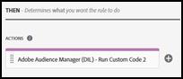

# Översikt över Adobe Audience Manager-tillägg

>[!NOTE]
>
>Adobe Experience Platform Launch har omklassificerats som en serie datainsamlingstekniker i Adobe Experience Platform. Som ett resultat av detta har flera terminologiska förändringar införts i produktdokumentationen. I följande [dokument](../../../term-updates.md) finns en konsoliderad referens till de ändrade terminologin.

Med taggtillägget Audience Manager kan du integrera DIL-koden som används av Audience Manager med dina egenskaper i Adobe Experience Platform.

Använd den här referensen för information om de alternativ som är tillgängliga när du använder det här tillägget för att skapa en regel.

>[!NOTE]
>
>Det här tillägget är inte avsett att användas för händelsevidarebefordran av Adobe Analytics-data. Använd [Adobe Analytics-tillägget](../analytics/overview.md) för vidarebefordran av händelser.

## Konfigurera Adobe Audience Manager-tillägget

Om Adobe Audience Manager-tillägget ännu inte är installerat öppnar du din egenskap, väljer **[!UICONTROL Extensions > Catalog]**, håller pekaren över Adobe Audience Manager-tillägget och väljer **[!UICONTROL Install]**.

Om du vill konfigurera tillägget öppnar du fliken [!UICONTROL Extensions], håller pekaren över tillägget och väljer **[!UICONTROL Configure]**.

### Inställningar för DIL

Konfigurera inställningarna för DIL. Följande konfigurationsalternativ är tillgängliga:

#### DIL version

Visar Datans Integration Library (DIL) version.

Den här inställningen kan inte ändras.

#### Uteslut särskilda sökvägar

Om URL:en matchar någon av de uteslutna sökvägarna läses tillägget inte in.

Välj **[!UICONTROL Add Path]** om du vill ange en exkluderad URL.

Aktivera Regex om URL:en är ett reguljärt uttryck.

#### Använd DIL Site Catalyst-modulen

Modulen [SiteCatalyst](https://experiencecloud.adobe.com/resources/help/en_US/aam/r_dil_sc_init.html) fungerar med DIL för att skicka Analytics-taggelement till Audience Manager.

Använd kodredigeraren för att konfigurera filen siteCatalyst.init.

Du kan också skapa en anteckning som innehåller information om den här konfigurationen.

#### Använd modulen DIL Google Analytics

Aktivera modulen [Google Analytics](https://experiencecloud.adobe.com/resources/help/en_US/aam/dil-google-universal-analytics.html).

#### DIL.skapa initieringsegenskaper

Lägg till initieringsegenskaper som används av [DIL.create](https://experiencecloud.adobe.com/resources/help/en_US/aam/r_dil_create.html) och namnutrymmesunderegenskapen för [visitorService-objektet](https://experiencecloud.adobe.com/resources/help/en_US/aam/r_dil_visitor_service.html). Det finns två exempel på användning i kodkommentarerna i kodredigeraren.

Välj **[!UICONTROL Choose an Item]** om du vill lägga till fler egenskaper.

Håll muspekaren över ikonerna för att se vad varje egenskap gör. Mer information om egenskaperna finns i [Audience Manager DIL-dokumentationen](https://experiencecloud.adobe.com/resources/help/en_US/aam/r_dil_create.html).

Välj **[!UICONTROL Save]** när du har slutfört konfigurationen av tillägget.

## Åtgärdstyper för Adobe Audience Manager-tillägg

I det här avsnittet beskrivs de åtgärdstyper som finns i tillägget Audience Manager.

Tillägget Adobe Audience Manager innehåller följande åtgärder i delen Sedan i en regel:

### Kör anpassad kod

Kör den anpassade koden som konfigurerats i kodredigeraren.

Ange önskad kod i kodredigeraren och ange sedan ett namn för koden. Den här koden blir tillgänglig i delen Sedan i regelbyggaren.

Du kan också lägga till en anteckning med information om konfigurationen.
