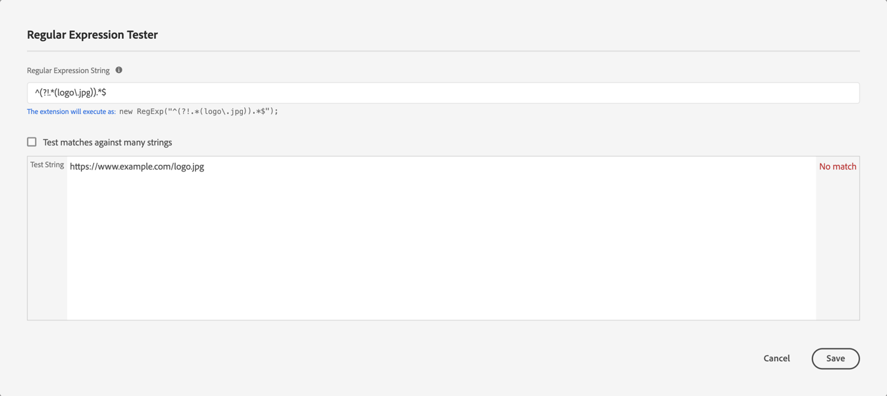

# Översikt över Adobe Content Analytics-tillägg

Med taggtillägget [!DNL Adobe Content Analytics] kan du spåra innehållsrelaterade händelser på en webbplats. Tillägget skickar innehållsdata (upplevelser och resurser) till ett dataram i Adobe Experience Cloud från webbegenskaper via Experience Platform Edge Network.

Med tillägget kan du strömma specifika innehållsrelaterade händelsedata till Experience Platform så att du kan använda dessa data i dina innehållsanalysrapporter i Customer Journey Analytics.

I det här dokumentet förklaras hur du konfigurerar taggtillägget i tagggränssnittet.

## Installera Adobe Content Analytics-taggtillägget {#install}

Adobe Content Analytics-taggtillägget installeras automatiskt som en del av taggegenskapen som skapas automatiskt när [den guidade konfigurationsguiden för Content Analytics](https://experienceleague.adobe.com/en/docs/analytics-platform/using/content-analytics/configuration/guided) används.

<!--
### Manual installation

In case of a manual configuration, the Adobe Content Analytics tag extension needs a property to be installed on. If you have not done so already, see the documentation on [creating a tag property](https://experienceleague.adobe.com/en/docs/platform-learn/implement-in-websites/configure-tags/create-a-property).

After you have created a property or when you select the property created using the [Content Analytics guided configuration wizard](https://experienceleague.adobe.com/en/docs/analytics-platform/using/content-analytics/configuration/guided), open the property and select the **[!UICONTROL Extensions]** tab on the left side bar.

Select the **[!UICONTROL Catalog]** tab. From the list of available extensions, find the **[!DNL Adobe Content Analytics]** extension and select **[!UICONTROL Install]**.

After selecting **[!UICONTROL Install]**, you must configure the Adobe Content Analytics tag extension and save the configuration.
-->

<!--
## Configure schema

The [Content Analytics guided configuration wizard](https://experienceleague.adobe.com/en/docs/analytics-platform/using/content-analytics/configuration/guided) automatically populates the proper value for the **[!UICONTROL Tenant Schema Name]**. 

>[!WARNING]
>
>Do not modify the value for **[!UICONTROL Tenant Schema Name]**.

-->

## Konfigurera dataströmmar

[Content Analytics guidade konfigurationsguide](https://experienceleague.adobe.com/en/docs/analytics-platform/using/content-analytics/configuration/guided) väljer automatiskt rätt värde för **[!UICONTROL Sandbox]** och **[!UICONTROL Production Datastream]**. Du kan även konfigurera ytterligare **[!UICONTROL Staging Datastream]** och **[!UICONTROL Development Datastream]**.

Du kan åsidosätta de automatiskt markerade värdena för **[!UICONTROL Sandbox]** och **[!UICONTROL Production Datastream]** om du vill använda Content Analytics i en annan sandlåda och med olika datastölar. När du gör det kan du antingen välja en sandlåda och datastödraster från de tillgängliga listrutorna, eller välja **[!UICONTROL Enter values]** och ange ett anpassat datastream-ID för varje miljö.

>[!IMPORTANT]
>
>När du konfigurerar en annan sandlåda och datastreams ska du se till att
>
>* den markerade sandlådan inte redan är kopplad till en annan Content Analytics-konfiguration, och
>* Experience Platform-tjänsten har konfigurerats med en aktiverad datauppsättning för Content Analytics Experience-händelser för alla markerade datauppsättningar.

Mer information om hur du konfigurerar ett datastream finns i guiden för [datastreams](../../../../datastreams/overview.md).

## Konfigurera insamling och definition av upplevelser

I avsnittet **[!UICONTROL Experience Capture & Definition]** kan du aktivera **[!UICONTROL Include Experiences]** för att inkludera upplevelser när du samlar in data för Content Analytics.

1. Aktivera **[!UICONTROL Include experiences]**.
1. Valfritt. Ange parametrarna för hur innehållet återges på webbplatsen. Parametrarna är noll eller flera kombinationer av **[!UICONTROL Domain regular expression]** och **[!UICONTROL Query parameters]**.
   1. Ange en **[!UICONTROL Domain regular expression]**, till exempel `^(?!.*\b(store|help|admin)\b)`.
   1. Ange en kommaavgränsad lista med **[!UICONTROL Query parameters]**, till exempel `outdoors, patio, kitchen`.
Använd  om du vill ta bort enskilda parametrar eller **[!UICONTROL Clear all]** om du vill ta bort alla parametrar.
1. Välj **[!UICONTROL Remove]** om du vill ta bort en kombination av reguljära uttryck och frågeparametrar för domäner.
1. Välj **[!UICONTROL Add Regex]** om du vill lägga till en annan kombination av ett reguljärt uttryck och frågeparametrar.

## Konfigurera händelsefiltrering

I avsnittet **[!UICONTROL Event Filtering]** kan du ändra de reguljära uttrycken för att filtrera **[!UICONTROL Page URLs]** och **[!UICONTROL Assets URLs]** när du samlar in data för Content Analytics. De reguljära uttryck som du har definierat i [Content Analytics guidade konfigurationsguide](https://experienceleague.adobe.com/en/docs/analytics-platform/using/content-analytics/configuration/guided) fylls i automatiskt.

### Exempel

* Du vill utesluta alla dokumentationssidor från Content Analytics. Använd följande reguljära uttryck: `^(?!.*documentation).*`
* Du vill utesluta alla JPEG-logotypbilder från Content Analytics. Använd följande reguljära uttryck: `^(?!.*(logo\.jpg|)).*$`

Du kan använda **[!UICONTROL Test Regex]** för att testa det reguljära uttrycket i **[!UICONTROL Regular Expression Tester]**.

