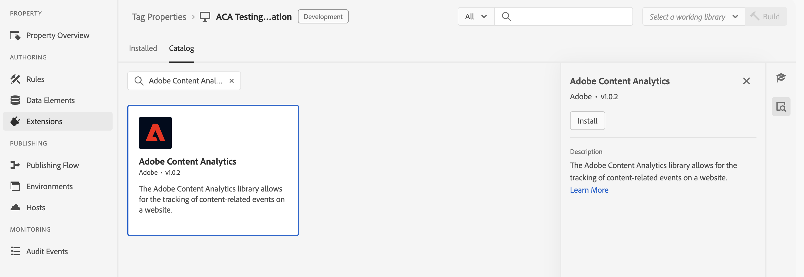

# Översikt över Adobe Content Analytics-tillägg

Med taggtillägget [!DNL Adobe Content Analytics] kan du spåra innehållsrelaterade händelser på en webbplats. Tillägget skickar innehållsdata (upplevelser och resurser) till ett dataram i Adobe Experience Cloud från webbegenskaper via Experience Platform Edge Network.

Med tillägget kan ni strömma specifika innehållsrelaterade händelsedata till plattformen så att ni kan använda dessa data i era innehållsanalysrapporter i Customer Journey Analytics.

I det här dokumentet förklaras hur du konfigurerar taggtillägget i tagggränssnittet.

## Installera taggtillägget Adobe Content Analytics {#install}

>[!NOTE]
>
>Adobe Content Analytics-taggtillägget installeras automatiskt som en del av taggegenskapen som skapas automatiskt när [den guidade konfigurationsguiden för Content Analytics](https://experienceleague.adobe.com/en/docs/analytics-platform/using/content-analytics/configuration/guided){target="_blank"} används.

### Manuell installation

Om konfigurationen är manuell måste en egenskap installeras på Adobe Content Analytics-taggtillägget. Om du inte redan har gjort det läser du dokumentationen om att [skapa en taggegenskap](https://experienceleague.adobe.com/en/docs/platform-learn/implement-in-websites/configure-tags/create-a-property).

När du har skapat en egenskap eller när du väljer den egenskap som har skapats med [Content Analytics guidade konfigurationsguide](https://experienceleague.adobe.com/en/docs/analytics-platform/using/content-analytics/configuration/guided) öppnar du egenskapen och väljer fliken **[!UICONTROL Extensions]** i det vänstra fältet.

Klicka på fliken **[!UICONTROL Catalog]**.  Leta reda på tillägget **[!DNL Adobe Content Analytics]** i listan över tillgängliga tillägg och välj **[!UICONTROL Install]**.

När du har valt **[!UICONTROL Install]** måste du konfigurera taggtillägget Adobe Content Analytics och spara konfigurationen.

<!--
## Configure schema

The [Content Analytics guided configuration wizard](https://experienceleague.adobe.com/en/docs/analytics-platform/using/content-analytics/configuration/guided) automatically populates the proper value for the **[!UICONTROL Tenant Schema Name]**. 

>[!WARNING]
>
>Do not modify the value for **[!UICONTROL Tenant Schema Name]**.

-->

## Konfigurera dataströmmar

Den guidade konfigurationsguiden för [innehållsanalys](https://experienceleague.adobe.com/en/docs/analytics-platform/using/content-analytics/configuration/guided) väljer automatiskt rätt värde för **[!UICONTROL Sandbox]** och **[!UICONTROL Production Datastream]**. Du kan även konfigurera ytterligare **[!UICONTROL Staging Datastream]** och **[!UICONTROL Development Datastream]**.

Du kan åsidosätta de automatiskt markerade värdena för **[!UICONTROL Sandbox]** och **[!UICONTROL Production Datastream]** om du vill använda Content Analytics i en annan sandlåda och med olika datastölar. När du gör det kan du antingen välja en sandlåda och datastödraster från de tillgängliga listrutorna, eller välja **[!UICONTROL Enter values]** och ange ett anpassat datastream-ID för varje miljö.

>[!IMPORTANT]
>
>När du konfigurerar en annan sandlåda och datastreams ska du se till att
>
>* den markerade sandlådan inte redan är kopplad till en annan Content Analytics-konfiguration, och
>* Experience Platform-tjänsten har konfigurerats med en aktiverad händelsedatamängd för upplevelsen av Content Analytics.

Mer information om hur du konfigurerar ett datastream finns i guiden för [datastreams](../../../../datastreams/overview.md).

## Konfigurera insamling och definition av upplevelser

I avsnittet **[!UICONTROL Experience Capture & Definition]** kan du aktivera **[!UICONTROL Include Experiences]** för att inkludera upplevelser när du samlar in data för Content Analytics.

1. Aktivera **[!UICONTROL Include experiences]**.
1. Valfritt. Ange parametrarna för hur innehållet återges på webbplatsen. Parametrarna är noll eller flera kombinationer av **[!UICONTROL Domain regular expression]** och **[!UICONTROL Query parameters]**.
   1. Ange en **[!UICONTROL Domain regular expression]**, till exempel `^(?!.*\b(store|help|admin)\b)`.
   1. Ange en kommaavgränsad lista med **[!UICONTROL Query parameters,]**, till exempel `outdoors, patio, kitchen`.
1. Välj **[!UICONTROL Remove]** om du vill ta bort en kombination av reguljära uttryck och frågeparametrar för domäner.
1. Välj **[!UICONTROL Add Regex]** om du vill lägga till en annan kombination av ett reguljärt uttryck och frågeparametrar.

## Konfigurera händelsefiltrering

I avsnittet **[!UICONTROL Event Filtering]** kan du ändra de reguljära uttrycken för att filtrera **[!UICONTROL Page URLs]** och **[!UICONTROL Assets URLs]** när du samlar in data för Content Analytics. De reguljära uttryck som du har definierat i den guidade konfigurationsguiden för [Innehållsanalys](https://experienceleague.adobe.com/en/docs/analytics-platform/using/content-analytics/configuration/guided) fylls i automatiskt.

### Exempel

* Du vill utesluta alla dokumentationssidor från Content Analytics. Använd följande reguljära uttryck: `^(?!.*documentation).*`
* Du vill utesluta alla logotyper för JPEG- och SVG-bilder från Content Analytics. Använd följande reguljära uttryck: `^(?!.*(logo\.jpg|\.svg)).*$`

Du kan använda **[!UICONTROL Test Regex]** för att testa det reguljära uttrycket i **[!UICONTROL Regular Expression Tester]**.

