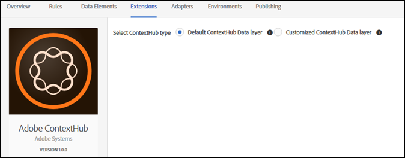

# Översikt över tillägget Adobe ContextHub

>[!NOTE]
>
>Adobe Experience Platform Launch har omklassificerats som en serie datainsamlingstekniker i Adobe Experience Platform. Som ett resultat av detta har flera terminologiska förändringar införts i produktdokumentationen. Se följande [dokument](../../../term-updates.md) för en konsoliderad hänvisning till terminologiska förändringar.

Använd den här referensen för information om hur du konfigurerar tillägget Adobe ContextHub och de alternativ som är tillgängliga när du använder tillägget för att skapa en regel.

## Konfigurera tillägget Adobe ContextHub

I det här avsnittet finns en referens för de alternativ som är tillgängliga när du konfigurerar tillägget Adobe ContextHub.

Om Adobe ContextHub-tillägget inte har installerats än öppnar du egenskapen och väljer sedan **[!UICONTROL Extensions > Catalog]** hovra över Adobe ContextHub-tillägget och markera **[!UICONTROL Install]**.

Om du vill konfigurera tillägget öppnar du [!UICONTROL Extensions] hovra över tillägget och välj **[!UICONTROL Configure]**.

Välj typen ContextHub. Följande konfigurationsalternativ är tillgängliga:

### Standardlager för ContextHub-data

Använd det här alternativet om du vill att taggar ska referera till det förvalda ContextHub-schemat för den här integreringen. Om du har ändrat ditt ContextHub-schema, eller vill använda ett annat datalager, använder du det anpassade alternativet.

### Anpassat ContextHub-datalager

Använd det här alternativet om du har redigerat datalagerschemat eller om du tänker redigera det.
