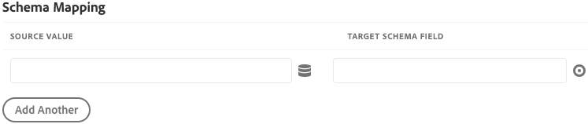

# Adobe Experience Platform Demo Extension

>[!NOTE]
>
>Adobe Experience Platform Launch har omklassificerats som en serie datainsamlingstekniker i Adobe Experience Platform. Som ett resultat av detta har flera terminologiska förändringar införts i produktdokumentationen. I följande [dokument](../../../term-updates.md) finns en konsoliderad referens till de ändrade terminologin.

>[!NOTE]
>
>Det här tillägget har ersatts med [Adobe Experience Platform Web SDK](../web-sdk/overview.md).

Funktionerna i det här tillägget porteras till ett nytt tillägg. Här är en snabb jämförelse av aktuella funktioner.

| Plattformsdemonstrationstillägg | Platform Web SDK |
| ------------------ | ----------- |
| Stöd för anpassade kund-ID:n | Stöd för anpassade användar-ID:n |
| Användargränssnitt för klientmappning för XDM | Bygg i ECID (No need for visitor.js) |
| Möjlighet att skapa en direktuppspelningsanslutning | Stöd för deltagande |
| | XDM-stöd som dataelement |
| | Stöd för första parts domän |
| | Inbyggda felsökningsverktyg |
| | Samlar automatiskt in webbläsarsammanhang |
| | Helt öppen källkod |

## Konfigurera Adobe Experience Platform-tillägget

I det här avsnittet finns en referens för de alternativ som är tillgängliga när du konfigurerar Adobe Experience Platform-tillägget.

Om Adobe Experience Platform-tillägget ännu inte är installerat öppnar du din egenskap, väljer **[!UICONTROL Extensions > Catalog]**, håller pekaren över Adobe Experience Platform-tillägget och väljer **[!UICONTROL Install]**.

Om du vill konfigurera tillägget öppnar du fliken [!UICONTROL Extensions], håller pekaren över tillägget och väljer **[!UICONTROL Configure]**.

### Direktuppspelningsanslutning

Att välja en direktuppspelningsanslutning är det första steget för dig att börja direktuppspela data till Adobe Experience Platform. Du kan välja en från kombinationsrutan för direktuppspelningsanslutning. Direktuppspelningsanslutning är ett obligatoriskt fält. Om du inte har skapat någon direktuppspelningsanslutning kan du skapa en genom att välja knappen **[!UICONTROL Create a streaming connection]**.

Om du väljer **[!UICONTROL Create a streaming connection]** visas ett modalt fönster.

Den modala innehåller fält med förifyllda värden som kan ändras efter dina behov. Om du planerar att skapa mer än en direktuppspelningsanslutning bör du vara medveten om att fältet **[!UICONTROL Data Source]** måste vara unikt. Försök att skapa en annan direktuppspelningsanslutning med en **[!UICONTROL Data Source]** som redan används på en annan anslutning kommer att misslyckas.

När du har valt en slutpunkt för direktuppspelning används URL:en för direktuppspelningsslutpunkten och källan.

## Åtgärdstyper för Adobe Experience Platform-tillägg

I det här avsnittet beskrivs de åtgärdstyper som finns i Adobe Experience Platform-tillägget.

### Skicka Beacon {#send-beacon}

Detta är den åtgärdstyp som du kommer att använda för att skicka data till Adobe Experience Platform.

Du måste först välja den datauppsättning där data ska lagras. Vanligtvis är datauppsättningar en tabell som lagrar data som skickas via direktuppspelningsanslutningen. Du måste skapa datauppsättningarna i Adobe Experience Platform innan du kan använda den här åtgärdstypen.

När du har valt den datauppsättning där data ska lagras, visas information om schemat som är länkat till den valda datauppsättningen.

### Schemamappning

När du har valt datauppsättningen kan du definiera din schemamappning.

Källvärdefältet accepterar ett värde eller ett dataelement. Du kan lägga till ett dataelement genom att markera elementknappen som finns bredvid fältet för källvärdet.

Målschemafältet innehåller sökvägen till ett XDM-fält som definierats i datasetschemat. För fält som definieras djupare i schemahierarkin kan du använda punkten som avgränsare mellan bandelarna (t.ex. timeSeriesEvents.eventType).

### Väljare för schemafält

Tillägget ger också möjlighet att välja ett målschemafält med hjälp av en visuell väljare. Om du väljer målknappen som finns bredvid målschemafältets indata, visas en modal där du ser datamängdens schematräd. Du kan välja ett fält, sedan markera knappen **Markera** och målschemafältets indata uppdateras och innehåller rätt XDM-sökväg.

### Identitetsfält i Adobe Experience Platform

Registrera datamodeller och tidsseriedatcheman kan innehålla ett eller flera identitetsfält. Identitetsfält sammanfogas till en enda identitetsrepresentation av ett ämne och innehåller information som en CRM-identifierare, Experience Cloud-ID (ECID), webbläsarcookie, AdvertisingId eller andra ID:n i olika domäner.

Identitetsfält kan definieras på två sätt i schemat:

1. Scheman för post- och tidsserier innehåller båda ett specialfält med namnet `xdm:identityMap` som kan innehålla en karta över identiteter.
1. Nyckelfält kan markeras som Identity-fält i schemat.

### Identitetsfält i Adobe Experience Platform Extension

För varje schemafält som definieras som ett identitetsfält läggs en rad till i schemamappningsavsnittet. Varje tillagd rad innehåller målschemafältet som redan är ifyllt med motsvarande XDM-schemasökväg. Du kan känna igen om ett schemafält också är ett identitetsfält om en profilikon visas nära fältet.

De primära identitetsfälten är alltid obligatoriska, så du kan inte ta bort raderna som innehåller dem från schemamappningsavsnittet.

Ett schemafält som är definierat som ett icke-primärt identitetsfält läggs automatiskt till i schemamappningsavsnittet, men källvärdets indata kan förbli tomma. Det fältet kan tas bort. Fältet ignoreras om motsvarande källvärdesinmatning är tom.

En varningsikon visas intill varje icke-primärt identitetsfält som inte innehåller något värde.

Ett identitetsavsnitt visas om schemat innehåller ett `xdm:identityMap`-fält. Du kan använda det här avsnittet om du föredrar att skicka data relaterade till identiteter med `xdm:identityMap`.

Avsnittet för identitetsmappning kan innehålla flera rader. Varje rad kan definiera en viss identitetstyp. Du kan definiera följande attribut för en identitet: typ, autentiserat läge, primär och värde.

Om du har flera identiteter i avsnittet för identitetsmappning kan bara en identitet markeras som primär.

Om du har ett schema som har ett `xdm:identityMap`-fält och samtidigt ett annat fält markeras som ett primärt identitetsfält, visas inte den primära kolumnen i identitetsmappningsavsnittet.

### Obligatoriska fält

Vissa scheman kommer att ha obligatoriska fält på den översta nivån. De vanligaste är `timestamp` och `_id`. Om du inte definierar de här fälten misslyckas beacon. Du kan definiera dem i schemamappningsavsnittet.

Om schemamappningsavsnittet inte innehåller `timestamp` eller `_id`, men datamängdsschemat kräver det, skickar Adobe Experience Platform-tillägget en fyr med automatiskt genererade värden så att beacon inte misslyckas. De automatiskt genererade värdena läggs bara till i beacon-data om du inte har definierat fälten i schemamappningsavsnittet.
