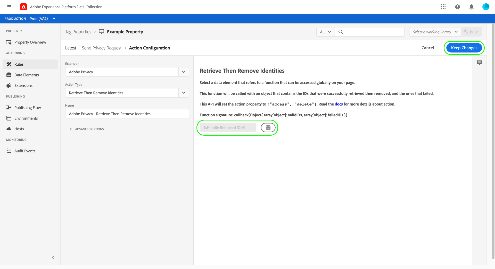

# Översikt över tillägget Sekretess i Adobe

>[!NOTE]
>
>Adobe Experience Platform Launch har omklassificerats som en serie datainsamlingstekniker i Adobe Experience Platform. Som ett resultat av detta har flera terminologiska förändringar införts i produktdokumentationen. Se följande [dokument](../../../term-updates.md) för en konsoliderad hänvisning till terminologiska förändringar.

Med taggtillägget Adobe Privacy kan du samla in och ta bort användar-ID:n som tilldelats slutanvändare av Adobe-lösningar på klientenheter. Insamlade ID:n kan sedan skickas till [Adobe Experience Platform Privacy Service](../../../../privacy-service/home.md) för att få tillgång till eller ta bort den relaterade personens personuppgifter i de Adobe Experience Cloud-program som stöds.

I den här guiden beskrivs hur du installerar och konfigurerar tillägget Sekretess för Adobe i användargränssnittet för Experience Platform och användargränssnittet för datainsamling.

>[!NOTE]
>
>Om du föredrar att installera de här funktionerna utan att använda taggar, se [Översikt över JavaScript-bibliotek för sekretess](../../../../privacy-service/js-library.md) för steg om hur du implementerar med hjälp av raw-kod.

## Installera och konfigurera tillägget

Välj **[!UICONTROL Extensions]** i den vänstra navigeringen, följt av **[!UICONTROL Catalog]** -fliken. Använd sökfältet för att begränsa listan över tillgängliga tillägg tills du hittar sekretessen för Adobe. Välj **[!UICONTROL Install]** för att fortsätta.

På nästa skärm kan du konfigurera vilka källor och lösningar du vill att tillägget ska samla in ID:n från. Följande lösningar stöds för tillägget:

* Adobe Analytics (AA)
* Adobe Audience Manager (AAM)
* Adobe Target
* Adobe Experience Cloud Identity Service (Visitor eller ECID)
* Adobe Advertising Cloud (AdCloud)

Välj en eller flera lösningar och välj sedan **[!UICONTROL Update]**.

Skärmen uppdateras och visar indata för de konfigurationsparametrar som krävs baserat på de lösningar som du valt.

Med listrutan nedan kan du även lägga till ytterligare lösningsspecifika parametrar i konfigurationen.

>[!NOTE]
>
>Se avsnittet om [konfigurationsparametrar](../../../../privacy-service/js-library.md#config-params) i översikten över JavaScript-bibliotek för sekretess om du vill ha mer information om vilka konfigurationsvärden som accepteras för varje lösning som stöds.

När du har lagt till parametrar för de valda lösningarna väljer du **[!UICONTROL Save]** för att spara konfigurationen.

## Använda tillägget {#using}

Tillägget för sekretess i Adobe innehåller tre åtgärdstyper som kan användas i en [regel](../../../ui/managing-resources/rules.md) när en viss händelse inträffar och villkoren är uppfyllda:

* **[!UICONTROL Retrieve Identities]**: Användarens lagrade identitetsinformation hämtas.
* **[!UICONTROL Remove Identities]**: Användarens lagrade identitetsinformation tas bort.
* **[!UICONTROL Retrieve Then Remove Identities]**: Användarens lagrade identitetsinformation hämtas och tas sedan bort.

För var och en av ovanstående åtgärder måste du tillhandahålla en återanrops-JavaScript-funktion som godkänner och hanterar de hämtade identitetsdata som en objektparameter. Härifrån kan du lagra dessa identiteter, visa dem eller skicka dem till [Privacy Services-API](../../../../privacy-service/api/overview.md) efter behov.

När du använder taggtillägget Sekretess för Adobe måste du ange den återanropsfunktion som krävs i form av ett dataelement. Gå till nästa avsnitt för steg om hur du konfigurerar det här dataelementet.

### Definiera ett dataelement som ska hantera identiteter

Börja skapa ett nytt dataelement genom att välja **[!UICONTROL Data Elements]** i den vänstra navigeringen, följt av **[!UICONTROL Add Data Element]**. När du är på konfigurationsskärmen väljer du **[!UICONTROL Core]** för tillägget och **[!UICONTROL Custom Code]** för elementtypen data. Välj **[!UICONTROL Open Editor]** i den högra panelen.

I dialogrutan som visas definierar du en JavaScript-funktion som ska hantera de hämtade identiteterna. Återanropet måste acceptera ett enda argument av objekttyp (`ids` i exemplet nedan). Funktionen kan sedan hantera ID:n hur du vill och kan även anropa variabler och funktioner som är globalt tillgängliga på platsen för vidare bearbetning.

>[!NOTE]
>
>Mer information om strukturen för `ids` objektet som callback-funktionen förväntas hantera, se [kodexempel](../../../../privacy-service/js-library.md#samples) finns i översikten för JavaScript-biblioteket för sekretess.

När du är klar väljer du **[!UICONTROL Save]**.

Du kan fortsätta att skapa andra anpassade kodelement med data om du behöver olika återanrop för olika händelser.

### Skapa en regel med en sekretessåtgärd

När du har konfigurerat ett dataelement för återanrop för att hantera hämtade ID:n, kan du skapa en regel som anropar tillägget för sekretess i Adobe när en viss händelse inträffar på webbplatsen tillsammans med andra villkor som du behöver.

När du konfigurerar åtgärden för regeln väljer du **[!UICONTROL Adobe Privacy]** för tillägget. För åtgärdstypen väljer du ett av [tre funktioner](#using) tillhandahålls av tillägget.

Den högra panelen uppmanar dig att välja ett dataelement som ska fungera som funktionsmakrots återanrop. Välj databasikonen () och välj det dataelement du skapade tidigare i listan. Välj **[!UICONTROL Keep Changes]** för att fortsätta.

Härifrån kan du fortsätta att konfigurera regeln så att sekretessåtgärden för Adobe aktiveras under de händelser och villkor som du kräver. När du är nöjd väljer du **[!UICONTROL Save]**.

Nu kan du lägga till regeln i ett bibliotek som ska distribueras som en version på din webbplats för testning. Se översikten på [taggar publiceringsflöde](../../../ui/publishing/overview.md) för mer information.

## Inaktivera eller avinstallera tillägget

När du har installerat tillägget kan du inaktivera eller ta bort det. Välj **[!UICONTROL Configure]** på sekretesskortet för Adobe i de installerade tilläggen och välj sedan antingen **[!UICONTROL Disable]** eller **[!UICONTROL Uninstall]**.

## Nästa steg

I den här handboken beskrivs hur du använder taggtillägget för sekretess i Adobe i användargränssnittet. Mer information om funktionerna i tillägget, inklusive exempel på hur du använder Raw-kod, finns i [Översikt över JavaScript-bibliotek för sekretess](../../../../privacy-service/js-library.md) i Privacy Servicens dokumentation.
