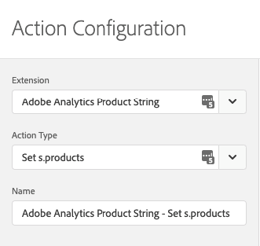
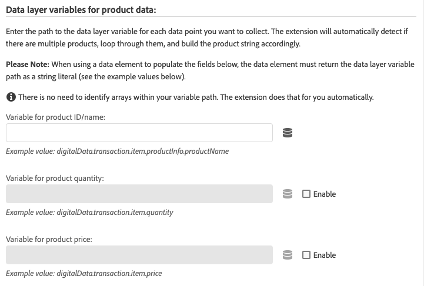
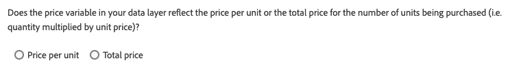
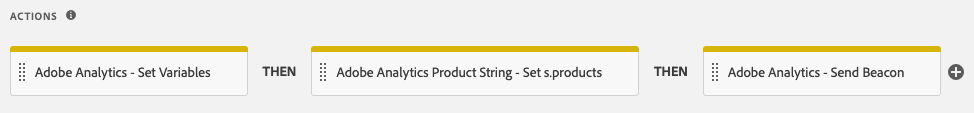

# Översikt över Adobe Analytics produktsträngstillägg

>[!NOTE]
>
>Adobe Experience Platform Launch har omklassificerats som en serie datainsamlingstekniker i Adobe Experience Platform. Som ett resultat av detta har flera terminologiska förändringar införts i produktdokumentationen. I följande [dokument](../../../term-updates.md) finns en konsoliderad referens till de ändrade terminologin.

Variabeln `products` spårar hur användare interagerar med produkter på din webbplats. Variabeln `products` kan till exempel spåra hur många gånger en produkt visas, läggs till i kundvagnen, checkas ut och köpts. Det kan också spåra hur effektiva marknadsföringskategorierna är på er webbplats.

Variabeln `products` ska alltid anges tillsammans med en success-händelse.

Tillägget [!DNL Adobe Analytics Product String Builder] ställer automatiskt in variabeln `products` åt dig genom att göra en slinga genom datalagret, hämta alla produktrelaterade data som behövs och formatera dem med rätt syntax enligt nedan. Du behöver inte längre skriva och underhålla anpassade JavaScript för att utföra dessa komplexa åtgärder.

## Syntax för produktvariabeln

```bash
Category;Product;Quantity;Price;eventN=X|eventN2=X2;eVarN=merch_category|eVarN2=merch_category2
```

Fullständig dokumentation finns på [Produkter](https://experienceleague.adobe.com/docs/analytics/implementation/vars/page-vars/products.html?lang=sv-SE).

## Tilläggsanvisningar

### Åtgärdskonfiguration

Lägg till åtgärden&quot;Adobe Analytics Product String - Set s.products&quot; i regeln.



### Ställa in standardproduktdata

Definiera sedan datalagrets variabler. När du har konfigurerat åtgärden enligt föregående steg visas följande skärm:



För varje datapunkt som du vill ta med i produktsträngen anger du sökvägen till rätt datalagervariabel.

Om datalagret till exempel är strukturerat så här:

```json
digitalData = {
  "transaction": {
    "item": [{
      "productInfo": {
        "productName": "My Product"
      }
    }]
  }
};
```

Du skulle ange följande sökväg i fältet Variabel för produkt-ID/namn för att hämta variabeln `productName`:

```json
digitalData.transaction.item.productInfo.productName
```

>[!NOTE]
>
>Om du använder ett dataelement för att fylla i fältet, bör det konfigureras med datatabellen Konstant eller Anpassad kod och måste returnera sökvägen ovan som en stränglitteral.

### Pristyp

Parametern `price` i produktsträngen [!DNL Adobe Analytics] måste återspegla det totala priset för antalet köpta enheter, inte enhetspriset, för den produkten. När du aktiverar fältet Pris i tilläggsåtgärden måste du ange om datalagret visar totalpriset eller enhetspriset. När du använder enhetspriset multiplicerar tillägget [!DNL Adobe Analytics Product String] automatiskt enhetspriset med kvantiteten för att få det totala priset och ange produktsträngen korrekt.



### Custom Events &amp; Merchandising eVars


Om implementeringen använder anpassade händelser eller eVars-produkter för marknadsföring gör du så här:

1. Markera den associerade **[!UICONTROL Add]**-knappen.
1. Välj den händelse eller eVar som du vill ställa in i listrutan.
1. Ange sökvägen till rätt datalagervariabel med samma syntax som beskrivs ovan.

### Åtgärdssekvens

Den här åtgärden måste åtföljas av en&quot;Adobe Analytics - Ange variabler&quot;-åtgärd som anger motsvarande lyckade händelser samt en&quot;Adobe Analytics - skicka Beacon&quot;-åtgärd. En lämplig sekvens av åtgärder visas nedan.



### Krav

* Ett objektbaserat [datalager](https://theblog.adobe.com/data-layers-buzzword-best-practice/) med variabler för alla produktrelaterade data (till exempel produkt-ID, kvantitet, pris). Det här tillägget fungerar inte med arraybaserade datalager.
* Tillägget [Adobe Analytics](../analytics/overview.md) måste vara installerat.
