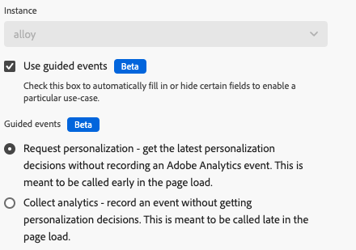

# Åtgärdstyper

När du har konfigurerat taggtillägget [Adobe Experience Platform Web SDK](web-sdk-extension-configuration.md) måste du konfigurera åtgärdstyperna.

Den här sidan beskriver de åtgärdstyper som stöds av [Adobe Experience Platform Web SDK-taggtillägget](web-sdk-extension-configuration.md).

## Använd förslag {#apply-propositions}

Åtgärdstypen **[!UICONTROL Apply propositions]** gör att du kan återge utkast i enkelsidiga program utan att öka måtten.

Den här åtgärdstypen är användbar när du arbetar med ensidiga program där delar av sidan återges på nytt, vilket kan innebära att personaliseringar som redan används på sidan skrivs över.

Du kan använda den här åtgärdstypen för olika användningsområden, till exempel:

1. **Rendera mbox HTML erbjuder**. Förslag som uttryckligen begärts via ett omfång eller en yta från en **[!UICONTROL Send event]**-åtgärd återges inte automatiskt. Du kan använda åtgärdstypen **[!UICONTROL Apply propositions]** för att ange var Web SDK ska återge dem genom att ange förslagets metadata.
2. **Återge erbjudandena för en vy i ett ensidigt program**. När du återger en vyändringshändelse kan du, om analysdata inte är klara än, använda åtgärden **[!UICONTROL Apply propositions]** för att återge vyförslagen överst på sidan. Mer information finns i [övre och nedre delen av sidhändelser (andra sidvyn - alternativ 2)](../../../../web-sdk/use-cases/top-bottom-page-events.md). Ange **[!UICONTROL View name]** i formuläret om du vill använda det.
3. **Återge förslag**. När webbplatsen använder ett ramverk som React för att återge innehåll kan du behöva tillämpa personaliseringen på nytt. I sådana fall kan du använda åtgärdstypen **[!UICONTROL Apply propositions]** för att göra detta.

Den här åtgärdstypen skickar ingen visningshändelse för återgivna inlägg. Den håller reda på återgivna förslag så att de kan inkluderas i efterföljande **[!UICONTROL Send event]** anrop.

Den här åtgärdstypen stöder följande fält:

* **[!UICONTROL Propositions]**: En array med objekt som du vill återge igen.
* **[!UICONTROL View name]**: Namnet på den vy som ska återges.
* **[!UICONTROL Proposition metadata]**: Ett objekt som avgör hur erbjudanden från HTML kan tillämpas. Du kan ange den här informationen antingen via formuläret eller via ett dataelement. Den innehåller följande egenskaper:
   * **[!UICONTROL Scope]**
   * **[!UICONTROL Selector]**
   * **[!UICONTROL Action type]**

## Använd svar {#apply-response}

Använd åtgärdstypen **[!UICONTROL Apply response]** när du vill utföra olika åtgärder baserat på ett svar från Edge Network. Den här åtgärdstypen används vanligtvis i hybriddistributioner där servern gör ett första anrop till Edge Network. Den här åtgärdstypen tar svaret från anropet och initierar Web SDK i webbläsaren.

Om du använder den här åtgärdstypen kan klientbelastningstiden för hybridpersonalisering minska.

Den här åtgärdstypen stöder följande konfigurationsalternativ:

* **[!UICONTROL Instance]**: Välj den Web SDK-instans som du använder.
* **[!UICONTROL Response headers]**: Markera det dataelement som returnerar ett objekt som innehåller huvudnycklar och värden som returneras från Edge Network-serveranropet.
* **[!UICONTROL Response body]**: Markera det dataelement som returnerar objektet som innehåller JSON-nyttolasten från Edge Network-svaret.
* **[!UICONTROL Render visual personalization decisions]**: Aktivera det här alternativet för att automatiskt återge det personaliseringsinnehåll som tillhandahålls av Edge Network och dölja innehållet för att förhindra flimmer.

## Utvärdera regeluppsättningar {#evaluate-rulesets}

Den här åtgärdstypen utlöser utvärdering av regeluppsättning manuellt. Regler returneras av Adobe Journey Optimizer för funktioner som webbläsarmeddelanden.

Den här åtgärdstypen stöder följande alternativ:

* **[!UICONTROL Render visual personalization decisions]**: Aktivera det här alternativet för att återge visuella personaliseringsbeslut för de regeluppsättningsobjekt som matchar.
* **[!UICONTROL Decision context]**: Det här är ett nyckelvärdesschema som används vid utvärdering av Adobe Journey Optimizer-regler för enhetsbeslut. Du kan ange beslutskontexten manuellt eller via ett dataelement.

## Hämta Media Analytics Tracker {#get-media-analytics-tracker}

Den här åtgärden används för att hämta det gamla API:t för Media Analytics. När åtgärden konfigureras och ett objektnamn anges, exporteras det gamla Media Analytics-API:t till det fönsterobjektet. Om inget anges exporteras den till `window.Media` som det aktuella mediets JS-biblioteket gör.

## Omdirigera med identitet {#redirect-with-identity}

Använd den här åtgärdstypen om du vill dela identiteter från den aktuella sidan till andra domäner. Den här åtgärden är utformad för att användas med en **[!UICONTROL click]**-händelsetyp och ett värdejämförelsevillkor. Mer information om hur du använder åtgärdstypen finns i [Lägg till identitet i URL med Web SDK-tillägget](../../../../web-sdk/commands/appendidentitytourl.md#extension).

## Skicka händelse {#send-event}

Skickar en händelse till Experience Platform så att plattformen kan samla in de data du skickar och agera på dessa data. Alla data som du vill skicka kan skickas i fältet **[!UICONTROL XDM Data]**. Använd ett [!DNL JSON]-objekt som följer strukturen i ditt [!DNL XDM]-schema. Det här objektet kan antingen skapas på sidan eller via en **[!UICONTROL Custom Code]** **[!UICONTROL Data Element]**.

Åtgärdstypen **[!UICONTROL Send Event]** stöder de fält och inställningar som beskrivs nedan. Dessa fält är alla valfria.

### Instansinställningar {#instance}

Använd väljaren **[!UICONTROL Instance]** för att välja den Web SDK-instans som du vill konfigurera. Om du bara har en instans är den förvald.

* **[!UICONTROL Instance]**: Välj den Web SDK-instans som du vill konfigurera. Om du bara har en instans är den förmarkerad.
* **[!UICONTROL Use guided events]**: Aktivera det här alternativet för att automatiskt fylla i eller dölja vissa fält för att aktivera ett visst användningsfall. Om du aktiverar det här alternativet visas följande inställningar.

  >[!NOTE]
  >
  >De guidade händelser som visas nedan är relaterade till [övre och nedre delen av sidhändelser](../../../../web-sdk/use-cases/top-bottom-page-events.md).
   * **[!UICONTROL Request personalization]**: Den här händelsen ska anropas överst på sidan. När den här händelsen är markerad anges följande fält:
      * **[!UICONTROL Type]**: **[!UICONTROL Decisioning Proposition Fetch]**
      * **[!UICONTROL Automatically send a display event]**: **[!UICONTROL false]**
      * Aktivera alternativet **[!UICONTROL Render visual personalization decisions]** om du vill att personaliseringen ska återges automatiskt i det här fallet.
   * **[!UICONTROL Collect analytics]**: Den här händelsen ska anropas längst ned på sidan. När den här händelsen är markerad anges följande fält:
      * **[!UICONTROL Include rendered propositions]**: **[!UICONTROL true]**
      * Inställningarna för **[!UICONTROL Personalization]** är dolda

### Data {#data}

* **[!UICONTROL Type]**: I det här fältet kan du ange en händelsetyp som ska registreras i XDM-schemat. Mer information finns i [`type`](/help/web-sdk/commands/sendevent/type.md) i kommandot `sendEvent`.
* **[!UICONTROL XDM]**:
* **[!UICONTROL Data]**: Använd det här fältet för att skicka data som inte matchar ett XDM-schema. Det här fältet är användbart om du försöker uppdatera en Adobe Target-profil eller skicka Target Recommendations-attribut. Mer information finns i [`data`](/help/web-sdk/commands/sendevent/data.md) i kommandot `sendEvent`.
* **[!UICONTROL Include rendered propositions]**: Aktivera det här alternativet om du vill inkludera alla förslag som har återgetts, men ingen visningshändelse har skickats. Använd detta tillsammans med **[!UICONTROL Automatically send a display event]** inaktiverat. Den här inställningen uppdaterar XDM-fältet `_experience.decisioning` med information om de renderade förslagen.
* **[!UICONTROL Document will unload]**: Aktivera det här alternativet för att se till att händelserna når servern även om användaren navigerar bort från sidan. Detta gör att händelser kan nå servern, men svaren ignoreras.
* **[!UICONTROL Merge ID]**: **Det här fältet är inaktuellt**. Detta fyller i XDM-fältet `eventMergeId`.

### Personalisering {#personalization}

* **[!UICONTROL Scopes]**: Välj de omfattningar (Adobe Target [!DNL mboxes]) som du vill begära explicit från personalisering. Du kan ange omfattningarna manuellt eller genom att ange ett dataelement.
* **[!UICONTROL Surfaces]**: Ange de webbytor som är tillgängliga på sidan för personalisering. Mer information finns i [Adobe Journey Optimizer-dokumentationen](https://experienceleague.adobe.com/docs/journey-optimizer/using/web/create-web.html).
* **Återge beslut om visuell anpassning:** Om du vill återge anpassat innehåll på sidan markerar du kryssrutan **[!UICONTROL Render visual personalization decisions]** . Du kan också ange beslutsomfattningar och/eller ytor om det behövs. Mer information om återgivning av anpassat innehåll finns i [anpassningsdokumentationen](/help/web-sdk/personalization/rendering-personalization-content.md#automatically-rendering-content).
* **[!UICONTROL Request default personalization]**: Använd det här avsnittet för att kontrollera om det sidomfattande omfånget (global mbox) och standardytan (web surface based on current URL) efterfrågas. Som standard begärs detta automatiskt under det första `sendEvent` anropet av sidinläsningen. Du kan välja mellan följande alternativ:
   * **[!UICONTROL Automatic]**: Detta är standardbeteendet. Begär endast standardanpassning när den ännu inte har begärts. Detta motsvarar `requestDefaultPersonalization` som inte har angetts i Web SDK-kommandot.
   * **[!UICONTROL Enabled]**: Begär sidomfånget och standardytan explicit. Detta uppdaterar cacheminnet för SPA. Detta motsvarar `requestDefaultPersonalization` inställt på `true`.
   * **[!UICONTROL Disabled]**: Undertrycker explicit begäran för sidomfånget och standardytan. Detta motsvarar `requestDefaultPersonalization` inställt på `false`.
* **[!UICONTROL Decision context]**: Det här är ett nyckelvärdesschema som används vid utvärdering av Adobe Journey Optimizer-regler för enhetsbeslut. Du kan ange beslutskontexten manuellt eller via ett dataelement.

### Åsidosättningar av dataströmskonfiguration {#datastream-overrides}

Med åsidosättningar av dataström kan du definiera ytterligare konfigurationer för dina dataströmmar, som skickas till Edge Network via Web SDK.

Detta hjälper dig att utlösa andra datastream-beteenden än standardbeteendena, utan att du behöver skapa ett nytt datastream eller ändra dina befintliga inställningar. Mer information finns i dokumentationen om [hur du konfigurerar datastream-åsidosättningar](web-sdk-extension-configuration.md#datastream-overrides).

## Skicka mediahändelse {#send-media-event}

Skickar en mediehändelse till Adobe Experience Platform och/eller Adobe Analytics. Den här åtgärden är användbar när du spårar mediahändelser på webbplatsen. Markera en instans (om du har fler än en). Åtgärden kräver en `playerId` som representerar en unik identifierare för en spårad mediesession. Det kräver också ett **[!UICONTROL Quality of Experience]**- och `playhead`-dataelement när en mediesession startas.

Åtgärdstypen **[!UICONTROL Send media event]** stöder följande egenskaper:

* **[!UICONTROL Instance]**: Den Web SDK-instans som används.
* **[!UICONTROL Media Event Type]**: Den typ av mediahändelse som spåras.
* **[!UICONTROL Player ID]**: Unik identifierare för mediesessionen.
* **[!UICONTROL Playhead]**: Medieuppspelningens aktuella position i sekunder.
* **[!UICONTROL Media session details]**: När du skickar en mediesändningshändelse måste du ange nödvändig information om mediesessionen.
* **[!UICONTROL Chapter details]**: I det här avsnittet kan du ange kapitelinformation när du skickar en kapitelmediahändelse.
* **[!UICONTROL Advertising details]**: När du skickar en `AdBreakStart` -händelse måste du ange nödvändig annonsinformation.
* **[!UICONTROL Advertising pod details]**: Information om annonseringsområdet när en `AdStart` -händelse skickas.
* **[!UICONTROL Error details]**: Information om det uppspelningsfel som spåras.
* **[!UICONTROL State Update Details]**: Det spelartillstånd som uppdateras.
* **[!UICONTROL Custom Metadata]**: Anpassade metadata om mediahändelsen som spåras.
* **[!UICONTROL Quality of Experience]**: Mediekvaliteten för upplevelsedata som spåras.

## Ange samtycke {#set-consent}

När du har fått ditt samtycke från din användare måste du meddela Adobe Experience Platform Web SDK genom att använda åtgärdstypen &quot;Ange samtycke&quot;. För närvarande stöds två typer av standarder: &quot;Adobe&quot; och &quot;IAB TCF&quot;. Se [Supporting Customer Consent Preferences](../../../../web-sdk/commands/setconsent.md). När du använder Adobe version 2.0 stöds bara ett dataelementvärde. Du måste skapa ett dataelement som matchar det godkända objektet.

I den här åtgärden får du även ett valfritt fält där du kan inkludera en identitetskarta så att identiteter kan synkroniseras när du har fått ditt samtycke. Synkronisering är användbart när medgivandet har konfigurerats som Väntande eller Ut eftersom det är sannolikt det första anropet som utlöses.

## Uppdatera variabel {#update-variable}

Använd den här åtgärden om du vill ändra ett XDM-objekt som ett resultat av en händelse. Den här åtgärden är avsedd att skapa ett objekt som senare kan refereras från en **[!UICONTROL Send event]**-åtgärd för att spela in händelsens XDM-objekt.

För att kunna använda den här åtgärdstypen måste du ha definierat ett [variabel](data-element-types.md#variable)-dataelement. När du väljer ett variabeldataelement att ändra visas en redigerare som liknar redigeraren för [XDM-objektets](data-element-types.md#xdm-object) dataelement.

Det XDM-schema som används för redigeraren är det schema som har valts i dataelementet [!UICONTROL variable]. Du kan ange en eller flera egenskaper för objektet genom att klicka på en av egenskaperna i trädet till vänster och sedan ändra värdet till höger. I skärmbilden nedan ställs egenskapen produceradAv in på dataelementet&quot;Producerad av dataelement&quot;.

Det finns vissa skillnader mellan redigeraren i uppdateringen av variabelåtgärden och redigeraren i XDM-objektdataelementet. Först har uppdateringsvariabelåtgärden ett rotnivåobjekt med namnet&quot;xdm&quot;. Om du klickar på det här objektet kan du ange ett dataelement som ska användas för att ställa in hela objektet. För det andra har åtgärden för att uppdatera variabeln kryssrutor för att rensa data från xdm-objektet. Klicka på en av egenskaperna till vänster och markera sedan kryssrutan till höger för att ta bort värdet. Detta rensar det aktuella värdet innan du anger värden för variabeln.

## Nästa steg {#next-steps}

När du har läst den här artikeln bör du ha en bättre förståelse för hur du konfigurerar dina åtgärder. Läs sedan om hur du [konfigurerar dina dataelementtyper](data-element-types.md).
