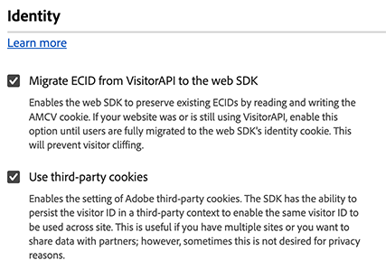
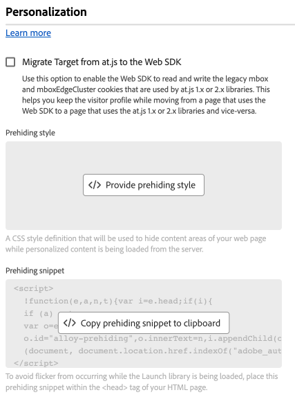
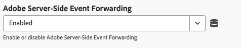

# Konfigurera SDK-taggtillägget för webben

Taggtillägget [!DNL Web SDK] skickar data till Adobe Experience Cloud från webbegenskaper via Experience Platform Edge Network.

Tillägget gör att ni kan strömma data till Experience Platform, synkronisera identiteter, bearbeta kundens medgivandesignaler och automatiskt samla in kontextdata.

I det här dokumentet förklaras hur du konfigurerar taggtillägget i tagggränssnittet.

## Installera SDK-taggtillägget för webben {#install}

Webbfilens SDK-taggtillägg måste ha en egenskap installerad på. Om du inte redan har gjort det läser du dokumentationen om att [skapa en taggegenskap](https://experienceleague.adobe.com/docs/platform-learn/implement-in-websites/configure-tags/create-a-property.html).

När du har skapat en egenskap öppnar du den och väljer fliken **[!UICONTROL Extensions]** i det vänstra fältet.

Klicka på fliken **[!UICONTROL Catalog]**.  Leta reda på tillägget [!DNL Web SDK] i listan över tillgängliga tillägg och välj **[!UICONTROL Install]**.

När du har valt **[!UICONTROL Install]** måste du konfigurera SDK-taggtillägget för webben och spara konfigurationen.

>[!NOTE]
>
>Taggtillägget installeras endast efter att konfigurationen har sparats. I nästa avsnitt får du lära dig hur du konfigurerar taggtillägget.

## Skapa en egen SDK-version för webben {#custom-build}

SDK-biblioteket för webben innehåller flera moduler för olika funktioner som personalisering, identitet, länkspårning med mera. Beroende på hur du använder dem kanske du bara behöver specifika funktioner i stället för hela biblioteket. Om du skapar en anpassad Web SDK-version kan du bara välja de moduler du behöver, vilket minskar biblioteksstorleken och förbättrar prestandan.

När du skapar en anpassad Web SDK-version används den av alla dina Web SDK-instanser.

>[!IMPORTANT]
>
>Om du inaktiverar Web SDK-komponenter kan den befintliga implementeringen brytas. Varje gång du inaktiverar en komponent måste du testa implementeringen noggrant för att se till att alla funktioner du behöver fungerar som förväntat.
>&#x200B;>När du inaktiverar en komponent kan du inte längre redigera inställningarna för den komponenten.

Följ stegen nedan för att skapa en anpassad Web SDK-version med hjälp av taggtillägget Web SDK.

1. Expandera avsnittet **[!UICONTROL Custom build components]** på konfigurationssidan för taggtillägg.
1. Aktivera eller inaktivera komponenterna utifrån dina behov. Du kan välja bland följande komponenter:
   * **[!UICONTROL Activity collector]**: Den här komponenten aktiverar automatisk länksamling och spårning av aktivitetskarta.
   * **[!UICONTROL Advertising]**: Den här komponenten innehåller all JavaScript-kod som behövs för Adobe Advertising. Det lägger också till [!UICONTROL Adobe Advertising]-inställningar i avsnittet [!UICONTROL SDK Instances] och en [!UICONTROL Advertising]-inställning i taggregler för att definiera hur annonsdata används för attribueringsmätning.
   * **[!UICONTROL Audiences]**: Den här komponenten möjliggör integrering med Audience Manager, inklusive URL och cookie-baserade mål samt ID-synk.
   * **[!UICONTROL Consent]**: Den här komponenten aktiverar samverkansintegrering. Om du inaktiverar den här komponenten inaktiveras följande element:
      * [Ange medgivande](action-types.md#set-consent), åtgärdstyp
   * **[!UICONTROL Context]**: Den här komponenten aktiverar automatisk insamling av kontextdata.
   * **[!UICONTROL Event merge]**: _Inaktuell_. Om du inaktiverar den här komponenten inaktiveras följande element:
      * [Dataelement för händelsesammanfognings-ID](action-types.md#data)
      * Åtgärdstypen **[!UICONTROL Reset event merge ID]**
   * **[!UICONTROL Media analytics bridge]**: Den här komponenten aktiverar Edge Network Streaming Media med medieanalysgränssnittet. Om du inaktiverar den här komponenten inaktiveras följande element:
      * [Åtgärdstypen Hämta Media Analytics-spåraren](action-types.md#get-media-analytics-tracker)
   * **[!UICONTROL Personalization]**: Den här komponenten aktiverar Adobe Target- och Adobe Journey Optimizer-integreringar. Om du inaktiverar den här komponenten inaktiveras följande element:
      * [Använd förslagsåtgärd](action-types.md) typ
   * **[!UICONTROL Rules engine]**: Den här komponenten aktiverar Adobe Journey Optimizer On-device-beslut. Om du inaktiverar den här komponenten inaktiveras följande element:
      * [Utvärdera regeluppsättningar](action-types.md#evaluate-rulesets), åtgärdstyp
      * [Prenumerera regeluppsättningsobjekt](event-types.md#subscribe-ruleset-items) - händelsetyp
   * **[!UICONTROL Streaming media]**: Den här komponenten aktiverar Edge Network Streaming Media. Om du inaktiverar den här komponenten inaktiveras följande element:
      * [Åtgärdstyp för att skicka mediehändelse](action-types.md#send-media-event)

## Konfigurera instansinställningar {#general}

Konfigurationsalternativen högst upp på sidan anger för Adobe Experience Platform var data ska skickas och vilka konfigurationer som ska användas på servern.

* **[!UICONTROL Name]**: Adobe Experience Platform Web SDK-tillägget stöder flera instanser på sidan. Namnet används för att skicka data till flera organisationer med en taggkonfiguration. Instansnamnet är som standard `alloy`. Du kan dock ändra instansnamnet till ett giltigt JavaScript-objektnamn.
* **[!UICONTROL IMS organization ID]**: ID för organisationen som du vill att data ska skickas till på Adobe. För det mesta använder du standardvärdet som fylls i automatiskt. När du har flera instanser på sidan fyller du i det här fältet med värdet för den andra organisationen som du vill skicka data till.
* **[!UICONTROL Edge domain]**: Domänen som tillägget skickar och tar emot data från. Adobe rekommenderar att du använder en CNAME (1st-party domain) för det här tillägget. Standarddomänen från tredje part fungerar för utvecklingsmiljöer men är inte lämplig för produktionsmiljöer. Instruktioner om hur du konfigurerar en CNAME från en första part visas [här](https://experienceleague.adobe.com/docs/core-services/interface/ec-cookies/cookies-first-party.html).
* **[!UICONTROL Adobe Advertising]**: Tillgängligt när komponenten `Advertising` har valts. Inställningar endast för företag med Adobe Advertising DSP:
   * **[!UICONTROL Adobe Advertising DSP]**: Aktiverar vyövergripande spårning.
   * **[!UICONTROL Advertisers]**: Tillgängligt när [!UICONTROL Adobe Advertising DSP] är aktiverat. De annonsörer för vilka genomsiktsspårning ska aktiveras.
   * **[!UICONTROL ID5 partner ID]**: Valfritt. Tillgängligt när [!UICONTROL Adobe Advertising DSP] är aktiverat. Organisationens ID5-partner-ID. Med den här inställningen kan Web SDK samla in universella ID:n för ID5.
   * **[!UICONTROL RampID JavaScript path]**: Valfritt. Tillgängligt när [!UICONTROL Adobe Advertising DSP] är aktiverat. Sökvägen till din organisations [!DNL LiveRamp RampID] JavaScript-kod (`ats.js`).  Med den här inställningen kan Web SDK samla in [!DNL RampID] universella ID:n.

## Konfigurera inställningar för dataström {#datastreams}

I det här avsnittet kan du välja de datastreams som ska användas för var och en av de tre tillgängliga miljöerna (produktion, mellanlagring och utveckling).

När en begäran skickas till Edge Network, används ett datastream-ID för att referera till konfigurationen på serversidan. Du kan uppdatera konfigurationen utan att behöva göra kodändringar på webbplatsen.

Mer information om hur du konfigurerar ett datastream finns i guiden för [datastreams](../../../../datastreams/overview.md).

Du kan antingen välja ett datastream från de tillgängliga listrutorna eller välja **[!UICONTROL Enter values]** och ange ett anpassat datastream-ID för varje miljö.

## Konfigurera sekretessinställningar {#privacy}

I det här avsnittet kan du konfigurera hur Web SDK hanterar tillståndssignaler från din webbplats. Det gör i synnerhet att du kan välja den standardnivå för samtycke som antas av en användare om ingen annan explicit medgivandeinställning har angetts.

Standardnivån för samtycke sparas inte i användarprofilen.

| [!UICONTROL Default consent level] | Beskrivning |
| --- | --- |
| [!UICONTROL In] | Samla in händelser som inträffar innan användaren ger sitt samtycke. |
| [!UICONTROL Out] | Ignorera händelser som inträffar innan användaren ger sitt medgivande. |
| [!UICONTROL Pending] | Köhändelser som inträffar innan användaren ger sitt samtycke. När du har angett medgivandeinställningar kommer händelserna att samlas in eller tas bort beroende på vilka inställningar som har angetts. |
| [!UICONTROL Provided by data element] | Standardnivån för samtycke bestäms av ett separat dataelement som du definierar. När du använder det här alternativet måste du ange dataelementet med den angivna listrutan. |

>[!TIP]
>
>Använd **[!UICONTROL Out]** eller **[!UICONTROL Pending]** om du kräver uttryckligt användargodkännande för dina affärsåtgärder.

## Konfigurera identitetsinställningar {#identity}

I det här avsnittet kan du definiera hur Web SDK ska fungera när det gäller att hantera användaridentifiering.

* **[!UICONTROL Migrate ECID from VisitorAPI]**: Det här alternativet är aktiverat som standard. När den här funktionen är aktiverad kan SDK läsa `AMCV`- och `s_ecid`-cookies och ange den `AMCV`-cookie som används av [!DNL Visitor.js]. Den här funktionen är viktig vid migrering till Web SDK, eftersom vissa sidor fortfarande använder [!DNL Visitor.js]. Med det här alternativet kan SDK fortsätta att använda samma [!DNL ECID] så att användare inte identifieras som två separata användare.
* **[!UICONTROL Use third-party cookies]**: När det här alternativet är aktiverat försöker Web SDK lagra en användaridentifierare i en cookie från tredje part. Om det lyckas identifieras användaren som en enskild användare när de navigerar mellan flera domäner, i stället för att identifieras som en separat användare på varje domän. Om det här alternativet är aktiverat kan SDK fortfarande inte lagra användaridentifieraren i en tredjeparts-cookie om webbläsaren inte stöder cookies från tredje part eller om den har konfigurerats av användaren att inte tillåta cookies från tredje part. I det här fallet lagrar SDK bara identifieraren i förstahandsdomänen.

  >[!IMPORTANT]
  >&#x200B;>Cookies från tredje part är inte kompatibla med funktionen [för första parts enhets-ID](../../../../web-sdk/identity/first-party-device-ids.md) i Web SDK.
  >&#x200B;>Du kan antingen använda enhets-ID:n från en annan leverantör eller använda cookies från tredje part, men du kan inte använda båda funktionerna samtidigt.
  >

## Konfigurera personaliseringsinställningar {#personalization}

I det här avsnittet kan du konfigurera hur du vill dölja vissa delar av en sida medan anpassat innehåll läses in. Detta garanterar att besökarna bara ser den personaliserade sidan.

* **[!UICONTROL Migrate Target from at.js to the Web SDK]**: Använd det här alternativet om du vill att [!DNL Web SDK] ska kunna läsa och skriva de gamla `mbox` och `mboxEdgeCluster` cookies som används av at.js `1.x` - eller `2.x`-bibliotek. Detta hjälper dig att behålla besökarprofilen när du går från en sida där Web SDK används till en sida där at.js `1.x`- eller `2.x`-bibliotek används och vice versa.

### Dölja stil {#prehiding-style}

Med den fördolda formatredigeraren kan du definiera anpassade CSS-regler för att dölja specifika avsnitt på en sida. När sidan har lästs in använder Web SDK den här stilen för att dölja de avsnitt som behöver personaliseras, hämtar personaliseringen och tar sedan bort de anpassade sidavsnitten. På så sätt kan besökarna se de sidor som redan är personaliserade, utan att se processen för hämtning av personalisering.

### Dölja fragment {#prehiding-snippet}

Det fördolda fragmentet är användbart när Web SDK-biblioteket läses in asynkront. För att undvika flimmer rekommenderar vi att du döljer innehållet innan Web SDK-biblioteket har lästs in.

Om du vill använda det fördolda fragmentet kopierar och klistrar du in det inuti `<head>`-elementet på sidan.

>[!IMPORTANT]
>
>När du använder det fördolda fragmentet rekommenderar Adobe att du använder samma [!DNL CSS]-regel som den som används i [fördöljningsformatet](#prehiding-style).

## Konfigurera inställningar för datainsamling {#data-collection}

Hantera konfigurationsinställningar för datainsamling. Liknande inställningar i JavaScript-biblioteket är tillgängliga med kommandot [`configure`](/help/web-sdk/commands/configure/overview.md).

* **[!UICONTROL On before event send callback]**: En callback-funktion som utvärderar och ändrar nyttolasten som skickas till Adobe. Använd variabeln `content` i callback-funktionen för att ändra nyttolasten. Det här återanropet motsvarar taggen [`onBeforeEventSend`](/help/web-sdk/commands/configure/onbeforeeventsend.md) i JavaScript-biblioteket.
* **[!UICONTROL Collect internal link clicks]**: En kryssruta som aktiverar insamling av länkspårningsdata som är interna för din webbplats eller egenskap. När du markerar den här kryssrutan visas alternativ för händelsegruppering:
   * **[!UICONTROL No event grouping]**: Länkspårningsdata skickas till Adobe i olika händelser. Länkklickningar som skickas i olika händelser kan öka den avtalsenliga användningen av data som skickas till Adobe Experience Platform.
   * **[!UICONTROL Event grouping using session storage]**: Lagra länkspårningsdata i sessionslagring tills nästa sidhändelse. På följande sida skickas data för lagrad länkspårning och sidvisning till Adobe samtidigt. Adobe rekommenderar att den här inställningen aktiveras när interna länkar spåras.
   * **[!UICONTROL Event grouping using local object]**: Lagra länkspårningsdata i ett lokalt objekt fram till nästa sidhändelse. Om en besökare navigerar till en ny sida, försvinner länkspårningsdata. Den här inställningen är mest användbar för enkelsidiga program.

  När du väljer händelsegruppering med sessionslagring eller ett lokalt objekt, och skickar data till Real-Time CDP, Customer Journey Analytics, Adobe Journey Optimizer eller Mix Modeler, måste du uppdatera taggningsreglerna. Kontrollera att varje sidvyhändelse explicit mappar både sidnamnet (som en sträng) och sidvisningsvärdet (som ett heltal, vanligtvis 1) till XDM-objektet innan data skickas till Adobe.

  Om du skickar data till Adobe Analytics inkluderas dessa värden automatiskt och ingen ytterligare konfiguration behövs.

* **[!UICONTROL Collect external link clicks]**: En kryssruta som aktiverar samlingen av externa länkar.
* **[!UICONTROL Collect download link clicks]**: En kryssruta som aktiverar samlingen med hämtningslänkar.
* **[!UICONTROL Download link qualifier]**: Ett reguljärt uttryck som kvalificerar en länk-URL som en nedladdningslänk.
* **[!UICONTROL Filter click properties]**: En callback-funktion som utvärderar och ändrar klickrelaterade egenskaper före samlingen. Den här funktionen körs före [!UICONTROL On before event send callback].
* **Kontextinställningar**: Samla in besökarinformation automatiskt, vilket fyller i specifika XDM-fält åt dig. Välj **[!UICONTROL All default context information]** eller **[!UICONTROL Specific context information]**. Det är taggen som motsvarar [`context`](/help/web-sdk/commands/configure/context.md) i JavaScript-biblioteket.
   * **[!UICONTROL Web]**: Samlar in information om den aktuella sidan.
   * **[!UICONTROL Device]**: Samlar in information om användarens enhet.
   * **[!UICONTROL Environment]**: Samlar in information om användarens webbläsare.
   * **[!UICONTROL Place context]**: Samlar in information om användarens plats.
   * **[!UICONTROL High entropy user-agent hints]**: Samlar in mer detaljerad information om användarens enhet.

>[!TIP]
>
>Fältet **[!UICONTROL On before link click send]** är ett föråldrat återanrop som bara är synligt för egenskaper som redan har det konfigurerat. Det är taggen som motsvarar [`onBeforeLinkClickSend`](/help/web-sdk/commands/configure/onbeforelinkclicksend.md) i JavaScript-biblioteket. Använd motringningen **[!UICONTROL Filter click properties]** för att filtrera eller justera klickdata, eller använd **[!UICONTROL On before event send callback]** för att filtrera eller justera den totala nyttolasten som skickas till Adobe. Om både **[!UICONTROL Filter click properties]**-återanropet och **[!UICONTROL On before link click send]**-återanropet är inställda körs bara **[!UICONTROL Filter click properties]**-återanropet.

## Konfigurera inställningar för mediesamling {#media-collection}

Funktionen för mediainsamling hjälper dig att samla in data relaterade till mediesessioner på din webbplats.

De insamlade data kan innehålla information om medieuppspelningar, pauser, slutföranden och andra relaterade händelser. När de samlats in kan du skicka dessa data till Adobe Experience Platform och/eller Adobe Analytics för att generera rapporter. Den här funktionen är en heltäckande lösning för att spåra och förstå hur medieanvändningen fungerar på din webbplats.

* **[!UICONTROL Channel]**: Namnet på den kanal där mediesamlingen sker. Exempel: `Video channel`.
* **[!UICONTROL Player Name]**: Namnet på mediespelaren.
* **[!UICONTROL Application Version]**: Mediespelarprogrammets version.
* **[!UICONTROL Main ping interval]**: Frekvensen pingar för huvudinnehåll, i sekunder. Standardvärdet är `10`. Värdena kan ligga mellan `10` och `50` sekunder.  Om inget värde anges används standardvärdet när [automatiskt spårade sessioner](../../../../web-sdk/commands/createmediasession.md#automatic) används.
* **[!UICONTROL Ad ping interval]**: Täthet för pingar för annonsinnehåll, i sekunder. Standardvärdet är `10`. Värdena kan ligga mellan `1` och `10` sekunder. Om inget värde anges används standardvärdet när [automatiskt spårade sessioner](../../../../web-sdk/commands/createmediasession.md#automatic) används

## Konfigurera åsidosättningar av dataström {#datastream-overrides}

Med åsidosättningar av dataströmmar kan du definiera ytterligare konfigurationer för dina dataströmmar, som skickas till Edge Network via Web SDK.

Detta hjälper dig att utlösa andra datastream-beteenden än standardbeteendena, utan att du behöver skapa ett nytt datastream eller ändra dina befintliga inställningar.

Åsidosättning av dataströmskonfiguration är en tvåstegsprocess:

1. Först måste du definiera åsidosättningar av datastream-konfigurationen på [datastreams konfigurationssida](/help/datastreams/configure.md).
2. Sedan måste du skicka åsidosättningarna till Edge Network antingen via ett Web SDK-kommando eller via taggtillägget Web SDK.

Mer information om hur du åsidosätter datastream-konfigurationer finns i [konfigurationen åsidosätter dokumentation](/help/datastreams/overrides.md).

Som ett alternativ till att skicka åsidosättningarna via ett Web SDK-kommando kan du konfigurera åsidosättningarna på taggtilläggsskärmen som visas nedan.

>[!IMPORTANT]
>
> Åsidosättningar av dataström måste konfigureras per miljö. Utvecklings-, staging- och produktionsmiljöerna har alla olika åsidosättningar. Du kan kopiera inställningarna mellan dem med hjälp av de dedikerade alternativen som visas på skärmen nedan.

Som standard är åsidosättningen av datastream-konfigurationen inaktiverad. Alternativet **[!UICONTROL Match datastream configuration]** är markerat som standard.

Om du vill aktivera datastream-åsidosättningar i taggtillägget väljer du **[!UICONTROL Enabled]** i listrutan.

När du har aktiverat åsidosättningar av dataströmskonfigurationer kan du konfigurera åsidosättningar för varje tjänst som beskrivs nedan.

Inställningarna för åsidosättning av datastream nedan åsidosätter alla datastream-konfigurationer och regler på serversidan för den valda miljön.

### Adobe Analytics {#analytics}

Använd inställningarna i det här avsnittet för att åsidosätta dataroutning till Adobe Analytics-tjänsten.

* **[!UICONTROL Enabled]** / **[!UICONTROL Disabled]**: Använd den här nedrullningsbara menyn om du vill aktivera eller inaktivera dataroutning till Adobe Analytics-tjänsten.
* **[!UICONTROL Report suites]**: ID för målrapportsviterna i Adobe Analytics. Värdet måste vara en förkonfigurerad åsidosättningsrapportssvit (eller en kommaavgränsad lista över rapportsviter) från din datastream-konfiguration. Den här inställningen åsidosätter den primära rapportsviten.
* **[!UICONTROL Add Report Suite]**: Välj det här alternativet om du vill lägga till ytterligare rapportsviter.

### Adobe Audience Manager {#audience-manager}

Använd inställningarna i det här avsnittet för att åsidosätta dataroutning till Adobe Audience Manager-tjänsten.

* **[!UICONTROL Enabled]** / **[!UICONTROL Disabled]**: Använd den här nedrullningsbara menyn om du vill aktivera eller inaktivera dataroutning till Adobe Audience Manager-tjänsten.
* **[!UICONTROL Third-party ID sync container]**: ID:t för målets synkroniseringsbehållare för tredjeparts-ID i Audience Manager. Värdet måste vara en förkonfigurerad sekundär behållare från din datastream-konfiguration och åsidosätter den primära behållaren.

### Adobe Experience Platform {#experience-platform}

Använd inställningarna i det här avsnittet för att åsidosätta dataroutning till Adobe Experience Platform-tjänsten.

* **[!UICONTROL Enabled]** / **[!UICONTROL Disabled]**: Använd den här nedrullningsbara menyn om du vill aktivera eller inaktivera dataroutning till Adobe Experience Platform-tjänsten.
* **[!UICONTROL Event dataset]**: ID:t för målhändelsedatauppsättningen i Adobe Experience Platform. Värdet måste vara en förkonfigurerad sekundär datauppsättning från din datastream-konfiguration.
* **[!UICONTROL Offer Decisioning]**: Använd den här nedrullningsbara menyn för att aktivera eller inaktivera dataroutning till tjänsten [!DNL Offer Decisioning].
* **[!UICONTROL Edge Segmentation]**: Använd den här nedrullningsbara menyn för att aktivera eller inaktivera dataroutning till tjänsten [!DNL Edge Segmentation].
* **[!UICONTROL Personalization Destinations]**: Använd den här nedrullningsbara menyn för att aktivera eller inaktivera dataroutning till personaliseringsmål.
* **[!UICONTROL Adobe Journey Optimizer]**: Använd den här nedrullningsbara menyn för att aktivera eller inaktivera dataroutning till tjänsten [!DNL Adobe Journey Optimizer].

### Händelsevidarebefordran på Adobe-serversidan {#ssf}

Använd inställningarna i det här avsnittet om du vill åsidosätta dataroutning till tjänsten för händelsespårning på Adobe-serversidan.

* **[!UICONTROL Enabled]** / **[!UICONTROL Disabled]**: Använd den här nedrullningsbara menyn för att aktivera eller inaktivera dataroutning till tjänsten för händelsespelning på Adobe Server-Side.

### Adobe Target {#target}

Använd inställningarna i det här avsnittet för att åsidosätta dataroutning till Adobe Target-tjänsten.

* **[!UICONTROL Enabled]** / **[!UICONTROL Disabled]**: Använd den här nedrullningsbara menyn om du vill aktivera eller inaktivera dataroutning till Adobe Target-tjänsten.

## Konfigurera avancerade inställningar

Använd fältet **[!UICONTROL Edge base path]** om du behöver ändra grundsökvägen som används för att interagera med Edge Network. Det här behöver inte uppdateras, men om du deltar i en beta eller alfa kan Adobe be dig att ändra det här fältet.

