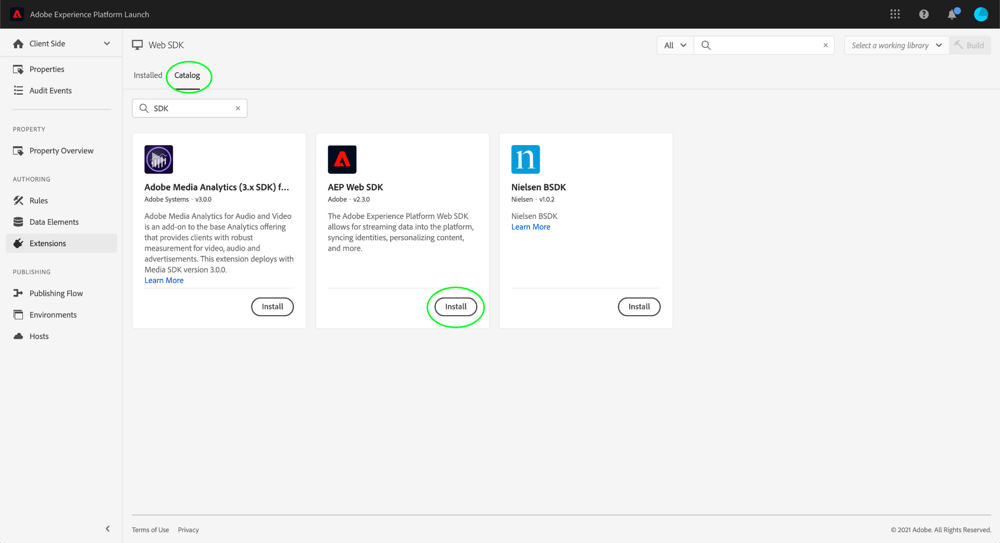
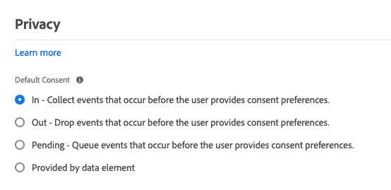

# Konfigurera taggtillägget Adobe Experience Platform Web SDK

Adobe Experience Platform Web SDK-taggtillägget skickar data till Adobe Experience Cloud från webbegenskaper via Adobe Experience Platform Edge Network. Tillägget gör att ni kan strömma data till plattformen, synkronisera identiteter, bearbeta kundens medgivandesignaler och automatiskt samla in kontextdata.

Det här dokumentet beskriver hur du konfigurerar tillägget i användargränssnittet.

## Komma igång

Om plattformstillägget för Web SDK redan har installerats för en egenskap öppnar du egenskapen i användargränssnittet och väljer **[!UICONTROL Extensions]** -fliken. Under Platform Web SDK väljer du **[!UICONTROL Configure]**.

Om du inte har installerat tillägget än väljer du **[!UICONTROL Catalog]** -fliken. Leta reda på plattformstillägget för Web SDK i listan över tillgängliga tillägg och välj **[!UICONTROL Install]**.

I båda fallen kommer du till konfigurationssidan för Platform Web SDK. I avsnitten nedan beskrivs tilläggets konfigurationsalternativ.

## Allmänna konfigurationsalternativ

Konfigurationsalternativen högst upp på sidan anger för Adobe Experience Platform var data ska skickas och vilka konfigurationer som ska användas på servern.

### [!UICONTROL Name]

Tillägget Adobe Experience Platform Web SDK har stöd för flera instanser på sidan. Namnet används för att skicka data till flera organisationer med en taggkonfiguration.

Tilläggets namn är som standard &quot;[!DNL alloy]&quot;. Du kan dock ändra instansnamnet till ett giltigt JavaScript-objektnamn.

### **[!UICONTROL IMS Organization ID]**

The [!UICONTROL IMS Organization ID] är den organisation som du vill att data skickas till i Adobe. För det mesta använder du standardvärdet som fylls i automatiskt. När du har flera instanser på sidan fyller du i det här fältet med värdet för den andra organisationen som du vill skicka data till.

### **[!UICONTROL Edge Domain]**

The [!UICONTROL Edge Domain] är den domän som Adobe Experience Platform-tillägget skickar och tar emot data från. Adobe rekommenderar att du använder en CNAME (1st-party domain) för det här tillägget. Standarddomänen från tredje part fungerar för utvecklingsmiljöer men är inte lämplig för produktionsmiljöer. Instruktioner om hur du konfigurerar en CNAME från en förstahandsleverantör finns i listan [här](https://experienceleague.adobe.com/docs/core-services/interface/ec-cookies/cookies-first-party.html).

## [!UICONTROL Datastreams]

När en begäran skickas till Adobe Experience Platform Edge Network, används ett datastream-ID för att referera till konfigurationen på serversidan. Du kan uppdatera konfigurationen utan att behöva göra kodändringar på webbplatsen.

Se guiden på [datastreams](../../../../datastreams/overview.md) för mer information.

## [!UICONTROL Privacy]

The [!UICONTROL Privacy] I kan du konfigurera hur SDK hanterar användares medgivandesignaler från din webbplats. Det gör i synnerhet att du kan välja den standardnivå för samtycke som antas av en användare om ingen annan explicit medgivandeinställning har angetts. Standardnivån för samtycke sparas inte i användarens profil. I följande tabell visas vad varje alternativ innebär:

| [!UICONTROL Default Consent Level] | Beskrivning |
| --- | --- |
| [!UICONTROL In] | Samla in händelser som inträffar innan användaren ger sitt samtycke. |
| [!UICONTROL Out] | Ignorera händelser som inträffar innan användaren ger sitt medgivande. |
| [!UICONTROL Pending] | Köhändelser som inträffar innan användaren ger sitt samtycke. När du har angett medgivandeinställningar kommer händelserna att samlas in eller tas bort beroende på vilka inställningar som har angetts. |
| [!UICONTROL Provided by data element] | Standardnivån för samtycke bestäms av ett separat dataelement som du definierar. När du använder det här alternativet måste du ange dataelementet med den angivna listrutan. |

Använd Utgående eller Väntande om du kräver uttryckligt användargodkännande för din affärsverksamhet.

## [!UICONTROL Identity]

### [!UICONTROL Migrate ECID from VisitorAPI]

Det här alternativet är aktiverat som standard. När den här funktionen är aktiverad kan SDK läsa AMCV- och s_ecid-cookies och ange den AMCV-cookie som används av Visitor.js. Den här funktionen är viktig när du migrerar till Adobe Experience Platform Web SDK eftersom vissa sidor fortfarande kan använda Visitor.js. SDK kan fortsätta att använda samma ECID så att användare inte identifieras som två separata användare.

### [!UICONTROL Use third-party cookies]

Med det här alternativet kan SDK försöka lagra en användaridentifierare i en cookie från tredje part. Om det lyckas identifieras användaren som en enskild användare när de navigerar mellan flera domäner, i stället för att identifieras som en separat användare på varje domän. Om det här alternativet är aktiverat kanske SDK fortfarande inte kan lagra användaridentifieraren i en tredjeparts-cookie om webbläsaren inte stöder cookies från tredje part eller har konfigurerats av användaren så att cookies från tredje part inte tillåts. I det här fallet lagrar SDK bara identifieraren i förstahandsdomänen.

## [!UICONTROL Personalization]

Om du vill dölja vissa delar av webbplatsen när anpassat innehåll läses in, kan du ange vilka element som ska döljas i den fördolda formatredigeraren. Du kan sedan kopiera det fördolda standardfragmentet som du har fått och klistra in det inuti `<head>`-element på din HTML-webbplats.

## [!UICONTROL Data Collection]

### [!UICONTROL Callback function]

Callback-funktionen som finns i tillägget kallas också [`onBeforeEventSend` function](https://experienceleague.adobe.com/docs/experience-platform/edge/fundamentals/configuring-the-sdk.html?lang=en) i biblioteket. Med den här funktionen kan du ändra händelser globalt innan de skickas till Adobe Edge Network. Mer detaljerad information om hur funktionen används finns [här](https://experienceleague.adobe.com/docs/experience-platform/edge/fundamentals/tracking-events.html?lang=en#modifying-events-globally).

### [!UICONTROL Click data collection]

SDK kan automatiskt samla in länkklicksinformation åt dig. Som standard är den här funktionen aktiverad men kan inaktiveras med det här alternativet. Länkarna är även märkta som nedladdningslänkar om de innehåller något av de nedladdningsuttryck som finns i [!UICONTROL Download Link Qualifier] textruta. I Adobe finns vissa standardkvalificerare för nedladdningslänk, men dessa kan redigeras när som helst.

### [!UICONTROL Automatically collected context data]

Som standard samlar SDK in vissa kontextdata för enhet, webb, miljö och platskontext. Om du vill se en lista över den information som samlas in av Adobe finns den [här](https://experienceleague.adobe.com/docs/experience-platform/edge/data-collection/automatic-information.html?lang=en). Om du inte vill att dessa data ska samlas in, eller om du bara vill att vissa kategorier av data ska samlas in, kan du ändra de här alternativen.

## [!UICONTROL Datastream Configuration Overrides]

Med åsidosättningar av dataströmmar kan du definiera ytterligare konfigurationer för dina dataströmmar, som skickas till Edge Network via Web SDK.

Detta hjälper dig att utlösa andra datastream-beteenden än standardbeteendena, utan att du behöver skapa ett nytt datastream eller ändra dina befintliga inställningar.

Åsidosättning av dataströmskonfiguration är en tvåstegsprocess:

1. Först måste du definiera åsidosättningar av dataströmskonfigurationer i [konfigurationssida för datastream](../../../../datastreams/configure.md).
2. Sedan måste du skicka åsidosättningarna till Edge Network antingen via ett Web SDK-kommando eller med hjälp av taggtillägget Web SDK.

Se datastream [dokumentation om åsidosättning av konfiguration](../../../../datastreams/overrides.md) om du vill ha detaljerade anvisningar om hur du åsidosätter datastream-konfigurationer.

Som ett alternativ till att skicka åsidosättningarna via ett Web SDK-kommando kan du konfigurera åsidosättningarna på taggtilläggsskärmen som visas nedan.

>[!IMPORTANT]
>
> Åsidosättningar av dataström måste konfigureras per miljö. Utvecklings-, staging- och produktionsmiljöerna har alla olika åsidosättningar. Du kan kopiera inställningarna mellan dem med hjälp av de dedikerade alternativen som visas på skärmen nedan.

## [!UICONTROL Advanced Settings]

### [!UICONTROL Edge base path]

Använd det här fältet om du behöver ändra grundsökvägen som används för att interagera med Adobe Edge Network. Det här behöver inte uppdateras, men om du deltar i en beta eller alfa kan Adobe be dig att ändra det här fältet.
