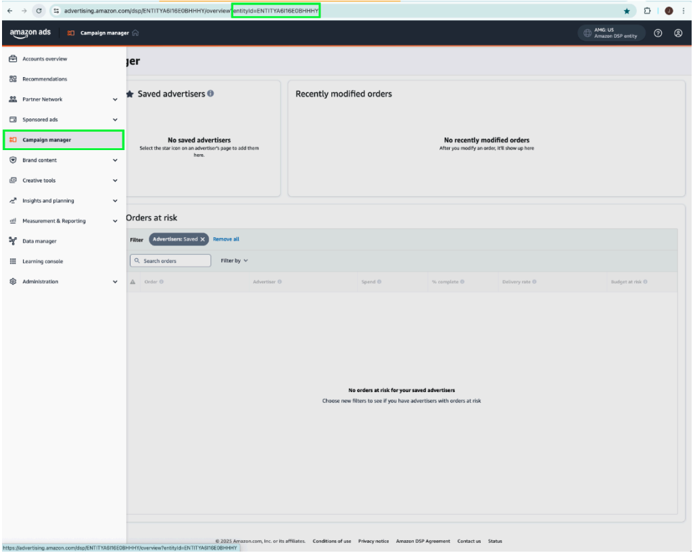

# API-tilläggets [!DNL Amazon] för webbhändelser - översikt

API-tillägget [!DNL Amazon] för konvertering skapar en direkt anslutning mellan marknadsföringsdata från en annonsörs server och [!DNL Amazon]. Det gör det möjligt för annonsörer att utvärdera kampanjens effektivitet oavsett var de befinner sig och optimera kampanjer utifrån detta. Tillägget ger fullständig attribuering, tillförlitlighet och optimerad leverans.

## Krav för [!DNL Amazon] {#prerequisites}

Innan du installerar och konfigurerar API-tillägget för [!DNL Amazon]-konverteringar slutför du följande nödvändiga steg för att säkerställa korrekt autentisering och dataåtkomst:

### Skapa en hemlighet och ett dataelement {#secret}

Skapa en ny [!DNL Amazon] [händelsevidarebefordringshemlighet](../../../ui/event-forwarding/secrets.md) och ge den ett unikt namn som anger den autentiserande medlemmen. Detta används för att autentisera anslutningen till ditt konto samtidigt som värdet är säkert.

Sedan [skapar du ett dataelement](../../../ui/managing-resources/data-elements.md#create-a-data-element) med tillägget [!UICONTROL Core] och dataelementtypen [!UICONTROL Secret] som refererar till den `Amazon`-hemlighet som du nyss skapade.

### Samla nödvändig konfigurationsinformation {#configuration-details}

Om du vill ansluta Experience Platform till [!DNL Amazon] anger du följande information:

| Nyckeltyp | Beskrivning |
| --- | --- |
| Konto-ID | Den unika kontoidentifieraren för ditt [!DNL Amazon]-konto. |
| Enhets-ID | Identifieraren för en profil som är associerad med annonserarkontot. Det här finns i Campaign Manager-portalens URL, som har prefixet `entity`. |
| Åtkomsttoken | Åtkomsttoken som inte förfaller för din app, som används för autentisering till API:t [!DNL Amazon] via OAuth. Mer information finns i [Amazon API-dokumentationen om autentisering](https://developer.amazon.com/docs/app-porting/device-messaging-fit-obtain-api-key.html). |

## Installera och konfigurera tillägget [!DNL Amazon] {#install-configure}

Så här installerar och konfigurerar du API-tillägget [!DNL Amazon] för konvertering:

1. Skapa eller redigera en egenskap för vidarebefordring av händelser.
2. Navigera till **Tillägg** i den vänstra navigeringspanelen och välj sedan tillägget [!DNL Amazon] på fliken Katalog.
3. Välj **Installera**.

   

4. Konfigurera tillägget med följande information:
   - **Åtkomsttoken**: Din dataelementhemlighet som innehåller OAuth 2-token.

     

   - **Entitet-ID**: Ditt enhets-ID (finns i Campaign Manager-portalens URL med entitetsprefixet).

     

5. Välj **Spara** för att slutföra konfigurationen.

## Konfigurera en regel för vidarebefordran av händelser {#config-rule}

När alla dataelement har konfigurerats skapar du regler för vidarebefordran av händelser som avgör när och hur händelserna skickas till [!DNL Amazon].

1. Navigera till **Regler** och skapa en ny regel för vidarebefordran av händelser.
2. Under **Åtgärder** väljer du **API-tillägg för Amazon-konvertering**.
3. Ange **åtgärdstypen** till **Importera konverteringshändelser**.

   

### Konfigurera konverteringshändelsedata {#conversion-event-data}

Data för konverteringshändelser är viktiga för att spåra användarinteraktioner och mäta effektiviteten i era kampanjer. Genom att vidarebefordra dessa data till [!DNL Amazon] kan du få insikter om användarbeteende, optimera kampanjer och säkerställa korrekt attribuering för konverteringar.

Tabellen nedan visar de nyckelegenskaper som krävs för att konfigurera och vidarebefordra konverteringshändelsedata:

| Indata | Beskrivning | Obligatoriskt | Exempel |
| --- | --- | --- | --- |
| `name` | Namnet på den importerade händelsen. | Ja | `My Event Name` |
| `eventType` | Standardhändelsetypen för Amazon som är associerad med händelsen och som används för rapportering. | Ja | `Add to Shopping Cart` |
| `eventActionSource` | Plattformen som händelsen härstammar från. | Ja | `WEBSITE` |
| `clientDedupeId` | Annonsören angav `id` för konverteringshändelsen. För händelser med samma `clientDedupeId` behålls endast den första händelsen och alla efterföljande händelser tas bort. | Valfritt | `3234A398932` |
| `timestamp` | Den rapporterade tidsstämpeln för när händelsen inträffade. Tidsstämpeln kan vara upp till 7 dagar innan du skickar en händelse. Data som är äldre än 7 dagar kommer inte att bearbetas. | Ja | `2023-05-08T14:04:28Z` |
| `matchKeys` | Array som representerar de typer/värden för kund- och enhetsidentifierare som ska användas för attribuering till trafikhändelser. | Ja | — |
| `matchKeys > type` | Identifieringstypen som används för attribuering. | Ja | — |
| `matchKeys > value` | Identifierarvärdet som används för attribuering. | Ja | Lista med SHA-256-hash-kodade identifierarvärden för kunden som utförde händelsen. |
| `value` | Händelsens värde. | Valfritt | `5` eller `0.99` |
| `currencyCode` | Valutakoden som är associerad med `value` för händelsen i ISO-4217-format. Gäller endast händelsetypen Av Amazon Purchases. Om det inte anges används valutakodinställningen för konverteringsdefinitionen. | Valfritt | `USD`, `EUR`, `GBP` osv. |
| `unitsSold` | Antal inköpta artiklar. Gäller endast händelsetypen Av Amazon Purchases. Om det inte anges för konverteringshändelsen används standardvärdet `1`. | Valfritt | — |
| `countryCode` | Detta värde baseras på ISO 3166-1 alpha-2, landskoder med två bokstäver som definieras i ISO 3166-1, som ingår i ISO 3166-standarden som offentliggjorts av ISO, för att representera länder, beroende områden och särskilda områden av geografiskt intresse. | Ja | — |
| `dataProcessingOptions` | Anger användarens samtycke för användning av annonsdata. | Valfritt | LIMITED_DATA_USE |

- Välj **[!UICONTROL Keep Changes]** om du vill spara regeln.

## Borttagning av händelser {#deduplication}

Deduplicering är nödvändigt för att säkerställa korrekt rapportering och förhindra inflaterade konverteringsantal när du använder både [!DNL Amazon] Advertising Tag (AAT) och [!DNL Amazon] Conversion API-tillägget för att spåra samma händelser.

### När krävs deduplicering?

- **Obligatoriskt**: Om samma händelse skickas från både klienten (AAT) och servern (Conversions API).
- **Krävs inte**: Om distinkta händelsetyper skickas från klienten och servern utan någon överlappning.

### Aktivera borttagning av dubbletter

Om du vill aktivera borttagning av dubbletter inkluderar du fältet `clientDedupeId` i alla delade händelser. Denna unika identifierare gör att [!DNL Amazon] kan skilja mellan klient- och serversideshändelser och förhindra dubblettposter.

Genom att konfigurera deduplicering på rätt sätt kan du se till att optimeringsdata förblir korrekta och att din rapportering inte påverkas negativt.

Mer information finns i [Amazon-handboken om borttagning av dubbletter](https://advertising.amazon.com/).

## Nästa steg {#next-steps}

I den här guiden beskrivs hur du konfigurerar och skickar konverteringshändelser till [!DNL Amazon] med API-tillägget [!DNL Amazon] Conversions. Mer information om funktioner för vidarebefordran av händelser i [!DNL Adobe Experience Platform] finns i [översikten över vidarebefordran av händelser](../../../ui/event-forwarding/overview.md).

Mer information om hur du felsöker implementeringen med verktyget för felsökning och övervakning av händelsevidarebefordran finns i [Adobe Experience Platform Debugger-översikten](/help/debugger/home.md) och [Övervaka aktiviteter](../../../ui/event-forwarding/monitoring.md) i händelsevidarebefordran.
