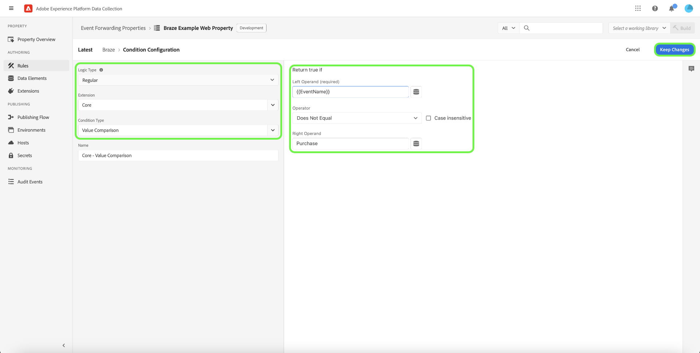

# [!DNL Braze Track Events API] tillägg för händelsevidarebefordran

[[!DNL Braze]](https://www.braze.com) är en plattform för kundengagemang som driver kundcentrerad interaktion mellan konsumenter och varumärken i realtid. Använda [!DNL Braze]kan du göra följande:

* Leverera data (t.ex. marknadsföringsmeddelanden) till riktade användare baserat på deras språkinställningar, positionering med mera för att öka konverteringsgraden och stödja viktiga affärsmål.
* Skicka personaliserade meddelanden till kunder i flera kanaler, inklusive e-post, push-meddelanden och meddelanden i appen, vid rätt tidpunkt och på de språk de föredrar.
* Målgruppsanpassa användare för marknadsförings- och kampanjkampanjer för att öka antalet återkommande kunder.
* Studera användarbeteenden och mönster för att inrikta er på specifika målgrupper med anpassade meddelanden, vilket kan öka intäkterna.

The [!DNL Braze Track Events API] [händelsevidarebefordran](../../../ui/event-forwarding/overview.md) kan du utnyttja data som samlats in i Adobe Experience Platform Edge Network och skicka dem till [!DNL Braze] i form av händelser på serversidan med [[!DNL Braze User Identify]](https://www.braze.com/docs/api/endpoints/user_data/post_user_identify) och [[!DNL Braze User Track]](https://www.braze.com/docs/api/endpoints/user_data/post_user_track) API:er.

Det här dokumentet beskriver tilläggets användningsfall, hur du installerar det i biblioteken för vidarebefordring av händelser och hur du använder dess funktioner vid en vidarebefordring av händelser [regel](../../../ui/managing-resources/rules.md).

## Användningsfall

Det här tillägget bör användas om du vill använda data från Edge Network i [!DNL Braze] för att utnyttja sina funktioner för kundanalys och målgruppsanpassning.

Ta till exempel en detaljhandelsorganisation som har en flerkanalsnärvaro (webbplats och mobil) och som samlar in transaktionsdata eller konverteringsdata som händelsedata från sin webbplats och sina mobila plattformar. Använda olika [tag](../../../home.md) skickas dessa data till Edge Network i realtid. Härifrån kommer [!DNL Braze] tillägg för händelsevidarebefordran skickar automatiskt relevanta händelser till [!DNL Braze] från serversidan.

När data har skickats kan organisationens analysteam sedan utnyttja dem [!DNL Braze's] funktioner för att bearbeta datauppsättningar och få affärsinsikter för att generera diagram, instrumentpaneler eller andra visualiseringar som kan informera affärsintressenter. Se [[!DNL Braze] kunder](https://www.braze.com/customers) sida för mer information om de olika användningsexemplen för plattformen.

## [!DNL Braze] krav och skyddsräcken {#prerequisites}

Du måste ha en [!DNL Braze] för att kunna använda sina tekniker. Om du inte har något konto går du till [Sidan Kom igång](https://www.braze.com/get-started/) på [!DNL Braze] för att ansluta till [!DNL Braze Sales] och börja skapa konto.

### API-skyddsutkast

Tillägget använder två av [!DNL Braze]API:er och deras begränsningar beskrivs nedan:

| API | Hastighetsgränser |
| --- | --- |
| [!DNL User Track] | 50 000 förfrågningar per minut.  Se [[!DNL User Track] API-dokumentation](https://www.braze.com/docs/api/endpoints/user_data/post_user_track#rate-limit) för mer information. |
| [!DNL User Identify] | 20 000 förfrågningar per minut.  Se [[!DNL User Identify] API-dokumentation](https://www.braze.com/docs/api/endpoints/user_data/post_user_identify#rate-limit) för mer information. |

>[!NOTE]
>
>Se guiden på [[!DNL Braze] API-begränsningar](https://www.braze.com/docs/api/api_limits/) för närmare uppgifter om de begränsningar som de fastställer.

### Förstå användarprofilens livscykel

[!DNL Braze] skapar anonyma användarprofiler med hjälp av den unika identifieraren, `deviceId`, anges av [!DNL Braze]. När en användare identifieras genom att ange ett användar-ID skapas en identifierad användarprofil.

I den första instansen av tilldelning av en `external_id` till en okänd användarprofil migreras alla befintliga användarprofildata och alla anonyma händelser till den nya användarprofilen. De anonyma användarprofilerna delar samma `deviceId` har även alias för den identifierade användarprofilen.

[!DNL Braze] sammanfogar och bevarar alla data som är associerade med profilen för endast alias. Alla efterföljande anonyma användardata kommer dock att bli överblivna. Se [!DNL Braze] dokumentationssidor på [identifierade användarprofiler](https://www.braze.com/docs/user_guide/data_and_analytics/user_data_collection/user_profile_lifecycle/#identified-user-profiles) och [bästa praxis för datainsamling](https://www.braze.com/docs/user_guide/data_and_analytics/user_data_collection/best_practices/#overview) för mer information.

### Fakturerbara datapunkter

Skicka ytterligare anpassade attribut till [!DNL Braze] kan öka [!DNL Braze] datapunktskonsumtion. Kontakta [!DNL Braze] kontohanteraren innan ytterligare anpassade attribut skickas. Se [!DNL Braze] dokumentation om [fakturerbara datapunkter](https://www.braze.com/docs/user_guide/onboarding_with_braze/data_points/#billable-data-points) för mer information.

### Samla nödvändig konfigurationsinformation {#configuration-details}

För att ansluta Edge Network till [!DNL Braze]krävs följande indata:

| Nyckeltyp | Beskrivning | Exempel |
| --- | --- | --- |
| [!DNL Braze] Instans | REST-slutpunkten som är associerad med [!DNL Braze] konto. Se [!DNL Braze] dokumentation om [instanser](https://www.braze.com/docs/user_guide/administrative/access_braze/braze_instances) för vägledning. | `rest.iad-03.braze.com` |
| API-nyckel | The [!DNL Braze] API-nyckel som är associerad med [!DNL Braze] konto.  Se [!DNL Braze] dokumentation om [REST API-nyckel](https://www.braze.com/docs/api/basics/#rest-api-key) för vägledning. | `YOUR-BRAZE-REST-API-KEY` |

## Krav för Experience Cloud

I det här avsnittet beskrivs de nödvändiga stegen i Experience Cloud för alla implementeringar. Beroende på vilka implementeringsbehov du har kan det vara bra att ställa in följande konstruktioner innan du konfigurerar tillägget:

1. A [schema](../../../../xdm/schema/composition.md) för att beskriva strukturen på de data som du matar in i Experience Cloud
1. A [datastream](https://experienceleague.adobe.com/docs/platform-learn/data-collection/event-forwarding/set-up-a-datastream.html) för att dirigera inkommande data till lämpliga Adobe Experience Cloud-program
1. A [datauppsättning](https://experienceleague.adobe.com/docs/platform-learn/tutorials/data-ingestion/create-datasets-and-ingest-data.html) lagra insamlade data

För alla implementeringar krävs följande på Experience Cloud:

1. [Skapa en hemlighet](#create-a-secret)
1. [Ange taggegenskaper](#set-up-tag-properties)
1. [Lägga till dataelement i taggegenskaper](#add-data-elements-within-tag-properties)
1. [Lägga till regler i taggegenskaper](#add-rules-within-tag-properties)

### Skapa en hemlighet

Skapa ett nytt [händelsevidarebefordringshemlighet](../../../ui/event-forwarding/secrets.md) och ange värdet för [[!DNL Braze] API-nyckel](#configuration-details). Detta används för att autentisera anslutningen till ditt konto samtidigt som värdet är säkert.

### Ange taggegenskaper

[Skapa en taggegenskap](https://experienceleague.adobe.com/docs/platform-learn/implement-in-websites/configure-tags/create-a-property.html?lang=en) eller välj en befintlig egenskap att redigera i stället. Den här egenskapen kommer att konfigureras för att samla in nödvändiga datastrukturer för [!DNL Braze] när de hämtas till Edge Network innan de skickas med händelsevidarebefordran.

### Lägga till dataelement i taggegenskaper

Om webbplatsen använder [!DNL Braze] SDK, du måste [skapa ett dataelement](../../../ui/managing-resources/data-elements.md) som använder **[!UICONTROL Cookie]** typ (tillhandahålls av [[!UICONTROL Core] taggtillägg](../../client/core/overview.md)) så att [!DNL Braze] `deviceId` kan läsas från cookien.

The **[!UICONTROL Cookie Name]** värdet måste matcha [!DNL Braze] cookie-namn för webbplatsen. Namnet ska ha ett format som liknar `ab.storage.deviceId.{BRAZE_PROJECT_TOKEN_FOR_WEBSITE}`. Välj **[!UICONTROL Save]** när du är klar.

För det andra dataelementet ställer du in typen på **[!UICONTROL XDM Object]** (från [Adobe Experience Platform Web SDK-tillägg](../../client/sdk/overview.md)) och mappa det till det schema som skapades tidigare. Se till att värdet för `deviceId` dataelement (som innehåller [!DNL Braze] `deviceId` värdet från cookien) refereras som ett värde i ett av dina schemafält.

>[!NOTE]
>
>Om webbplatsen inte körs på [!DNL Braze] SDK, ett Adobe Experience Cloud-ID (ECID) kommer att användas som reserv `deviceId` värde som ska skickas med händelsen som skickas till [!DNL Braze].

Beroende på ditt scenario kan du behöva skapa ett annat dataelement som kan användas för att mappa till händelsenamnet i schemat. Detta kan du göra med **[!UICONTROL Constant]** typ som tillhandahålls av [!UICONTROL Core] tillägg.

### Lägga till regler i taggegenskaper

Det sista steget innan du installerar [!DNL Braze] tillägget är att skapa en tagg [regel](../../../ui/managing-resources/rules.md) (eller flera taggregler) som aktiveras för de användaridentifieringshändelser som spåras, t.ex. inloggningar, registreringar, registreringar osv.

När du konfigurerar **[!UICONTROL Events]** för regeln väljer du de händelsetyper som ska utlösa regeln. Ett exempel på en händelse som utlöser inloggningsregeln när en användare klickar visas nedan:

När du väljer **[!UICONTROL Actions]** för regeln väljer du **[!UICONTROL Send event]** åtgärdstypen som tillhandahålls av Web SDK-tillägget. Under **[!UICONTROL XDM data]** väljer du [!UICONTROL XDM Object] datatypen du skapade [tidigare](#add-data-elements-within-tag-properties).

## Installera och konfigurera [!DNL Braze] extension {#install}

Installera tillägget genom att [skapa en egenskap för vidarebefordring av händelser](../../../ui/event-forwarding/overview.md#properties) eller välj en befintlig egenskap att redigera i stället.

Välj **[!UICONTROL Extensions]** i den vänstra navigeringen. I **[!UICONTROL Catalog]** flik, välja **[!UICONTROL Install]** på kortet för [!DNL Braze] tillägg.

![Installera [!DNL Braze] tillägg.](../../../images/extensions/server/braze/install-extension.png)

På nästa skärm anger du följande [konfigurationsvärden](#configuration-details) som du tidigare har samlat in från [!DNL Braze]:

* **[!UICONTROL Braze Rest Endpoint URL]**: Du kan ange värdet för [!DNL Braze] rest endpoint URL as plain text in the provided input.
* **[!UICONTROL API Key]**: Välj [hemligt dataelement](#create-a-secret) som du skapade tidigare, som innehåller [!DNL Braze] API-nyckel.

Välj **[!UICONTROL Save]** när du är klar.

![The [!DNL Braze] konfigurationssida för tillägg.](../../../images/extensions/server/braze/configure-extension.png)

## Konfigurera dataelement för händelsevidarebefordran

När du har installerat och konfigurerat tillägget är nästa steg att skapa dataelement för vidarebefordran som hämtar nödvändiga datakonstruktioner som skickas till [!DNL Braze].

### Skapa en `deviceId` dataelement

Om din plats har konfigurerats med [!DNL Braze] SDK, har du redan definierat en [hemligt dataelement](#add-data-elements-within-tag-properties) som innehåller [!DNL Braze] `deviceId` på din taggegenskap. Nu måste du skapa ett separat dataelement under händelsevidarebefordran som pekar på det här värdet när det skickas i XDM-format.

När du skapar dataelementet väljer du **[!UICONTROL Core]** för tillägget väljer du **[!UICONTROL Path]** för elementtypen data. För värdet anger du punktnotation-sökvägen till `deviceId` fältet som det finns i ditt schema. Välj **[!UICONTROL Save]** när du är klar.

### Skapa en `EventName` dataelement

Skapa ett dataelement som använder **[!UICONTROL Path]** text från **[!UICONTROL Core]** tillägg. För värdet anger du punktnotation-sökvägen till händelsenamnet så som det finns i ditt schema.

### Skapa dataelement för händelser och inköp

The [[!DNL Braze User Track] API](https://www.braze.com/docs/api/endpoints/user_data/post_user_track) har stöd för två olika åtgärder: anpassad [händelser](https://www.braze.com/docs/api/objects_filters/event_object/#what-is-the-event-object) och [köp](https://www.braze.com/docs/api/objects_filters/purchase_object/#what-is-a-purchase-object). API:t har även stöd för [attributes](https://www.braze.com/docs/api/objects_filters/user_attributes_object/) som motsvarar [!DNL Braze] datapunkter.

Dataelementen för `deviceId` och `EventName` krävs för både anpassade händelser och inköp, men det finns ytterligare dataelement som kan inkluderas för båda händelsetyperna. De listas nedan.

>[!NOTE]
>
>Alla dataelement som listas nedan ska använda **[!UICONTROL Path]** så att de kan mappa till specifika fält i schemat enligt instruktionerna i **Schemasökväg** kolumn.

#### Anpassade händelser

| [!DNL Braze] key | Schemasökväg | Beskrivning | Obligatoriskt |
| --- | --- | --- | --- |
| [!DNL Braze] Enhets-ID | `arc.event.xdm._extconndev.brazeDeviceId` | `deviceId` identifierar användaren som utförde händelsen. `deviceId` måste specificeras för varje händelse, eftersom det är avgörande för [!DNL Braze] att utföra analyser. | Ja |
| Händelsetyp | `arc.event.xdm._extconndev.event_Type` | Namnet på händelsen. | Ja |
| Användar-ID | `arc.event.xdm._extconndev.userId` | Användarens e-postadress eller inloggnings-ID, om tillgängligt. |  |
| Program-ID | `arc.event.xdm._extconndev.appId` | En sträng som anger var händelsen utlöstes. |  |
| Händelsefält | `arc.event.xdm._extconndev.event_Properties` | Ett JSON-objekt som representerar alla attribut om händelsen. |  |

{style="table-layout:auto"}

#### Inköp

| [!DNL Braze] key | Schemasökväg | Beskrivning | Obligatoriskt |
| --- | --- | --- | --- |
| [!DNL Braze] Enhets-ID | `arc.event.xdm._extconndev.brazeDeviceId` | `deviceId` identifierar användaren som utförde händelsen. `deviceId` måste specificeras för varje händelse, eftersom det är avgörande för [!DNL Braze] att utföra analyser. | Ja |
| Händelsetyp | `arc.event.xdm._extconndev.event_Type` | Namnet på händelsen. | Ja |
| Användar-ID | `arc.event.xdm._extconndev.userId` | Användarens e-postadress eller inloggnings-ID, om tillgängligt. |  |
| Program-ID | `arc.event.xdm._extconndev.appId` | En sträng som anger var händelsen utlöstes. |  |
| Produkt-ID | `arc.event.xdm._extconndev.product_Id` | En identifierare för köpet, till exempel UPC, ISBN, produktkategori eller produktnamn. | Ja |
| Valuta | `arc.event.xdm._extconndev.currency` | Valutan som används för köpet, i [ISO 4217-kodformat](https://www.iso.org/iso-4217-currency-codes.html). | Ja |
| Pris | `arc.event.xdm._extconndev.price` | Köpets värde i siffror. | Ja |
| Kvantitet | `arc.event.xdm._extconndev.quantity` | Kvantiteten köpta produkter. | Ja |
| Ytterligare fält | `arc.event.xdm._extconndev.event_Properties` | Ett JSON-objekt som representerar ytterligare attribut om händelsen. Se [[!DNL Braze] dokumentation](https://www.braze.com/docs/user_guide/onboarding_with_braze/data_points/#billable-data-points) om du vill ha information om vilka datapunkter som faktureras. |  |

{style="table-layout:auto"}

## Ställ in regler för vidarebefordran av händelser

När alla dataelement har konfigurerats kan du börja skapa regler för vidarebefordran av händelser som avgör när och hur anpassade händelser och köp skickas till [!DNL Braze].

Sedan [!DNL Braze User Track] API har stöd för anpassade händelser och köp som två separata åtgärder. Du måste skapa minst två regler så att [!DNL Braze's] Analyserna för varje kan utnyttjas på lämpligt sätt.

Resultatet blev att [!DNL Braze] kan du lägga till följande åtgärdstyper i reglerna:

* **[!UICONTROL Braze Event]**
* **[!UICONTROL Braze Purchase Event]**

>[!IMPORTANT]
>
>Du måste ha minst en regel med åtgärdstypen **[!UICONTROL Braze Event]**. Utan den här regeln skickar Edge Network inte händelser till [!DNL Braze].

### Skapa en [!DNL Track Event] regel {#tracking-rule}

Börja skapa en ny regel i egenskapen för vidarebefordran av händelser. Under **[!UICONTROL Conditions]**, lägga till **[!UICONTROL Value Comparison]** villkorstyp (tillhandahålls av [!UICONTROL Core] tillägg) för att kontrollera att `EventName` är inte `Purchase`. Detta säkerställer att händelserna skickas med rätt objektnyttolast till [!DNL Braze] API.

Under **[!UICONTROL Actions]**, lägga till en ny åtgärd och ange tillägget till **[!UICONTROL Braze]**. Ange sedan åtgärdstypen till **[!UICONTROL Braze Event]** skicka Adobe Experience Edge Network-händelser till [!DNL Braze].

Härifrån måste du mappa **[!UICONTROL Event Name]** fält till den inkommande händelsens namn, samt **[!UICONTROL Event Time]**. Andra valfria fält innehåller [!UICONTROL External User ID], [!UICONTROL Braze User ID], [!UICONTROL Alias Label], [!UICONTROL Alias Name]och [!UICONTROL App Identifier].

>[!NOTE]
>
>The **[!UICONTROL Braze Event]** funktionsmakrot kräver bara en **[!UICONTROL Event Name]** och **[!UICONTROL Event Time]** ska anges, men du bör inkludera så mycket information som möjligt i de återstående fälten. Mer information om [!DNL Braze] händelseobjekt, se [officiell dokumentation](https://www.braze.com/docs/api/objects_filters/event_object/).

När [!UICONTROL Braze Event] läggs till i regeln kan du även inkludera en **[!UICONTROL Braze Purchase]** om händelsen du spårar råkar vara en köphändelse. En exempelkonfiguration för inköpsåtgärden visas nedan:

>[!NOTE]
>
>Mer information om [!DNL Braze] inköpsobjekt, se [officiell dokumentation](https://www.braze.com/docs/api/objects_filters/purchase_object/).

The [!DNL Track Event] regeln är fullständig och ska se ut ungefär som bilden nedan. Välj **[!UICONTROL Save]** för att lägga till regeln i biblioteket.

>[!IMPORTANT]
>
>Om din webbplats använder [!DNL Braze] SDK, du kan fortsätta till nästa steg i [validera data inom [!DNL Braze]](#validate). Om du inte använder [!DNL Braze] SDK, du måste [skapa en separat regel för identitetsspårning](#create-an-identity-tracking-rule) säkerställa att lämpliga händelser och `deviceId` värden skickas till [!DNL Braze] när en användaridentifieringshändelse inträffar.

### Skapa en regel för identitetsspårning

Om du inte använder [!DNL Braze SDK]är nästa steg att skapa en annan regel som använder båda **[!UICONTROL Braze Event]** och **[!UICONTROL Braze Alias]** åtgärdstyper. Med den här regeln säkerställs att när en användaridentifieringshändelse inträffar på webbplatsen (som inloggning, registrering, registrering osv.) ska rätt händelser och `deviceId` värden skickas till [!DNL Braze].

Börja definiera en ny regel för att spåra identitetshändelser. I det här exemplet definieras en regel specifikt för en registreringshändelse.

Liknar [!DNL Track Event] regel, under **[!UICONTROL Conditions]**, innehåller **[!UICONTROL Value Comparison]** villkorstyp som kontrollerar att `EventName` är lika med `Registration`. Detta garanterar att den här händelsen bara aktiveras för registreringshändelser.

![Åtgärdskonfiguration för [!DNL Braze] åtgärdstyperna Alias och Identifiera.](../../../images/extensions/server/braze/ef-registration-condition.png)

Se till att [!DNL Braze] kan sammanfoga användaridentiteter automatiskt. Du måste lägga till följande åtgärdstyper i regeln, som båda tillhandahålls av [!DNL Braze] tillägg:

* **[!UICONTROL Braze Event]**
* **[!UICONTROL Braze Alias Event]**

Konfigurera **[!UICONTROL Braze Event]** fungerar på samma sätt som [regel för händelsespårning](#tracking-rule), inklusive så mycket information som möjligt i de angivna fälten.

![Konfiguration [!DNL Braze] Händelseåtgärd](../../../images/extensions/server/braze/registration-braze-event.png)

The  **[!UICONTROL Braze Alias Event]** funktionsmakrot kräver [användar-ID](https://www.braze.com/docs/api/objects_filters/aliases_to_identify)och du kan även ange [programidentifierare](https://www.braze.com/docs/api/identifier_types/) vid behov.

![Konfiguration [!DNL Braze] Aliasåtgärd](../../../images/extensions/server/braze/registration-braze-alias.png)

När båda åtgärderna har lagts till i regeln väljer du **[!UICONTROL Save]** för att lägga till regeln i ditt arbetsbibliotek. Härifrån kan du bygga in biblioteket i en av dina miljöer för att validera om det fungerar som förväntat.

![Båda [!DNL Braze] åtgärder läggs till i regeln](../../../images/extensions/server/braze/registration-rule-complete.png)

## Validera data i [!DNL Braze] {#validate}

Om händelsesamlingen och [!DNL Adobe Experience Platform] integreringen lyckades, du kommer att se händelser i [!DNL Braze] konsol när [visa användarprofiler](https://www.braze.com/docs/user_guide/engagement_tools/segments/user_profiles/). De nya händelsedata som skickas till [!DNL Braze] återspeglas i [!DNL Purchases] del av en viss användares [fliken Översikt](https://www.braze.com/docs/user_guide/engagement_tools/segments/user_profiles/#overview-tab).

## Nästa steg

I den här guiden beskrivs hur du skickar konverteringshändelser till [!DNL Braze] med händelsevidarebefordran. Mer information om efterföljande program för händelsedata som skickas till [!DNL Braze], se [officiell dokumentation](https://www.braze.com/docs).

Mer information om funktioner för att vidarebefordra händelser i Experience Platform finns i [händelsevidarebefordring - översikt](../../../ui/event-forwarding/overview.md).